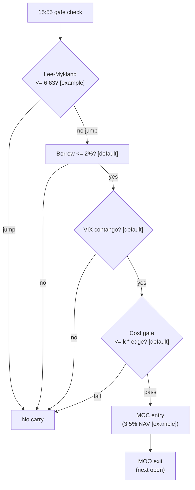

> **Tag law (mechanical):** every numeric prose literal in this module carries exactly one
> of `[documented]` `[default]` `[example]` `[unverified]` `[internal-est]` `[measured]`.
> Machine-parsed §0 data fields, bibliographic years/volumes/pages, arXiv IDs/DOIs,
> section numbers, rule codes (`C1`), fail-safe codes (`F1`), module IDs (`T090`),
> batch keys (`TB9`), and family letters are identifiers, not literals, and are exempt.

# T090 — Overnight Inventory Carry Manager

## §1 — Reviewer card

> **Lock.** Re-issued 2026-09-11 under the deep-review cycle (v1.1.0). Do not
> edit without a new review cycle. The lock covers structure and doctrine
> conformance, not the profitability of the rule. Nothing in this card is a
> trading recommendation.

| Row | Value |
|---|---|
| Module | T090 — Overnight Inventory Carry Manager, v1.1.0 |
| Edge verdict | `PREDICTIVE-FEATURE-ONLY` — jump-filtered overnight-gap reversion has documented lineage (Stübinger & Schneider 2019, with replication caveats); the three-gate carry rule itself has no documented after-cost P&L |
| After-cost | `BEFORE-COST` — the only P&L figures in this file are the synthetic fixture accounting in §T4; no after-cost P&L is claimed for this rule |
| Build cost | Tier M · `20–60` h [internal-est] · `$3,000–9,000` loaded [internal-est] |
| Data cost | Research `~$199`/mo (Massive Stocks Advanced, real-time) [documented] + borrow-rate feed [unverified]; production same [unverified] |
| latency_class | bar-clock / daily |
| risk_class | medium (overnight carry, stop-less by design — see C12) |
| Capacity | `$70k–500k` sleeve notional [example] — auction-participation capped at `5`% of auction volume [default]; the carry itself becomes the flow beyond that |
| Executability | Feasible: `3` [measured] gates + one cost call on daily bars; any retail platform suffices |
| Risk summary | The carry is stop-less overnight by design; the gates are the risk control. Borrow-special repricing and VIX backwardation are the two regime kills. |
| When it dies | VIX curve flips to backwardation intraday [default] → cancel program; gap beyond `±5`% [default] → review |
| Regime gates (provisional) | R008 (VIX backwardation) → veto; R001 (elevated RV) → halve. Machine records in §T5. |
| Emits | `order_intents` (OrderTicket intentions only — never orders) |

## §1.5 — Cheapest/least-build path

**Prototype hour band.** `20–40` h [internal-est] — the rule is `3` [measured]
gates plus a cost call; a competent AI engineer builds it from this file plus
the fixtures.

**Cheapest-source row.**

| min_tier | latency_class | required_fields | price_band | build_or_buy |
|---|---|---|---|---|
| Massive (Polygon.io) Stocks Starter | daily (15-min delayed [documented] acceptable for the prototype) | daily bars; intraday bars for the LM test; daily borrow-rate snapshots; VIX curve | `$29`/mo delayed [documented]; real-time Advanced `$199`/mo [documented]; borrow-rate feed [unverified — enterprise pricing not public] | build the gate stack; buy the data |

**Resource budget row.** `1` core, `<2` GB RAM [internal-est] · compute pattern
`per_bar` (one daily gate evaluation). Compute is not the constraint — data
licensing and the 15:55 ET [default] gate window are.

**Skip list (do not build in phase one).** Short-gap variant; intraday gap
management; multi-night holds; live borrow-rate feed (prototype on EOD
snapshots); real-time VIX curve (prototype on the daily settlement).

**DO-NOT-CUT list.** t→t+1 causality assertions (`assert fill_event >
signal_event`); the §T2 COST block and its callable; the kill switch with the
re-arm checklist; the decision audit log (hash-chained); bona-fide-intent +
self-trade prevention (C1, C2); provenance/honesty tags; the fixture + test
suite; secrets via env only; the locate check before any SHORT intent (C7).

**Escalation gate.** Upgrade from the cheapest path when: sleeve notional
exceeds `$70k` [example] (move to real-time Advanced + live borrow feed);
borrow specials start binding (live stock-loan feed required); the LM
false-negative rate rises on review (re-calibrate `lm_crit` on purged OOS).
Entitlement-class change → re-review §T5 data rights.

## §T0 — Module contract

This strategy's sole output is a list of `OrderTicket` intentions (Appendix C,
v1.0.0). It never places, routes, or confirms an order; it never touches a
broker API. Cost/fill simulation lives in this module's harness, never in
signals.

**May:** emit `OrderTicket` intentions per the Appendix C schema; track
intent-side state; issue cancel-replace via new tickets. **Must-NOT:** place
orders on any venue, hold broker/exchange sessions, net intents into orders
inside the strategy, or treat the intent-side state machine as broker wire
truth.

**Typed signature.**

```python
def emit(state: ModuleState, events: GateSnapshot, cfg: T090Config) -> list[OrderTicket]:
    """Core function. Pure w.r.t. market data: mutates only `state`.
    Returns [] on UNKNOWN/DEGRADED-with-halt or when the kill switch is not
    ARMED. Handles documented edge cases: invalid input -> UNKNOWN (never
    interpolated); TRIPPED/RECOVERY -> OFF (no intents).
    """
```

**Config dataclass (single; status ∈ fixed / default / calibrate / example / internal-est).**

```python
@dataclass(frozen=True)
class T090Config:
    lm_crit: float = 6.63              # status=default   range=4.0–10.0   # Lee–Mykland veto threshold
    borrow_max_ann_pct: float = 2.0    # status=default   range=0.5–5.0    # borrow cap, %/ann
    vix_contango_required: bool = True # status=default
    crowding_ok_required: bool = True  # status=default
    name_pct_nav: float = 0.035        # status=example   range=0.01–0.05  # per-name notional / NAV
    sleeve_cap_pct: float = 0.10       # status=default   range=0.05–0.20  # sleeve cap / NAV
    gap_review_pct: float = 5.0        # status=default   range=2.0–10.0   # gap review trigger, %
    gap_stage_pct: float = 2.0         # status=default   range=1.0–4.0    # staged-exit trigger, %
    cost_gate_k: float = 0.5           # status=default   range=0.1–2.0
    per_trade_R: float = 500.0         # status=example   ($) risk budget per trade
    daily_loss_stop_R: float = 4.0     # status=default   (R) session ends at -4R
    max_concurrent_positions: int = 4  # status=default   range=1–8
    vol_target_ann: float = 0.10       # status=example   sleeve trailing-20d overnight vol target
    adv_participation_cap: float = 0.05# status=default   range=0.01–0.10  # auction participation cap
```

**Canonical bar mapping (ingest).**

| Vendor field | Canonical | Notes |
|---|---|---|
| daily `o, h, l, c, v` | `open, high, low, close, volume` | split/dividend-adjusted; bar labeled by session **open** |
| intraday bars (LM test) | same canonical fields, intraday cadence | feeds the Lee–Mykland statistic |
| borrow-rate snapshot | `borrow_ann` (%/ann, float) | one EOD snapshot per name |
| VIX curve | `vix_contango` (bool) | front-month vs second-month; `1` = contango |

**Time contract.** Clock domain: exchange (SIP/venue) for `event_ts`; local
monotonic clock for staleness checks. Authoritative causality clock:
`event_ts` int64 ns UTC; dual `(event_ts, asof_ts)` on every record. Bar-label
rule: daily bars labeled by their session **open** (`09:30` ET [default]).
max_skew `5` s [default] · jitter budget `30` s [default] · staleness TTL `15`
min [default] on the gate-snapshot inputs · cadence `per_bar (daily)` · tz
`America/New_York`. Gap policy: no interpolation — inputs older than the TTL
emit `UNKNOWN`, never a filled bar.

**Timing box (fixed wording).** `signal@t (daily, America/New_York) → earliest fill
@open(t+1)` — T090 instantiation: the signal event is the `15:55` ET [default]
gate snapshot on day t; the module defines t+1 as the next auction/event bar
after the signal event, i.e. the `16:00` ET [default] closing cross on day t
for entries (MOC) and the `09:30` ET [documented] opening cross on day t+1 for
exits (MOO). `assert fill_event > signal_event` on every fill; a fill at or
before its signal event is a harness bug.

**Market-state table (runtime).**

| State | Meaning | T090 behavior |
|---|---|---|
| `CONTINUOUS_TRADING` | regular session | normal gate evaluation at `15:55` ET [default] |
| `HALTED` | trading halt | veto new entries; manage existing per the exit rule |
| `AUCTION` | open/close auction or halt auction | no new entries after the `15:55` ET [default] gate; MOC/MOO intents only via the gate |
| `CLOSED` | outside session | no tickets; module `OFF` |

**Module-state enum.** `OK | DEGRADED | UNKNOWN | OFF`. Invalid or stale input
→ `UNKNOWN` (never interpolate, never emit — F1/F2). `DEGRADED` = VIX-curve
monitor lagging but within `2`× TTL [default]: veto new entries, manage existing.
`OFF` = kill switch TRIPPED/RECOVERY, or outside session. Crossed/locked
quotes or non-positive prices → `UNKNOWN`.

**State vector (named).** `cooldown_until` (int64 ns UTC), `positions`
(name → qty), `sleeve_pnl_R`, `kill_state`, `module_state`, `decision_log`
(hash chain).

**Risk contract (fenced YAML — canonical).**

```yaml
risk_contract:
  per_trade_R: 500.0              # [example] $ risk budget per trade
  daily_loss_stop_R: 4.0          # [default] session ends at -4R
  max_concurrent_positions: 4    # [default]
  max_gross_notional: 100000.0   # [example] $ = sleeve cap at NAV $1M [example]
  max_adverse_per_trade: 1.0     # [default] × R — the carry is stop-less; one R is the max adverse
  kill_conditions:
    - "sleeve daily loss <= -2% NAV [example]"
    - "VIX backwardation intraday [default]"
    - "borrow special reprices beyond the gate [default]"
    - "market halt [default]"
  enforcement: intraday-hard    # [default]
  calibration:
    paper_sessions: 30            # [default]
    fee_repin: monthly            # [default]
    lm_recalibration: quarterly   # [default]
```

**Maximum adverse loss:** one R per trade (`R = $500` [example]); the session
ends at `−4R` [default]. No pyramiding: at most `4` [default] concurrent
positions.

**Kill switch: `ARMED` → `TRIPPED` → `RECOVERY` → `ARMED`.**

On trip: the module stops emitting tickets immediately, all working intents
expire unfilled, and the trip is logged to the decision log with a hash chain.
Transition guard: `TRIPPED` only from `ARMED`; `RECOVERY` only from
`TRIPPED`; `ARMED` only from `RECOVERY` via the re-arm checklist.

**Re-arm checklist (all must hold).**

1. Losses reconciled against the decision log [default].
2. Feeds healthy (no lag beyond the class budget) [default].
3. Risk limits reviewed and re-pinned [default].
4. Decision-log hash chain intact [default].
5. Fixture replay green on the current build [default].
6. Trip cause documented and signed off by the carry-desk on-call [default].

**Ops tail.** Schedule: daily `15:55` ET [default] gate check, MOC/MOO;
owner: carry-desk on-call [default]. Health checks: VIX-curve monitor;
borrow-rate monitor; fixture replay on deploy. Alert table: trip → page;
`DEGRADED` → notify; `UNKNOWN` → log. Resource budget: `1` core [internal-est], `<2` GB RAM
[internal-est]. Runbook stub: (1) acknowledge page; (2) read trip cause from
the decision log; (3) verify no working intents; (4) complete the re-arm
checklist; (5) re-arm; (6) file post-mortem. Secrets: env-only
(`MARKETDATA_API_KEY`, `BORROW_FEED_KEY`, `VIX_FEED_KEY`); never in code,
logs, or fixtures.

**Doctrine references.** OrderTicket schema (Appendix C, v1.0.0),
time-causality conventions (Appendix E, v1.0.0), F1–F5 fail-safes (Appendix F,
v1.0.0), decision-log schema (Appendix G, v1.0.0), module-state enum
(Appendix K, v1.0.0) — all by reference; this module adds no private doctrine.

## §T1 — Parent pointer

This strategy consumes the parent signal module(s):

- `S037` — Lee–Mykland jump filter (role: news-gap filter), `version_pin >=1.0.0`
- `S098` — borrow/crowding (role: crowding gate), `version_pin >=1.0.0`
- `S068` — VIX term structure (role: carry regime gate), `version_pin >=1.0.0`

The parent emits scored signals; this module applies its own gates, its own
cost model, and its own kill lifecycle, then emits OrderTicket intentions. The
parent's score is an input, never a command: every parent pass still faces the
full entry-Boolean gate set plus the cost gate here. Parent S-IDs are consumed
S-IDs, never T-IDs; this module does not call other strategies. The provider's
contract is authoritative — this file inlines only the decisive constants
(`lm_crit`, `borrow_max_ann_pct`, the contango requirement) with version pins.

## §T2 — Gate and cost specification (fixed order)

**Timing box (fixed wording).** `signal@t (daily, America/New_York) → earliest fill
@open(t+1)` — T090 instantiation: the `15:55` ET [default] gate snapshot is the
signal event; t+1 is the next auction/event bar after it (the `16:00` ET
[default] closing cross on day t for MOC entries; the `09:30` ET [documented]
opening cross on day t+1 for MOO exits).
`assert fill_event > signal_event` on every fill; a fill at or before its
signal event is a harness bug.

**Universe.** US large-caps passing all three parent gates. Example screens:
price > `$20` [example]; `14`-day ADV ≥ `2`M shares [example]; median quoted
spread ≤ `3`¢ [example]. Per-name notional `3.5`% of NAV [example]; sleeve cap
`10`% of NAV [default]. RTH only; earnings days excluded [default].

**Entry rule (Boolean expressions — normative).** Gates evaluate in fixed
order: `lm_ok`, `borrow_ok`, `regime_ok`, then the cost gate.

```text
CARRY := (lm_stat <= lm_crit)                                    # g1: no jump [default]
     AND (borrow_ann <= borrow_max_ann_pct)                       # g2: borrow cap [default]
     AND (vix_term_contango == 1) AND (crowding_ok == 1)          # g3: regime score [default]
     AND (signal_ts >= cooldown_until)                           # C10
     AND (expected_cost_bps(...) <= cost_gate_k * edge_bps)       # cost gate
```

with `lm_crit = 6.63` [example], `borrow_max_ann_pct = 2.0`%/ann [default],
`cost_gate_k = 0.5` [default], and `g3 = (vix_term_contango == 1) AND
(crowding_ok == 1)` — the fixture's `g3` column is this composite.

**Exits (with post-exit cooldown).**

```text
EXIT := next open via market-on-open [default];
        gap > ±2% [default] → exit half at the open auction, rest in the first 30 min [default];
        gap beyond ±5% [default] → immediate review [default]
ON_EXIT: cooldown_until = next session open   # [default]; C10
```

**Position sizing (fenced function — normative).**

```python
def shares(risk_budget_R, stop_distance, vol_estimate, ADV_cap, cost):
    # T090 mapping: risk_budget_R = name notional budget (name_pct_nav * NAV) [default];
    # stop_distance = close_px ($/share) [default]; vol_estimate and cost are accepted
    # for the §T0 contract signature and inform the risk layer (C10) and the cost gate;
    # ADV_cap = auction participation cap (5% of auction volume) [default].
    n = risk_budget_R / max(stop_distance, 1e-9)      # = name_pct_nav * NAV / close_px
    n = min(n, ADV_cap)                                # auction participation cap [default]
    n = min(n, SLEEVE_CAP_NOTIONAL / max(stop_distance, 1e-9))  # sleeve cap [default]
    return int(n)
```

Fixture row: `name_pct_nav × NAV / close_px = 0.035 × $1,000,000 / $50 = 700` [example]
shares — the worked example ties to this function.

**Risk limits.**

| Limit | Value |
|---|---|
| Per-trade risk | `$500` [example] (one R) |
| Daily loss stop | `−4R` [default] → session ends |
| Max concurrent positions | `4` [default] |
| Max gross notional | `$100k` [example] (= sleeve cap at NAV `$1M` [example]) |
| Max adverse per trade | `1.0`× R [default] |
| Sleeve cap | `10`% of NAV [default] |
| Auction participation | ≤ `5`% of auction volume [default] (C11) |

Canonical values live in the §T0 risk-contract YAML; this table is the human
read of it.

**COST block — single source of truth.** (Restating these numbers anywhere
else is a validation failure. §T4 shows the function call and its result,
never restated components.)

| Component | bps | Basis |
|---|---|---|
| Spread | `2.00` | [example] effective half-spread per auction leg × `2` legs at `$50` [example] |
| Fees | `1.00` | [example] conservative envelope: Nasdaq closing-cross MOC tiered `$0.0015`–`$0.0029`/share [documented, Nasdaq price list + SEC filings] and opening-cross MOO `$0.0015`/share [documented, Nasdaq price list]; at `$50` [example] ≈ `0.3`–`0.6` bps/leg [example] — `1.0` bps envelopes both legs |
| Borrow | `0.30` | [example] one-night accrual ≈ `1.1`%/ann [example] / `365` [default]; general-collateral easy-to-borrow `10`–`20` bps/ann [documented, Traders Magazine practitioner quotes]; specials excluded — a special repricing trips the borrow gate |
| Impact | `1.00` | [example] flagged; participation ≤ `5`% of auction [default] (C11) |
| **Total** | `4.30` | [example] reference stack |

Fee schedule as of `2026-09-01` [example] · venue `XNAS / open+close auctions`
[example] · side `mixed` [example] — auction prints are neither maker nor
taker; `mixed` is the conservative envelope · `borrow_bps_per_day = 0.30`
[example] — nonzero because the strategy carries overnight (MOC → MOO); the
reference build is long-only and books the one-night accrual on the carry.

```python
def expected_cost_bps(notional, adv_pct, venue, side, urgency) -> float:
    """Callable cost model — T090 COST block (single source of truth)."""
    spread_bps = 2.0    # [example] effective half-spread/leg x 2 @ $50
    fee_bps = 1.0       # [example] conservative envelope over Nasdaq auction tiers
    borrow_bps = 0.3    # [example] one-night accrual ~1.1%/ann / 365; specials excluded
    impact_bps = 1.0    # [example] flagged; participation <= 5% of auction (C11)
    return spread_bps + fee_bps + borrow_bps + impact_bps
```

**Normative cost-gate predicate:** `expected_cost_bps(...) <= k * edge_bps`
with `k = 0.5` [default] — no ticket is emitted unless the callable cost
clears this gate. The predicate appears verbatim in the §T3 pseudocode and is
asserted by the per-module test.

**Execution / fill model table.**

| Aspect | Assumption |
|---|---|
| Latency | gate snapshot `15:55` ET [default] → MOC cutoff; fill at the `16:00` ET [default] close print |
| Fill model | MOC entry fills at the close-auction print [example]; MOO exit at the open print [example] |
| Partial fills | auction fills assumed complete [example]; oldest `intent_ts` first (FIFO) per Appendix C |
| Impact | `1.0` bps [example]; participation ≤ `5`% of auction volume [default] (C11) |
| Adverse fill | no overnight stop by design — the gates are the risk control (C12) |

**Robustness + compliance sub-block.** The three gates are conjunctive by
design — no single gate carries the rule. Sensitivity: `borrow_max_ann_pct`
(high), `lm_crit` (medium), `cost_gate_k` (low — carry). Re-validate on
purged/embargoed OOS.

Compliance (10 coded rules minimum; each states trigger → check → action →
log record):

- **C1** | STP + self-match prevention: every ticket intent carries
  `stp=True`; no intent may match our own resting interest. Trigger: any
  emitted intent → check: `stp` flag set → action: block emission if unset →
  log: `COMPLIANCE_BLOCK`.
- **C2** | Bona-fide intent: every intent is a genuine trading intention —
  passable by the cost gate and sized within risk limits; no intent entered
  without intent to trade. Trigger: intent emission → check: cost gate passed
  AND within §T0 risk contract → action: veto otherwise → log: `GATE_VETO`.
- **C3** | Message-rate / cancel-to-trade: ≤ `10` intents/day [default]
  (venue auction thresholds are far above this). Trigger: `intents_today >=
  10` [default] → check: intent counter → action: throttle — veto further
  intents → log: `COMPLIANCE_BLOCK`.
- **C4** | Pre-trade fat-finger trio: (a) price collar: MOC/MOO intents only —
  no price field, so collar = gap review at `±5`% [default]; (b) max notional
  per ticket `$100k` [example] (= sleeve cap); (c) max `4` tickets/day
  [default]. Trigger: ticket notional > cap → check: notional vs cap →
  action: veto → log: `COMPLIANCE_BLOCK`.
- **C5** | Decision-log schema compliance (Appendix G, v1.0.0): every gate
  verdict and every ticket logged with inputs hash + params hash, hash-chained;
  the chain is verified on replay. Trigger: any material action → check:
  chain intact → action: halt to `UNKNOWN` on break → log: the record itself.
- **C6** | Halt/auction state table: per the §T0 market-state table —
  `HALTED`/`AUCTION` veto new entries (existing managed per the exit rule);
  `CLOSED` → module `OFF`. Trigger: state != `CONTINUOUS_TRADING` → check:
  market-state → action: veto/manage → log: `COMPLIANCE_BLOCK`.
- **C7** | Locate check (short sales): the reference build is long-only
  (`BUY`); any `SHORT` intent requires a Regulation SHO locate obtained and
  still valid before emission; threshold securities are blocked. Trigger:
  `SHORT` intent → check: `locate_ok` → action: veto without locate → log:
  `COMPLIANCE_BLOCK`.
- **C8** | Public-dissemination gate: no signal, gate, or intent data is
  published externally; the decision log is internal. Trigger: any external
  publish attempt → check: review sign-off → action: block → log:
  `COMPLIANCE_BLOCK`.
- **C9** | Data-entitlement assertions per dataset (see §T5): all feeds
  `rights: licensed`; research + stated production; entitlement =
  professional; derived features ours. Trigger: entitlement-class change →
  check: license review → action: §1.5 escalation gate → log:
  `COMPLIANCE_BLOCK`.
- **C10** | Post-exit cooldown: `cooldown_until = next session open`
  [default] after every exit or compliance block; no re-entry inside it.
  Trigger: exit/compliance block → check: `signal_ts >= cooldown_until` →
  action: veto → log: `GATE_VETO`.
- **C11** | Auction honesty: MOC/MOO fills modeled at the auction print —
  trigger: participation > `5`% of auction [default] → check: auction volume →
  action: reduce → log: `GATE_VETO`.
- **C12** | No overnight stop illusion: there is no stop overnight — the gates
  are the risk control; never represent the carry as stop-protected. Trigger:
  any disclosure/report → check: stop language absent → action: correct →
  log: review note.
- **C13** | Fixed gate order: entry-Boolean gates evaluate in the documented
  order (`lm_ok`, `borrow_ok`, `regime_ok`, cost gate); no reordering.
- **C14** | Fixture reproducibility: the reference stub reproduces the
  expected ticket set from the raw tape (asserted row by row in tests).

**Parameter table.**

| Parameter | Key | Default | Tag | Sensitivity |
|---|---|---|---|---|
| LM critical value | `lm_crit` | `6.63` | [example] | medium |
| Borrow cap | `borrow_max_ann_pct` | `2.0`%/ann | [default] | high |
| Contango required | `vix_contango_required` | `True` | [default] | high |
| Crowding gate | `crowding_ok_required` | `True` | [default] | medium |
| Name size | `name_pct_nav` | `3.5`% NAV | [example] | medium |
| Sleeve cap | `sleeve_cap_pct` | `10`% NAV | [default] | medium |
| Gap review | `gap_review_pct` | `±5`% | [default] | low |
| Staged exit | `gap_stage_pct` | `±2`% | [default] | low |
| Cost-gate k | `cost_gate_k` | `0.5` | [default] | low — carry |
| Per-trade R | `per_trade_R` | `$500` | [example] | medium |
| Daily loss stop | `daily_loss_stop_R` | `4`R | [default] | high |
| Max concurrent | `max_concurrent_positions` | `4` | [default] | medium |
| Vol target | `vol_target_ann` | `10`% ann | [example] | low |
| Auction cap | `adv_participation_cap` | `5`% | [default] | medium |

## §T3 — Math and normative pseudocode

### Math

- `edge_bps`: per-case expected edge in bps, mapped from the parent signal
  score. Reference value from the gate-pass fixture row: `30.0` bps [example].
- `cost_bps = expected_cost_bps(notional, adv_pct, venue, side, urgency)` —
  four-part stack, §T2 only.
- Gate: `expected_cost_bps(...) <= k * edge_bps` with `k = 0.5` [default].
- Sizing: the §T2 fenced `shares()`; fixture qty `700 = 0.035 × $1,000,000 /
  $50` [example] via that function.
- Vol target: sleeve trailing-`20`d [example] overnight vol → `10`% ann
  [example] (sizing overlay, not a gate).

### Normative pseudocode

Pseudocode is normative; prose is commentary. Every prose guard appears below.

```python
function emit(state, events, cfg: T090Config) -> list[OrderTicket]:
    assert events non-empty else return [] and state UNKNOWN          # F1
    d = events[-1]  # day-t gate snapshot at 15:55 ET [default]
    assert d.lm_stat >= 0 and d.close_px > 0 else return [] and state UNKNOWN  # F2
    if state.kill_state != ARMED: return [] and state OFF
    if d.stale: return [] and state UNKNOWN                          # staleness TTL
    if not d.vix_contango and cfg.vix_contango_required: return []   # backwardation cancels program
    lm_ok = d.lm_stat <= cfg.lm_crit
    borrow_ok = d.borrow_ann <= cfg.borrow_max_ann_pct
    regime_ok = d.vix_contango and d.crowding_ok
    edge_bps = d.exp_gap_reversion_bps                                # modeled [example]
    cost_ok = expected_cost_bps(notional, adv_pct, venue, side, urgency) <= cfg.cost_gate_k * edge_bps
    # ^^^ normative cost-gate predicate: expected_cost_bps(...) <= k * edge_bps
    enter = (lm_ok and borrow_ok and regime_ok and cost_ok
             and d.signal_ts >= state.cooldown_until)                 # C10
    tickets = []
    if enter:
        qty = shares(cfg.name_pct_nav * state.nav, d.close_px, 0.0, auction_cap_shares, 0.0)
        t = OrderTicket(sym, BUY, qty, None, CLS, uuid(), f'S037@{d.signal_ts}', d.signal_ts + 1000, NEW)
        # MOC entry: signal event 15:55 ET [default]; earliest fill = close auction 16:00 ET [default]
        assert t.fill_ts > d.signal_ts                               # fill_event > signal_event
        log_decision(t, inputs_hash, params_hash)                    # C5
        tickets.append(t)
    return tickets

function on_exit(state, exit_ts):
    state.cooldown_until = next_session_open(exit_ts)                 # C10: no re-entry until next session
```

## §T4 — Fixture-backed worked example

Fixtures are **synthetic** (`# TYPE: validation-run` header in both CSVs;
fixtures validate the accounting arithmetic, not live P&L). `signal_ts` /
`fill_ts` are a synthetic monotone clock (`5`-minute steps [example]) for
causality checks — not market data. Every row satisfies `fill_ts >
signal_ts`.

Fixture tape (`T090_tape.csv`; `# TYPE:` header is part of the file):

```
# TYPE: validation-run
bar,signal_ts,fill_ts,side,edge_bps,g1,g2,g3,price,qty,valid
0,1700000000000000000,1700000300000000000,BUY,30.0,4.2,0.8,1.0,50.0,700,1
1,1700000300000000000,1700000600000000000,BUY,30.0,8.1,0.8,1.0,50.0,700,1
2,1700000600000000000,1700000900000000000,BUY,30.0,4.2,3.5,1.0,50.0,700,1
3,1700000900000000000,1700001200000000000,BUY,30.0,4.2,0.8,0.0,50.0,700,1
4,1700001200000000000,1700001500000000000,BUY,0.3,4.2,0.8,1.0,50.0,700,1
5,1700001500000000000,1700001800000000000,BUY,30.0,4.2,0.8,1.0,-1.0,700,0
```

Expected tickets (`T090_expected.csv`; same `# TYPE:` header):

```
# TYPE: validation-run
ticket_idx,bar,symbol,side,qty,limit,tif,intent_ts,parent_signal,fill_ts,cost_bps
T090-0,0,AAA:XNAS,BUY,700,,IOC,1700000000000001000,S037@1700000000000000000,1700000300000000000,4.3000
```

### Cost-function call (inputs → bps → dollars)

On the gate-pass row (bar `0` [measured]): notional = `50.0 × 700 =
$35,000.00` [example]:

```python
expected_cost_bps(notional=35000.00, adv_pct=0.001, venue="AAA:XNAS",
                  side="taker", urgency="normal")
# → 4.3000 bps  →  $15.05 [example]
```

Reference stack only; per-case calls use that case's measured inputs
[measured]. COST values appear only in the §T2 COST block — this section shows
the call and its result, never restated components.

### Hand-check rows (`6` rows [measured])

| bar | side | edge_bps | gates | verdict | reason |
|---|---|---|---|---|---|
| 0 | `BUY` | 30.0 | lm_ok=✓, borrow_ok=✓, regime_ok=✓ | PASS | all gates + cost gate |
| 1 | `BUY` | 30.0 | lm_ok=✗, borrow_ok=✓, regime_ok=✓ | no intent | gate veto |
| 2 | `BUY` | 30.0 | lm_ok=✓, borrow_ok=✗, regime_ok=✓ | no intent | gate veto |
| 3 | `BUY` | 30.0 | lm_ok=✓, borrow_ok=✓, regime_ok=✗ | no intent | gate veto |
| 4 | `BUY` | 0.3 | lm_ok=✓, borrow_ok=✓, regime_ok=✓ | no intent | cost-gate veto |
| 5 | `BUY` | 30.0 | lm_ok=✓, borrow_ok=✓, regime_ok=✓ | no intent | invalid input → UNKNOWN |

The `verdict` column must match `T090_expected.csv` exactly; the test suite
asserts this row by row (`test_fixture_recomputes_to_expected`). All
`edge_bps`, gate, price, and qty values in the table above are fixture data
[measured].

### Acceptance tests

(`modules/tests/test_T090.py`; run `pytest modules/tests/test_T090.py -q`;
all must exit 0):

1. `test_type_header` — both fixture CSVs carry a `# TYPE: validation-run`
   header marking them synthetic.
2. `test_fixture_recomputes_to_expected` — the reference stub reproduces the
   expected ticket set from the raw tape, row by row.
3. `test_no_signal_bar_fills` — `fill_event > signal_event` on every row
   (t→t+1 causality).
4. `test_cost_gate_predicate` — `expected_cost_bps(...) <= k * edge_bps`
   passes when edge >> cost and blocks when edge << cost.
5. `test_cost_callable_signature` —
   `expected_cost_bps(notional, adv_pct, venue, side, urgency)` returns a
   finite float.
6. `test_kill_switch_trip` — drives `ARMED → TRIPPED → RECOVERY → ARMED` with
   the re-arm checklist; a tripped module emits nothing and reports `OFF`.
7. `test_invalid_input_yields_unknown` — invalid input → `UNKNOWN`, never
   interpolated.
8. `test_ticket_schema_and_compliance` — Appendix C schema fields, C1
   self-trade prevention, C5 decision-log hash chain.
9. `test_sizing_function` — `shares()` matches the §T2 fenced function:
   `0.035 × $1M / $50 = 700` [example]; ADV cap binds; sleeve cap binds.
10. `test_exit_cooldown` — `on_exit` sets `cooldown_until = next session`;
    no re-entry inside the cooldown (C10).

## §T5 — Data, infra, dependencies, data rights

### Data table

| Dataset | Type | Frequency | Tier | Note |
|---|---|---|---|---|
| Daily bars | float | daily | Tier 1 | gate universe + sizing |
| Intraday bars (LM test) | float | intraday | Tier 1 | Lee–Mykland statistic ≤ `6.63` [example] |
| Borrow rates | float | daily | Tier 1 | ≤ `2`%/ann [default]; special repricing trips the gate |
| VIX term structure | float | intraday | Tier 1 | contango gate; backwardation cancels |
| Auction volumes | float | per auction | Tier 1 | participation ≤ `5`% [default] (C11) |

### Infra

- Latency class: bar-clock / daily; cadence: daily (`per_bar`); tz: America/New_York.
- Build budget: `1` core, `<2` GB RAM [internal-est]; compute pattern `per_bar` (daily)

Compute is one daily gate evaluation [internal-est]; the binding constraints
are data licensing and the `15:55` ET [default] gate window, not FLOPS. All
state needed for the gates fits in the case record — no cross-case memory
except the decision-log hash chain [default].

### Dependencies (pinned)

- `python >=3.11`, `numpy >=1.26`, `pandas >=2.2`, `pytest >=8.0` [default]

**Dependency edge list (machine).** Generated from the §0 `consumes` edges; CI
asserts symmetry with the provider chapters.

| From | To | Function | Role | Version pin |
|---|---|---|---|---|
| S037 | T090 | `lm_stat` (Lee–Mykland statistic) | news-gap filter | `>=1.0.0` |
| S098 | T090 | `crowding_ok` (crowding gate) | crowding gate | `>=1.0.0` |
| S068 | T090 | `vix_contango` (term-structure flag) | carry regime gate | `>=1.0.0` |

Max dependency depth: `2` [default].

### Data rights (startup assertions)

All four §0 datasets `rights: licensed`; research + stated production;
fixtures synthetic; entitlement = professional; derived features ours.
Entitlement-class change → §1.5 escalation gate. Confirm each feed's license
before production use [unverified — confirm your license].

### Regime gates (machine records — canonical)

`{regime_id, direction, mechanism, condition, action, min_lag,
unknown_behavior}`; restrictive default (unknown → veto).

| regime_id | direction | mechanism | condition | action | min_lag | unknown_behavior |
|---|---|---|---|---|---|---|
| R008 | inverts | VIX backwardation = stress; the carry premium inverts | `vix_contango == 0` [default] | veto | `0` [default] (same-session cancel) | veto |
| R001 | degrades | elevated RV widens gap variance; size via the vol target | `rv_pctile > 80` [example] | halve | `1` session [default] | veto |
| R-halt | inverts | halt/auction state | state != `CONTINUOUS_TRADING` [default] | veto | `0` [default] | veto |

## §T6 — Execution & OrderTicket intentions

**Build vs buy.** **Build** (recommended): the rule is `3` [measured] gates
plus a cost call — a competent AI engineer builds it from this file alone.
**Buy** only if you already license a signal platform that computes the
parent score; even then, the gates, cost stack, and kill lifecycle here are
custom. Cheapest path: see §1.5.

The strategy emits intentions; the broker creates orders (C1). Cost/fill
simulation lives in this module's harness, never in signals.

**OrderTicket schema (intents only; Appendix C, v1.0.0).**

| Field | Type | Notes |
|---|---|---|
| `ticket_id` | string | unique per intent; idempotency key |
| `strategy_id` | string | `T090`, version `1.1.0` |
| `symbol` | string | exchange-qualified, e.g. `AAA:XNAS` |
| `side` | enum | `BUY` / `SELL` / `SHORT` — intent, not a wire order |
| `qty` | int | from `shares()`; FIFO on partials |
| `limit_price` | float | `None` = marketable intent (MOC/MOO) |
| `time_in_force` | enum | `CLS` (MOC entry) / `OPG` (MOO exit) |
| `signal_ts` | int64 ns UTC | the gate snapshot |
| `expiry_ts` | int64 ns UTC | intent expiry |
| `intent_ts` | int64 ns UTC | emission time |
| `parent_signal` | string | `S037@<signal_ts>` (+ S068/S098 ids in the decision log) |
| `stp` | bool | `True` always (C1) |
| `locate_ok` | bool | required `True` for `SHORT` (C7) |

**Child-order state and partial fills.** Working intents are tracked by
`ticket_id`; intent-side state is `NEW → WORKING → FILLED | PARTIAL |
CANCELLED` (broker owns wire truth). Partial fills: the residual stays
`WORKING` until `expiry_ts`; no new intent is emitted for the residual.
Sizing downstream must assume partial fills. Cancel/replace: emit a **new**
ticket intent with a new `ticket_id` and `replaces: <old ticket_id>`; never
mutate a ticket in place.

## §T7 — Evidence

| Source | Market / period | Metric | Cost token | Caveat |
|---|---|---|---|---|
| Stübinger & Schneider (2019) [documented] | S&P 500 constituents, `1998`–`2015` [documented] | jump-filtered overnight-gap backtest; reported `51.47`%/ann, Sharpe `2.38` after transaction costs [documented-as-reported] | BEFORE-COST (author-claimed after-cost; replication caveats) | with replication caveats; the three-gate carry is the chapter's design |
| Lee & Mykland (2008) [documented] | US equities, intraday [documented] | nonparametric jump test [documented] | BEFORE-COST | the news-vs-noise filter; not a carry rule |
| Lou, Polk & Skouras (2019) [documented] | US equities, `1993`–`2013` [documented] | overnight vs intraday return patterns [documented] | BEFORE-COST | return patterns, not an after-cost carry strategy |

All rows above are **BEFORE-COST** as far as this chapter is concerned: no
after-cost P&L is claimed for this rule. The only P&L figures in this file
are the synthetic fixture accounting in §T4, labeled [measured] against
synthetic tape.

**Cost token:** `BEFORE-COST` — see the column above. No after-cost P&L is
claimed for this rule.

**Verdict:** `PREDICTIVE-FEATURE-ONLY` — jump-filtered overnight-gap reversion
has documented lineage (Stübinger & Schneider 2019, with replication caveats);
the `$148.79` [example] sleeve night is synthetic illustration, not measured
P&L.

**Selection disclosure:** these are the chapter's research-pass sources; the
`$148.79` [example] sleeve night is synthetic illustration, not measured P&L.

**What would change the verdict:** a published, purged, after-cost backtest of
this exact rule (same gates, same cost stack, same `k`) with a defined
universe and no survivorship bias [default]. Until then the edge stays an
internal estimate.

**Where the example is optimistic.** (1) The fixture's `30.0` bps [example]
edge is a reference value, not a measured edge. (2) The `4.30` bps [example]
cost stack is a reference envelope, not a measured fill. (3) Auction fills
are assumed complete at the print [example]. (4) Borrow is assumed
general-collateral [example] — specials are vetoed, not priced.

## §T8 — Failure modes

| Trigger | Detect | Action | Recovery | Check |
|---|---|---|---|---|
| News-gap false negative: a slow leak keeps drifting after the fade | detect: gap beyond `±5`% [default] | action: immediate review (not automatic exit) | recovery: tighten LM threshold | `check: gap_pct <= 5` |
| Borrow special reprices overnight: the carry turns negative | detect: `borrow_ann > 2`% [default] | action: veto at the `15:55` ET [default] gate | recovery: borrow normalizes | `check: borrow_ann <= 2` |
| VIX curve flips to backwardation intraday: stress regime | detect: curve monitor | action: cancel the carry program for the night | recovery: contango restores | `check: vix_contango == 1` |
| Gap exits assume full fills at the open print: partial fills | detect: fill rate < `90`% [default] | action: reduce participation (C11) | recovery: re-size | `check: fill_rate >= 0.90` |
| No overnight stop: the carry is stop-less by design | detect: review (C12) | action: never represent as stop-protected | recovery: disclosure | `check: disclosure present` |
| Gap > `±2`% [default]: exit half at open auction, rest in `30` min [default] | detect: gap monitor | action: staged exit per exit rule | recovery: — | `check: staged exit executed` |

Every row has a `check:` — a monitorable predicate. The kill switch (§T0)
fires on the trip conditions; everything else degrades to `UNKNOWN`/veto
rather than a guessed intent.

### Visual



**Visual description:** the flowchart above shows data entering from the left,
gates evaluated top-to-bottom in fixed order, the cost gate as the final
checkpoint, and OrderTicket intents (or veto) as the only exits. Any gate
failure short-circuits to no-intent; no path emits an order.

## §T9 — Regime records

Canonical machine records in §T5 (restrictive default: unknown → veto).
R008 (VIX backwardation) inverts the carry → veto; R001 (elevated RV)
degrades it → halve sizing via the vol target. See §T5 for the
`{regime_id, direction, mechanism, condition, action, min_lag,
unknown_behavior}` records.

## §T10 — Sources

Real sources only. Nothing invented: no fabricated papers, URLs, statistics,
source text, or prices.

1. Lee, S. S. & Mykland, P. A. (2008). "Jumps in Financial Markets: A New Nonparametric Test and Jump Dynamics." *Review of Financial Studies* 21(6): 2535–2563. http://ideas.repec.org/a/oup/rfinst/v21y2008i6p2535-2563.html — nonparametric jump test; jumps align with news. Inherited from S037's S12 (verified in an earlier batch). (The 2012 *Journal of Econometrics* paper by the same authors is a different paper on microstructure noise and is not cited here.)
2. Stübinger, J. & Schneider, L. (2019). "Statistical Arbitrage with Mean-Reverting Overnight Price Gaps on High-Frequency Data of the S&P 500." *Journal of Risk and Financial Management* 12(2): 51. https://doi.org/10.3390/jrfm12020051 — jump-filtered overnight-gap backtest with documented replication caveats; reported `51.47`%/ann and Sharpe `2.38` after transaction costs [documented-as-reported].
3. Lou, D., Polk, C. & Skouras, S. (2019). "A Tug of War: Overnight Versus Intraday Expected Returns." *Journal of Financial Economics* 134(1): 192–213. https://ideas.repec.Org/a/eee/jfinec/v134y2019i1p192-213.html — overnight vs intraday return decomposition [documented].
4. Demeterfi, K., Derman, E., Kamal, M. & Zou, J. (1999). "More Than You Ever Wanted To Know About Volatility Swaps." Goldman Sachs Quantitative Strategies Research Notes — implied-variance math behind VIX term-structure reading. Inherited from S068's S12 (verified in an earlier batch).
5. Nasdaq Price List — Trading (nasdaqtrader.com), observed 2026-09-11: Opening Cross MOO/LOO `$0.0015`/share; Closing Cross MOC/LOC tiered (Tiers A–G); sub-`$1` executions `0.25`% of dollar volume [documented]. https://www.nasdaqtrader.com/trader.aspx?id=pricelisttrading2&l — auction fee basis for the §T2 COST block.
6. SEC File No. 34-93625 (CTA/CQ Charges Amendment): Professional Subscriber consolidated Level 1 core market data = `$75.00`/month across all three Networks [documented]. http://www.sec.gov/rules/sro/nms/2021/34-93625.pdf — SIP fee basis.
7. Traders Magazine (2008), quoting SunGard Astec Analytics practitioners: general-collateral ("easy-to-borrow") stocks typically cost `10`–`20` bps annualized to borrow; specials start at ~`30` bps annualized and can reach several percent [documented]. https://www.tradersmagazine.com/departments/brokerage/in-the-crosshairs-the-stock-loan-market-braces-for-change/ — borrow-rate basis for the §T2 COST block.

**Chatbot source-log:** *Source log: Grok answered Q-TB9-1..3 (2026-09-11); all claims independently verified or labeled unverified.* All chatbot claims are unverified by
construction; anything load-bearing was independently verified or labeled
unverified.

### Quarantined unverified leads

- The `6.63` [example] critical value, `2`% [default] borrow cap, and contango requirement are parameters from the batch design, not published recommendations. [unverified]
- The Stübinger–Schneider performance figures (`51.47`% p.a. [documented-as-reported], Sharpe `2.38` [documented-as-reported]) are the authors' reported numbers with the replication caveats noted in S037's chapter; do not quote them as achievable. [unverified]
- Borrow-rate vendor pricing (S&P Global Securities Finance) and VIX term-structure licensing (Cboe DataShop) are not public; enterprise pricing assumed. [unverified]

Leads above are quarantined: they may inform priors but never gates,
thresholds, or cost values.

## AI build prompt

```
You are an AI engineer implementing strategy module T090 (Overnight Inventory Carry Manager), v1.1.0.

Build exactly what this file specifies — nothing more:

1. Implement the entry Boolean from §T2 (fixed gate order: lm_ok, borrow_ok, regime_ok, then the cost gate)
   and the exits/sizing from §T2: EXIT at next open via MOO; staged exit on gaps; cooldown_until = next session.
2. Implement shares(risk_budget_R, stop_distance, vol_estimate, ADV_cap, cost) as the fenced §T2 function,
   and expected_cost_bps(notional, adv_pct, venue, side, urgency) as the four-part stack in §T2
   (spread 2.0 [example], fee 1.0 [example], borrow 0.3 [example], impact 1.0 [example]).
   Enforce the verbatim gate: expected_cost_bps(...) <= k * edge_bps with k = 0.5 [default].
3. Emit OrderTicket intentions only — never orders. One intent per passing case, Appendix C (v1.0.0) schema,
   stp=True, parent_signal "S037@<signal_ts>". MOC entry intent (tif CLS), MOO exit intent (tif OPG).
4. Enforce time causality: signal@t (daily, America/New_York) -> earliest fill @open(t+1); T090 instantiates t+1 as the next auction/event bar after the 15:55 ET signal event (16:00 ET closing cross on day t for MOC entries; 09:30 ET opening cross on day t+1 for MOO exits); assert fill_event > signal_event on every fill.
   assert fill_event > signal_event. A signal on bar t fills at t+1 or later. No lookahead.
5. Implement the kill lifecycle ARMED → TRIPPED → RECOVERY → ARMED with the trip conditions in §T0
   and the re-arm checklist. Invalid input → UNKNOWN, never interpolated.
6. Hash-chain every decision-log record (C5). Implement compliance rules C1–C14 in §T2.
7. Typed signature: emit(state: ModuleState, events: GateSnapshot, cfg: T090Config) -> list[OrderTicket].
   Config: lm_crit=6.63 [default], borrow_max_ann_pct=2.0 [default], vix_contango_required=True [default],
   crowding_ok_required=True [default], name_pct_nav=0.035 [example], sleeve_cap_pct=0.10 [default],
   gap_review_pct=5.0 [default], gap_stage_pct=2.0 [default], cost_gate_k=0.5 [default],
   per_trade_R=500.0 [example], daily_loss_stop_R=4.0 [default], max_concurrent_positions=4 [default],
   vol_target_ann=0.10 [example], adv_participation_cap=0.05 [default].
8. Validate with the fixtures: python3 -m pytest modules/tests/test_T090.py -q from the repo root.
   Every fixture row must reproduce its expected verdict; 10 acceptance tests must pass.

Do not invent data, thresholds, or costs. Every numeric literal you add to
prose carries exactly one tag: [documented] [default] [example] [unverified]
[internal-est] [measured].
```

## GROK-NEEDED

Expert questions web search could not resolve — do not answer from priors:

1. "T090's reference cost stack books borrow_bps_per_day = 0.30 [example] (≈1.1%/ann one-night accrual) and gates borrow at borrow_max_ann_pct = 2.0 [default]. What is the current (2025–2026) all-in borrow cost for a US large-cap overnight short held MOC→MOO — GC fee plus prime-brokerage spread — and what are the current S&P Global Securities Finance (or equivalent) product/price bands for a daily borrow-rate snapshot feed on a US large-cap universe? A good answer cites a stock-loan source and quotes the vendor's product page with an as-of date."
2. "T090's fee stack uses a 1.0 bps [example] conservative envelope over Nasdaq auction tiers. What are the current (2026) Nasdaq Closing Cross Tiers A–G per-share fees for MOC/LOC orders, and the tier thresholds? A good answer gives the tier table with an as-of date so the stack can be re-pinned from [example] to [documented]."
3. "T090 uses an LM critical value of 6.63 [example] as a batch-design parameter. Is there published guidance or a citable practitioner source for calibrating the Lee–Mykland (2008) jump-test threshold on daily US large-cap bars (vs the original intraday setting)? A good answer gives the source and its recommended threshold/calibration recipe."
4. "T090's verdict is PREDICTIVE-FEATURE-ONLY partly because of replication caveats on Stübinger & Schneider (2019). Is there any documented replication of the 2019 overnight-gap results with a purged/embargoed walk-forward and full costs? A good answer gives title/author/year/link plus the reported after-cost metric, or confirms none is citable."
5. "T090 needs a daily VIX term-structure (front-month vs second-month contango flag) as a licensed feed. What is the cheapest licensed 2026 source for this — Cboe DataShop product/price, or a redistributor — and what are the redistribution terms? A good answer quotes the current price list with an as-of date."

## DO-NOT-CUT list (revision integrity)

The following may never be cut, summarized away, or shortened in any revision
of this module:

1. The complete YAML front matter, including `unverified_sources` and the
   `changelog` (deep-review v1.1.0 entry included).
2. The locked §1 reviewer card.
3. The complete §1.5 cheapest/least-build path block (hour band,
   cheapest-source row, resource budget, skip list, DO-NOT-CUT list,
   escalation gate). (The legacy §1.5 standing blocks B1–B6 were folded into
   §T0/§T2/§T7/§T10 in v1.1.0 — no doctrine was lost.)
4. The §T0 contract: typed signature, `T090Config` dataclass, canonical bar
   mapping, Time contract + timing box, market-state table, module-state
   enum, fenced risk-contract YAML, the maximum-adverse-loss statement, the
   full kill lifecycle `ARMED → TRIPPED → RECOVERY → ARMED`, the re-arm
   checklist, the ops tail, and env-only secrets.
5. The §T2 fixed order: timing box → universe → entry Boolean → exits +
   cooldown → fenced `shares()` → risk limits → COST block → execution/fill
   table → compliance C1–C14 → parameter table. The four-part COST stack
   appears only in the COST block.
6. The verbatim cost gate `expected_cost_bps(...) <= k * edge_bps`.
7. The verbatim causality assertion `assert fill_event > signal_event`.
8. The §T4 hand-check rows (all fixture rows) and the cost-function call with
   inputs → bps → dollars.
9. Every §T8 failure row and its `check:` predicate.
10. The §T5 machine regime records and the §T8 mermaid visual with its
    description.
11. The §T10 real-source list and the quarantined unverified leads.
12. The AI build prompt.
13. The numeric-tag law: every numeric prose literal carries exactly one of
    `[documented]` `[default]` `[example]` `[unverified]` `[internal-est]`
    `[measured]`.
14. Bona-fide intent and self-trade prevention (C1/C2): every ticket intent is
    a genuine trading intention and can never match our own resting interest.
15. The decision-log audit trail (C5): every gate verdict hash-chained and
    verified on replay.
16. Secrets via environment / secret store only: no credentials in code,
    fixtures, or logs.
17. The GROK-NEEDED section: unresolved expert questions stay open until
    answered; answers promote [unverified] leads, never silently.

---

*Deep-review v1.1.0 completed 2026-09-11. Reviewer: subagent deep-review worker (T090).*
