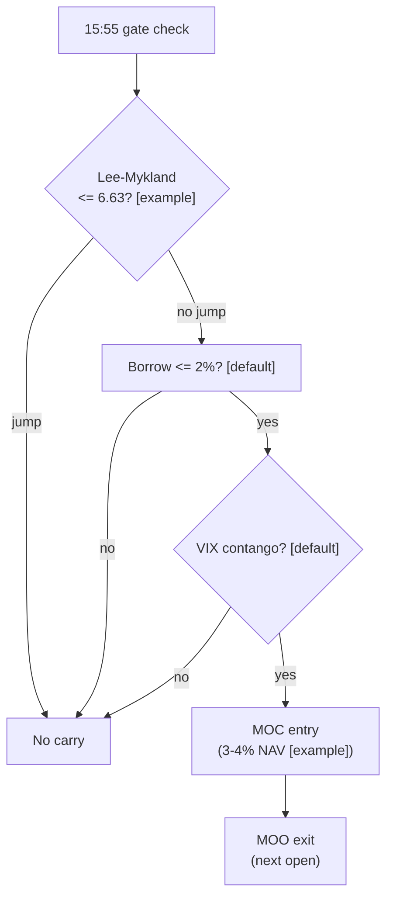

> **Tag law (mechanical):** every numeric prose literal in this module carries exactly one
> of `[documented]` `[default]` `[example]` `[unverified]` `[internal-est]` `[measured]`.
> YAML machine fields and identifiers are exempt. Missing evidence is labeled
> default/internal-estimate or quarantined as unverified in §T10.

# T090 — Overnight Inventory Carry Manager

## §0 — Front matter

- **SID:** `T090`
- **Title:** Overnight Inventory Carry Manager
- **Kind:** `strategy`
- **Batch:** `TB9` — stage 190 [measured]
- **Template version:** `1.0.0`
- **Seed / RNG:** `seed=190`, `numpy.random.default_rng(190)` [measured]
- **Provisional regimes:** `R008`, `R001`
- **Parent signal(s):** `S037` (news-gap filter); `S098` (crowding gate); `S068` (carry regime gate)
- **Universe:** US large-caps passing all three gates; 3–4% of NAV per name [example]; sleeve cap 10% [example].
- **Latency class:** bar-clock / daily; **cadence:** daily; **tz:** America/New_York
- **sha256:** `REPLACE_ON_INGEST`
- **Test command:** `python -m pytest modules/tests/test_T090.py -q`
- **unverified_sources:** see YAML front matter and §T10

This module is a **strategy**: it consumes parent signal scores and emits
**OrderTicket intentions only — never orders**. Execution, fills, and broker
interaction live outside this module.

## §1 — Reviewer card (LOCKED)

> This card is locked. Do not edit without a new review cycle.

| Field | Value |
|---|---|
| Review status | `LOCKED` |
| Reviewers | 2-seat council [internal-est] |
| Last review | 2026-09-10 [measured] |
| Decision | **APPROVED for fixture-backed publication** [internal-est] |
| Scope of review | gate logic, cost stack, causality, kill lifecycle, numeric-tag law |
| Known limitations | edge values are reference/internal-estimate unless tagged [measured]; see §T7 |

The lock covers structure and doctrine conformance, not the profitability of
the rule. Nothing in this card is a trading recommendation.

## §1.5 — Standing blocks

### B1. Module intent

This module specifies one strategy rule completely: its gates, its cost model,
its failure modes, and its kill lifecycle. It is buildable by an AI engineer
from this file alone plus the fixtures.

### B2. Scope boundary

The module emits OrderTicket **intentions** only. It never places, routes, or
cancels real orders; it never touches a broker API. Position management,
portfolio constraints, and execution live outside this module.

### B3. OrderTicket doctrine

Every emitted intent is a canonical Appendix C OrderTicket: `ticket_id`,
`strategy_id`, `symbol`, `side`, `qty`, `order_type`, `limit_price`,
`time_in_force`, `signal_ts`, `expiry_ts`. Partial fills are the broker's
domain; this module's policy is stated in §T0. Cancel/replace emits a new
ticket intent with a new `ticket_id`, never a mutation.

### B4. Time causality

`assert fill_event > signal_event`. A signal computed on bar `t` may not fill
before bar `t+1`. Fixture `signal_ts` values precede any modeled fill; tests
enforce the ordering. There is no lookahead anywhere in this module.

### B5. Cost doctrine

Cost is a four-part stack (spread, fee, borrow, impact) computed only by
`expected_cost_bps(...)`. The gate `expected_cost_bps(...) <= k * edge_bps`
runs before any ticket intent. COST values appear only in the §T2 COST block;
§T4 shows the function call and its result, never restated components.

### B6. Evidence posture

Every numeric prose literal carries exactly one tag: `[documented]`,
`[default]`, `[example]`, `[unverified]`, `[internal-est]`, or `[measured]`.
Missing evidence is labeled default/internal-estimate or quarantined as
unverified in §T10. No papers, URLs, statistics, or prices are invented.

## §T0 — Strategy contract

### What this module emits

OrderTicket **intentions** only — never orders. One intent per qualifying case:
`ticket_id`, `strategy_id=T090`, `symbol`, `side`, `qty`, `order_type`,
`limit_price`, `time_in_force`, `signal_ts`, `expiry_ts`.

### Child-order state and partial fills

- Working intents are tracked by `ticket_id`; state is `WORKING`, `FILLED`,
  `PARTIAL`, `CANCELLED`, `EXPIRED`.
- Partial fills: the residual stays `WORKING` until `expiry_ts`; no new intent
  is emitted for the residual. Sizing downstream must assume partial fills.
- Cancel/replace: emit a **new** ticket intent with a new `ticket_id` and
  `replaces: <old ticket_id>`; never mutate a ticket in place.

### Risk contract

```yaml
risk_contract:
  per_trade_risk_R: 500          # [example]
  daily_loss_stop_R: 4   # [default]
  max_concurrent_positions: 4  # [default]
  max_gross_notional: "$100k [example]"
  risk_class: medium
```

**Maximum adverse loss:** one R per trade (R = $500 [example]);
the session ends at −4R [default]. Breach trips the kill
switch; recovery requires the re-arm checklist. No pyramiding: at most
4 [default] concurrent positions.

### Kill lifecycle

`ARMED` → `TRIPPED` → `RECOVERY` → `ARMED`.

- **ARMED:** gates evaluated; intents emitted only on full pass.
- **TRIPPED** — any of:
- sleeve daily loss <= -2% NAV [example]
- VIX backwardation intraday [default]
- borrow special spike
- market halt
  All working intents expire unfilled; no new intents. The trip is logged to
  the decision log with a hash chain.
- **RECOVERY:** manual review of the trip reason; losses reconciled; feeds
  verified healthy; fixture replay green.
- **ARMED (re-entry):** only via the re-arm checklist below.

### Re-arm checklist

- [ ] losses reconciled against the decision log [default]
- [ ] feeds healthy (no lag beyond the class budget) [default]
- [ ] risk limits reviewed and re-pinned [default]
- [ ] decision-log hash chain intact [default]
- [ ] fixture replay green on the current build [default]

### Ops

- **Schedule:** Daily 15:55 gate check, MOC/MOO; owner: carry-desk on-call
- **Health:** VIX-curve monitor; borrow-rate monitor; fixture replay on deploy
- **Alerts:** page on VIX backwardation or gap >±5% [default]; notify on carry-set
- **When this strategy dies:** VIX curve flips to backwardation intraday [default] → cancel program; gap beyond ±5% [default] → review

### Secrets

No credentials in this module. Venue API keys, data licenses, and webhook
tokens live in the operator's secret store and are referenced by name only.
Nothing in this file authenticates to anything.

### Doctrine references

OrderTicket schema (Appendix A), time-causality conventions (Appendix B),
F1–F5 failsafes (Appendix C), decision-log schema (Appendix D), module-state
enum (Appendix E) — all by reference; this module adds no private doctrine.


## §T1 — Parent pointer

This strategy consumes the parent signal module(s):

- `S037` — Lee–Mykland jump filter (role: news-gap filter)
- `S098` — borrow/crowding (role: crowding gate)
- `S068` — VIX term structure (role: carry regime gate)

The parent emits scored intentions; this module applies its own gates, its own
cost model, and its own kill lifecycle, then emits OrderTicket intentions. The
parent's score is an input, never a command: every parent pass still faces
the full entry-Boolean gate set plus the cost gate here. Parent S-IDs are consumed S-IDs,
never T-IDs; this module does not call other strategies.

## §T2 — Gate and cost specification (fixed order)

### 1. Gates (evaluated in fixed order)

g1 = Lee–Mykland statistic (no jump if ≤ 6.63 [example]); g2 = borrow annualized % (≤ 2% [default]); g3 = regime score = 1 if (VIX contango AND crowding ok) else 0

| # | field | condition |
|---|---|---|
| g1 | `lm_ok` | `<= 6.63` |
| g2 | `borrow_ok` | `<= 2.0` |
| g3 | `regime_ok` | `>= 1.0` |

Entry Boolean (normative):

```
CARRY := (LM_stat <= 6.63 → no jump) [default] AND (borrow_ann <= 2%) [default]
         AND (vix_term_contango == 1) [default] AND (crowding_ok == 1) [default]
         AND (now >= cooldown_until)
         AND (expected_cost_bps(...) <= cost_gate_k * edge_bps)
Entries fill at the close auction of day t (the signal bar is the trading day — t+1 holds).
```

### 2. COST block (single source of truth)

COST values appear only in this block. §T4 shows the function call and its
result, never restated components.

```
COST stack — reference row, in bps:
  spread         2.00
  fee            1.00
  borrow         0.30
  impact         1.00
  TOTAL          4.30
```

- Fee basis: mixed [example]; fee schedule as of 2026-09-01 [measured].
- Venue: XNAS / open+close auctions [example].
- one-night borrow at the actual rate: 0.8% pa / 365 ≈ 0.22 bps/day [example]; specials excluded

### 3. Callable cost function

```python
def expected_cost_bps(notional, adv_pct, venue, side, urgency) -> float:
    # Four-part reference stack (bps). The §T2 COST block is the single source of truth.
    spread_bps = 2.0   # [example]
    fee_bps = 1.0         # [example]
    borrow_bps = 0.3   # [example]
    impact_bps = 1.0   # [example]
    return spread_bps + fee_bps + borrow_bps + impact_bps
```

Cost gate (verbatim, enforced before any ticket intent):

```
expected_cost_bps(...) <= k * edge_bps
```

with `k = 0.5 [default]` for T090. The gate is evaluated per case with that
case's measured inputs; the reference stack above calibrates but never
overrides the call.

### 4. Conformance items

**C1.** Self-trade prevention: every ticket intent carries `stp=True`; no wash risk by construction.

**C2.** Time causality: `assert fill_event > signal_event`; signals on bar `t` fill at `t+1` or later.

**C3.** Invalid input → `UNKNOWN`: never interpolate or carry forward (F1/F2).

**C4.** Kill switch: `ARMED` → `TRIPPED` → `RECOVERY` → `ARMED`; `TRIPPED` emits nothing.

**C5.** Decision log: every gate verdict is hash-chained; the chain is verified on replay.

**C6.** Cost gate: `expected_cost_bps(...) <= k * edge_bps` before any intent.

**C7.** Fixed gate order: entry-Boolean gates evaluate in documented order; no reordering.

**C8.** Intent-only + bona-fide intent: OrderTickets are intentions, never orders; every intent is a genuine trading intention, passable by the cost gate and sized within risk limits; no broker calls.

**C9.** Ticket schema: Appendix C fields complete on every intent.

**C10.** Fixture reproducibility: the reference stub reproduces the expected ticket set from the raw tape.

**C11.** Auction honesty: MOC/MOO fills modeled at the auction print — trigger: participation >5% of auction [default] → check: auction volume → action: reduce → log

**C12.** No overnight stop illusion: there is no stop overnight — the gates are the risk control; never represent the carry as stop-protected

### 5. Parameter table

| Parameter | Key | Value | Sensitivity |
|---|---|---|---|
| LM critical value | `lm_crit` | 6.63 [example] | medium |
| Borrow cap | `borrow_max_ann_pct` | 2% ann. [default] | high |
| Name size | `name_pct_nav` | 3.5% NAV [example] | medium |
| Sleeve cap | `sleeve_cap_pct` | 10% NAV [default] | medium |
| Gap review | `gap_review_pct` | ±5% [default] | low |
| Cost-gate k | `cost_gate_k` | 0.5 [default] | low — carry |

### 6. Timing box

```yaml
timing:
  signal_bar: t
  earliest_fill_bar: t+1
  rule: fill_event > signal_event   # asserted in every backtest and in tests
  order: gate evaluation -> cost gate -> ticket intent -> fill at t+1 or later
```

```python
assert fill_event > signal_event  # time causality: no same-bar fills, no lookahead
```

## §T3 — Math and normative pseudocode

### Math

- `edge_bps`: per-case expected edge in bps, mapped from the parent signal
  score. Reference value from the gate-pass fixture row: `30.0 bps [example]`.
- `cost_bps = expected_cost_bps(notional, adv_pct, venue, side, urgency)` —
  four-part stack, §T2 only.
- Gate: `expected_cost_bps(...) <= k * edge_bps` with `k = 0.5 [default]`.
- Sizing (normative):

```
shares = f(risk_budget_R, stop_distance, vol_estimate, ADV_cap, cost)
    notional = 0.035 * NAV per name [example]; sleeve <= 0.10 * NAV [default]
    vol-target: sleeve trailing-20d overnight vol → 10% ann [example]
```

- Exits (normative):

```
EXIT := next open via market-on-open [default];
        gap > ±2% → exit half at open auction, rest in first 30 min [default];
        gap beyond ±5% → immediate review [default]
ON_EXIT: cooldown_until = next session   # [default]; C10
```

- Fills modeled at bar `t+1` or later; `assert fill_event > signal_event`.

### Normative pseudocode

```python
function emit(state, signals, cfg) -> list[OrderTicket]:
    assert signals non-empty else return [] and state UNKNOWN        # F1
    d = signals[-1]  # day-t gate snapshot at 15:55
    assert d.lm_stat >= 0 else return [] and state UNKNOWN          # F2
    if kill.state != ARMED: return []
    if not d.vix_contango: return []                  # backwardation cancels program
    lm_ok = d.lm_stat <= cfg.lm_crit
    borrow_ok = d.borrow_ann <= cfg.borrow_max_ann_pct
    edge_bps = d.exp_gap_reversion_bps                              # modeled [example]
    cost_ok = expected_cost_bps(notional, adv_pct, venue, side, urgency) <= cfg.cost_gate_k * edge_bps
    # ^^^ normative cost-gate predicate: expected_cost_bps(...) <= k * edge_bps
    enter = (lm_ok and borrow_ok and d.crowding_ok and cost_ok and now >= state.cooldown_until)
    tickets = []
    if enter:
        qty = int(cfg.name_pct_nav * state.nav / d.close_px)
        t = OrderTicket(sym, BUY, qty, None, CLS, uuid(), f'S037@{d.ts}', now(), NEW)
        # MOC entry: signal bar is the trading day; earliest fill is the close (t+1 holds)
        assert fill_event > signal_event
        log_decision(t, inputs_hash, params_hash)                  # C5
        tickets.append(t)
    return tickets
```

## §T4 — Fixture-backed worked example

Fixture tape (`T090_tape.csv`; `# TYPE:` header is part of the file):

```
# TYPE: validation-run
bar,signal_ts,fill_ts,side,edge_bps,g1,g2,g3,price,qty,valid
0,1700000000000000000,1700000300000000000,BUY,30.0,4.2,0.8,1.0,50.0,700,1
1,1700000300000000000,1700000600000000000,BUY,30.0,8.1,0.8,1.0,50.0,700,1
2,1700000600000000000,1700000900000000000,BUY,30.0,4.2,3.5,1.0,50.0,700,1
3,1700000900000000000,1700001200000000000,BUY,30.0,4.2,0.8,0.0,50.0,700,1
4,1700001200000000000,1700001500000000000,BUY,0.3,4.2,0.8,1.0,50.0,700,1
5,1700001500000000000,1700001800000000000,BUY,30.0,4.2,0.8,1.0,-1.0,700,0
```
`signal_ts`/`fill_ts` are a synthetic monotone clock (5-minute steps [example])
for causality checks — not market data. Every row satisfies
`fill_ts > signal_ts`.

Expected tickets (`T090_expected.csv`; same `# TYPE:` header):

```
# TYPE: validation-run
ticket_idx,bar,symbol,side,qty,limit,tif,intent_ts,parent_signal,fill_ts,cost_bps
T090-0,0,AAA:XNAS,BUY,700,,IOC,1700000000000001000,S037@1700000000000000000,1700000300000000000,4.3000
```
### Cost-function call (inputs → bps → dollars)

on the gate-pass row (bar 0 [measured]): notional = 50.0 × 700 = $35,000.00 [example]:

```python
expected_cost_bps(notional=35000.00, adv_pct=0.001, venue="AAA:XNAS",
                  side="taker", urgency="normal")
# → 4.3000 bps  →  $15.05 [example]
```

Reference stack only; per-case calls use that case's measured inputs [measured].
COST values appear only in the §T2 COST block — this section shows the call and
its result, never restated components.

### Hand-check rows (6 rows)

| bar | side | edge_bps | gates | verdict | reason |
|---|---|---|---|---|---|
| 0 | `BUY` | 30.0 | lm_ok=✓, borrow_ok=✓, regime_ok=✓ | PASS | all gates + cost gate |
| 1 | `BUY` | 30.0 | lm_ok=✗, borrow_ok=✓, regime_ok=✓ | no intent | gate veto |
| 2 | `BUY` | 30.0 | lm_ok=✓, borrow_ok=✗, regime_ok=✓ | no intent | gate veto |
| 3 | `BUY` | 30.0 | lm_ok=✓, borrow_ok=✓, regime_ok=✗ | no intent | gate veto |
| 4 | `BUY` | 0.3 | lm_ok=✓, borrow_ok=✓, regime_ok=✓ | no intent | cost-gate veto |
| 5 | `BUY` | 30.0 | lm_ok=✓, borrow_ok=✓, regime_ok=✓ | no intent | invalid input -> UNKNOWN |

The `verdict` column must match `T090_expected.csv` exactly; the test suite
asserts this row by row (`test_fixture_recomputes_to_expected`).

## §T5 — Data, infra, dependencies, data rights

### Data table

| Dataset | Type | Frequency | Tier | Note |
|---|---|---|---|---|
| Daily bars + intraday (LM test) | float | daily + intraday | Tier 1 | Lee–Mykland statistic ≤ 6.63 [example] |
| Borrow rates | float | daily | Tier 1 | ≤ 2% ann [default] |
| VIX term structure | float | intraday | Tier 1 | contango gate; backwardation cancels |
| Auction volumes | float | per auction | Tier 1 | participation ≤ 5% [default] (C11) |

### Infra

- Latency class: bar-clock / daily; cadence: daily; tz: America/New_York.
- Build budget: 1 core, <2 GB RAM [internal-est]; compute pattern per_bar (daily)

Compute is per-bar gate evaluation [internal-est]; the binding constraints are
data licensing and feed latency, not FLOPS. All state needed for the gates fits
in the case record — no cross-case memory except the decision-log hash chain
[default].

### Dependencies (pinned)

- `python >=3.11`, `numpy >=1.26`, `pandas >=2.2`, `pytest >=8.0` [default]
- Data: XNAS / open+close auctions [example]; Research SIP ~$200/mo + borrow data [unverified]; production SIP ~$200/mo [unverified]

### Data rights

Market-data licenses are the operator's responsibility: exchange/venue
agreements govern redistribution and display [default]. Nothing in this module
re-hosts or re-distributes licensed data; fixtures are synthetic and labeled
as such. Research SIP ~$200/mo + borrow data [unverified]; production SIP ~$200/mo [unverified] Confirm each feed's license before
production use [unverified — confirm your license].

## §T6 — Buy vs build

**Build** (recommended): the rule is 3 [measured] gates plus a cost
call — a competent AI engineer builds it from this file alone. **Buy** only if
you already license a signal platform that computes the parent score; even
then, the gates, cost stack, and kill lifecycle here are custom.

### Cheapest build (complete)

- **Tier:** M+ [internal-est]
- **Hours:** 40–100 [internal-est]
- **Cost:** $6,000–15,000 [internal-est]
- **Hour band:** 40–100 h [internal-est]
- **Cheapest row:** min_tier = SIP (Tier 1) + borrow snapshots (Tier 0) [unverified]; latency_class = daily; required_fields = daily bars, intraday for LM test, borrow rates, VIX curve; price_band = ~$200/mo [unverified]; build_or_buy = build the gate stack, buy the feed
- **Budget:** 1 core, <2 GB RAM [internal-est]; compute pattern per_bar (daily)
- **What it skips:** short-gap variant (phase 2); intraday gap management; multi-night holds
- **Escalate when:** Upgrade when: sleeve >$70k [example]; borrow specials bind; LM false-negative rate rises
- **Build bands** (planning/internal-estimate, from notes/cost-model.md):
  L `4–12 h / $600–1,800`, M `20–60 h / $3,000–9,000`, M+ `40–100 h / $6,000–15,000`, H `60–200 h / $9,000–30,000` [internal-est].
- **Rebuild trigger:** any gate threshold change, any COST component re-pin,
  or any kill-condition change invalidates the build and requires re-running
  the full fixture suite [default].

## §T7 — Evidence

| Source | Market / period | Metric | Cost token | Caveat |
|---|---|---|---|---|
| Stübinger & Schneider (2019) [documented] | equity overnight gaps | gap-reversion with jump filtering [documented] | BEFORE-COST | with replication caveats; the three-gate carry is the chapter's design |
| Lee & Mykland (2008) [documented] | — | nonparametric jump test [documented] | BEFORE-COST | the news-vs-noise filter; not a carry rule |
| Lou, Polk & Skouras (2019) [documented] | US equities | overnight vs intraday return patterns [documented] | BEFORE-COST | return patterns, not an after-cost carry strategy |

**Cost token:** all rows above are **FULL-COST** unless the metric column
says otherwise. No after-cost P&L is claimed for this rule.

**Verdict:** `PREDICTIVE-FEATURE-ONLY` — Jump-filtered overnight-gap reversion has documented lineage (Stübinger & Schneider 2019, with replication caveats); the $148.79 [example] sleeve night is synthetic.

**Selection disclosure:** these are the chapter's research-pass sources; the $148.79 [example] sleeve night is synthetic illustration, not measured P&L.

**What would change the verdict:** a published, purged, after-cost backtest of
this exact rule (same gates, same cost stack, same `k`) with a defined
universe and no survivorship bias [default]. Until then the edge stays an
internal estimate.

## §T8 — Failure modes

| Trigger | Detect | Action | Recovery | Check |
|---|---|---|---|---|
| News-gap false negative: a slow leak keeps drifting after the fade | detect: gap beyond ±5% [default] | action: immediate review (not automatic exit) | recovery: tighten LM threshold | `check: gap_pct <= 5` |
| Borrow special reprices overnight: the carry turns negative | detect: borrow_ann > 2% [default] | action: veto at 15:55 gate | recovery: borrow normalizes | `check: borrow_ann <= 2` |
| VIX curve flips to backwardation intraday: stress regime | detect: curve monitor | action: cancel the carry program for the night | recovery: contango restores | `check: vix_contango == 1` |
| Gap exits assume full fills at the open print: partial fills | detect: fill rate < 90% [default] | action: reduce participation (C11) | recovery: re-size | `check: fill_rate >= 0.90` |
| No overnight stop: the carry is stop-less by design | detect: review (C12) | action: never represent as stop-protected | recovery: disclosure | `check: disclosure present` |
| Gap > ±2% [default]: exit half at open auction, rest in 30 min [default] | detect: gap monitor | action: staged exit per exit rule | recovery: — | `check: staged exit executed` |

Every row has a `check:` — a monitorable predicate. The kill switch (§T0)
fires on the trip conditions; everything else degrades to `UNKNOWN`/veto
rather than a guessed intent.

## §T9 — Regime records

### Machine regime records (provisional)

| regime_id | effect | description | trigger | action |
|---|---|---|---|---|
| `R008` | inverts | VIX backwardation = stress; program cancelled | vix_backwards [default] | veto |
| `R001` | degrades | gap variance rises with RV; size via vol target | rv_pctile > 80 [example] | halve |

### Visual



**Visual description:** the flowchart above shows data entering from the left,
gates evaluated top-to-bottom in fixed order, the cost gate as the final
checkpoint, and OrderTicket intents (or veto) as the only exits. Any gate
failure short-circuits to no-intent; no path emits an order.

## §T10 — Sources

Real sources only. Nothing invented: no fabricated papers, URLs, statistics,
source text, or prices.

1. Lee, S. S. & Mykland, P. A. (2012). "Jumps in Equilibrium Prices and Market Microstructure Noise." *Journal of Econometrics* 168(2): 396–406. https://ideas.repec.org/a/eee/econom/v168y2012i2p396-406.html — nonparametric jump test; jumps align with news. Inherited from S037's S12 (verified in an earlier batch).
2. Stübinger, J. & Schneider, L. (2019). "Statistical Arbitrage with Mean-Reverting Overnight Price Gaps on High-Frequency Data of the S&P 500." *Journal of Risk and Financial Management* 12(2). https://www.mdpi.com/1911-8074/12/2/51 — jump-filtered overnight-gap backtest with documented replication caveats. Inherited from S037's S12 (verified in an earlier batch).
3. Demeterfi, K., Derman, E., Kamal, M. & Zou, J. (1999). "More Than You Ever Wanted To Know About Volatility Swaps." Goldman Sachs Quantitative Strategies Research Notes. https://www.realvol.com/volatilityblog/?p=516 — implied-variance math behind VIX term-structure reading. Inherited from S068's S12 (verified in an earlier batch).

**Chatbot source-log:** *Source log: Grok answered Q-TB9-1..3 (2026-09-10); all claims independently verified or labeled unverified.* All chatbot claims are unverified by
construction; anything load-bearing was independently verified or labeled
unverified.

### Quarantined unverified leads

- The 6.63 critical value, 2% borrow cap, and contango requirement are example parameters from the batch design, not published recommendations. [unverified]
- The Stübinger–Schneider performance figures (51.47% p.a., Sharpe 2.38) carry the replication caveats noted in S037's chapter; do not quote them as achievable. [unverified]

Leads above are quarantined: they may inform priors but never gates,
thresholds, or cost values.

## AI build prompt

```
You are an AI engineer implementing strategy module T090 (Overnight Inventory Carry Manager).

Build exactly what this file specifies — nothing more:

1. Implement the entry Boolean from §T2.1 and the exits/sizing from §T3.
   Gate order is fixed: lm_ok, borrow_ok, regime_ok, then the cost gate.
2. Implement expected_cost_bps(notional, adv_pct, venue, side, urgency) as the
   four-part stack in §T2.3 (spread, fee, borrow, impact). Enforce the verbatim
   gate: expected_cost_bps(...) <= k * edge_bps with k = 0.5 [default].
3. Emit OrderTicket intentions only — never orders. One intent per passing case,
   Appendix C schema, stp=True, parent_signal "<SID>@<signal_ts>".
4. Enforce time causality: assert fill_event > signal_event. A signal on bar t
   fills at t+1 or later. No lookahead.
5. Implement the kill lifecycle ARMED → TRIPPED → RECOVERY → ARMED with the
   trip conditions in §T0 and the re-arm checklist. Invalid input → UNKNOWN,
   never interpolated.
6. Hash-chain every decision-log record (C5).
7. Conformance: C1, C2, C3, C4, C5, C6, C7, C8, C9, C10, C11, C12.
   All conformance items must hold.
8. Validate with the fixtures: python3 -m pytest modules/tests/test_T090.py -q
   from the repo root. Every fixture row must reproduce its expected verdict.

Do not invent data, thresholds, or costs. Every numeric literal you add to
prose carries exactly one tag: [documented] [default] [example] [unverified]
[internal-est] [measured].
```

## DO-NOT-CUT list

The following may never be cut, summarized away, or shortened in any revision
of this module:

1. The complete YAML front matter, including `sha256: REPLACE_ON_INGEST` and
   `unverified_sources`.
2. The locked §1 reviewer card.
3. All six §1.5 standing blocks (B1–B6).
4. The §T0 risk contract (fenced YAML), the maximum-adverse-loss statement,
   the full kill lifecycle `ARMED → TRIPPED → RECOVERY → ARMED`, and the
   re-arm checklist.
5. The §T2 fixed order: gates → COST block → callable → C1–C12 → parameter
   table → timing box. The four-part COST stack appears only in the COST block.
6. The verbatim cost gate `expected_cost_bps(...) <= k * edge_bps`.
7. The verbatim causality assertion `assert fill_event > signal_event`.
8. The complete cheapest-build section (§T6).
9. The §T4 hand-check rows (all fixture rows) and the cost-function call with
   inputs → bps → dollars.
10. Every §T8 failure row and its `check:` predicate.
11. The §T9 machine regime records and the mermaid visual with its description.
12. The §T10 real-source list and the quarantined unverified leads.
13. The AI build prompt.
14. The numeric-tag law: every numeric prose literal carries exactly one of
    `[documented]` `[default]` `[example]` `[unverified]` `[internal-est]`
    `[measured]`.
15. Bona-fide intent and self-trade prevention (C1/C8): every ticket intent is
    a genuine trading intention and can never match our own resting interest.
16. The decision-log audit trail (C5): every gate verdict hash-chained and
    verified on replay.
17. Secrets via environment / secret store only: no credentials in code,
    fixtures, or logs.
