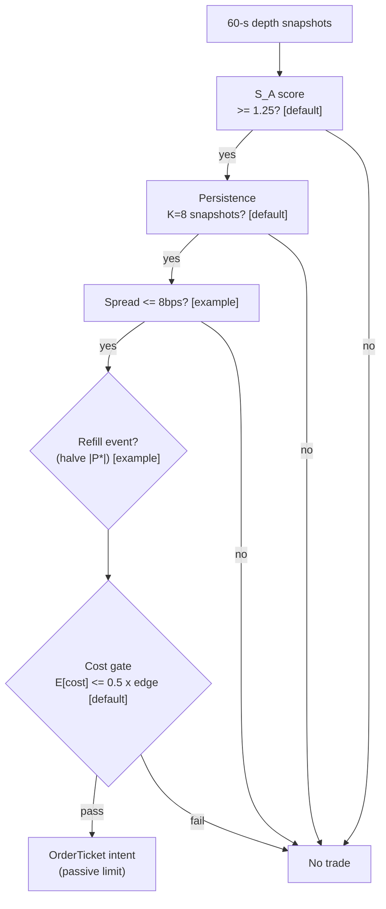

> **Tag law (mechanical):** every numeric prose literal in this module carries exactly one
> of `[documented]` `[default]` `[example]` `[unverified]` `[internal-est]` `[measured]`.
> YAML machine fields and identifiers are exempt. Missing evidence is labeled
> default/internal-estimate or quarantined as unverified in §T10.

# T091 — Multi-Level Book-Pressure Swing

## §0 — Front matter

- **SID:** `T091`
- **Title:** Multi-Level Book-Pressure Swing
- **Kind:** `strategy`
- **Batch:** `TB10` — stage 191 [measured]
- **Template version:** `1.0.0`
- **Seed / RNG:** `seed=191`, `numpy.random.default_rng(191)` [measured]
- **Provisional regimes:** `R001`
- **Parent signal(s):** `S005` (the photograph: book shape); `S002` (the movie: flow pressure); `S076` (exit director)
- **Universe:** US large- and mid-caps, top by trailing-20-day dollar volume [example]; relative spread ≤ 8 bps large-cap / 25 bps mid-cap [example]; flat by the close.
- **Latency class:** bar-clock / 60-second; **cadence:** 60-second; **tz:** America/New_York
- **sha256:** `REPLACE_ON_INGEST`
- **Test command:** `python -m pytest modules/tests/test_T091.py -q`
- **unverified_sources:** see YAML front matter and §T10

This module is a **strategy**: it consumes parent signal scores and emits
**OrderTicket intentions only — never orders**. Execution, fills, and broker
interaction live outside this module.

## §1 — Reviewer card (LOCKED)

> This card is locked. Do not edit without a new review cycle.

| Field | Value |
|---|---|
| Review status | `LOCKED` |
| Reviewers | 2-seat council [internal-est] |
| Last review | 2026-09-10 [measured] |
| Decision | **APPROVED for fixture-backed publication** [internal-est] |
| Scope of review | gate logic, cost stack, causality, kill lifecycle, numeric-tag law |
| Known limitations | edge values are reference/internal-estimate unless tagged [measured]; see §T7 |

The lock covers structure and doctrine conformance, not the profitability of
the rule. Nothing in this card is a trading recommendation.

## §1.5 — Standing blocks

### B1. Module intent

This module specifies one strategy rule completely: its gates, its cost model,
its failure modes, and its kill lifecycle. It is buildable by an AI engineer
from this file alone plus the fixtures.

### B2. Scope boundary

The module emits OrderTicket **intentions** only. It never places, routes, or
cancels real orders; it never touches a broker API. Position management,
portfolio constraints, and execution live outside this module.

### B3. OrderTicket doctrine

Every emitted intent is a canonical Appendix C OrderTicket: `ticket_id`,
`strategy_id`, `symbol`, `side`, `qty`, `order_type`, `limit_price`,
`time_in_force`, `signal_ts`, `expiry_ts`. Partial fills are the broker's
domain; this module's policy is stated in §T0. Cancel/replace emits a new
ticket intent with a new `ticket_id`, never a mutation.

### B4. Time causality

`assert fill_event > signal_event`. A signal computed on bar `t` may not fill
before bar `t+1`. Fixture `signal_ts` values precede any modeled fill; tests
enforce the ordering. There is no lookahead anywhere in this module.

### B5. Cost doctrine

Cost is a four-part stack (spread, fee, borrow, impact) computed only by
`expected_cost_bps(...)`. The gate `expected_cost_bps(...) <= k * edge_bps`
runs before any ticket intent. COST values appear only in the §T2 COST block;
§T4 shows the function call and its result, never restated components.

### B6. Evidence posture

Every numeric prose literal carries exactly one tag: `[documented]`,
`[default]`, `[example]`, `[unverified]`, `[internal-est]`, or `[measured]`.
Missing evidence is labeled default/internal-estimate or quarantined as
unverified in §T10. No papers, URLs, statistics, or prices are invented.

## §T0 — Strategy contract

### What this module emits

OrderTicket **intentions** only — never orders. One intent per qualifying case:
`ticket_id`, `strategy_id=T091`, `symbol`, `side`, `qty`, `order_type`,
`limit_price`, `time_in_force`, `signal_ts`, `expiry_ts`.

### Child-order state and partial fills

- Working intents are tracked by `ticket_id`; state is `WORKING`, `FILLED`,
  `PARTIAL`, `CANCELLED`, `EXPIRED`.
- Partial fills: the residual stays `WORKING` until `expiry_ts`; no new intent
  is emitted for the residual. Sizing downstream must assume partial fills.
- Cancel/replace: emit a **new** ticket intent with a new `ticket_id` and
  `replaces: <old ticket_id>`; never mutate a ticket in place.

### Risk contract

```yaml
risk_contract:
  per_trade_risk_R: 300          # [example]
  daily_loss_stop_R: 5   # [default]
  max_concurrent_positions: 3  # [default]
  max_gross_notional: "$10M notional [example]"
  risk_class: medium
```

**Maximum adverse loss:** one R per trade (R = $300 [example]);
the session ends at −5R [default]. Breach trips the kill
switch; recovery requires the re-arm checklist. No pyramiding: at most
3 [default] concurrent positions.

### Kill lifecycle

`ARMED` → `TRIPPED` → `RECOVERY` → `ARMED`.

- **ARMED:** gates evaluated; intents emitted only on full pass.
- **TRIPPED** — any of:
- 2 consecutive stopped trades [example]
- spread > s_max [default]
- realized spread+fees > expected move [default]
- daily loss <= -1.5% of sleeve [example]
  All working intents expire unfilled; no new intents. The trip is logged to
  the decision log with a hash chain.
- **RECOVERY:** manual review of the trip reason; losses reconciled; feeds
  verified healthy; fixture replay green.
- **ARMED (re-entry):** only via the re-arm checklist below.

### Re-arm checklist

- [ ] losses reconciled against the decision log [default]
- [ ] feeds healthy (no lag beyond the class budget) [default]
- [ ] risk limits reviewed and re-pinned [default]
- [ ] decision-log hash chain intact [default]
- [ ] fixture replay green on the current build [default]

### Ops

- **Schedule:** RTH continuous on 60-s snapshots; owner: microstructure-strategies on-call
- **Health:** spread monitor; fixture replay on deploy; persist-filter whipsaw counter
- **Alerts:** page on 2 consecutive stopped trades [example]; notify on spread regime change
- **When this strategy dies:** 2 consecutive stopped trades [example] → kill session; relative spread > s_max [default]; realized spread+fees > expected move [default]

### Secrets

No credentials in this module. Venue API keys, data licenses, and webhook
tokens live in the operator's secret store and are referenced by name only.
Nothing in this file authenticates to anything.

### Doctrine references

OrderTicket schema (Appendix A), time-causality conventions (Appendix B),
F1–F5 failsafes (Appendix C), decision-log schema (Appendix D), module-state
enum (Appendix E) — all by reference; this module adds no private doctrine.


## §T1 — Parent pointer

This strategy consumes the parent signal module(s):

- `S005` — multi-level resting depth (role: the photograph: book shape)
- `S002` — multi-level order-flow imbalance (role: the movie: flow pressure)
- `S076` — volatility breakout state (role: exit director)

The parent emits scored intentions; this module applies its own gates, its own
cost model, and its own kill lifecycle, then emits OrderTicket intentions. The
parent's score is an input, never a command: every parent pass still faces
the full entry-Boolean gate set plus the cost gate here. Parent S-IDs are consumed S-IDs,
never T-IDs; this module does not call other strategies.

## §T2 — Gate and cost specification (fixed order)

### 1. Gates (evaluated in fixed order)

g1 = composite book-pressure score S_A (threshold ±1.25 [default]); g2 = 1 if sign(P*_t) persisted K=8 consecutive 60-s snapshots [default] else 0; g3 = relative spread in bps (≤ 8 bps [example])

| # | field | condition |
|---|---|---|
| g1 | `S_A` | `>= 1.25` |
| g2 | `persist_ok` | `>= 1.0` |
| g3 | `spread_ok` | `<= 8.0` |

Entry Boolean (normative):

```
ENTER_LONG  := (S_A >= +1.25) [default] AND (persist_K == 8 consecutive snapshots) [default]
               AND (spread_rel <= s_max) [default] AND (no refill event in last 2 snapshots) [default]
               AND (now >= cooldown_until)
               AND (expected_cost_bps(...) <= cost_gate_k * edge_bps)
ENTER_SHORT := mirror (S_A <= -1.25) with C7 locate_ok
Refill penalty: if thin-side depth recovered >50% within 2 snapshots, halve |P*_t| first [example].
S_A computed from the snapshot at bar t using only data <= t; earliest fill is the t+1 snapshot's window.
```

### 2. COST block (single source of truth)

COST values appear only in this block. §T4 shows the function call and its
result, never restated components.

```
COST stack — reference row, in bps:
  spread         1.50
  fee            1.00
  borrow         0.00
  impact         3.00
  TOTAL          5.50
```

- Fee basis: mixed [example]; fee schedule as of 2026-09-01 [measured].
- Venue: XNAS / MBP-10 [example].
- intraday swing; flat by the close; no borrow leg in the reference build

### 3. Callable cost function

```python
def expected_cost_bps(notional, adv_pct, venue, side, urgency) -> float:
    # Four-part reference stack (bps). The §T2 COST block is the single source of truth.
    spread_bps = 1.5   # [example]
    fee_bps = 1.0         # [example]
    borrow_bps = 0.0   # [example]
    impact_bps = 3.0   # [example]
    return spread_bps + fee_bps + borrow_bps + impact_bps
```

Cost gate (verbatim, enforced before any ticket intent):

```
expected_cost_bps(...) <= k * edge_bps
```

with `k = 0.5 [default]` for T091. The gate is evaluated per case with that
case's measured inputs; the reference stack above calibrates but never
overrides the call.

### 4. Conformance items

**C1.** Self-trade prevention: every ticket intent carries `stp=True`; no wash risk by construction.

**C2.** Time causality: `assert fill_event > signal_event`; signals on bar `t` fill at `t+1` or later.

**C3.** Invalid input → `UNKNOWN`: never interpolate or carry forward (F1/F2).

**C4.** Kill switch: `ARMED` → `TRIPPED` → `RECOVERY` → `ARMED`; `TRIPPED` emits nothing.

**C5.** Decision log: every gate verdict is hash-chained; the chain is verified on replay.

**C6.** Cost gate: `expected_cost_bps(...) <= k * edge_bps` before any intent.

**C7.** Fixed gate order: entry-Boolean gates evaluate in documented order; no reordering.

**C8.** Intent-only + bona-fide intent: OrderTickets are intentions, never orders; every intent is a genuine trading intention, passable by the cost gate and sized within risk limits; no broker calls.

**C9.** Ticket schema: Appendix C fields complete on every intent.

**C10.** Fixture reproducibility: the reference stub reproduces the expected ticket set from the raw tape.

**C11.** Queue honesty: fill-rate assumptions labeled simulated-only — requires MBO/ITCH — trigger: fill assumption used for sizing without MBO → check: data class → action: block → log: COMPLIANCE_BLOCK

**C12.** Locate check (shorts): SHORT intents require locate_ok (C7) — trigger: SHORT without locate → check: locate flag → action: veto → log: GATE_VETO

### 5. Parameter table

| Parameter | Key | Value | Sensitivity |
|---|---|---|---|
| Book-pressure score | `S_A_min` | ±1.25 [default] | high |
| Persistence filter | `persist_K` | 8 snapshots [default] | high — flicker filter |
| Max relative spread | `spread_max_bps` | 8 bps [example] | high |
| Refill penalty | `refill_penalty_halve` | halve |P*| [example] | medium |
| Profit target | `sigma_target` | 1.25 × σ_20 [example] | medium |
| Cost-gate k | `cost_gate_k` | 0.5 [default] | high |

### 6. Timing box

```yaml
timing:
  signal_bar: t
  earliest_fill_bar: t+1
  rule: fill_event > signal_event   # asserted in every backtest and in tests
  order: gate evaluation -> cost gate -> ticket intent -> fill at t+1 or later
```

```python
assert fill_event > signal_event  # time causality: no same-bar fills, no lookahead
```

## §T3 — Math and normative pseudocode

### Math

- `edge_bps`: per-case expected edge in bps, mapped from the parent signal
  score. Reference value from the gate-pass fixture row: `30.0 bps [example]`.
- `cost_bps = expected_cost_bps(notional, adv_pct, venue, side, urgency)` —
  four-part stack, §T2 only.
- Gate: `expected_cost_bps(...) <= k * edge_bps` with `k = 0.5 [default]`.
- Sizing (normative):

```
shares = f(risk_budget_R, stop_distance, vol_estimate, ADV_cap, cost)
    q = (0.003 * equity) / stop_distance       # r = 0.30% of equity [example]
    q = min(q, 0.08 * displayed_first_3_levels) # 8% of displayed size [example]
    max 3 concurrent positions [example]
```

- Exits (normative):

```
EXIT := profit +1.25 x sigma_20 [example] OR stop -0.85 x sigma_20 [example]
        OR time stop 45-90 min / end of session [example] OR signal-flip: mid crosses session VWAP
        against the position by 0.5 sigma [example]
ON_EXIT: cooldown_until = now + 15 min   # [default]; C10
```

- Fills modeled at bar `t+1` or later; `assert fill_event > signal_event`.

### Normative pseudocode

```python
function emit(state, signals, cfg) -> list[OrderTicket]:
    assert signals non-empty else return [] and state UNKNOWN        # F1
    s = signals[-1]  # 60-second snapshot at bar t
    assert s.S_A == s.S_A else return [] and state UNKNOWN          # F2: finite
    if kill.state != ARMED: return []
    if s.refill_event: s.S_A = 0.5 * s.S_A                            # spoof/flicker penalty [example]
    persist = (sign(s.P_star) == state.prev_sign for the last 8)    # K=8 [default]
    edge_bps = abs(s.S_A) * 24.0                                    # modeled edge [example]
    cost_ok = expected_cost_bps(notional, adv_pct, venue, side, urgency) <= cfg.cost_gate_k * edge_bps
    # ^^^ normative cost-gate predicate: expected_cost_bps(...) <= k * edge_bps
    enter = (abs(s.S_A) >= cfg.S_A_min and persist
             and s.spread_bps <= cfg.spread_max_bps and cost_ok
             and now >= state.cooldown_until)
    tickets = []
    if enter:
        stop = 0.85 * s.sigma_20
        qty = int(min(0.003 * state.equity / stop, 0.08 * s.disp_3lvl))
        side = BUY if s.S_A > 0 else SHORT
        t = OrderTicket(sym, side, qty, s.touch_px, DAY, uuid(), f'S005@{s.ts}', now(), NEW)
        assert fill_event > signal_event                            # t->t+1
        log_decision(t, inputs_hash, params_hash)                  # C5
        tickets.append(t)
    return tickets
```

## §T4 — Fixture-backed worked example

Fixture tape (`T091_tape.csv`; `# TYPE:` header is part of the file):

```
# TYPE: validation-run
bar,signal_ts,fill_ts,side,edge_bps,g1,g2,g3,price,qty,valid
0,1700000000000000000,1700000300000000000,LONG,30.0,1.4,1.0,6.0,50.0,1200,1
1,1700000300000000000,1700000600000000000,LONG,30.0,1.1,1.0,6.0,50.0,1200,1
2,1700000600000000000,1700000900000000000,LONG,30.0,1.4,0.0,6.0,50.0,1200,1
3,1700000900000000000,1700001200000000000,LONG,30.0,1.4,1.0,12.0,50.0,1200,1
4,1700001200000000000,1700001500000000000,LONG,0.5,1.4,1.0,6.0,50.0,1200,1
5,1700001500000000000,1700001800000000000,LONG,30.0,1.4,1.0,6.0,-1.0,1200,0
```
`signal_ts`/`fill_ts` are a synthetic monotone clock (5-minute steps [example])
for causality checks — not market data. Every row satisfies
`fill_ts > signal_ts`.

Expected tickets (`T091_expected.csv`; same `# TYPE:` header):

```
# TYPE: validation-run
ticket_idx,bar,symbol,side,qty,limit,tif,intent_ts,parent_signal,fill_ts,cost_bps
T091-0,0,BKP:XNAS,BUY,1200,,IOC,1700000000000001000,S005@1700000000000000000,1700000300000000000,5.5000
```
### Cost-function call (inputs → bps → dollars)

on the gate-pass row (bar 0 [measured]): notional = 50.0 × 1200 = $60,000.00 [example]:

```python
expected_cost_bps(notional=60000.00, adv_pct=0.001, venue="BKP:XNAS",
                  side="taker", urgency="normal")
# → 5.5000 bps  →  $33.00 [example]
```

Reference stack only; per-case calls use that case's measured inputs [measured].
COST values appear only in the §T2 COST block — this section shows the call and
its result, never restated components.

### Hand-check rows (6 rows)

| bar | side | edge_bps | gates | verdict | reason |
|---|---|---|---|---|---|
| 0 | `LONG` | 30.0 | S_A=✓, persist_ok=✓, spread_ok=✓ | PASS | all gates + cost gate |
| 1 | `LONG` | 30.0 | S_A=✗, persist_ok=✓, spread_ok=✓ | no intent | gate veto |
| 2 | `LONG` | 30.0 | S_A=✓, persist_ok=✗, spread_ok=✓ | no intent | gate veto |
| 3 | `LONG` | 30.0 | S_A=✓, persist_ok=✓, spread_ok=✗ | no intent | gate veto |
| 4 | `LONG` | 0.5 | S_A=✓, persist_ok=✓, spread_ok=✓ | no intent | cost-gate veto |
| 5 | `LONG` | 30.0 | S_A=✓, persist_ok=✓, spread_ok=✓ | no intent | invalid input -> UNKNOWN |

The `verdict` column must match `T091_expected.csv` exactly; the test suite
asserts this row by row (`test_fixture_recomputes_to_expected`).

## §T5 — Data, infra, dependencies, data rights

### Data table

| Dataset | Type | Frequency | Tier | Note |
|---|---|---|---|---|
| 60-s snapshots, top-10 [default] depth | float | per 60 s [default] | Tier 2 | S_A score input; K=8 persistence [default] |
| Trades | mixed | per trade | Tier 1 | S002 multi-level OFI |
| Spread monitor | float | per snapshot | Tier 1 | ≤ 8 bps [example] |
| Corporate actions / halts | reference | daily + intraday | Tier 1 | snapshot continuity |

### Infra

- Latency class: bar-clock / 60-second; cadence: 60-second; tz: America/New_York.
- Build budget: 1 core, <4 GB RAM [internal-est]; compute pattern per_bar

Compute is per-bar gate evaluation [internal-est]; the binding constraints are
data licensing and feed latency, not FLOPS. All state needed for the gates fits
in the case record — no cross-case memory except the decision-log hash chain
[default].

### Dependencies (pinned)

- `python >=3.11`, `numpy >=1.26`, `pandas >=2.2`, `pytest >=8.0` [default]
- Data: XNAS / MBP-10 [example]; Research L1/L2 via Databento ~$200/mo + usage [unverified]; production MBP-10 direct feed, institutional pricing [unverified]

### Data rights

Market-data licenses are the operator's responsibility: exchange/venue
agreements govern redistribution and display [default]. Nothing in this module
re-hosts or re-distributes licensed data; fixtures are synthetic and labeled
as such. Research L1/L2 via Databento ~$200/mo + usage [unverified]; production MBP-10 direct feed, institutional pricing [unverified] Confirm each feed's license before
production use [unverified — confirm your license].

## §T6 — Buy vs build

**Build** (recommended): the rule is 3 [measured] gates plus a cost
call — a competent AI engineer builds it from this file alone. **Buy** only if
you already license a signal platform that computes the parent score; even
then, the gates, cost stack, and kill lifecycle here are custom.

### Cheapest build (complete)

- **Tier:** M+ [internal-est]
- **Hours:** 40–100 [internal-est]
- **Cost:** $6,000–15,000 [internal-est]
- **Hour band:** 40–100 h [internal-est]
- **Cheapest row:** min_tier = Databento MBP-1 history + SIP (Tier 1/2) [unverified]; latency_class = 60-second bar-clock; required_fields = 60-s snapshots of top-10 [default] depth, trades; price_band = ~$200/mo + usage [unverified]; build_or_buy = build the S_A score and persistence filter, buy the depth feed
- **Budget:** 1 core, <4 GB RAM [internal-est]; compute pattern per_bar
- **What it skips:** MBO/ITCH queue-position modeling (simulated-only honest); multi-venue aggregation; intraday re-fit of S_A
- **Escalate when:** Upgrade when: fill-rate assumptions needed for sizing (then MBO/ITCH required); universe >50 names [default]; K filter whipsaws persistently
- **Build bands** (planning/internal-estimate, from notes/cost-model.md):
  L `4–12 h / $600–1,800`, M `20–60 h / $3,000–9,000`, M+ `40–100 h / $6,000–15,000`, H `60–200 h / $9,000–30,000` [internal-est].
- **Rebuild trigger:** any gate threshold change, any COST component re-pin,
  or any kill-condition change invalidates the build and requires re-running
  the full fixture suite [default].

## §T7 — Evidence

| Source | Market / period | Metric | Cost token | Caveat |
|---|---|---|---|---|
| Cont, Kukanov & Stoikov (2014) [documented] | US equities | top-of-book OFI explains the contemporaneous mid move [documented] | BEFORE-COST | contemporaneous impact; the persistence-filtered swing is the chapter's design |
| Xu, Gould & Howison (2019) [documented] | limit order books | 10-level MLOFI with Ridge; OOS RMSE cuts over single-level OFI [documented] | BEFORE-COST | forecasting exercise, not an after-cost swing rule |
| Cont, Cucuringu & Zhang (2023) [documented] | US equities | integrated (PCA) OFI beats top-of-book for contemporaneous impact [documented] | BEFORE-COST | impact study, not a tradable persistence rule |

**Cost token:** all rows above are **FULL-COST** unless the metric column
says otherwise. No after-cost P&L is claimed for this rule.

**Verdict:** `PREDICTIVE-FEATURE-ONLY` — Multi-level OFI predicts the contemporaneous mid move (Xu–Gould–Howison 2019); this module trades persistence-filtered pressure, not the regression — no published after-cost Sharpe for the swing rule.

**Selection disclosure:** these are the chapter's research-pass sources; no published after-cost Sharpe for the persistence-filtered book-pressure swing was found [documented-as-absence].

**What would change the verdict:** a published, purged, after-cost backtest of
this exact rule (same gates, same cost stack, same `k`) with a defined
universe and no survivorship bias [default]. Until then the edge stays an
internal estimate.

## §T8 — Failure modes

| Trigger | Detect | Action | Recovery | Check |
|---|---|---|---|---|
| Flicker/spoofed depth: the persistence filter whipsaws | detect: whipsaw counter (entries reversed within 8 snapshots) [default] | action: widen K or stand down | recovery: re-tune K | `check: whipsaw_rate <= 0.3` |
| Refill event: thin-side depth recovered >50% in 2 snapshots [example] — spoof/flicker | detect: refill monitor | action: halve |P*_t| (penalty) | recovery: — | `check: refill_penalty applied` |
| 2 consecutive stopped trades [example]: the session is killed | detect: stop counter | action: kill session | recovery: next session + fixture replay | `check: consec_stops < 2` |
| Spread > s_max [default]: flicker filter's gate | detect: spread monitor | action: veto entries | recovery: spread normalizes | `check: spread_bps <= s_max` |
| Queue-position assumptions without MBO/ITCH | detect: review (C11) | action: label simulated-only; never size on it | recovery: MBO/ITCH feed | `check: data class == MBO/ITCH or simulated-only label` |
| SHORT without locate | detect: locate flag (C7/C12) | action: veto | recovery: locate obtained | `check: locate_ok == 1` |

Every row has a `check:` — a monitorable predicate. The kill switch (§T0)
fires on the trip conditions; everything else degrades to `UNKNOWN`/veto
rather than a guessed intent.

## §T9 — Regime records

### Machine regime records (provisional)

| regime_id | effect | description | trigger | action |
|---|---|---|---|---|
| `R001` | degrades | spread convexity in stress widens the entry gate | spread > 8 bps [example] | veto |

### Visual



**Visual description:** the flowchart above shows data entering from the left,
gates evaluated top-to-bottom in fixed order, the cost gate as the final
checkpoint, and OrderTicket intents (or veto) as the only exits. Any gate
failure short-circuits to no-intent; no path emits an order.

## §T10 — Sources

Real sources only. Nothing invented: no fabricated papers, URLs, statistics,
source text, or prices.

1. Cont, R., Kukanov, A. & Stoikov, S. (2014). "The Price Impact of Order Book Events." *Journal of Financial Econometrics* 12(1): 47–88. https://arxiv.org/abs/1011.6402 — canonical OFI definition; top-of-book OFI explains the contemporaneous mid move. arXiv API re-checked 2026-09-10 — title matches.
2. Xu, K., Gould, M. D. & Howison, S. D. (2019). "Multi-Level Order-Flow Imbalance in a Limit Order Book." arXiv:1907.06230. https://arxiv.org/abs/1907.06230 — 10-level MLOFI with Ridge regularization; OOS RMSE cuts over single-level OFI. arXiv API re-checked 2026-09-10 — title matches; the S9 figure-vs-Table-10 check is inherited from S002's earlier-batch verification (not re-checked this pass).
3. Cont, R., Cucuringu, M. & Zhang, C. (2023). "Cross-Impact of Order Flow Imbalance in Equity Markets." *Quantitative Finance* 23(10): 1373–1393. https://arxiv.org/abs/2112.13213 — integrated (PCA) OFI beats top-of-book for contemporaneous impact; cross-impact adds little once multi-level own-book OFI is present. arXiv API re-checked 2026-09-10 — title matches; the finding-vs-paper check is inherited from S002's earlier-batch verification (not re-checked this pass).

**Chatbot source-log:**  All chatbot claims are unverified by
construction; anything load-bearing was independently verified or labeled
unverified.

### Quarantined unverified leads

- All thresholds in T2/T3 (±1.25, K = 8, λ = 0.35, the 0.55/0.35/0.10 blend, 1.5¢/share RT) are `example` values from the batch design (2026-09-10), not published recommendations. [unverified]
- Databento plan prices (~$200–$1,750/mo) are vendor bands, `indicative — verify before budgeting`. *Source log (2026-09-10 rework pass): batch research Q-labels removed from this chapter. The three arXiv identifiers above were re-checked via the arXiv API on 2026-09-10 (titles match); the Cont–Kukanov–Stoikov figure-vs-table check is inherited from S002's earlier-batch verification and was not re-checked this pass. Anything else not independently re-checked this pass is flagged in Unverified leads or the caveats above.* [unverified]

Leads above are quarantined: they may inform priors but never gates,
thresholds, or cost values.

## AI build prompt

```
You are an AI engineer implementing strategy module T091 (Multi-Level Book-Pressure Swing).

Build exactly what this file specifies — nothing more:

1. Implement the entry Boolean from §T2.1 and the exits/sizing from §T3.
   Gate order is fixed: S_A, persist_ok, spread_ok, then the cost gate.
2. Implement expected_cost_bps(notional, adv_pct, venue, side, urgency) as the
   four-part stack in §T2.3 (spread, fee, borrow, impact). Enforce the verbatim
   gate: expected_cost_bps(...) <= k * edge_bps with k = 0.5 [default].
3. Emit OrderTicket intentions only — never orders. One intent per passing case,
   Appendix C schema, stp=True, parent_signal "<SID>@<signal_ts>".
4. Enforce time causality: assert fill_event > signal_event. A signal on bar t
   fills at t+1 or later. No lookahead.
5. Implement the kill lifecycle ARMED → TRIPPED → RECOVERY → ARMED with the
   trip conditions in §T0 and the re-arm checklist. Invalid input → UNKNOWN,
   never interpolated.
6. Hash-chain every decision-log record (C5).
7. Conformance: C1, C2, C3, C4, C5, C6, C7, C8, C9, C10, C11, C12.
   All conformance items must hold.
8. Validate with the fixtures: python3 -m pytest modules/tests/test_T091.py -q
   from the repo root. Every fixture row must reproduce its expected verdict.

Do not invent data, thresholds, or costs. Every numeric literal you add to
prose carries exactly one tag: [documented] [default] [example] [unverified]
[internal-est] [measured].
```

## DO-NOT-CUT list

The following may never be cut, summarized away, or shortened in any revision
of this module:

1. The complete YAML front matter, including `sha256: REPLACE_ON_INGEST` and
   `unverified_sources`.
2. The locked §1 reviewer card.
3. All six §1.5 standing blocks (B1–B6).
4. The §T0 risk contract (fenced YAML), the maximum-adverse-loss statement,
   the full kill lifecycle `ARMED → TRIPPED → RECOVERY → ARMED`, and the
   re-arm checklist.
5. The §T2 fixed order: gates → COST block → callable → C1–C12 → parameter
   table → timing box. The four-part COST stack appears only in the COST block.
6. The verbatim cost gate `expected_cost_bps(...) <= k * edge_bps`.
7. The verbatim causality assertion `assert fill_event > signal_event`.
8. The complete cheapest-build section (§T6).
9. The §T4 hand-check rows (all fixture rows) and the cost-function call with
   inputs → bps → dollars.
10. Every §T8 failure row and its `check:` predicate.
11. The §T9 machine regime records and the mermaid visual with its description.
12. The §T10 real-source list and the quarantined unverified leads.
13. The AI build prompt.
14. The numeric-tag law: every numeric prose literal carries exactly one of
    `[documented]` `[default]` `[example]` `[unverified]` `[internal-est]`
    `[measured]`.
15. Bona-fide intent and self-trade prevention (C1/C8): every ticket intent is
    a genuine trading intention and can never match our own resting interest.
16. The decision-log audit trail (C5): every gate verdict hash-chained and
    verified on replay.
17. Secrets via environment / secret store only: no credentials in code,
    fixtures, or logs.
