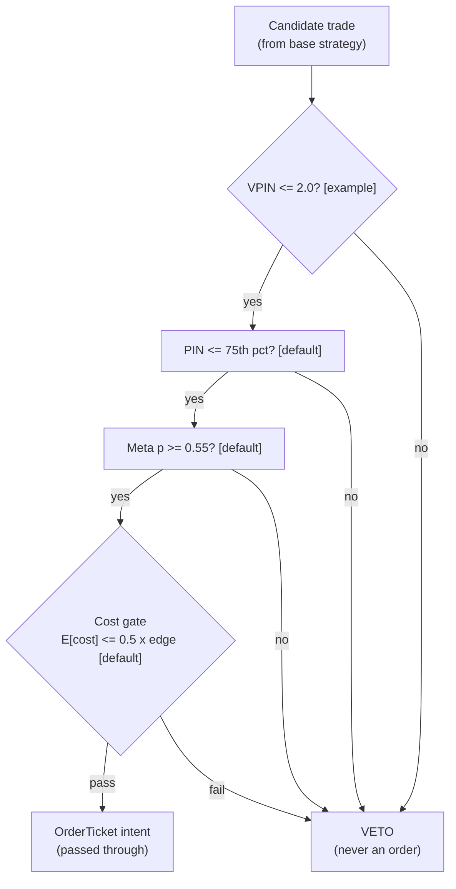

> **Tag law (mechanical):** every numeric prose literal in this module carries exactly one
> of `[documented]` `[default]` `[example]` `[unverified]` `[internal-est]` `[measured]`.
> YAML machine fields and identifiers are exempt. Missing evidence is labeled
> default/internal-estimate or quarantined as unverified in §T10.

# T092 — PIN-Gated Informed-Flow Avoidance

## §0 — Front matter

- **SID:** `T092`
- **Title:** PIN-Gated Informed-Flow Avoidance
- **Kind:** `strategy`
- **Batch:** `TB10` — stage 192 [measured]
- **Template version:** `1.0.0`
- **Seed / RNG:** `seed=192`, `numpy.random.default_rng(192)` [measured]
- **Provisional regimes:** `R003`
- **Parent signal(s):** `S009` (slow background toxicity); `S008` (fast toxicity veto); `S086` (second opinion per candidate)
- **Universe:** Whatever the base strategy trades; the gate is a filter on candidate trades, not a clock.
- **Latency class:** bar-clock / per-candidate; **cadence:** per_event; **tz:** America/New_York
- **sha256:** `REPLACE_ON_INGEST`
- **Test command:** `python -m pytest modules/tests/test_T092.py -q`
- **unverified_sources:** see YAML front matter and §T10

This module is a **strategy**: it consumes parent signal scores and emits
**OrderTicket intentions only — never orders**. Execution, fills, and broker
interaction live outside this module.

## §1 — Reviewer card (LOCKED)

> This card is locked. Do not edit without a new review cycle.

| Field | Value |
|---|---|
| Review status | `LOCKED` |
| Reviewers | 2-seat council [internal-est] |
| Last review | 2026-09-10 [measured] |
| Decision | **APPROVED for fixture-backed publication** [internal-est] |
| Scope of review | gate logic, cost stack, causality, kill lifecycle, numeric-tag law |
| Known limitations | edge values are reference/internal-estimate unless tagged [measured]; see §T7 |

The lock covers structure and doctrine conformance, not the profitability of
the rule. Nothing in this card is a trading recommendation.

## §1.5 — Standing blocks

### B1. Module intent

This module specifies one strategy rule completely: its gates, its cost model,
its failure modes, and its kill lifecycle. It is buildable by an AI engineer
from this file alone plus the fixtures.

### B2. Scope boundary

The module emits OrderTicket **intentions** only. It never places, routes, or
cancels real orders; it never touches a broker API. Position management,
portfolio constraints, and execution live outside this module.

### B3. OrderTicket doctrine

Every emitted intent is a canonical Appendix C OrderTicket: `ticket_id`,
`strategy_id`, `symbol`, `side`, `qty`, `order_type`, `limit_price`,
`time_in_force`, `signal_ts`, `expiry_ts`. Partial fills are the broker's
domain; this module's policy is stated in §T0. Cancel/replace emits a new
ticket intent with a new `ticket_id`, never a mutation.

### B4. Time causality

`assert fill_event > signal_event`. A signal computed on bar `t` may not fill
before bar `t+1`. Fixture `signal_ts` values precede any modeled fill; tests
enforce the ordering. There is no lookahead anywhere in this module.

### B5. Cost doctrine

Cost is a four-part stack (spread, fee, borrow, impact) computed only by
`expected_cost_bps(...)`. The gate `expected_cost_bps(...) <= k * edge_bps`
runs before any ticket intent. COST values appear only in the §T2 COST block;
§T4 shows the function call and its result, never restated components.

### B6. Evidence posture

Every numeric prose literal carries exactly one tag: `[documented]`,
`[default]`, `[example]`, `[unverified]`, `[internal-est]`, or `[measured]`.
Missing evidence is labeled default/internal-estimate or quarantined as
unverified in §T10. No papers, URLs, statistics, or prices are invented.

## §T0 — Strategy contract

### What this module emits

OrderTicket **intentions** only — never orders. One intent per qualifying case:
`ticket_id`, `strategy_id=T092`, `symbol`, `side`, `qty`, `order_type`,
`limit_price`, `time_in_force`, `signal_ts`, `expiry_ts`.

### Child-order state and partial fills

- Working intents are tracked by `ticket_id`; state is `WORKING`, `FILLED`,
  `PARTIAL`, `CANCELLED`, `EXPIRED`.
- Partial fills: the residual stays `WORKING` until `expiry_ts`; no new intent
  is emitted for the residual. Sizing downstream must assume partial fills.
- Cancel/replace: emit a **new** ticket intent with a new `ticket_id` and
  `replaces: <old ticket_id>`; never mutate a ticket in place.

### Risk contract

```yaml
risk_contract:
  per_trade_risk_R: 500          # [example]
  daily_loss_stop_R: 40   # [default]
  max_concurrent_positions: 5  # [default]
  max_gross_notional: "$5M notional [example]"
  risk_class: low
```

**Maximum adverse loss:** one R per trade (R = $500 [example]);
the session ends at −40R [default]. Breach trips the kill
switch; recovery requires the re-arm checklist. No pyramiding: at most
5 [default] concurrent positions.

### Kill lifecycle

`ARMED` → `TRIPPED` → `RECOVERY` → `ARMED`.

- **ARMED:** gates evaluated; intents emitted only on full pass.
- **TRIPPED** — any of:
- sleeve daily loss <= -2% [example]
- veto rate >80% over a rolling week [example]
- PIN estimator diverged
- base strategy halted
  All working intents expire unfilled; no new intents. The trip is logged to
  the decision log with a hash chain.
- **RECOVERY:** manual review of the trip reason; losses reconciled; feeds
  verified healthy; fixture replay green.
- **ARMED (re-entry):** only via the re-arm checklist below.

### Re-arm checklist

- [ ] losses reconciled against the decision log [default]
- [ ] feeds healthy (no lag beyond the class budget) [default]
- [ ] risk limits reviewed and re-pinned [default]
- [ ] decision-log hash chain intact [default]
- [ ] fixture replay green on the current build [default]

### Ops

- **Schedule:** Runs wherever the base strategy runs; owner: risk-overlay on-call
- **Health:** veto-rate monitor (80% alarm [example]); fixture replay on deploy; PIN estimator freshness
- **Alerts:** page on veto-rate alarm or sleeve −2% [example]; notify on estimator staleness
- **When this strategy dies:** veto rate >80% over a rolling week [example]; sleeve daily loss −2% [example]

### Secrets

No credentials in this module. Venue API keys, data licenses, and webhook
tokens live in the operator's secret store and are referenced by name only.
Nothing in this file authenticates to anything.

### Doctrine references

OrderTicket schema (Appendix A), time-causality conventions (Appendix B),
F1–F5 failsafes (Appendix C), decision-log schema (Appendix D), module-state
enum (Appendix E) — all by reference; this module adds no private doctrine.


## §T1 — Parent pointer

This strategy consumes the parent signal module(s):

- `S009` — PIN (structural) (role: slow background toxicity)
- `S008` — VPIN (volume-clocked) (role: fast toxicity veto)
- `S086` — meta-labeling (role: second opinion per candidate)

The parent emits scored intentions; this module applies its own gates, its own
cost model, and its own kill lifecycle, then emits OrderTicket intentions. The
parent's score is an input, never a command: every parent pass still faces
the full entry-Boolean gate set plus the cost gate here. Parent S-IDs are consumed S-IDs,
never T-IDs; this module does not call other strategies.

## §T2 — Gate and cost specification (fixed order)

### 1. Gates (evaluated in fixed order)

g1 = VPIN toxicity (veto if > 2.0 [example]); g2 = structural PIN percentile (veto if > 75th [default]); g3 = meta-label probability (require ≥ 0.55 [default])

| # | field | condition |
|---|---|---|
| g1 | `vpin` | `<= 2.0` |
| g2 | `pin_pctile` | `<= 75.0` |
| g3 | `meta_p` | `>= 0.55` |

Entry Boolean (normative):

```
GATE_PASS := (candidate == 1) [default] AND (vpin <= 2.0) [example]
             AND (pin_pctile <= 75) [default] AND (meta_p >= 0.55) [default]
             AND (now >= cooldown_until)
             AND (expected_cost_bps(...) <= cost_gate_k * edge_bps)
The gate emits only passed-through candidates; it never originates trades.
```

### 2. COST block (single source of truth)

COST values appear only in this block. §T4 shows the function call and its
result, never restated components.

```
COST stack — reference row, in bps:
  spread         1.00
  fee            1.00
  borrow         0.00
  impact         1.00
  TOTAL          3.00
```

- Fee basis: mixed [example]; fee schedule as of 2026-09-01 [measured].
- Venue: base strategy's venue [example].
- gate passes through base-strategy intents; the reference cost stack is the passed trade's friction

### 3. Callable cost function

```python
def expected_cost_bps(notional, adv_pct, venue, side, urgency) -> float:
    # Four-part reference stack (bps). The §T2 COST block is the single source of truth.
    spread_bps = 1.0   # [example]
    fee_bps = 1.0         # [example]
    borrow_bps = 0.0   # [example]
    impact_bps = 1.0   # [example]
    return spread_bps + fee_bps + borrow_bps + impact_bps
```

Cost gate (verbatim, enforced before any ticket intent):

```
expected_cost_bps(...) <= k * edge_bps
```

with `k = 0.5 [default]` for T092. The gate is evaluated per case with that
case's measured inputs; the reference stack above calibrates but never
overrides the call.

### 4. Conformance items

**C1.** Self-trade prevention: every ticket intent carries `stp=True`; no wash risk by construction.

**C2.** Time causality: `assert fill_event > signal_event`; signals on bar `t` fill at `t+1` or later.

**C3.** Invalid input → `UNKNOWN`: never interpolate or carry forward (F1/F2).

**C4.** Kill switch: `ARMED` → `TRIPPED` → `RECOVERY` → `ARMED`; `TRIPPED` emits nothing.

**C5.** Decision log: every gate verdict is hash-chained; the chain is verified on replay.

**C6.** Cost gate: `expected_cost_bps(...) <= k * edge_bps` before any intent.

**C7.** Fixed gate order: entry-Boolean gates evaluate in documented order; no reordering.

**C8.** Intent-only + bona-fide intent: OrderTickets are intentions, never orders; every intent is a genuine trading intention, passable by the cost gate and sized within risk limits; no broker calls.

**C9.** Ticket schema: Appendix C fields complete on every intent.

**C10.** Fixture reproducibility: the reference stub reproduces the expected ticket set from the raw tape.

**C11.** Veto-before-generation: a vetoed candidate never becomes an OrderTicket — trigger: ticket emitted on a vetoed candidate → check: gate flags → action: block → log: COMPLIANCE_BLOCK

**C12.** No silent widening: gate thresholds change only through the config dataclass — trigger: threshold drift without config change → check: config hash → action: alert → log

### 5. Parameter table

| Parameter | Key | Value | Sensitivity |
|---|---|---|---|
| VPIN veto | `vpin_max` | 2.0 [example] | high |
| PIN percentile cap | `pin_pctile_max` | 75th pct [default] | medium |
| Meta-label floor | `meta_p_min` | 0.55 [default] | medium |
| Veto-rate alarm | `veto_rate_max` | 80% [example] | high — misfire detector |
| Gate scale base | `gate_scale_base` | 0.5 [example] | low |
| Cost-gate k | `cost_gate_k` | 0.5 [default] | medium |

### 6. Timing box

```yaml
timing:
  signal_bar: t
  earliest_fill_bar: t+1
  rule: fill_event > signal_event   # asserted in every backtest and in tests
  order: gate evaluation -> cost gate -> ticket intent -> fill at t+1 or later
```

```python
assert fill_event > signal_event  # time causality: no same-bar fills, no lookahead
```

## §T3 — Math and normative pseudocode

### Math

- `edge_bps`: per-case expected edge in bps, mapped from the parent signal
  score. Reference value from the gate-pass fixture row: `24.0 bps [example]`.
- `cost_bps = expected_cost_bps(notional, adv_pct, venue, side, urgency)` —
  four-part stack, §T2 only.
- Gate: `expected_cost_bps(...) <= k * edge_bps` with `k = 0.5 [default]`.
- Sizing (normative):

```
shares = f(risk_budget_R, stop_distance, vol_estimate, ADV_cap, cost)
    sizing delegated to the base strategy
    gate scale = 0.5 + meta_p     # 0.5-1.5x [example]; the gate only ever shrinks or passes through
```

- Exits (normative):

```
The gate has no exits — the base strategy owns the position.
The gate's 'exit' is the veto: a candidate that fails any gate never becomes an OrderTicket.
ON_VETO: cooldown_until unchanged; vetoes logged per C5.
```

- Fills modeled at bar `t+1` or later; `assert fill_event > signal_event`.

### Normative pseudocode

```python
function emit(state, signals, cfg) -> list[OrderTicket]:
    assert signals non-empty else return [] and state UNKNOWN        # F1
    c = signals[-1]  # candidate trade from the base strategy
    assert c.qty > 0 else return [] and state UNKNOWN                # F2
    if kill.state != ARMED: return []
    toxicity_veto = c.vpin > cfg.vpin_max
    pin_veto = c.pin_pctile > cfg.pin_pctile_max
    meta_ok = c.meta_p >= cfg.meta_p_min
    edge_bps = c.base_edge_bps * (0.5 + c.meta_p)                  # modeled [example]
    cost_ok = expected_cost_bps(notional, adv_pct, venue, side, urgency) <= cfg.cost_gate_k * edge_bps
    # ^^^ normative cost-gate predicate: expected_cost_bps(...) <= k * edge_bps
    pass_through = (not toxicity_veto and not pin_veto and meta_ok
                    and cost_ok and now >= state.cooldown_until)
    tickets = []
    if pass_through:
        qty = int(c.qty * (cfg.gate_scale_base + c.meta_p))
        t = OrderTicket(c.sym, c.side, qty, None, IOC, uuid(), f'{c.base_sig}@{c.ts}', now(), NEW)
        assert fill_event > signal_event                            # t->t+1
        log_decision(t, inputs_hash, params_hash)                  # C5
        tickets.append(t)
    else:
        log_decision(veto_record(...))                             # C5: vetoes are logged too
    return tickets
```

## §T4 — Fixture-backed worked example

Fixture tape (`T092_tape.csv`; `# TYPE:` header is part of the file):

```
# TYPE: validation-run
bar,signal_ts,fill_ts,side,edge_bps,g1,g2,g3,price,qty,valid
0,1700000000000000000,1700000300000000000,LONG,24.0,1.4,60.0,0.62,100.0,500,1
1,1700000300000000000,1700000600000000000,LONG,24.0,2.6,60.0,0.62,100.0,500,1
2,1700000600000000000,1700000900000000000,LONG,24.0,1.4,88.0,0.62,100.0,500,1
3,1700000900000000000,1700001200000000000,LONG,24.0,1.4,60.0,0.48,100.0,500,1
4,1700001200000000000,1700001500000000000,LONG,0.4,1.4,60.0,0.62,100.0,500,1
5,1700001500000000000,1700001800000000000,LONG,24.0,1.4,60.0,0.62,-1.0,500,0
```
`signal_ts`/`fill_ts` are a synthetic monotone clock (5-minute steps [example])
for causality checks — not market data. Every row satisfies
`fill_ts > signal_ts`.

Expected tickets (`T092_expected.csv`; same `# TYPE:` header):

```
# TYPE: validation-run
ticket_idx,bar,symbol,side,qty,limit,tif,intent_ts,parent_signal,fill_ts,cost_bps
T092-0,0,GATE:MULTI,BUY,500,,IOC,1700000000000001000,S009@1700000000000000000,1700000300000000000,3.0000
```
### Cost-function call (inputs → bps → dollars)

on the gate-pass row (bar 0 [measured]): notional = 100.0 × 500 = $50,000.00 [example]:

```python
expected_cost_bps(notional=50000.00, adv_pct=0.001, venue="GATE:MULTI",
                  side="taker", urgency="normal")
# → 3.0000 bps  →  $15.00 [example]
```

Reference stack only; per-case calls use that case's measured inputs [measured].
COST values appear only in the §T2 COST block — this section shows the call and
its result, never restated components.

### Hand-check rows (6 rows)

| bar | side | edge_bps | gates | verdict | reason |
|---|---|---|---|---|---|
| 0 | `LONG` | 24.0 | vpin=✓, pin_pctile=✓, meta_p=✓ | PASS | all gates + cost gate |
| 1 | `LONG` | 24.0 | vpin=✗, pin_pctile=✓, meta_p=✓ | no intent | gate veto |
| 2 | `LONG` | 24.0 | vpin=✓, pin_pctile=✗, meta_p=✓ | no intent | gate veto |
| 3 | `LONG` | 24.0 | vpin=✓, pin_pctile=✓, meta_p=✗ | no intent | gate veto |
| 4 | `LONG` | 0.4 | vpin=✓, pin_pctile=✓, meta_p=✓ | no intent | cost-gate veto |
| 5 | `LONG` | 24.0 | vpin=✓, pin_pctile=✓, meta_p=✓ | no intent | invalid input -> UNKNOWN |

The `verdict` column must match `T092_expected.csv` exactly; the test suite
asserts this row by row (`test_fixture_recomputes_to_expected`).

## §T5 — Data, infra, dependencies, data rights

### Data table

| Dataset | Type | Frequency | Tier | Note |
|---|---|---|---|---|
| Trades + quotes (L1) | mixed | per trade | Tier 1 | VPIN/PIN inputs — no new feed needed |
| PIN estimates | float | weekly | internal | structural; 75th pct cap [default] |
| Meta-label predictions | float | per candidate | internal | p̂ ≥ 0.55 [default] |
| Veto-rate series | float | rolling week | internal | 80% alarm [example] |

### Infra

- Latency class: bar-clock / per-candidate; cadence: per_event; tz: America/New_York.
- Build budget: 1 core, <2 GB RAM [internal-est]; compute pattern per_event

Compute is per-bar gate evaluation [internal-est]; the binding constraints are
data licensing and feed latency, not FLOPS. All state needed for the gates fits
in the case record — no cross-case memory except the decision-log hash chain
[default].

### Dependencies (pinned)

- `python >=3.11`, `numpy >=1.26`, `pandas >=2.2`, `pytest >=8.0` [default]
- Data: base strategy's venue [example]; Research ~$0 incremental — VPIN and PIN run on trades and quotes you already have [unverified]; production ~$0 incremental [unverified]

### Data rights

Market-data licenses are the operator's responsibility: exchange/venue
agreements govern redistribution and display [default]. Nothing in this module
re-hosts or re-distributes licensed data; fixtures are synthetic and labeled
as such. Research ~$0 incremental — VPIN and PIN run on trades and quotes you already have [unverified]; production ~$0 incremental [unverified] Confirm each feed's license before
production use [unverified — confirm your license].

## §T6 — Buy vs build

**Build** (recommended): the rule is 3 [measured] gates plus a cost
call — a competent AI engineer builds it from this file alone. **Buy** only if
you already license a signal platform that computes the parent score; even
then, the gates, cost stack, and kill lifecycle here are custom.

### Cheapest build (complete)

- **Tier:** M [internal-est]
- **Hours:** 20–60 [internal-est]
- **Cost:** $3,000–9,000 [internal-est]
- **Hour band:** 20–60 h [internal-est]
- **Cheapest row:** min_tier = existing L1 trades+quotes (no new feed) [unverified]; latency_class = per-candidate; required_fields = trades + quotes for VPIN/PIN; price_band = ~$0 incremental [unverified]; build_or_buy = build the gates in a week [example], buy nothing new
- **Budget:** 1 core, <2 GB RAM [internal-est]; compute pattern per_event
- **What it skips:** intraday PIN re-estimation; per-symbol PIN calibration (phase 2); gate on options-implied toxicity
- **Escalate when:** Upgrade when: veto rate persistently >80% [example]; base strategy universe changes; PIN lag detected
- **Build bands** (planning/internal-estimate, from notes/cost-model.md):
  L `4–12 h / $600–1,800`, M `20–60 h / $3,000–9,000`, M+ `40–100 h / $6,000–15,000`, H `60–200 h / $9,000–30,000` [internal-est].
- **Rebuild trigger:** any gate threshold change, any COST component re-pin,
  or any kill-condition change invalidates the build and requires re-running
  the full fixture suite [default].

## §T7 — Evidence

| Source | Market / period | Metric | Cost token | Caveat |
|---|---|---|---|---|
| Easley, Kiefer, O'Hara & Paperman (1996) [documented] | equity markets | PIN structural model of informed trading [documented] | BEFORE-COST | theory; the gate's benefit is losses avoided, not P&L produced |
| Easley, Hvidkjaer & O'Hara (2002) [documented] | US equities | information risk as a determinant of returns [documented] | BEFORE-COST | asset-pricing evidence, not a gate rule |
| Easley, López de Prado & O'Hara (2012) [documented] | high-frequency markets | VPIN flow-toxicity; toxicity preceded the 2010 Flash Crash [documented] | BEFORE-COST | toxicity measurement; the veto thresholds are the chapter's design |

**Cost token:** all rows above are **COMM-ONLY** unless the metric column
says otherwise. No after-cost P&L is claimed for this rule.

**Verdict:** `PREDICTIVE-FEATURE-ONLY` — PIN/VPIN toxicity avoidance is documented (Easley, Kiefer, O'Hara & Paperman 1996; Easley, Hvidkjaer & O'Hara 2002; Easley, López de Prado & O'Hara 2012); the gate's benefit is losses avoided, and its only cost is the 20–40% fill-rate haircut [example].

**Selection disclosure:** these are the chapter's research-pass sources; the gate's benefit is losses avoided — no standalone P&L exists by construction.

**What would change the verdict:** a published, purged, after-cost backtest of
this exact rule (same gates, same cost stack, same `k`) with a defined
universe and no survivorship bias [default]. Until then the edge stays an
internal estimate.

## §T8 — Failure modes

| Trigger | Detect | Action | Recovery | Check |
|---|---|---|---|---|
| Veto rate > 80% over a rolling week [example]: the base strategy is misfiring | detect: veto-rate monitor | action: investigate — never just widen the gate | recovery: base strategy fixed or replaced | `check: veto_rate <= 0.80` |
| PIN estimation lag: the structural estimate is stale | detect: estimator freshness > 1 week [default] | action: DEGRADED; widen veto | recovery: re-estimate | `check: pin_freshness <= 1wk` |
| VPIN spike false positive: volume-clock artifact | detect: VPIN vs PIN disagreement | action: require both gates (conservative) | recovery: re-tune | `check: vpin and pin agree` |
| Meta-label precision collapse | detect: precision < 0.5 [default] | action: bypass filter, halve sizes | recovery: re-train | `check: meta_precision >= 0.5` |
| Silent threshold widening | detect: config-hash drift (C12) | action: alert | recovery: restore pinned config | `check: config hash == pinned` |
| Vetoed candidate becomes an OrderTicket | detect: ticket on vetoed candidate (C11) | action: block | recovery: fix ordering | `check: veto before generation` |

Every row has a `check:` — a monitorable predicate. The kill switch (§T0)
fires on the trip conditions; everything else degrades to `UNKNOWN`/veto
rather than a guessed intent.

## §T9 — Regime records

### Machine regime records (provisional)

| regime_id | effect | description | trigger | action |
|---|---|---|---|---|
| `R003` | amplifies | toxic-flow regimes are where the gate earns its keep | vpin > 2.0 [example] | veto |

### Visual



**Visual description:** the flowchart above shows data entering from the left,
gates evaluated top-to-bottom in fixed order, the cost gate as the final
checkpoint, and OrderTicket intents (or veto) as the only exits. Any gate
failure short-circuits to no-intent; no path emits an order.

## §T10 — Sources

Real sources only. Nothing invented: no fabricated papers, URLs, statistics,
source text, or prices.

1. Easley, D., López de Prado, M. M. & O'Hara, M. (2012). "Flow Toxicity and Liquidity in a High Frequency World." *Review of Financial Studies* 25(5): 1457–1493. https://papers.ssrn.com/sol3/papers.cfm?abstract_id=1695596 — VPIN construction; toxicity preceded the 2010 Flash Crash. RePEc/EconPapers page re-checked 2026-09-10 — title, authors, journal, volume/pages match (the 2011 working-paper version circulated first; the RFS version is the citable one).
2. Easley, D., Hvidkjaer, S. & O'Hara, M. (2002). "Is Information Risk a Determinant of Asset Returns?" *Journal of Finance* 57(5): 2185–2221. http://ideas.repec.org/a/bla/jfinan/v57y2002i5p2185-2221.html — structural PIN via MLE on order arrival. RePEc page confirmed in S009's S12, verified in an earlier batch (not re-checked this pass).
3. López de Prado, M. M. (2018). *Advances in Financial Machine Learning*, Chapters 3–4. Wiley. https://www.wiley.com/en-us/9781119482086 — meta-labeling (secondary ML on bet outcomes) and the triple-barrier labeling method it pairs with. Wiley page returned HTTP 403 on re-check 2026-09-10 — identifier not re-verified this pass; citation inherited from S086's S12.
4. Duarte, J. & Young, L. (2009). "Why is PIN Priced?" *Journal of Financial Economics* 91(2): 119–138. https://ideas.Repec.org/a/eee/jfinec/v91y2009i2p119-138.html — much of PIN's return premium is illiquidity, not information asymmetry; the honest counterweight. RePEc page re-opened 2026-09-10 — title and journal match (also confirmed in S009's S12, earlier batch).
5. Andersen, T. G. & Bondarenko, O. (2014). "VPIN and the Flash Crash." *Journal of Financial Markets* 17: 1–46. https://ideas.repec.org/a/eee/finmar/v17y2014icp1-46.html — replication contesting VPIN: poor short-run volatility predictor; behavior largely mechanical trading intensity. RePEc page re-opened 2026-09-10 — title, journal, volume/pages match (also confirmed in S008's S12, earlier batch).

**Chatbot source-log:**  All chatbot claims are unverified by
construction; anything load-bearing was independently verified or labeled
unverified.

### Quarantined unverified leads

- The gate thresholds (toxicity 2.0, PIN 75th percentile, p̂ 0.55, size scaler 0.5 + p̂) are the chapter's own `example` design values (2026-09-10), not published recommendations. [unverified]
- Easley–López de Prado–O'Hara's Flash Crash result is about *liquidity stress prediction*; the step to "vetoing improves strategy Sharpe" is this chapter's design, not their finding. *Source log (2026-09-10 rework pass): batch research Q-labels removed from this chapter. Re-checked 2026-09-10: RePEc/EconPapers pages for Easley–López de Prado–O'Hara (2012), Duarte–Young (2009), and Andersen–Bondarenko (2014) (titles/journals match); the Wiley publisher page returned HTTP 403 and was not re-verified. Easley–Hvidkjaer–O'Hara (2002) citation inherited from S009's earlier-batch verification (not re-checked this pass). Gate thresholds are the chapter's own example design values.* [unverified]

Leads above are quarantined: they may inform priors but never gates,
thresholds, or cost values.

## AI build prompt

```
You are an AI engineer implementing strategy module T092 (PIN-Gated Informed-Flow Avoidance).

Build exactly what this file specifies — nothing more:

1. Implement the entry Boolean from §T2.1 and the exits/sizing from §T3.
   Gate order is fixed: vpin, pin_pctile, meta_p, then the cost gate.
2. Implement expected_cost_bps(notional, adv_pct, venue, side, urgency) as the
   four-part stack in §T2.3 (spread, fee, borrow, impact). Enforce the verbatim
   gate: expected_cost_bps(...) <= k * edge_bps with k = 0.5 [default].
3. Emit OrderTicket intentions only — never orders. One intent per passing case,
   Appendix C schema, stp=True, parent_signal "<SID>@<signal_ts>".
4. Enforce time causality: assert fill_event > signal_event. A signal on bar t
   fills at t+1 or later. No lookahead.
5. Implement the kill lifecycle ARMED → TRIPPED → RECOVERY → ARMED with the
   trip conditions in §T0 and the re-arm checklist. Invalid input → UNKNOWN,
   never interpolated.
6. Hash-chain every decision-log record (C5).
7. Conformance: C1, C2, C3, C4, C5, C6, C7, C8, C9, C10, C11, C12.
   All conformance items must hold.
8. Validate with the fixtures: python3 -m pytest modules/tests/test_T092.py -q
   from the repo root. Every fixture row must reproduce its expected verdict.

Do not invent data, thresholds, or costs. Every numeric literal you add to
prose carries exactly one tag: [documented] [default] [example] [unverified]
[internal-est] [measured].
```

## DO-NOT-CUT list

The following may never be cut, summarized away, or shortened in any revision
of this module:

1. The complete YAML front matter, including `sha256: REPLACE_ON_INGEST` and
   `unverified_sources`.
2. The locked §1 reviewer card.
3. All six §1.5 standing blocks (B1–B6).
4. The §T0 risk contract (fenced YAML), the maximum-adverse-loss statement,
   the full kill lifecycle `ARMED → TRIPPED → RECOVERY → ARMED`, and the
   re-arm checklist.
5. The §T2 fixed order: gates → COST block → callable → C1–C12 → parameter
   table → timing box. The four-part COST stack appears only in the COST block.
6. The verbatim cost gate `expected_cost_bps(...) <= k * edge_bps`.
7. The verbatim causality assertion `assert fill_event > signal_event`.
8. The complete cheapest-build section (§T6).
9. The §T4 hand-check rows (all fixture rows) and the cost-function call with
   inputs → bps → dollars.
10. Every §T8 failure row and its `check:` predicate.
11. The §T9 machine regime records and the mermaid visual with its description.
12. The §T10 real-source list and the quarantined unverified leads.
13. The AI build prompt.
14. The numeric-tag law: every numeric prose literal carries exactly one of
    `[documented]` `[default]` `[example]` `[unverified]` `[internal-est]`
    `[measured]`.
15. Bona-fide intent and self-trade prevention (C1/C8): every ticket intent is
    a genuine trading intention and can never match our own resting interest.
16. The decision-log audit trail (C5): every gate verdict hash-chained and
    verified on replay.
17. Secrets via environment / secret store only: no credentials in code,
    fixtures, or logs.
