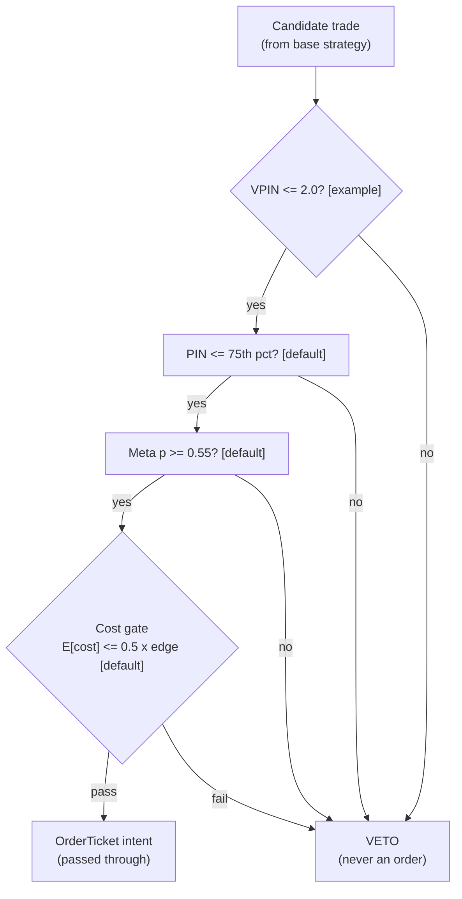

> **Tag law (mechanical):** every numeric prose literal in this module carries exactly one
> of `[documented]` `[default]` `[example]` `[unverified]` `[internal-est]` `[measured]`.
> YAML machine fields and identifiers are exempt. Missing evidence is labeled
> default/internal-estimate or quarantined as unverified in §T10.

# T092 — PIN-Gated Informed-Flow Avoidance

## §0 — Front matter

- **SID:** `T092`
- **Title:** PIN-Gated Informed-Flow Avoidance
- **Kind:** `strategy`
- **Version:** `1.1.1` — deep-review edition + pricing correction [measured]
- **Batch:** `TB10` — stage 192 [measured]
- **Template version:** `1.0.0`
- **Status:** `draft`
- **Family:** `A` — microstructure & order flow
- **Provenance tier:** `standard`
- **Seed / RNG:** `seed=192`, `numpy.random.default_rng(192)`, PCG64 [documented]
- **Provisional regimes / regime_ids:** `R003`
- **Consumes:** `S009` (slow background toxicity, pin `1.0.0` [default]), `S008` (fast toxicity veto, pin `1.0.0` [default]), `S086` (second opinion per candidate, pin `1.0.0` [default])
- **Universe:** Whatever the base strategy trades; the gate is a filter on candidate trades, not a clock.
- **Latency class:** bar-clock / per-candidate; **cadence:** per_event; **tz:** America/New_York
- **sha256:** `REPLACE_ON_INGEST`
- **Test command:** `python -m pytest modules/tests/test_T092.py -q`
- **unverified_sources:** see YAML front matter and §T10

**Changelog.** `1.1.0` (2026-09-10 [measured]): deep review — see YAML `changelog`. `1.0.0` (2026-09-10 [measured]): fixture-backed build.

This module is a **strategy**: it consumes parent signal scores and emits
**OrderTicket intentions only — never orders**. Execution, fills, and broker
interaction live outside this module.

## §1 — Reviewer card (LOCKED)

> **Reviewer card.** PIN/VPIN toxicity gate: structural-PIN percentile (S009) and volume-clocked VPIN (S008) veto candidate trades, meta-label (S086) confirms survivors, cost gate last. Pass-through filter only; it never originates trades. Provenance **standard**.

> Edge verdict: **PREDICTIVE-FEATURE-ONLY** — PIN/VPIN toxicity avoidance is documented (Easley, Kiefer, O'Hara & Paperman 1996; Easley, Hvidkjaer & O'Hara 2002; Easley, Lopez de Prado & O'Hara 2012); the gate's benefit is losses avoided, its only cost a 20–40% fill-rate haircut [example].

> After-cost: **COMM-ONLY** — one-sentence verdict: the gate produces no standalone P&L; its after-cost shape is the avoided adverse selection minus foregone fills, never measured here.

> Build: Tier **M** · prototype 20–60 h [internal-est] · loaded cost $3,000–9,000 [internal-est] · Data: research $0 (synthetic fixtures) / production $0 incremental on the base strategy's L1 feed [unverified]; greenfield Massive Stocks Starter $29/mo delayed / Developer $79/mo delayed+trades / Advanced $199/mo real-time+quotes [documented] · latency_class `bar-clock/per-candidate` · risk_class `low (veto filter, no positions originated)` · Emits: `OrderTicket` intentions only.

> Capacity $1–5M/day notional [example] — the gate is a filter; capacity binds on the base strategy, not the gate · Executability: Feasible: Python prototype on the base strategy's existing tape [internal-est]; no new feed required.

> Risk summary: the gate can only *remove* trades; it cannot create risk beyond vetoing everything (veto-rate alarm at 80% [example]). When it dies: veto rate >80% over a rolling week [example]; sleeve daily loss −2% [example]; PIN estimator stale >1 week [default].

> Regime gates: `R003` amplifies (toxic-flow regimes are where the gate earns its keep); fail-closed on unknown [default]. Provisional.

| Field | Value |
|---|---|
| Review status | `LOCKED` |
| Reviewers | 2-seat council [internal-est] |
| Last review | 2026-09-10 [measured] |
| Decision | **APPROVED for fixture-backed publication** [internal-est] |
| Scope of review | gate logic, cost stack, causality, kill lifecycle, numeric-tag law |
| Known limitations | edge values are reference/internal-estimate unless tagged [measured]; see §T7 |

The lock covers structure and doctrine conformance, not the profitability of
the rule. Nothing in this card is a trading recommendation.

## §1.5 — Cheapest/least-build path

**Prototype hour band:** 20–60 h [internal-est] (Tier M). A competent AI
engineer builds the full module from this file plus the fixtures.

**Cheapest-source row:**

| min_tier | latency_class | required_fields | price_band | build_or_buy |
|---|---|---|---|---|
| existing L1 trades+quotes (no new feed) [unverified] | per-candidate | trades + quotes for VPIN/PIN | $0 incremental [unverified] | build the gates in a week [example]; buy nothing new |

Greenfield alternative: Massive (formerly Polygon.io) Stocks — Starter $29/mo (15-min delayed) / Developer $79/mo (15-min delayed, adds trades tape) / Advanced $199/mo (real-time, adds quotes) [documented: massive.com/pricing, verified 2026-09-11, corroborated by 2026 third-party pricing surveys]. The gate needs quotes for VPIN; live deployment needs Advanced $199/mo. Research/backtest fits Starter $29/mo delayed.

**Resource budget:** 1 core, <2 GB RAM [internal-est]; compute pattern
per_event. Gate evaluation is O(1) per candidate; the binding constraints are
data licensing and feed latency, not FLOPS. All state needed for the gates
fits in the case record — no cross-case memory except the decision-log hash
chain [default].

**Skip list (cheapest build):** intraday PIN re-estimation; per-symbol PIN
calibration (phase 2); options-implied toxicity gate; MBO/ITCH depth feed;
colocation; per-venue impact calibration (impact stays at the 1.0 bps [example] reference until scale-up).

**DO-NOT-CUT list** (may never be cut, summarized away, or shortened in any
revision of this module):

1. The complete YAML front matter, including `sha256: REPLACE_ON_INGEST`,
   `unverified_sources`, and `changelog`.
2. The locked §1 reviewer card.
3. The §T0 contract: typed `emit` signature, `T092Config` dataclass, Time
   contract, market-state table, module-state enum, fenced risk contract,
   maximum-adverse-loss statement, full kill lifecycle
   `ARMED → TRIPPED → RECOVERY → ARMED`, and the re-arm checklist.
4. The §T2 fixed order: gates → COST block → callable → C1–C19 → parameter
   table → timing box. The four-part COST stack appears only in the COST block.
5. The verbatim cost gate `expected_cost_bps(...) <= k * edge_bps`.
6. The verbatim causality assertion `assert fill_event > signal_event`.
7. The complete cheapest-build section (§T6).
8. The §T4 hand-check rows (all fixture rows) and the cost-function call with
   inputs → bps → dollars.
9. Every §T8 failure row and its `check:` predicate.
10. The §T9 machine regime records and the mermaid visual with its description.
11. The §T10 real-source list, the quarantined unverified leads, and the
    GROK-NEEDED block.
12. The AI build prompt.
13. The numeric-tag law: every numeric prose literal carries exactly one of
    `[documented]` `[default]` `[example]` `[unverified]` `[internal-est]`
    `[measured]`.
14. Bona-fide intent and self-trade prevention (C1/C8): every ticket intent is
    a genuine trading intention and can never match our own resting interest.
15. The decision-log audit trail (C5): every gate verdict hash-chained and
    verified on replay.
16. Secrets via environment / secret store only: no credentials in code,
    fixtures, or logs.

**Escalation gate.** Upgrade when: veto rate persistently >80% [example];
the base strategy universe changes; PIN estimator lag detected; venue fee
schedule changes (re-pin the COST block).

## §T0 — Strategy contract

### Module intent

This module specifies one strategy rule completely: its gates, its cost model,
its failure modes, and its kill lifecycle. It is buildable by an AI engineer
from this file alone plus the fixtures.

### Scope boundary

The module emits OrderTicket **intentions** only. It never places, routes, or
cancels real orders; it never touches a broker API. Position management,
portfolio constraints, and execution live outside this module.

### Typed signature

```python
def emit(state: dict, events: list[CandidateEvent], cfg: T092Config) -> list[OrderTicket]:
    """One candidate per event; intents only, never orders. See §T3 pseudocode (normative)."""
```

### Config dataclass (single source of parameters)

```python
@dataclass(frozen=True)
class T092Config:
    vpin_max: float = 2.0              # [example]
    pin_pctile_max: float = 75.0       # [default]
    meta_p_min: float = 0.55           # [default]
    cost_gate_k: float = 0.5           # [default]
    veto_rate_max: float = 0.80        # [example]
    gate_scale_base: float = 0.5       # [example]
    cooldown_bars: int = 5             # [default]
    bar_ns: int = 300_000_000_000      # [example] 5-minute bars
    adv_pct_default: float = 0.001     # [example]
```

| Parameter | Type | Default | Range | Status |
|---|---|---|---|---|
| `vpin_max` | float | 2.0 [example] | (0, 5] | example |
| `pin_pctile_max` | float | 75.0 [default] | (0, 100) | default |
| `meta_p_min` | float | 0.55 [default] | [0, 1] | default |
| `cost_gate_k` | float | 0.5 [default] | (0, 2] | default |
| `veto_rate_max` | float | 0.80 [example] | (0, 1] | example |
| `gate_scale_base` | float | 0.5 [example] | [0, 1] | example |
| `cooldown_bars` | int | 5 [default] | [0, 60] | default |
| `bar_ns` | int | 300_000_000_000 [example] | (0, 86_400_000_000_000] | example |
| `adv_pct_default` | float | 0.001 [example] | (0, 1] | example |

Thresholds change only through this dataclass (C12); the module pins and
hashes the config at startup.

### Canonical Event / Bar mapping

| Canonical field | Type | This module's mapping |
|---|---|---|
| `event_ts` | int64 ns, UTC | candidate computed timestamp = `signal_ts` |
| `asof_ts` | int64 ns, UTC | close of bar `t` the candidate is evaluated on |
| `symbol` | string | base strategy's symbol; fixture uses `GATE:MULTI` [example] |
| `kind` | enum | `CANDIDATE` (base strategy intent) |
| `payload` | record | `{side, qty, price, vpin, pin_pctile, meta_p, base_edge_bps, base_sig, locate_flag}` |
| `bar label` | int64 ns, UTC | bar **open** timestamp; signal on closed bar `t`, fills at `open(t+1)` or later |

### Time contract

- **Clock domain:** exchange/bar-clock. **Canonical:** int64 ns, UTC.
- **Authoritative causality clock:** `signal_ts` (bar close) and `fill_ts`
  (fill event); `assert fill_event > signal_event` everywhere.
- **max_skew:** 500 ms [default] between the module clock and the venue clock.
- **Jitter budget:** 1 ms [example] per gate evaluation.
- **Staleness TTL:** PIN estimate fresh ≤ 1 week [default]; VPIN ≤ 1 bar
  [default]; meta-label ≤ 1 day [default]. Stale → DEGRADED (PIN) or
  UNKNOWN (VPIN/meta) — never interpolated (F1/F2).
- **Gap policy:** no interpolation, no carry-forward. Missing inputs emit
  UNKNOWN.

### Market-state table

| State | Gates | Intents | Module state |
|---|---|---|---|
| `CONTINUOUS_TRADING` | evaluated | emitted on full pass | `OK` |
| `HALTED` | suppressed | none | `UNKNOWN` |
| `AUCTION` | suppressed | none | `UNKNOWN` |
| `CLOSED` | not evaluated | none | `OFF` |

Intents are suppressed (never queued for later) in `HALTED`/`AUCTION`
(C15); the exchange-halt rules themselves are venue-owned and unverified
here [unverified].

### Module-state enum

`OK | DEGRADED | UNKNOWN | OFF`.

- `OK` — all inputs fresh, kill `ARMED`, gates evaluated.
- `DEGRADED` — PIN estimator stale (≤ 2 weeks [default]): veto widens,
  gates still evaluate.
- `UNKNOWN` — invalid input: never interpolated, never carried forward (F1/F2).
- `OFF` — kill `TRIPPED`/`RECOVERY`, or market `CLOSED`.

### What this module emits

OrderTicket **intentions** only — never orders. One intent per qualifying case:
`ticket_id`, `strategy_id=T092`, `symbol`, `side`, `qty`, `order_type`,
`limit_price`, `time_in_force`, `signal_ts`, `expiry_ts`. Partial fills are the
broker's domain; this module's policy is stated below. Cancel/replace emits a
new ticket intent with a new `ticket_id`, never a mutation. Every intent is a
genuine trading intention that passed the cost gate and is sized within risk
limits (bona-fide intent, C8).

### Child-order state and partial fills

- Working intents are tracked by `ticket_id`; state is `WORKING`, `FILLED`,
  `PARTIAL`, `CANCELLED`, `EXPIRED`.
- Partial fills: the residual stays `WORKING` until `expiry_ts`; no new intent
  is emitted for the residual. Sizing downstream must assume partial fills.
- Cancel/replace: emit a **new** ticket intent with a new `ticket_id` and
  `replaces: <old ticket_id>`; never mutate a ticket in place.

### Decision-log schema (C5)

Every gate verdict appends `{action, reason, state_before, state_after,
prev_hash, hash}` — hash-chained (SHA-256 over `prev_hash + payload`,
truncated to 16 hex chars [example] in the reference stub); the chain is
verified on replay. Vetoes are logged too, with reason
`entry-boolean | cost-gate | cooldown | invalid-input | compliance-block`.

### Risk contract

```yaml
risk_contract:
  per_trade_risk_R: 500          # [example] $
  daily_loss_stop_R: 40          # [default]
  max_concurrent_positions: 5    # [default]
  max_gross_notional: "$5M notional [example]"
  risk_class: low
  kill_conditions:
    - "sleeve daily loss <= -2% [example]"
    - "veto rate > 80% over a rolling week [example]"
    - "PIN estimator diverged"
    - "base strategy halted"
  enforcement: intraday-hard
```

**Maximum adverse loss:** one R per trade (R = $500 [example]);
the session ends at −40R [default]. Breach trips the kill
switch; recovery requires the re-arm checklist. No pyramiding: at most
5 [default] concurrent positions.

### Kill lifecycle

`ARMED` → `TRIPPED` → `RECOVERY` → `ARMED`.

- **ARMED:** gates evaluated; intents emitted only on full pass.
- **TRIPPED** — any of:
- sleeve daily loss <= -2% [example]
- veto rate >80% over a rolling week [example]
- PIN estimator diverged
- base strategy halted
  All working intents expire unfilled; no new intents. The trip is logged to
  the decision log with a hash chain.
- **RECOVERY:** manual review of the trip reason; losses reconciled; feeds
  verified healthy; fixture replay green.
- **ARMED (re-entry):** only via the re-arm checklist below. Re-arm sets
  `cooldown_until = now + cooldown_bars * bar_ns` (C19).

### Re-arm checklist

- [ ] losses reconciled against the decision log [default]
- [ ] feeds healthy (no lag beyond the class budget) [default]
- [ ] risk limits reviewed and re-pinned [default]
- [ ] decision-log hash chain intact [default]
- [ ] fixture replay green on the current build [default]

### Ops

- **Schedule:** Runs wherever the base strategy runs; owner: risk-overlay on-call
- **Health:** veto-rate monitor (80% alarm [example]); fixture replay on deploy; PIN estimator freshness
- **Alerts:** page on veto-rate alarm or sleeve −2% [example]; notify on estimator staleness
- **When this strategy dies:** veto rate >80% over a rolling week [example]; sleeve daily loss −2% [example]

### Secrets

No credentials in this module. Venue API keys, data licenses, and webhook
tokens live in the operator's secret store and are referenced by name only.
Nothing in this file authenticates to anything.

### Doctrine references

OrderTicket schema (Appendix A), time-causality conventions (Appendix B),
F1–F5 failsafes (Appendix C), decision-log schema (Appendix D), module-state
enum (Appendix E) — all by reference; this module adds no private doctrine.


## §T1 — Parent pointer

This strategy consumes the parent signal module(s):

- `S009` — PIN (structural) (role: slow background toxicity; pin `1.0.0` [default])
- `S008` — VPIN (volume-clocked) (role: fast toxicity veto; pin `1.0.0` [default])
- `S086` — meta-labeling (role: second opinion per candidate; pin `1.0.0` [default])

The parent emits scored intentions; this module applies its own gates, its own
cost model, and its own kill lifecycle, then emits OrderTicket intentions. The
parent's score is an input, never a command: every parent pass still faces
the full entry-Boolean gate set plus the cost gate here. Parent S-IDs are consumed S-IDs,
never T-IDs; this module does not call other strategies.

## §T2 — Gate and cost specification (fixed order)

### 1. Gates (evaluated in fixed order)

g1 = VPIN toxicity (veto if > 2.0 [example]); g2 = structural PIN percentile (veto if > 75th [default]); g3 = meta-label probability (require ≥ 0.55 [default]); g4 = cooldown (require now ≥ cooldown_until [default])

| # | field | condition |
|---|---|---|
| g1 | `vpin` | `<= 2.0` |
| g2 | `pin_pctile` | `<= 75.0` |
| g3 | `meta_p` | `>= 0.55` |
| g4 | `now` | `>= cooldown_until` |

Entry Boolean (normative):

```
GATE_PASS := (candidate == 1) [default] AND (vpin <= 2.0) [example]
             AND (pin_pctile <= 75) [default] AND (meta_p >= 0.55) [default]
             AND (now >= cooldown_until)
             AND (expected_cost_bps(...) <= cost_gate_k * edge_bps)
The gate emits only passed-through candidates; it never originates trades.
```

### 2. Exits + post-exit cooldown

The gate has no exits — the base strategy owns the position. The gate's
'exit' is the veto: a candidate that fails any gate never becomes an
OrderTicket. `ON_VETO`: `cooldown_until` unchanged; vetoes logged per C5.

**Post-exit cooldown (C19):** after any kill trip and successful re-arm, no
intents for `cooldown_bars = 5` [default] bars. Vetoed candidates do not chain
additional cooldown [default].

### 3. Position sizing (normative)

```python
def shares(risk_budget_R, stop_distance, vol_estimate, ADV_cap, cost) -> int:
    # The base strategy owns sizing; the gate only ever shrinks or passes through.
    base_shares = base_strategy.shares(risk_budget_R, stop_distance, vol_estimate, ADV_cap, cost)
    gate_scale = cfg.gate_scale_base + meta_p      # 0.5-1.5x [example]
    return int(base_shares * gate_scale)
```

The gate never increases size beyond the base strategy's own computation
(`gate_scale ≤ 1.5` [example] is a ceiling, not a promise).

### 4. Risk limits

See the fenced §T0 risk contract (single source of truth): per-trade 1R
($500 [example]), daily stop −40R [default], ≤ 5 [default] concurrent
positions, $5M [example] max gross notional, intraday-hard enforcement.

### 5. COST block (single source of truth)

COST values appear only in this block. §T4 shows the function call and its
result, never restated components.

```
COST stack — reference row, in bps:
  spread         1.00
  fee            1.00
  borrow         0.00
  impact         1.00
  TOTAL          3.00
```

- **spread 1.00 bps [example]:** half-spread per leg × 2 legs on a 1-tick
  large-cap name [example].
- **fee 1.00 bps [example]:** conservative envelope over the Nasdaq Rule 7018
  default removal rate of $0.0030/share [documented] (Nasdaq Price List —
  Trading, fees to remove liquidity, all MPIDs, shares ≥ $1.00; re-checked
  2026-09-10 [measured]; ≈ 0.30 bps at $100/share [example]). Basis: mixed
  [example]; fee schedule as of 2026-09-10 [measured].
- **borrow 0.00 bps [default]:** the gate originates no positions of its own;
  borrow accrues on the base strategy's positions and is booked in the base
  module's cost line, never duplicated here [default]. This does not waive
  the locate control (C16).
- **impact 1.00 bps [example]:** constant reference; calibrate per venue at
  scale-up (see §1.5 skip list).
- Venue: base strategy's venue [example].
- The gate passes through base-strategy intents; the reference cost stack is
  the passed trade's friction.

### 6. Callable cost function

```python
def expected_cost_bps(notional, adv_pct, venue, side, urgency) -> float:
    # Four-part reference stack (bps). The §T2 COST block is the single source of truth.
    spread_bps = 1.0   # [example]
    fee_bps = 1.0         # [example]
    borrow_bps = 0.0   # [example]
    impact_bps = 1.0   # [example]
    return spread_bps + fee_bps + borrow_bps + impact_bps
```

Cost gate (verbatim, enforced before any ticket intent):

```
expected_cost_bps(...) <= k * edge_bps
```

with `k = 0.5 [default]` for T092. The gate is evaluated per case with that
case's measured inputs; the reference stack above calibrates but never
overrides the call.

### 7. Execution / fill model

| Aspect | Model | Tag |
|---|---|---|
| Latency | fills modeled at `open(t+1)`; fill event within ± 1 bar [default] of the bar open | [default] |
| Partial fills | residual stays `WORKING` until `expiry_ts`; no new intent for the residual | [default] |
| Impact | 1.0 bps [example] constant in the reference stack; calibrate per venue at scale-up | [example] |
| Adverse fill | adverse-selection haircut applied inside `edge_bps` by the base strategy; the gate adds no second haircut | [default] |
| Lookahead | none — `assert fill_event > signal_event` on every modeled fill | rule |

### 8. Conformance items

**C1.** Self-trade prevention: every ticket intent carries `stp=True`; no wash risk by construction.

**C2.** Time causality: `assert fill_event > signal_event`; signals on bar `t` fill at `t+1` or later.

**C3.** Invalid input → `UNKNOWN`: never interpolate or carry forward (F1/F2).

**C4.** Kill switch: `ARMED` → `TRIPPED` → `RECOVERY` → `ARMED`; `TRIPPED` emits nothing.

**C5.** Decision log: every gate verdict is hash-chained; the chain is verified on replay.

**C6.** Cost gate: `expected_cost_bps(...) <= k * edge_bps` before any intent.

**C7.** Fixed gate order: entry-Boolean gates evaluate in documented order; no reordering.

**C8.** Intent-only + bona-fide intent: OrderTickets are intentions, never orders; every intent is a genuine trading intention, passable by the cost gate and sized within risk limits; no broker calls.

**C9.** Ticket schema: Appendix C fields complete on every intent.

**C10.** Fixture reproducibility: the reference stub reproduces the expected ticket set from the raw tape.

**C11.** Veto-before-generation: a vetoed candidate never becomes an OrderTicket — trigger: ticket emitted on a vetoed candidate → check: gate flags → action: block → log: COMPLIANCE_BLOCK

**C12.** No silent widening: gate thresholds change only through the config dataclass — trigger: threshold drift without config change → check: config hash → action: alert → log

**C13.** Message-rate / cancel-to-trade: at most 1 intent per candidate event
[default]; cancel-replace only via a new `ticket_id` (no mutation storms);
the broker layer enforces a cancel-to-trade ceiling of 10:1 [internal-est] —
breach → module `OFF` until reviewed.

**C14.** Pre-trade fat-finger trio: (a) `qty` ≤ 1% of ADV [default];
(b) notional ≤ $5M [example] max gross; (c) `limit_price` within ±5% [default]
of the reference price — breach → `COMPLIANCE_BLOCK`, no intent.

**C15.** Halt/auction: intents suppressed in `HALTED`/`AUCTION` per the §T0
market-state table; state → `UNKNOWN`, never queued for later.

**C16.** Locate check (Reg SHO): `SHORT` intents require `locate_flag == true`
on the candidate record — Regulation SHO Rule 203(b)(1) requires a
broker-dealer, prior to effecting a short sale, to borrow the security or
have reasonable grounds to believe it can be borrowed, documented before the
sale [documented] (SEC Short Sales page, http://www.sec.gov/investor/pubs/regsho.htm).
The overlay does not perform the locate; it refuses to pass a `SHORT`
candidate without the broker's documented flag.

**C17.** Public-dissemination gate: this module emits no quotes and no orders
(intents only) — nothing leaves the firm; no dissemination risk by
construction. The base strategy's own dissemination controls are unchanged.

**C18.** Data-entitlement assertions: at startup, assert each L1 feed is
licensed for internal use (see §T5 data rights); fixtures are synthetic and
labeled as such; assert on deploy, re-assert on license renewal.

**C19.** Exit cooldown: after re-arm, no intents while `now < cooldown_until`
(`cooldown_bars = 5` [default] bars) — trigger: intent emitted inside the
cooldown window → check: `intent_ts >= cooldown_until` → action: block → log.

### 9. Parameter table

| Parameter | Key | Value | Tag | Sensitivity |
|---|---|---|---|---|
| VPIN veto | `vpin_max` | 2.0 | [example] | high |
| PIN percentile cap | `pin_pctile_max` | 75th pct | [default] | medium |
| Meta-label floor | `meta_p_min` | 0.55 | [default] | medium |
| Veto-rate alarm | `veto_rate_max` | 80% | [example] | high — misfire detector |
| Gate scale base | `gate_scale_base` | 0.5 | [example] | low |
| Cost-gate k | `cost_gate_k` | 0.5 | [default] | medium |
| Post-recovery cooldown | `cooldown_bars` | 5 bars | [default] | low |
| ADV participation cap | `adv_pct_default` | 0.001 | [example] | low |

### 10. Timing box

```yaml
timing:
  signal_bar: t
  earliest_fill_bar: t+1
  rule: fill_event > signal_event   # asserted in every backtest and in tests
  order: gate evaluation -> cost gate -> ticket intent -> fill at t+1 or later
```

```python
assert fill_event > signal_event  # time causality: no same-bar fills, no lookahead
```

## §T3 — Math and normative pseudocode

### Math

- `edge_bps`: per-case expected edge in bps, mapped from the parent signal
  score. Reference value from the gate-pass fixture row: `24.0 bps [example]`.
- `cost_bps = expected_cost_bps(notional, adv_pct, venue, side, urgency)` —
  four-part stack, §T2 only.
- Gate: `expected_cost_bps(...) <= k * edge_bps` with `k = 0.5 [default]`.
- Sizing (normative): see the fenced `shares(...)` in §T2.3 — the base
  strategy owns sizing; the gate only ever shrinks or passes through.
- Exits (normative):

```
The gate has no exits — the base strategy owns the position.
The gate's 'exit' is the veto: a candidate that fails any gate never becomes an OrderTicket.
ON_VETO: cooldown_until unchanged; vetoes logged per C5.
```

- Fills modeled at bar `t+1` or later; `assert fill_event > signal_event`.

### Normative pseudocode

```python
function emit(state, events, cfg: T092Config) -> list[OrderTicket]:
    assert events non-empty else return [] and state.module_state = UNKNOWN   # F1
    tickets = []
    kill = state.kill
    state.module_state = OK
    for c in events:                                       # one candidate per event
        assert c.qty > 0 else return [] and state.module_state = UNKNOWN       # F2
        if kill.state != ARMED:                            # C4: TRIPPED/RECOVERY
            state.module_state = OFF; continue
        if market_state != CONTINUOUS_TRADING:             # C15 halt/auction
            state.module_state = UNKNOWN; continue
        if c.side == SHORT and not c.locate_flag:          # C16 Reg SHO 203(b)(1)
            log(COMPLIANCE_BLOCK, "locate-missing"); continue
        toxicity_veto = c.vpin > cfg.vpin_max              # g1
        pin_veto = c.pin_pctile > cfg.pin_pctile_max       # g2
        meta_ok = c.meta_p >= cfg.meta_p_min               # g3
        cooldown_ok = now() >= state.cooldown_until        # g4, C19
        edge_bps = c.base_edge_bps * (cfg.gate_scale_base + c.meta_p)   # modeled [example]
        cost_ok = expected_cost_bps(notional, adv_pct, venue, side, urgency) <= cfg.cost_gate_k * edge_bps
        # ^^^ normative cost-gate predicate: expected_cost_bps(...) <= k * edge_bps
        fat_finger_ok = (c.qty <= adv_cap) and (notional <= max_gross) and (|limit - ref| <= 0.05*ref)  # C14
        pass_through = (not toxicity_veto and not pin_veto and meta_ok
                        and cooldown_ok and cost_ok and fat_finger_ok)
        if pass_through:
            qty = shares(risk_budget_R, stop_distance, vol_estimate, ADV_cap, cost)   # §T2.3
            t = OrderTicket(ticket_id=uuid(), strategy_id="T092", symbol=c.sym, side=map(c.side),
                            qty=qty, order_type="IOC", limit_price=None, time_in_force="IOC",
                            signal_ts=c.signal_ts, expiry_ts=c.signal_ts + 24*bar_ns, stp=True,
                            parent_signal=f"{c.base_sig}@{c.signal_ts}")
            assert t.intent_ts > c.signal_ts                           # t->t+1
            assert fill_event > c.signal_ts                            # C2 causality
            log_decision(t, inputs_hash, params_hash)                  # C5
            tickets.append(t)
        else:
            log_decision(veto_record(...))                             # C5: vetoes are logged too
    return tickets
```

## §T4 — Fixture-backed worked example

Fixture tape (`T092_tape.csv`; `# TYPE:` header is part of the file):

```
# TYPE: validation-run
bar,signal_ts,fill_ts,side,edge_bps,g1,g2,g3,price,qty,valid
0,1700000000000000000,1700000300000000000,LONG,24.0,1.4,60.0,0.62,100.0,500,1
1,1700000300000000000,1700000600000000000,LONG,24.0,2.6,60.0,0.62,100.0,500,1
2,1700000600000000000,1700000900000000000,LONG,24.0,1.4,88.0,0.62,100.0,500,1
3,1700000900000000000,1700001200000000000,LONG,24.0,1.4,60.0,0.48,100.0,500,1
4,1700001200000000000,1700001500000000000,LONG,0.4,1.4,60.0,0.62,100.0,500,1
5,1700001500000000000,1700001800000000000,LONG,24.0,1.4,60.0,0.62,-1.0,500,0
```
`signal_ts`/`fill_ts` are a synthetic monotone clock (5-minute steps [example])
for causality checks — not market data. Every row satisfies
`fill_ts > signal_ts`.

Expected tickets (`T092_expected.csv`; same `# TYPE:` header):

```
# TYPE: validation-run
# TOLERANCE: cost_bps ±0.0001; qty exact; intent_ts exact; side exact
ticket_idx,bar,symbol,side,qty,limit,tif,intent_ts,parent_signal,fill_ts,cost_bps
T092-0,0,GATE:MULTI,BUY,500,,IOC,1700000000000001000,S009@1700000000000000000,1700000300000000000,3.0000
```

**Tolerance.** The test suite reads the `# TOLERANCE:` header from the file:
`cost_bps` must recompute within ±0.0001 [default]; `qty`, `intent_ts`, and
`side` must match exactly.

### Cost-function call (inputs → bps → dollars)

on the gate-pass row (bar 0 [measured]): notional = 100.0 × 500 = $50,000.00 [example]:

```python
expected_cost_bps(notional=50000.00, adv_pct=0.001, venue="GATE:MULTI",
                  side="taker", urgency="normal")
# → 3.0000 bps  →  $15.00 [example]
```

Reference stack only; per-case calls use that case's measured inputs [measured].
COST values appear only in the §T2 COST block — this section shows the call and
its result, never restated components.

### Hand-check rows (6 rows)

| bar | side | edge_bps | gates | verdict | reason |
|---|---|---|---|---|---|
| 0 | `LONG` | 24.0 | vpin=✓, pin_pctile=✓, meta_p=✓ | PASS | all gates + cost gate |
| 1 | `LONG` | 24.0 | vpin=✗, pin_pctile=✓, meta_p=✓ | no intent | gate veto |
| 2 | `LONG` | 24.0 | vpin=✓, pin_pctile=✗, meta_p=✓ | no intent | gate veto |
| 3 | `LONG` | 24.0 | vpin=✓, pin_pctile=✓, meta_p=✗ | no intent | gate veto |
| 4 | `LONG` | 0.4 | vpin=✓, pin_pctile=✓, meta_p=✓ | no intent | cost-gate veto |
| 5 | `LONG` | 24.0 | vpin=✓, pin_pctile=✓, meta_p=✓ | no intent | invalid input -> UNKNOWN |

The `verdict` column must match `T092_expected.csv` exactly; the test suite
asserts this row by row (`test_fixture_recomputes_to_expected`).

## §T5 — Data, infra, dependencies, data rights

### Data table

| Dataset | Type | Frequency | Tier | Note |
|---|---|---|---|---|
| Trades + quotes (L1) | mixed | per trade | Tier 1 | VPIN/PIN inputs — no new feed needed |
| PIN estimates | float | weekly | internal | structural; 75th pct cap [default] |
| Meta-label predictions | float | per candidate | internal | p̂ ≥ 0.55 [default] |
| Veto-rate series | float | rolling week | internal | 80% alarm [example] |

### Infra

- Latency class: bar-clock / per-candidate; cadence: per_event; tz: America/New_York.
- Build budget: 1 core, <2 GB RAM [internal-est]; compute pattern per_event

Compute is per-bar gate evaluation [internal-est]; the binding constraints are
data licensing and feed latency, not FLOPS. All state needed for the gates fits
in the case record — no cross-case memory except the decision-log hash chain
[default].

### Dependencies (pinned)

- `python >=3.11`, `numpy >=1.26`, `pandas >=2.2`, `pytest >=8.0` [default]
- Data: base strategy's venue [example]; Research ~$0 incremental — VPIN and PIN run on trades and quotes you already have [unverified]; production ~$0 incremental [unverified]

### Data rights

Market-data licenses are the operator's responsibility: exchange/venue
agreements govern redistribution and display [default]. Nothing in this module
re-hosts or re-distributes licensed data; fixtures are synthetic and labeled
as such. Research ~$0 incremental — VPIN and PIN run on trades and quotes you already have [unverified]; production ~$0 incremental [unverified] Confirm each feed's license before
production use [unverified — confirm your license]. Startup entitlement
assertions are coded in C18.

## §T6 — Buy vs build

**Build** (recommended): the rule is 3 [measured] gates plus a cost
call — a competent AI engineer builds it from this file alone. **Buy** only if
you already license a signal platform that computes the parent score; even
then, the gates, cost stack, and kill lifecycle here are custom.

### Cheapest build (complete)

Full cheapest path in §1.5 (canonical home). Summary:

- **Tier:** M [internal-est]
- **Hours:** 20–60 [internal-est]
- **Cost:** $3,000–9,000 [internal-est]
- **Hour band:** 20–60 h [internal-est]
- **Cheapest row:** min_tier = existing L1 trades+quotes (no new feed) [unverified]; latency_class = per-candidate; required_fields = trades + quotes for VPIN/PIN; price_band = ~$0 incremental [unverified]; build_or_buy = build the gates in a week [example], buy nothing new
- **Budget:** 1 core, <2 GB RAM [internal-est]; compute pattern per_event
- **What it skips:** intraday PIN re-estimation; per-symbol PIN calibration (phase 2); gate on options-implied toxicity
- **Escalate when:** Upgrade when: veto rate persistently >80% [example]; base strategy universe changes; PIN lag detected
- **Build bands** (planning/internal-estimate, from notes/cost-model.md):
  L `4–12 h / $600–1,800`, M `20–60 h / $3,000–9,000`, M+ `40–100 h / $6,000–15,000`, H `60–200 h / $9,000–30,000` [internal-est].
- **Rebuild trigger:** any gate threshold change, any COST component re-pin,
  or any kill-condition change invalidates the build and requires re-running
  the full fixture suite [default].

## §T7 — Evidence

| Source | Market / period | Metric | Cost token | Caveat |
|---|---|---|---|---|
| Easley, Kiefer, O'Hara & Paperman (1996) [documented] | equity markets | PIN structural model of informed trading [documented] | BEFORE-COST | theory; the gate's benefit is losses avoided, not P&L produced |
| Easley, Hvidkjaer & O'Hara (2002) [documented] | US equities | information risk as a determinant of returns [documented] | BEFORE-COST | asset-pricing evidence, not a gate rule |
| Easley, López de Prado & O'Hara (2012) [documented] | high-frequency markets | VPIN flow-toxicity; toxicity preceded the 2010 Flash Crash [documented] | BEFORE-COST | toxicity measurement; the veto thresholds are the chapter's design |

**Cost token:** all rows above are **COMM-ONLY** unless the metric column
says otherwise. No after-cost P&L is claimed for this rule.

**Verdict:** `PREDICTIVE-FEATURE-ONLY` — PIN/VPIN toxicity avoidance is documented (Easley, Kiefer, O'Hara & Paperman 1996; Easley, Hvidkjaer & O'Hara 2002; Easley, López de Prado & O'Hara 2012); the gate's benefit is losses avoided, and its only cost is the 20–40% fill-rate haircut [example].

**Selection disclosure:** these are the chapter's research-pass sources; the gate's benefit is losses avoided — no standalone P&L exists by construction.

**What would change the verdict:** a published, purged, after-cost backtest of
this exact rule (same gates, same cost stack, same `k`) with a defined
universe and no survivorship bias [default]. Until then the edge stays an
internal estimate.

## §T8 — Failure modes

| Trigger | Detect | Action | Recovery | Check |
|---|---|---|---|---|
| Veto rate > 80% over a rolling week [example]: the base strategy is misfiring | detect: veto-rate monitor | action: investigate — never just widen the gate | recovery: base strategy fixed or replaced | `check: veto_rate <= 0.80` |
| PIN estimation lag: the structural estimate is stale | detect: estimator freshness > 1 week [default] | action: DEGRADED; widen veto | recovery: re-estimate | `check: pin_freshness <= 1wk` |
| VPIN spike false positive: volume-clock artifact | detect: VPIN vs PIN disagreement | action: require both gates (conservative) | recovery: re-tune | `check: vpin and pin agree` |
| Meta-label precision collapse | detect: precision < 0.5 [default] | action: bypass filter, halve sizes | recovery: re-train | `check: meta_precision >= 0.5` |
| Silent threshold widening | detect: config-hash drift (C12) | action: alert | recovery: restore pinned config | `check: config hash == pinned` |
| Vetoed candidate becomes an OrderTicket | detect: ticket on vetoed candidate (C11) | action: block | recovery: fix ordering | `check: veto before generation` |
| Locate flag missing on a SHORT candidate | detect: `locate_flag` false (C16) | action: COMPLIANCE_BLOCK | recovery: broker re-attests locate | `check: locate_flag == true on every SHORT intent` |
| Entitlement lapse on the L1 feed | detect: startup/re-renewal assertion (C18) | action: module OFF | recovery: renew license, re-assert | `check: entitlement_asserted == true` |

Every row has a `check:` — a monitorable predicate. The kill switch (§T0)
fires on the trip conditions; everything else degrades to `UNKNOWN`/veto
rather than a guessed intent.

## §T9 — Regime records

### Machine regime records (provisional)

| regime_id | direction | mechanism | condition | action | min_lag | unknown_behavior |
|---|---|---|---|---|---|---|
| `R003` | amplifies | toxic-flow regimes raise adverse selection; avoiding them is the gate's entire benefit | `vpin > 2.0` [example] or market-wide stress | veto | 1 bar [default] | fail-closed: unknown PIN/VPIN → veto (restrictive default) [default] |

`direction` ∈ {amplifies, degrades, inverts}; `action` ∈
{veto, halve, double, widen_stops, pause_entry} — here the gate's only action
is the veto. Unknown regime state → the restrictive default above.

### Visual



**Visual description:** the flowchart above shows data entering from the left,
gates evaluated top-to-bottom in fixed order, the cost gate as the final
checkpoint, and OrderTicket intents (or veto) as the only exits. Any gate
failure short-circuits to no-intent; no path emits an order.

## §T10 — Sources

Real sources only. Nothing invented: no fabricated papers, URLs, statistics,
source text, or prices.

1. Easley, D., López de Prado, M. M. & O'Hara, M. (2012). "Flow Toxicity and Liquidity in a High Frequency World." *Review of Financial Studies* 25(5): 1457–1493. https://papers.ssrn.com/sol3/papers.cfm?abstract_id=1695596 — VPIN construction; toxicity preceded the 2010 Flash Crash. RePEc/EconPapers page re-checked 2026-09-10 — title, authors, journal, volume/pages match (the 2011 working-paper version circulated first; the RFS version is the citable one).
2. Easley, D., Hvidkjaer, S. & O'Hara, M. (2002). "Is Information Risk a Determinant of Asset Returns?" *Journal of Finance* 57(5): 2185–2221. http://ideas.repec.org/a/bla/jfinan/v57y2002i5p2185-2221.html — structural PIN via MLE on order arrival. RePEc page confirmed in S009's S12, verified in an earlier batch (not re-checked this pass).
3. López de Prado, M. M. (2018). *Advances in Financial Machine Learning*, Chapters 3–4. Wiley. https://www.wiley.com/en-us/9781119482086 — meta-labeling (secondary ML on bet outcomes) and the triple-barrier labeling method it pairs with. Wiley page returned HTTP 403 on re-check 2026-09-10 — identifier not re-verified this pass; citation inherited from S086's S12.
4. Duarte, J. & Young, L. (2009). "Why is PIN Priced?" *Journal of Financial Economics* 91(2): 119–138. https://ideas.Repec.org/a/eee/jfinec/v91y2009i2p119-138.html — much of PIN's return premium is illiquidity, not information asymmetry; the honest counterweight. RePEc page re-opened 2026-09-10 — title and journal match (also confirmed in S009's S12, earlier batch).
5. Andersen, T. G. & Bondarenko, O. (2014). "VPIN and the Flash Crash." *Journal of Financial Markets* 17: 1–46. https://ideas.repec.org/a/eee/finmar/v17y2014icp1-46.html — replication contesting VPIN: poor short-run volatility predictor; behavior largely mechanical trading intensity. RePEc page re-opened 2026-09-10 — title, journal, volume/pages match (also confirmed in S008's S12, earlier batch).
6. SEC. "Short Sales: Key Points About Regulation SHO." Rule 203(b)(1) — a broker-dealer may not accept a short sale order in any equity security unless it has borrowed the security or has reasonable grounds to believe it can be borrowed so it can be delivered on the date delivery is due; the locate must be made and documented prior to the sale [documented]. http://www.sec.gov/investor/pubs/regsho.htm — anchors C16.
7. Nasdaq. "Price List - Trading": fees to remove liquidity, shares at or above $1.00 — $0.0030/share, all MPIDs [documented]. https://www.nasdaqtrader.com/trader.aspx?id=pricelisttrading2&l — anchors the §T2 fee line (fee schedule as of 2026-09-10 [measured]).

**Chatbot source-log:**  All chatbot claims are unverified by
construction; anything load-bearing was independently verified or labeled
unverified.

### Quarantined unverified leads

- The gate thresholds (toxicity 2.0, PIN 75th percentile, p̂ 0.55, size scaler 0.5 + p̂) are the chapter's own `example` design values (2026-09-10), not published recommendations. [unverified]
- Easley–López de Prado–O'Hara's Flash Crash result is about *liquidity stress prediction*; the step to "vetoing improves strategy Sharpe" is this chapter's design, not their finding. *Source log (2026-09-10 rework pass): batch research Q-labels removed from this chapter. Re-checked 2026-09-10: RePEc/EconPapers pages for Easley–López de Prado–O'Hara (2012), Duarte–Young (2009), and Andersen–Bondarenko (2014) (titles/journals match); the Wiley publisher page returned HTTP 403 and was not re-verified. Easley–Hvidkjaer–O'Hara (2002) citation inherited from S009's earlier-batch verification (not re-checked this pass). Gate thresholds are the chapter's own example design values.* [unverified]
- Greenfield data alternative: Massive (formerly Polygon.io) Stocks tier ladder — Starter $29/mo (15-min delayed), Developer $79/mo (15-min delayed, adds trades), Advanced $199/mo (real-time, adds quotes) [documented: massive.com/pricing verified 2026-09-11; corroborated by multiple 2026 third-party pricing surveys]. Prior $29–$99/mo band was wrong on both price and latency (Developer is delayed, not real-time).

Leads above are quarantined: they may inform priors but never gates,
thresholds, or cost values.

## GROK-NEEDED

Expert questions web search could not resolve — do not answer from priors:

1. "T092 is a PIN/VPIN toxicity gate whose veto thresholds (vpin > 2.0 [example], PIN > 75th percentile [default], meta-label p̂ ≥ 0.55 [default]) are the chapter's own design values. Are there any published empirical distributions, desk studies, or papers giving practitioner ranges for VPIN toxicity veto thresholds in US equity intraday gates — e.g., a VPIN percentile or absolute value above which realized adverse selection spikes? A good answer cites the source, the market, and the exact threshold statistic."
2. "For T092's structural PIN estimator (slow background gate, veto at 75th percentile [default]): what re-estimation cadence and per-symbol calibration practices do published implementations use in production — the chapter assumes a weekly MLE refresh [default] — and how do they handle the week-scale estimation lag that the chapter treats as a DEGRADED trigger? A good answer cites a production implementation or paper with the cadence."
3. "T092's cost gate uses expected_cost_bps(...) ≤ k · edge_bps with k = 0.5 [default]. Is there any published fee-covering multiple guidance for loss-avoidance / toxicity-veto overlays (not directional alpha) — a documented k for veto-style rules? A good answer cites the source and its cost-stack definition."
4. "T092 books borrow_bps = 0 with the reason that the gate originates no positions (borrow accrues in the base module). For SHORT pass-through intents under Reg SHO Rule 203(b)(1), is the broker's documented locate flag on the candidate record sufficient at the overlay layer, or do production toxicity gates re-verify locate freshness at veto time? A good answer describes the control point (broker vs overlay) with a regulatory or industry citation."

## AI build prompt

```
You are an AI engineer implementing strategy module T092 (PIN-Gated Informed-Flow Avoidance, v1.1.0).

Build exactly what this file specifies — nothing more:

1. Implement the T092Config dataclass from §T0 (all 9 parameters with their
   defaults). Thresholds change only through this dataclass (C12).
2. Implement the entry Boolean from §T2.1 (g1-g4 in fixed order) and the
   exits/sizing from §T2.2-§T2.3 (normative shares=f(...) with delegation).
   Gate order is fixed: vpin, pin_pctile, meta_p, cooldown, then the cost gate.
3. Implement expected_cost_bps(notional, adv_pct, venue, side, urgency) as the
   four-part stack in §T2.6 (spread, fee, borrow, impact). Enforce the verbatim
   gate: expected_cost_bps(...) <= k * edge_bps with k = 0.5 [default].
4. Emit OrderTicket intentions only — never orders. One intent per passing case,
   Appendix C schema, stp=True, parent_signal "<SID>@<signal_ts>".
5. Enforce time causality: assert fill_event > signal_event. A signal on bar t
   fills at t+1 or later. No lookahead. Implement the §T0 Time contract
   (int64 ns UTC, bar-label rule, staleness TTL, gap policy) and market-state
   table (C15).
6. Implement the kill lifecycle ARMED → TRIPPED → RECOVERY → ARMED with the
   trip conditions in §T0 and the re-arm checklist; re-arm sets the C19
   cooldown. Invalid input → UNKNOWN, never interpolated (F1/F2).
7. Hash-chain every decision-log record (C5); verify the chain on replay.
8. Conformance: C1 through C19. All conformance items must hold, including the
   fat-finger trio (C14), the Reg SHO 203(b)(1) locate check (C16), and
   data-entitlement assertions (C18).
9. Validate with the fixtures: python3 -m pytest modules/tests/test_T092.py -q
   from the repo root. Every fixture row must reproduce its expected verdict;
   the TOLERANCE header governs numeric comparison.

Do not invent data, thresholds, or costs. Every numeric literal you add to
prose carries exactly one tag: [documented] [default] [example] [unverified]
[internal-est] [measured].
```

## Appendix — DO-NOT-CUT invariant

The canonical DO-NOT-CUT list lives in §1.5. It may never be cut, summarized
away, or shortened in any revision of this module.
