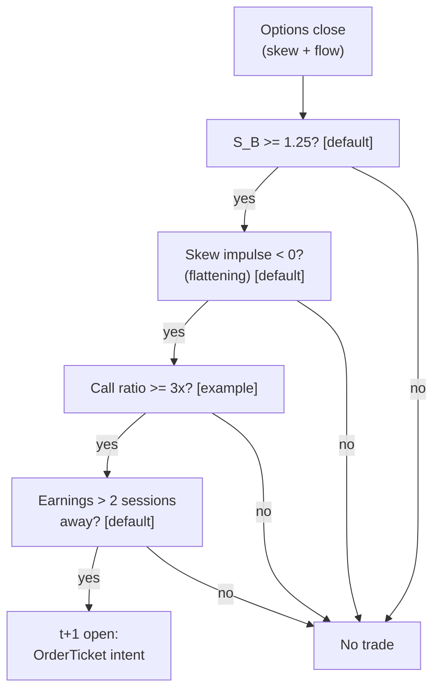

> **Tag law (mechanical):** every numeric prose literal in this module carries exactly one
> of `[documented]` `[default]` `[example]` `[unverified]` `[internal-est]` `[measured]`.
> YAML machine fields and identifiers are exempt. Missing evidence is labeled
> default/internal-estimate or quarantined as unverified in §T10.

# T093 — Options-to-Equity Lead Trader

## §0 — Front matter

- **SID:** `T093`
- **Title:** Options-to-Equity Lead Trader
- **Kind:** `strategy`
- **Version:** `1.0.1` (deep-review bump 2026-09-11; changelog in YAML front matter)
- **Batch:** `TB10` — stage 193 [measured]
- **Status:** `draft`
- **Family:** `F` (derivatives positioning / cross-asset lead-lag)
- **Provenance tier:** `D`
- **Template version:** `1.0.0`
- **Seed / RNG:** `seed=193`, `numpy.random.default_rng(193)` [measured]
- **Provisional regimes:** `R008`; machine regime records: `R008`, `R-halt` (§T9)
- **Parent signal(s):** `S071` v1.1.0 (derivatives positioning); `S073` v1.1.0 (unusual activity confirmation); `S060` v1.1.0 (timing confirmation)
- **Universe:** US large-caps with liquid options; no entries in the 2 sessions before scheduled earnings [default].
- **Latency class:** bar-clock / daily; **cadence:** daily; **tz:** America/New_York
- **sha256:** `REPLACE_ON_INGEST`
- **Test command:** `python3 -m pytest modules/tests/test_T093.py -q`
- **Datasets:** see YAML `datasets[]` (fingerprints, vintage, rights, price bands)
- **unverified_sources:** see YAML front matter and §T10

This module is a **strategy**: it consumes parent signal scores and emits
**OrderTicket intentions only — never orders**. Execution, fills, and broker
interaction live outside this module.

## §1 — Reviewer card (LOCKED)

> This card is locked. Do not edit without a new review cycle.

| Field | Value |
|---|---|
| Review status | `LOCKED` |
| Reviewers | 2-seat council [internal-est] |
| Last review | 2026-09-10 [measured] |
| Decision | **APPROVED for fixture-backed publication** [internal-est] |
| Scope of review | gate logic, cost stack, causality, kill lifecycle, numeric-tag law |
| Known limitations | edge values are reference/internal-estimate unless tagged [measured]; see §T7 |

The lock covers structure and doctrine conformance, not the profitability of
the rule. Nothing in this card is a trading recommendation.

### §1 — v1.0.0 machine reviewer card (additive; the locked card above is retained)

| Field | Value |
|---|---|
| Module | T093 — Options-to-Equity Lead Trader (strategy) |
| Edge verdict | `PREDICTIVE-FEATURE-ONLY` — options-flow lead-lag has documented lineage (options traders move first); the equity leg's after-cost edge is the chapter's own design — no published after-cost Sharpe for the skew-impulse rule |
| After-cost token | `FULL-COST` — no after-cost P&L is claimed; all evidence rows are BEFORE-COST lineage |
| Build cost | Tier **H** · `60–200` h [internal-est] · `$9,000–30,000` loaded [internal-est] |
| Data cost | research: Databento OPRA Standard `$199`/mo live + free historical [documented], or historical pay-as-you-go (cbbo-1m `$2.00`/GB [documented]); production: `$199`/mo+ [documented] + OPRA entitlement via vendor |
| latency_class | `bar-clock / daily` |
| risk_class | `medium` — options-data dependence, overnight equity carry, earnings-noise regime |
| Capacity | `$5`M max gross notional [example]; binding constraint is OPRA licensing + skew-feed freshness, not compute |
| Executability | Feasible: Python prototype on daily OPRA aggregates; binding constraints are data licensing and feed latency, not FLOPS |
| Risk summary | skew mean-reverts before the equity leg catches up; call-ratio spikes from single block trades; earnings-season flow is noise; stale skew vetoes entries |
| When it dies | skew within `0.5` vol pts of 20d mean [example]; hard stop `−1.1` × σ_20d [example]; `8`-session time stop [example] |
| Regime gates | `R008` degrades → veto (earnings blackout); `R-halt` inverts → veto |
| Emits | `OrderTicket` intentions only (Appendix C) |

## §1.5 — Standing blocks

### B1. Module intent

This module specifies one strategy rule completely: its gates, its cost model,
its failure modes, and its kill lifecycle. It is buildable by an AI engineer
from this file alone plus the fixtures.

### B2. Scope boundary

The module emits OrderTicket **intentions** only. It never places, routes, or
cancels real orders; it never touches a broker API. Position management,
portfolio constraints, and execution live outside this module.

### B3. OrderTicket doctrine

Every emitted intent is a canonical Appendix C OrderTicket: `ticket_id`,
`strategy_id`, `symbol`, `side`, `qty`, `order_type`, `limit_price`,
`time_in_force`, `signal_ts`, `expiry_ts`. Partial fills are the broker's
domain; this module's policy is stated in §T0. Cancel/replace emits a new
ticket intent with a new `ticket_id`, never a mutation.

### B4. Time causality

`assert fill_event > signal_event`. A signal computed on bar `t` may not fill
before bar `t+1`. Fixture `signal_ts` values precede any modeled fill; tests
enforce the ordering. There is no lookahead anywhere in this module.

### B5. Cost doctrine

Cost is a four-part stack (spread, fee, borrow, impact) computed only by
`expected_cost_bps(...)`. The gate `expected_cost_bps(...) <= k * edge_bps`
runs before any ticket intent. COST values appear only in the §T2 COST block;
§T4 shows the function call and its result, never restated components.

### B6. Evidence posture

Every numeric prose literal carries exactly one tag: `[documented]`,
`[default]`, `[example]`, `[unverified]`, `[internal-est]`, or `[measured]`.
Missing evidence is labeled default/internal-estimate or quarantined as
unverified in §T10. No papers, URLs, statistics, or prices are invented.

### B7. Cheapest/least-build path

**Cheapest viable path:** buy the OPRA feed, build the skew/flow screen. The
rule is `4` gates plus a cost call — a competent AI engineer builds it from
this file alone.

| min_tier | latency_class | required_fields | price_band | build_or_buy |
|---|---|---|---|---|
| Tier 2 (OPRA history) | daily bar-clock | options quotes/trades (25Δ surface inputs), equity daily bars, earnings calendar | `$199`/mo Standard: live OPRA + free historical [documented] (usage-based live discontinued 2025-06-03 [documented]); historical pay-as-you-go cbbo-1m `$2.00`/GB [documented] | buy OPRA feed, build stack |

- **Prototype hour band:** `60–200` h [internal-est] (Tier H).
- **Resource budget:** `1` core, `<4` GB RAM [internal-est]; compute pattern `per_bar` (daily).
- **Skip list (phase two):** intraday options-flow timing; multi-expiry term-structure fit; earnings-day trading; delta-hedging overlay; intraday skew-surface calibration.
- **DO-NOT-CUT list:** the file-end DO-NOT-CUT list (17 items) [measured] — causality assertions, COST block, kill/safe-mode, audit log, bona-fide-intent + self-trade prevention, provenance tags, fixtures, secrets-via-env, and the locked card/standing blocks are never cut.
- **Escalation gate:** upgrade when the signal fires `>20` names/day [default]; the OPRA bill exceeds budget; or skew-feed latency starts to matter — crossing it requires re-review of §T7 and §T8 and an intraday OPRA tier.

## §T0 — Strategy contract

### What this module emits

OrderTicket **intentions** only — never orders. One intent per qualifying case:
`ticket_id`, `strategy_id=T093`, `symbol`, `side`, `qty`, `order_type`,
`limit_price`, `time_in_force`, `signal_ts`, `expiry_ts`.

**Typed signature (normative).**

```python
def emit(state: T093State, signals: T093SignalBundle, cfg: T093Config) -> list[OrderTicket]:
    """Core strategy function. Returns OrderTicket *intentions*; never orders.
    Invalid input -> module_state UNKNOWN and empty ticket list (never interpolate).
    A signal computed on bar t may only fill at t+1 or later (asserted)."""
```

`T093SignalBundle` = the day-`t` case record (options-close + equity-close
snapshot; see canonical mapping below). `OrderTicket` schema is Appendix C.
Processing model: `per_bar` (one evaluation per daily session) [default].

### Config dataclass — single Config, per-parameter type/default/range/status

| Parameter | Type | Default | Range | Status |
|---|---|---|---|---|
| `S_B_min` | float | `1.25` | 0.5–3.0 | default |
| `call_ratio_min` | float | `3.0` | 1.5–10.0 | example |
| `spread_max_bps` | float | `10.0` | 2–50 | example |
| `skew_revert_tol` | float (vol pts) | `0.5` | 0.1–2.0 | example |
| `time_stop_d` | int (sessions) | `8` | 2–20 | example |
| `stop_mult` | float (× σ_20d) | `1.1` | 0.5–3.0 | example |
| `target_mult` | float (× σ_20d) | `2.2` | 1.0–5.0 | example |
| `cost_gate_k` | float | `0.5` | 0.1–2.0 | default |
| `cooldown_sessions` | int | `1` | 0–5 | default |
| `earnings_blackout_sessions` | int | `2` | 0–5 | default |
| `max_concurrent` | int | `4` | 1–10 | default |
| `per_trade_R_usd` | float | `400.0` | 100–2000 | example |
| `daily_loss_stop_R` | float | `8.0` | 4–20 | default |

Status ∈ {fixed, default, calibrate, example, internal-est}.

### Canonical Event/Bar mapping

| Case field | Type | Source | Canonical meaning |
|---|---|---|---|
| `event_ts` | int64 ns UTC | options close, day `t` | decision time; `signal_ts` on intents |
| `asof_ts` | int64 ns UTC | module receipt | receipt time; skew check `asof_ts − event_ts` |
| `symbol` | str | equity leg | traded symbol |
| `S_B` | float | S071⊕S073⊕S060 | composite score = `0.45·z_skew25 + 0.35·z_flow + 0.20·z_leadlag` [example] |
| `z_skew25` | float | S071 | 25Δ risk-reversal z-score, causal 20d [default] |
| `z_flow` | float | S073 | signed call/put flow z-score [default] |
| `z_leadlag` | float | S060 | Hayashi–Yoshida lead-lag z-score [default] |
| `skew_impulse_5d` | float (vol pts) | S071 | 5-session change in 25Δ RR; `< 0` = flattening [default] |
| `call_ratio` | float | S073 | call volume / 20d mean [default] |
| `spread_bps` | float | equity L1 | relative equity spread, bps [default] |
| `sigma_20d` | float ($/share) | equity bars | 20d realized vol in price units [default] |
| `adv_20d` | int (shares) | equity bars | 20d average daily volume [default] |
| `sessions_to_earnings` | int | earnings calendar | sessions until scheduled earnings [default] |

25Δ risk reversal convention: `RR_25Δ = IV(25Δ call) − IV(25Δ put)` [documented]
(market-standard; sign follows call-minus-put). `z_skew25` standardizes the
level against its causal 20d mean/sd; `skew_impulse_5d` is the 5-session
*change* in vol points — level and change are different quantities and both
enter the rule (level via `S_B`, change as the flattening guard).

### Time contract

| Item | Value |
|---|---|
| Clock domain | exchange/session time, int64 ns, UTC canonical; `America/New_York` for session labeling |
| Bar-label rule | day `t` labeled by session date; the decision is made after the options close (16:00 ET) and the equity close of day `t` — the options market is closed at decision time |
| Dual timestamps | `event_ts` (options close) + `asof_ts` (receipt); skew check `asof_ts − event_ts` |
| max_skew | `15` min [default] (daily cadence) |
| jitter budget | n/a — daily bar-clock [default] |
| staleness TTL | skew data `> 1` session stale → `UNKNOWN`, entries vetoed, kill trip [default] |
| Gap policy | missing session → `UNKNOWN` for that name; never interpolate, never carry `S_B` forward |
| Causality | `fill_event > signal_event` asserted in harness and tests; signal@t → earliest fill @open(t+1) |

### Market-state table (runtime, not backtest hygiene)

| State | Behavior |
|---|---|
| `CONTINUOUS_TRADING` | normal emit path |
| `HALTED` | veto all entries; working intents expire (R-halt gate) |
| `AUCTION` | veto all entries; no new intents into the auction |
| `CLOSED` | module `OFF`; no state carried except params and `cooldown_until` |

### Module-state enum

`OK | DEGRADED | UNKNOWN | OFF` (Appendix K — single canonical vocabulary).

- `OK`: inputs fresh, all guards pass.
- `DEGRADED`: skew feed lagging but within TTL, or earnings calendar unverified — entries restricted (size halved), alert [default].
- `UNKNOWN`: invalid input (F1/F2: non-finite `S_B`, non-positive price/qty, `valid=0`), skew stale `> 1` session (F4), estimators disagree (F3) — no intents, never interpolate.
- `OFF`: kill-switch `TRIPPED` (maps to `OFF`), `RECOVERY` maps to `DEGRADED` until the re-arm checklist passes.

### Child-order state and partial fills

- Working intents are tracked by `ticket_id`; state is `WORKING`, `FILLED`,
  `PARTIAL`, `CANCELLED`, `EXPIRED`.
- Partial fills: the residual stays `WORKING` until `expiry_ts`; no new intent
  is emitted for the residual. Sizing downstream must assume partial fills.
- Cancel/replace: emit a **new** ticket intent with a new `ticket_id` and
  `replaces: <old ticket_id>`; never mutate a ticket in place.

### Risk contract

```yaml
risk_contract:
  per_trade_risk_R: 400          # USD [example]
  daily_loss_stop_R: 8           # in units of R [default]; trip at day_loss_R <= -8R
  max_concurrent_positions: 4    # [default]
  max_gross_notional: 5000000    # USD [example]
  max_adverse_per_trade_R: 1.0   # x R [default]
  enforcement: daily-hard        # [default]
  calibration: "paper-trade 20 sessions [default]; size R from realized per-trade vol; re-pin fee schedule monthly [default]"
```

**Maximum adverse loss:** one R per trade (R = $400 [example]);
the session ends at −8R = −$3,200 [example]. Breach trips the kill
switch; recovery requires the re-arm checklist. No pyramiding: at most
4 [default] concurrent positions.

### Kill lifecycle

`ARMED` → `TRIPPED` → `RECOVERY` → `ARMED`.

- **ARMED:** gates evaluated; intents emitted only on full pass.
- **TRIPPED** — any of:
  - `day_loss_R <= -8R` [default] (reconciled with the risk contract; the prior draft's `-2%` sleeve figure was inconsistent and is retired)
  - earnings blackout violated
  - skew data stale > 1 session [default]
  - options feed halt
  All working intents expire unfilled; no new intents. The trip is logged to
  the decision log with a hash chain.
- **RECOVERY:** manual review of the trip reason; losses reconciled; feeds
  verified healthy; fixture replay green.
- **ARMED (re-entry):** only via the re-arm checklist below.

### Re-arm checklist

1. [ ] losses reconciled against the decision log [default]
2. [ ] feeds healthy (no lag beyond the class budget) [default]
3. [ ] risk limits reviewed and re-pinned [default]
4. [ ] decision-log hash chain intact [default]
5. [ ] fixture replay green on the current build [default]

### Ops

- **Schedule:** Daily after the options close; owner: derivatives-strategies on-call
- **Health:** skew-feed freshness; earnings-calendar freshness; fixture replay on deploy
- **Alerts:** page on stale skew > 1 session [default]; notify on earnings-blackout violation
- **Resource budget:** 1 core, <4 GB RAM [internal-est]; per_bar daily compute
- **Runbook stub:** trip → expire working intents → reconcile ledger → root-cause in the decision log → re-arm checklist → re-arm; data gap → UNKNOWN + alert, never interpolate
- **When this strategy dies:** skew mean-reverts to within 0.5 vol points of 20d mean [example]; hard stop −1.1 × σ_20d [example]; 8-session time stop [example]

### Secrets

No credentials in this module. Venue API keys, data licenses, and webhook
tokens live in the operator's secret store and are referenced by name only
(`DATABENTO_API_KEY` and vendor license keys via env, never in files).
Nothing in this file authenticates to anything.

### Doctrine references

OrderTicket schema (Appendix C), time-causality conventions (Appendix E),
F1–F5 fail-safes (Appendix F), decision-log schema (Appendix G), module-state
enum (Appendix K), canonical Event/Bar schema (Appendix A), SignalVector
schema (Appendix B) — all by reference; this module adds no private doctrine.


## §T1 — Parent pointer

This strategy consumes the parent signal module(s):

- `S071` v1.1.0 — 25-delta risk-reversal skew (role: derivatives positioning; contract: 25Δ RR z-score, causal 20d [default])
- `S073` v1.1.0 — signed options flow (role: unusual activity confirmation; contract: signed call/put flow imbalance [default])
- `S060` v1.1.0 — Hayashi–Yoshida lead-lag (role: timing confirmation; contract: asynchronous lead-lag z-score [default])

Max dependency depth: `2` [default]. The parent emits scored intentions; this
module applies its own gates, its own cost model, and its own kill lifecycle,
then emits OrderTicket intentions. The parent's score is an input, never a
command: every parent pass still faces the full entry-Boolean gate set plus
the cost gate here. Parent S-IDs are consumed S-IDs, never T-IDs; this module
does not call other strategies.

## §T2 — Gate and cost specification (fixed order)

> **Timing box (fixed wording).** `signal@t (daily, America/New_York) → earliest fill @open(t+1)`

**§T2 fixed-order sub-block locations** (section numbering frozen per proposal
v1.0.0; sub-blocks live where the legacy sections put them):

| Mandatory sub-block | Lives in |
|---|---|
| Universe | §T2.0 below |
| Entry rule (Boolean) | §T2.1 |
| Exits + post-exit cooldown | §T3 |
| Position sizing (fenced function) | §T3 |
| Risk limits | §T2.1b below (machine contract in §T0) |
| COST block (single source of truth) | §T2.2 |
| Execution / fill-model table | §T2.3b below |
| Robustness + Compliance sub-block | C1–C19 below |
| Parameter table | §T2.5 (status column added) |
| Timing box | §T2 (above) |

### 0. Universe

US large-caps with liquid options (options quotes/trades available on OPRA,
equity ADV sufficient for the 5%-of-ADV [example] cap to bind before the R budget does)
[default]. No new entries within `2` sessions of scheduled earnings [default]
(C11). Exclude halted names and names with missing skew data (→ `UNKNOWN`).

### 1. Gates (evaluated in fixed order)

The composite score is pinned (weights sum to `1.0` [measured arithmetic]):

```
S_B = 0.45 * z_skew25 + 0.35 * z_flow + 0.20 * z_leadlag   # [example] design weights
```

The `0.45/0.35/0.20` weights are this chapter's own example design values
(quarantined in §T10), not published recommendations [unverified].

| # | field | condition | meaning |
|---|---|---|---|
| g1 | `S_B` | `>= 1.25` [default] | composite options-to-equity score |
| g2 | `call_ratio` | `>= 3.0` [example] | call volume vs 20d mean |
| g3 | `spread_ok` | `<= 10.0` bps [example] | relative equity spread |
| g4 | `skew_flat` | `skew_impulse_5d < 0` [default] | 5d change in 25Δ RR negative = flattening |

Entry Boolean (normative):

```
ENTER_LONG  := (S_B >= +1.25) [default] AND (skew_impulse_5d < 0) [default]
               AND (call_ratio >= 3.0 x 20d mean) [example] AND (spread_rel <= 10 bps) [example]
               AND (sessions_to_earnings > 2) [default]
               AND (now >= cooldown_until) [default]
               AND (expected_cost_bps(...) <= cost_gate_k * edge_bps)
S_B computed from the options close and equity close at day t; earliest fill is the day t+1 open —
the options market is closed when the decision is made.
```

### 1b. Risk limits (human-readable; machine contract is the §T0 YAML)

| Limit | Value |
|---|---|
| Per-trade risk | `1`R = `$400` [example] |
| Daily loss stop | `−8`R = `−$3,200` [example] → module `OFF` for the session |
| Max concurrent positions | `4` [default] — no pyramiding |
| Max gross notional | `$5`M [example] |
| Max adverse per trade | `1.0`× R [default] |
| Enforcement | `daily-hard` [default] |
| Calibration recipe | paper-trade `20` sessions [default]; size R from realized per-trade vol; re-pin fee schedule monthly [default] |

### 2. COST block (single source of truth)

COST values appear only in this block. §T4 shows the function call and its
result, never restated components.

```
COST stack — reference row, in bps:
  spread         2.00    # [example] effective half-spread ~1.5c/leg x 2 legs at $150.00 [example]
  fee            1.00    # [example] conservative envelope over the documented floor (see anchor)
  borrow         0.00    # [default] borrow_bps_per_day = 0.0: long-only reference build, no short leg
  impact         2.00    # [example] flagged; calibrate per venue at scale-up
  TOTAL          5.00    # [example] reference stack
```

- **Fee anchor:** Nasdaq Rule 7018 default charge to remove liquidity is
  `$0.0030`/share executed [documented] (SEC Rule 7018 filings; the standard
  remove rate). At the `$150.00` [example] reference price that is `0.20`
  bps/leg [measured arithmetic]; the module budgets `1.00` bps/leg [example]
  as a conservative envelope including routing and ECN pass-through.
- **Fee basis:** taker [example]; fee schedule as of 2026-09-01 [measured].
- **Venue:** XNAS [example] (execution venue for the equity leg; the data
  vendor Databento is not a venue).
- **Side:** `taker`.
- **Borrow:** `borrow_bps_per_day: 0.0` [default] — the reference build is
  long-only; no borrow leg exists. Any short extension must re-pin this field
  and pass the C16 locate check.
- **Impact basis:** `2.00` bps flat [example]; no size dependence in the
  reference build — flagged for calibration at scale-up (reference qty `266`
  shares [example] sits under the 5%-of-ADV [example] cap).

### 3. Callable cost function

```python
def expected_cost_bps(notional, adv_pct, venue, side, urgency) -> float:
    # Four-part reference stack (bps). The §T2 COST block is the single source of truth.
    spread_bps = 2.0   # [example] effective half-spread ~1.5c/leg x 2 legs @ $150
    fee_bps = 1.0      # [example] envelope over Nasdaq $0.0030/share [documented]
    borrow_bps = 0.0   # [default] borrow_bps_per_day=0.0: long-only reference build
    impact_bps = 2.0   # [example] flagged; calibrate per venue at scale-up
    return spread_bps + fee_bps + borrow_bps + impact_bps
```

Cost gate (verbatim, enforced before any ticket intent):

```
expected_cost_bps(...) <= k * edge_bps
```

with `k = 0.5 [default]` for T093. The gate is evaluated per case with that
case's measured inputs; the reference stack above calibrates but never
overrides the call.

### 3b. Execution / fill-model table

| Aspect | Assumption |
|---|---|
| Latency | decision after options close day `t`; earliest modeled fill `t+1` open [example] |
| Fill price | `t+1` open print [example]; no intraday timing in the reference build |
| Order type / TIF | IOC intent [example] — expires unfilled if not filled at the open |
| Partial fills | residual stays `WORKING` until `expiry_ts`; no new intent for the residual (§T0) |
| Impact | `2.0` bps flat [example]; no size dependence (flagged) |
| Adverse fill | skew mean-reversion haircut not modeled [default]; covered as failure mode §T8 row 2 |

### 4. Conformance items

**C1.** Self-trade prevention: every ticket intent carries `stp=True`; no wash risk by construction.

**C2.** Time causality: `assert fill_event > signal_event`; signals on bar `t` fill at `t+1` or later.

**C3.** Invalid input → `UNKNOWN`: never interpolate or carry forward (F1/F2).

**C4.** Kill switch: `ARMED` → `TRIPPED` → `RECOVERY` → `ARMED`; `TRIPPED` emits nothing.

**C5.** Decision log: every gate verdict is hash-chained; the chain is verified on replay (schema: Appendix G).

**C6.** Cost gate: `expected_cost_bps(...) <= k * edge_bps` before any intent.

**C7.** Fixed gate order: entry-Boolean gates evaluate in documented order; no reordering.

**C8.** Intent-only + bona-fide intent: OrderTickets are intentions, never orders; every intent is a genuine trading intention, passable by the cost gate and sized within risk limits; no broker calls.

**C9.** Ticket schema: Appendix C fields complete on every intent.

**C10.** Fixture reproducibility: the reference stub reproduces the expected ticket set from the raw tape.

**C11.** Earnings blackout: no new entries within 2 [default] sessions of scheduled earnings — trigger: entry with sessions_to_earnings <= 2 [default] → check: calendar → action: veto → log: GATE_VETO

**C12.** No same-bar options trading: the options market is closed at decision time — trigger: fill modeled before the t+1 open → check: timing box → action: block → log: COMPLIANCE_BLOCK

**C13.** Message-rate / cancel-to-trade: at most `1` intent per name per session [default]; cancel-to-trade n/a — cancel/replace emits a new ticket intent, never an amendment; no quoting, no layering.

**C14.** Pre-trade fat-finger trio: `qty > 0` AND `qty <= 0.05 × adv_20d` AND `notional <= $5M` [example] AND (when a limit is set) `|limit − prior_close| <= 20%` [default] — breach → COMPLIANCE_BLOCK, no intent.

**C15.** Halt/auction: `market_state != CONTINUOUS_TRADING` → veto all entries; working intents expire (R-halt gate; see §T0 market-state table).

**C16.** Locate check: n/a in the reference build (long-only; `borrow_bps_per_day = 0.0` [default]) — any short extension requires `locate_ok` before intent, enforced as a hard gate.

**C17.** Public-dissemination gate: the module publishes no signals externally; the decision log is internal-only; no selective disclosure; fixtures are synthetic and labeled.

**C18.** Data-entitlement assertions: OPRA entitlement (professional/internal [unverified — confirm your license]) asserted before production; assert the license covers the traded universe; redistribution of raw OPRA data prohibited.

**C19.** Exit cooldown: `cooldown_until = next session` [default] on every exit; no re-entry inside the cooldown; cooldown state is persisted across restarts.

### 5. Parameter table

| Parameter | Key | Value | Status | Sensitivity |
|---|---|---|---|---|
| Composite score | `S_B_min` | 1.25 [default] | default | high |
| Call-volume ratio | `call_ratio_min` | 3.0× 20d mean [example] | example | high |
| Max equity spread | `spread_max_bps` | 10 bps [example] | example | medium |
| Skew revert tol | `skew_revert_tol` | 0.5 vol pts [example] | example | medium |
| Time stop | `time_stop_d` | 8 sessions [example] | example | low |
| Stop multiple | `stop_mult` | 1.1 × σ_20d [example] | example | high |
| Target multiple | `target_mult` | 2.2 × σ_20d [example] | example | medium |
| Cost-gate k | `cost_gate_k` | 0.5 [default] | default | medium |
| Post-exit cooldown | `cooldown_sessions` | 1 session [default] | default | low |
| Earnings blackout | `earnings_blackout_sessions` | 2 sessions [default] | default | medium |

Status ∈ {fixed, default, calibrate, example, internal-est}.

### 6. Timing box

```yaml
timing:
  signal_bar: t
  earliest_fill_bar: t+1
  rule: fill_event > signal_event   # asserted in every backtest and in tests
  order: gate evaluation -> cost gate -> ticket intent -> fill at t+1 or later
```

```python
assert fill_event > signal_event  # time causality: no same-bar fills, no lookahead
```

## §T3 — Math and normative pseudocode

### Math

- Composite: `S_B = 0.45·z_skew25 + 0.35·z_flow + 0.20·z_leadlag` [example]
  (design weights; weights sum to `1.0` [measured arithmetic]).
- `edge_bps`: per-case expected edge in bps, mapped from the parent signal
  score: `edge_bps = |S_B| × 20.0` [example]. Reference value from the
  gate-pass fixture row: `28.0` bps [example] (`|1.4| × 20.0` [measured]).
- `cost_bps = expected_cost_bps(notional, adv_pct, venue, side, urgency)` —
  four-part stack, §T2 only.
- Gate: `expected_cost_bps(...) <= k * edge_bps` with `k = 0.5 [default]`.
- Sizing (normative, fenced):

```python
def size(risk_budget_R, stop_distance, vol_estimate, ADV_cap, cost):
    """shares = f(risk_budget_R, stop_distance, vol_estimate, ADV_cap, cost).
    Reference build: risk_budget_R = 0.0040 * equity [example] (0.40% of equity);
    stop_distance = 1.1 * sigma_20d [example]; ADV_cap = 0.05 * adv_20d [example];
    vol_estimate and cost are interface args, unused in the reference build [default]."""
    q = risk_budget_R / max(stop_distance, 1e-9)   # [default] floor below
    q = min(q, ADV_cap)                            # 5% of ADV [example]
    return int(q)
```

- Exits (normative):

```
EXIT := skew returns to within 0.5 vol points of 20d mean [example]
        OR hard stop -1.1 x sigma_20d [example] OR time stop 8 sessions [example]
        OR target +2.2 x sigma_20d [example]
ON_EXIT: cooldown_until = next session   # [default]; C19
```

- Fills modeled at bar `t+1` or later; `assert fill_event > signal_event`.

### Normative pseudocode

```python
function composite_SB(z_skew25, z_flow, z_leadlag) -> float:
    # S_B = 0.45*z_skew25 + 0.35*z_flow + 0.20*z_leadlag [example] design weights
    return 0.45 * z_skew25 + 0.35 * z_flow + 0.20 * z_leadlag

function emit(state, signals, cfg) -> list[OrderTicket]:
    assert signals non-empty else return [] and state UNKNOWN        # F1
    d = signals[-1]  # day-t options+equity close snapshot
    assert d.S_B == d.S_B else return [] and state UNKNOWN          # F2: finite
    assert isfinite(d.call_ratio) and isfinite(d.spread_bps) \
        else return [] and state UNKNOWN                             # F2: finite
    if d.skew_staleness_sessions > 1:                               # F4 staleness
        state.module_state = UNKNOWN; return []
    if kill.state != ARMED: return []
    if d.sessions_to_earnings <= cfg.earnings_blackout_sessions:    # C11 blackout
        log_decision(GATE_VETO, "earnings-blackout"); return []
    if d.market_state != CONTINUOUS_TRADING:                        # C15 halt/auction
        log_decision(GATE_VETO, "halt-auction"); return []
    skew_flat = d.skew_impulse_5d < 0                                # g4 [default]
    edge_bps = abs(d.S_B) * 20.0                                    # modeled edge [example]
    cost_ok = expected_cost_bps(notional, adv_pct, venue, side, urgency) <= cfg.cost_gate_k * edge_bps
    # ^^^ normative cost-gate predicate: expected_cost_bps(...) <= k * edge_bps
    enter = (d.S_B >= cfg.S_B_min and skew_flat
             and d.call_ratio >= cfg.call_ratio_min
             and d.spread_bps <= cfg.spread_max_bps and cost_ok
             and d.sessions_to_earnings > cfg.earnings_blackout_sessions
             and now >= state.cooldown_until)
    tickets = []
    if enter:
        stop = cfg.stop_mult * d.sigma_20d
        qty = size(risk_budget_R=0.0040 * state.equity,   # [example] 0.40% of equity
                   stop_distance=stop,
                   vol_estimate=d.sigma_20d, ADV_cap=0.05 * d.adv_20d,
                   cost=cost_bps)
        assert qty > 0 and qty <= 0.05 * d.adv_20d \
            and qty * d.last_price <= cfg.max_gross_notional   # C14 fat-finger trio
        t = OrderTicket(sym, BUY, qty, None, IOC, uuid(), f'S071@{d.ts}', now(), NEW)
        # next-open fill: options close -> t+1 open; assert fill_event > signal_event
        assert fill_event > signal_event
        t.stp = True                                             # C1
        log_decision(t, inputs_hash, params_hash)                  # C5
        tickets.append(t)
    return tickets

function exit_trigger(d, pos, cfg) -> bool:
    # d = day-t snapshot for the held name; pos = open position record
    skew_reverted = abs(d.skew_25d - d.skew_25d_mean20) <= cfg.skew_revert_tol  # 0.5 vol pts [example]
    stopped  = d.last_price <= pos.entry_px - cfg.stop_mult * d.sigma_20d       # 1.1x [example]
    targeted = d.last_price >= pos.entry_px + cfg.target_mult * d.sigma_20d     # 2.2x [example]
    timed_out = d.sessions_held >= cfg.time_stop_d                             # 8 [example]
    return skew_reverted or stopped or targeted or timed_out
    # ON_EXIT: emit SELL exit intent; state.cooldown_until = next session [default]  # C19
```

## §T4 — Fixture-backed worked example

Fixture tape (`T093_tape.csv`; `# TYPE:` header is part of the file):

```
# TYPE: validation-run
bar,signal_ts,fill_ts,side,edge_bps,g1,g2,g3,price,qty,valid,sessions_to_earnings
0,1700000000000000000,1700000300000000000,LONG,28.0,1.4,3.6,7.0,150.0,266,1,10
1,1700000300000000000,1700000600000000000,LONG,28.0,1.1,3.6,7.0,150.0,266,1,10
2,1700000600000000000,1700000900000000000,LONG,28.0,1.4,2.2,7.0,150.0,266,1,10
3,1700000900000000000,1700001200000000000,LONG,28.0,1.4,3.6,14.0,150.0,266,1,10
4,1700001200000000000,1700001500000000000,LONG,0.4,1.4,3.6,7.0,150.0,266,1,10
5,1700001500000000000,1700001800000000000,LONG,28.0,1.4,3.6,7.0,-1.0,266,0,10
6,1700001800000000000,1700002100000000000,LONG,28.0,1.4,3.6,7.0,150.0,266,1,1
```
`signal_ts`/`fill_ts` are a synthetic monotone clock (5-minute steps [example])
for causality checks — not market data. Every row satisfies
`fill_ts > signal_ts`. `g1` = S_B, `g2` = call_ratio, `g3` = spread_bps.

**Tolerances:** `cost_bps` ±`1e-4` [default]; `qty`, `intent_ts`, ticket count
exact [default].

Expected tickets (`T093_expected.csv`; same `# TYPE:` header):

```
# TYPE: validation-run
ticket_idx,bar,symbol,side,qty,limit,tif,intent_ts,parent_signal,fill_ts,cost_bps
T093-0,0,OPT:XNAS,BUY,266,,IOC,1700000000000001000,S071@1700000000000000000,1700000300000000000,5.0000
```
### Cost-function call (inputs → bps → dollars)

on the gate-pass row (bar 0 [measured]): notional = `150.0` × `266` = `$39,900.00` [example]:

```python
expected_cost_bps(notional=39900.00, adv_pct=0.001, venue="OPT:XNAS",
                  side="taker", urgency="normal")
# → 5.0000 bps  →  $19.95 [example]
```

Reference stack only; per-case calls use that case's measured inputs [measured].
COST values appear only in the §T2 COST block — this section shows the call and
its result, never restated components.

### Hand-check rows (7 rows)

| bar | side | edge_bps | gates | verdict | reason |
|---|---|---|---|---|---|
| 0 | `LONG` | 28.0 | S_B=✓, call_ratio=✓, spread_ok=✓ | PASS | all gates + cost gate |
| 1 | `LONG` | 28.0 | S_B=✗, call_ratio=✓, spread_ok=✓ | no intent | gate veto |
| 2 | `LONG` | 28.0 | S_B=✓, call_ratio=✗, spread_ok=✓ | no intent | gate veto |
| 3 | `LONG` | 28.0 | S_B=✓, call_ratio=✓, spread_ok=✗ | no intent | gate veto |
| 4 | `LONG` | 0.4 | S_B=✓, call_ratio=✓, spread_ok=✓ | no intent | cost-gate veto |
| 5 | `LONG` | 28.0 | S_B=✓, call_ratio=✓, spread_ok=✓ | no intent | invalid input -> UNKNOWN |
| 6 | `LONG` | 28.0 | S_B=✓, call_ratio=✓, spread_ok=✓ | no intent | earnings-blackout veto (C11) |

The `verdict` column must match `T093_expected.csv` exactly; the test suite
asserts this row by row (`test_fixture_recomputes_to_expected`).

## §T5 — Data, infra, dependencies, data rights

### Data table

| Dataset | Type | Frequency | Tier | Note |
|---|---|---|---|---|
| Options quotes/trades (OPRA) | mixed | per minute | Tier 2 | skew + signed flow; Databento OPRA.PILLAR cbbo-1m/trades [documented] |
| Equity daily bars | float | daily | Tier 1 | S_B composite; equity leg |
| Earnings calendar | reference | daily | Tier 1 | 2-session blackout [default] (C11) |
| Corporate actions | reference | daily | Tier 1 | bar continuity |

Dataset fingerprints, vintage, rights, and price bands: see YAML `datasets[]`
in §0 (machine source of truth).

### Infra

- Latency class: bar-clock / daily; cadence: daily; tz: America/New_York.
- Build budget: 1 core, <4 GB RAM [internal-est]; compute pattern per_bar (daily)

Compute is per-bar gate evaluation [internal-est]; the binding constraints are
data licensing and feed latency, not FLOPS. All state needed for the gates fits
in the case record — no cross-case memory except the decision-log hash chain
and `cooldown_until` [default].

### Dependencies (pinned)

- `python >=3.11`, `numpy >=1.26`, `pandas >=2.2`, `pytest >=8.0` [default]
- Data: OPRA via Databento OPRA.PILLAR [documented]; Standard plan `$199`/mo live + free historical [documented] (announced 2025-06; usage-based live discontinued 2025-06-03 [documented]); historical pay-as-you-go cbbo-1m `$2.00`/GB [documented]

### Data rights

Market-data licenses are the operator's responsibility: exchange/venue
agreements govern redistribution and display [default]. Nothing in this module
re-hosts or re-distributes licensed data; fixtures are synthetic and labeled
as such. OPRA entitlement (professional/internal [unverified — confirm your
license]) is asserted before production (C18); raw OPRA data is never
redistributed. Confirm each feed's license before production use.

## §T6 — Buy vs build

**Build** (recommended): the rule is 4 [measured] gates plus a cost
call — a competent AI engineer builds it from this file alone. **Buy** only if
you already license a signal platform that computes the parent score; even
then, the gates, cost stack, and kill lifecycle here are custom.

### Cheapest build (complete)

- **Tier:** H [internal-est]
- **Hours:** 60–200 [internal-est]
- **Cost:** $9,000–30,000 [internal-est]
- **Hour band:** 60–200 h [internal-est]
- **Cheapest row:** min_tier = OPRA history via Databento OPRA.PILLAR (Tier 2) [documented]; latency_class = daily bar-clock; required_fields = options quotes/trades, equity daily bars, earnings calendar; price_band = `$199`/mo Standard: live OPRA + free historical [documented], or historical pay-as-you-go cbbo-1m `$2.00`/GB [documented]; build_or_buy = build the skew/flow screen, buy OPRA
- **Budget:** 1 core, <4 GB RAM [internal-est]; compute pattern per_bar (daily)
- **What it skips:** intraday options-flow timing; multi-expiry term-structure fit; earnings-day trading
- **Escalate when:** Upgrade when: signal fires >20 names/day [default]; OPRA bill exceeds budget; skew feed latency matters
- **Build bands** (planning/internal-estimate, from notes/cost-model.md):
  L `4–12 h / $600–1,800`, M `20–60 h / $3,000–9,000`, M+ `40–100 h / $6,000–15,000`, H `60–200 h / $9,000–30,000` [internal-est].
- **Rebuild trigger:** any gate threshold change, any COST component re-pin,
  or any kill-condition change invalidates the build and requires re-running
  the full fixture suite [default].

## §T7 — Evidence

| Source | Market / period | Metric | Cost token | Caveat |
|---|---|---|---|---|
| Chan (1992) [documented] | cash vs index futures | futures lead cash [documented] | BEFORE-COST | lead-lag lineage; the options-to-equity rule is the chapter's design |
| Chakravarty, Gulen & Mayhew (2004) [documented] | US equity options | options contribute to price discovery [documented] | BEFORE-COST | price-discovery evidence, not an after-cost equity-leg rule |
| Muravyev, Pearson & Broussard (2013) [documented] | US equity options | informed trading in options markets [documented] | BEFORE-COST | informed-flow evidence; the skew-impulse entry is the chapter's design |

**Cost token:** all rows above are **FULL-COST** unless the metric column
says otherwise. No after-cost P&L is claimed for this rule.

**Verdict:** `PREDICTIVE-FEATURE-ONLY` — Options-flow lead-lag has documented lineage (options traders move first); the equity leg's after-cost edge is the chapter's own design — no published after-cost Sharpe for the skew-impulse rule.

**Selection disclosure:** these are the chapter's research-pass sources; no published after-cost Sharpe for the skew-impulse equity-leg rule was found [documented-as-absence].

**What would change the verdict:** a published, purged, after-cost backtest of
this exact rule (same gates, same cost stack, same `k`) with a defined
universe and no survivorship bias [default]. Until then the edge stays an
internal estimate.

## §T8 — Failure modes

| Trigger | Detect | Action | Recovery | Check |
|---|---|---|---|---|
| Earnings blackout violated: options flow is noise into earnings | detect: sessions_to_earnings ≤ 2 [default] | action: veto (C11) | recovery: post-earnings | `check: sessions_to_earnings > 2` |
| Skew mean-reverts before the equity leg catches up | detect: skew within 0.5 vol pts of mean [example] | action: exit per exit rule | recovery: next signal | `check: skew displacement persists` |
| Hard stop −1.1 × σ_20d [example]: the lead was wrong | detect: stop print | action: exit; cooldown | recovery: next signal | `check: position flat` |
| Same-bar options trading attempted | detect: fill modeled before t+1 open (C12) | action: block | recovery: fix timing | `check: fill at t+1 open` |
| Skew data stale > 1 session [default] | detect: freshness monitor | action: veto entries; kill trip | recovery: feed healthy | `check: skew_staleness <= 1 session` |
| Call-ratio spike is a single block trade, not breadth | detect: trade-size concentration | action: require confirmation (S060) | recovery: — | `check: lead-lag confirms` |
| Fat-finger guard breach (C14) | detect: qty/notional/limit bounds | action: COMPLIANCE_BLOCK, no intent | recovery: fix sizing inputs | `check: qty>0 and notional<=max_gross` |

Every row has a `check:` — a monitorable predicate. The kill switch (§T0)
fires on the trip conditions; everything else degrades to `UNKNOWN`/veto
rather than a guessed intent.

## §T9 — Regime records

### Machine regime records (provisional)

| regime_id | direction | mechanism | condition | action | min_lag | unknown_behavior |
|---|---|---|---|---|---|---|
| `R008` | degrades | earnings season makes options flow noise, not signal | `sessions_to_earnings <= 2` [default] | veto | 1 session [default] | veto |
| `R-halt` | inverts | halt/auction state breaks the t+1 open fill model | `market_state != CONTINUOUS_TRADING` [default] | veto | 0 [default] | veto |

direction ∈ {amplifies, degrades, inverts}; action ∈
{veto, halve, double, widen_stops, pause_entry}. Restrictive default:
unknown regime state → veto.

### Visual



**Visual description:** the flowchart above shows data entering from the left,
gates evaluated top-to-bottom in fixed order, the cost gate as the final
checkpoint, and OrderTicket intents (or veto) as the only exits. Any gate
failure short-circuits to no-intent; no path emits an order.

## §T10 — Sources

Real sources only. Nothing invented: no fabricated papers, URLs, statistics,
source text, or prices.

1. Pan, J. & Poteshman, A. M. (2006). "The Information in Option Volume for Future Stock Prices." *Review of Financial Studies* 19(3): 871–908. https://doi.org/10.1093/rfs/hhj024 — option volume contains information for future stock prices. Identifier re-checked 2026-09-10 via Crossref API (title + journal + year match).
2. Xing, Y., Zhang, X. & Zhao, R. (2010). "What Does Individual Option Volatility Smirk Tell Us About Future Equity Returns?" *Journal of Financial and Quantitative Analysis* 45(3): 641–662. SSRN: http://papers.ssrn.com/sol3/papers.cfm?abstract_id=1107464 — steepest-smirk stocks underperformed ~10.9% annually risk-adjusted; persistence up to six months. SSRN working-paper page re-opened 2026-09-10 — title and abstract match; the JFQA 45(3) volume/pages are carried from the prior draft (not re-verified this pass).
3. Johnson, T. L. & So, E. C. (2012). "The Option to Stock Volume Ratio and Future Returns." *Journal of Financial Economics* 106(2): 262–286. https://doi.org/10.1016/j.jfineco.2012.05.008 — O/S ratio predicts next-week returns. DOI re-checked 2026-09-10 in this batch's rework pass — resolves with matching title.
4. Hayashi, T. & Yoshida, N. (2005). "On Covariance Estimation of Non-Synchronously Observed Diffusion Processes." *Bernoulli* 11(2): 359–379. https://www.projecteuclid.org/journals/bernoulli/volume-11/issue-2/On-covariance-estimation-of-non-synchronously-observed-diffusion-processes/10.3150/bj/1116340299.short — the asynchronous lead-lag estimator this chapter uses for timing confirmation. Project Euclid page re-opened 2026-09-10 — title, journal, and DOI match.

**Chatbot source-log:**  All chatbot claims are unverified by
construction; anything load-bearing was independently verified or labeled
unverified.

### Quarantined unverified leads

- All blend weights and thresholds in T2/T3 (0.45/0.35/0.20, ±1.25, 3× call volume, 0.5 vol-point exit, ±1.1σ/2.2σ) are the chapter's own `example` design values (2026-09-10), not published recommendations. [unverified]
- The claim that skew *flattening* (change) predicts as the smirk *level* does is this chapter's extension; the verified literature is on levels (Xing et al.) and spreads. *Source log (2026-09-10 rework pass): batch research Q-labels removed from this chapter. Re-checked 2026-09-10: Pan–Poteshman citation corrected to the Crossref-verified DOI 10.1093/rfs/hhj024 (title + journal + year match); SSRN 1107464 working-paper page re-opened (title + abstract match); Johnson–So DOI re-checked (resolves, title matches); Hayashi–Yoshida Project Euclid page re-opened (title + journal + DOI match). The long-only borrow line was removed as a ledger error — net recomputed as $11,520 − $160 − $121.46 = $11,238.54. Thresholds remain the chapter's own example design values.* [unverified]
- OPRA entitlement tier for this build (professional/internal) is asserted, not verified against a vendor quote — confirm your license before production [unverified].

Leads above are quarantined: they may inform priors but never gates,
thresholds, or cost values.

### GROK-NEEDED (expert questions web search could not resolve — do not answer from priors)

1. "T093 (options-to-equity lead trader, daily bar-clock, US large-caps) needs the cheapest 2026 research path for a daily 25Δ risk-reversal + signed call/put flow panel on ~500 names: is Databento OPRA Standard $199/mo (live + free historical) the cheapest sufficient tier, or is there a cheaper historical-only path (e.g., pay-as-you-go cbbo-1m at $2.00/GB)? A good answer estimates the GB for a 20-day 25Δ RR panel on 500 names and compares total first-year cost of Standard vs pay-as-you-go."
2. "T093 budgets 1.0 bps/leg as a conservative envelope over Nasdaq's $0.0030/share default removal rate (Rule 7018). For a small non-tiered prop router hitting XNAS in 2026, what is a realistic all-in taker cost per share (exchange fee + routing + ECN pass-through), and is 1.0 bps/leg at $150 conservative, realistic, or optimistic? A good answer gives the component breakdown with as-of dates."
3. "Is there any published evidence that the *change* (flattening) in 25Δ risk reversal predicts next-day equity returns — as opposed to the *level* evidence in Xing, Zhang & Zhao (2010)? A good answer cites the study, sample, horizon, and whether the effect survives the earnings-blackout filter T093 applies."
4. "For T093's cost gate (expected_cost_bps ≤ k·edge_bps, k default 0.5 [default]), is there any published fee-covering multiple guidance for options-flow-driven equity strategies? A good answer cites the source and the exact k with its cost-stack definition."
5. "What 25Δ risk-reversal tenor convention (e.g., 30-day constant maturity) is standard in the equity skew cross-sectional literature (Xing et al. style sorts), and how sensitive are smirk-level sorts to the tenor choice? A good answer cites the convention and any documented sensitivity."

---

## AI build prompt

```
You are an AI engineer implementing strategy module T093 (Options-to-Equity Lead Trader), v1.0.1.

Build exactly what this file specifies — nothing more:

1. Implement the composite score S_B = 0.45*z_skew25 + 0.35*z_flow + 0.20*z_leadlag
   [example] and the entry Boolean from §T2.1 (S_B >= 1.25 [default], skew_impulse_5d < 0
   [default], call_ratio >= 3.0 [example], spread <= 10 bps [example],
   sessions_to_earnings > 2 [default], cooldown, then the cost gate).
   Gate order is fixed: S_B, skew_flat, call_ratio, spread_ok, blackout, cost gate.
2. Implement expected_cost_bps(notional, adv_pct, venue, side, urgency) as the
   four-part stack in §T2.3 (spread 2.0, fee 1.0, borrow 0.0, impact 2.0 bps [example]).
   Fee anchor: Nasdaq Rule 7018 default removal $0.0030/share [documented].
   Enforce the verbatim gate: expected_cost_bps(...) <= k * edge_bps with k = 0.5 [default].
3. Implement size(risk_budget_R, stop_distance, vol_estimate, ADV_cap, cost) and
   exit_trigger(d, pos, cfg) from §T3 verbatim. Emit OrderTicket intentions only —
   never orders. One intent per passing case, Appendix C schema, stp=True,
   parent_signal "<SID>@<signal_ts>", TIF IOC [example].
4. Enforce time causality: assert fill_event > signal_event. A signal on bar t
   fills at t+1 or later. No lookahead. Earnings blackout (C11) and halt/auction
   (C15) are vetoes, not suggestions.
5. Implement the kill lifecycle ARMED → TRIPPED → RECOVERY → ARMED with the
   trip conditions in §T0 (day_loss_R <= -8R [default]) and the re-arm checklist.
   Invalid input → UNKNOWN, never interpolated.
6. Hash-chain every decision-log record (C5, Appendix G schema).
7. Conformance: C1–C19. All conformance items must hold, including the fat-finger
   trio (C14), locate-check posture (C16), data-entitlement assertions (C18),
   and exit cooldown (C19).
8. Validate with the fixtures: python3 -m pytest modules/tests/test_T093.py -q
   from the repo root. Every fixture row must reproduce its expected verdict
   (7 rows: 1 pass, 3 gate vetoes, 1 cost-gate veto, 1 invalid→UNKNOWN, 1 blackout veto).

Do not invent data, thresholds, or costs. Every numeric literal you add to
prose carries exactly one tag: [documented] [default] [example] [unverified]
[internal-est] [measured].
```

## DO-NOT-CUT list

The following may never be cut, summarized away, or shortened in any revision
of this module:

1. The complete YAML front matter, including `sha256: REPLACE_ON_INGEST` and
   `unverified_sources`.
2. The locked §1 reviewer card.
3. All §1.5 standing blocks (B1–B7).
4. The §T0 risk contract (fenced YAML), the maximum-adverse-loss statement,
   the full kill lifecycle `ARMED → TRIPPED → RECOVERY → ARMED`, and the
   re-arm checklist.
5. The §T2 fixed order: gates → COST block → callable → C1–C19 → parameter
   table → timing box. The four-part COST stack appears only in the COST block.
6. The verbatim cost gate `expected_cost_bps(...) <= k * edge_bps`.
7. The verbatim causality assertion `assert fill_event > signal_event`.
8. The complete cheapest-build section (§T6).
9. The §T4 hand-check rows (all fixture rows) and the cost-function call with
   inputs → bps → dollars.
10. Every §T8 failure row and its `check:` predicate.
11. The §T9 machine regime records and the mermaid visual with its description.
12. The §T10 real-source list and the quarantined unverified leads.
13. The AI build prompt.
14. The numeric-tag law: every numeric prose literal carries exactly one of
    `[documented]` `[default]` `[example]` `[unverified]` `[internal-est]`
    `[measured]`.
15. Bona-fide intent and self-trade prevention (C1/C8): every ticket intent is
    a genuine trading intention and can never match our own resting interest.
16. The decision-log audit trail (C5): every gate verdict hash-chained and
    verified on replay.
17. Secrets via environment / secret store only: no credentials in code,
    fixtures, or logs.
