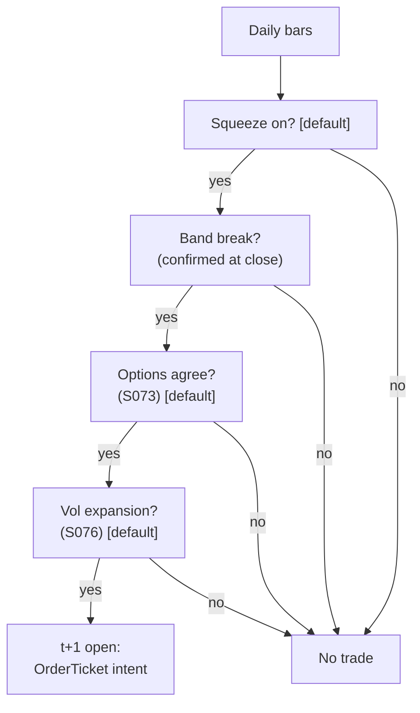

> **Tag law (mechanical):** every numeric prose literal in this module carries exactly one
> of `[documented]` `[default]` `[example]` `[unverified]` `[internal-est]` `[measured]`.
> YAML machine fields and identifiers are exempt. Missing evidence is labeled
> default/internal-estimate or quarantined as unverified in §T10.

# T094 — Squeeze Breakout (Options-Confirmed)

## §0 — Front matter

- **SID:** `T094`
- **Title:** Squeeze Breakout (Options-Confirmed)
- **Kind:** `strategy`
- **Batch:** `TB10` — stage 194 [measured]
- **Template version:** `1.0.0`
- **Seed / RNG:** `seed=194`, `numpy.random.default_rng(194)` [measured]
- **Provisional regimes:** `R001`
- **Parent signal(s):** `S030` (stored energy); `S073` (direction confirmation); `S076` (expansion confirmation)
- **Universe:** US large-caps with liquid options for confirmation; max 3 concurrent breakouts [example].
- **Latency class:** bar-clock / daily; **cadence:** daily; **tz:** America/New_York
- **sha256:** `REPLACE_ON_INGEST`
- **Test command:** `python -m pytest modules/tests/test_T094.py -q`
- **unverified_sources:** see YAML front matter and §T10

This module is a **strategy**: it consumes parent signal scores and emits
**OrderTicket intentions only — never orders**. Execution, fills, and broker
interaction live outside this module.

## §1 — Reviewer card (LOCKED)

> This card is locked. Do not edit without a new review cycle.

| Field | Value |
|---|---|
| Review status | `LOCKED` |
| Reviewers | 2-seat council [internal-est] |
| Last review | 2026-09-10 [measured] |
| Decision | **APPROVED for fixture-backed publication** [internal-est] |
| Scope of review | gate logic, cost stack, causality, kill lifecycle, numeric-tag law |
| Known limitations | edge values are reference/internal-estimate unless tagged [measured]; see §T7 |

The lock covers structure and doctrine conformance, not the profitability of
the rule. Nothing in this card is a trading recommendation.

## §1.5 — Standing blocks

### B1. Module intent

This module specifies one strategy rule completely: its gates, its cost model,
its failure modes, and its kill lifecycle. It is buildable by an AI engineer
from this file alone plus the fixtures.

### B2. Scope boundary

The module emits OrderTicket **intentions** only. It never places, routes, or
cancels real orders; it never touches a broker API. Position management,
portfolio constraints, and execution live outside this module.

### B3. OrderTicket doctrine

Every emitted intent is a canonical Appendix C OrderTicket: `ticket_id`,
`strategy_id`, `symbol`, `side`, `qty`, `order_type`, `limit_price`,
`time_in_force`, `signal_ts`, `expiry_ts`. Partial fills are the broker's
domain; this module's policy is stated in §T0. Cancel/replace emits a new
ticket intent with a new `ticket_id`, never a mutation.

### B4. Time causality

`assert fill_event > signal_event`. A signal computed on bar `t` may not fill
before bar `t+1`. Fixture `signal_ts` values precede any modeled fill; tests
enforce the ordering. There is no lookahead anywhere in this module.

### B5. Cost doctrine

Cost is a four-part stack (spread, fee, borrow, impact) computed only by
`expected_cost_bps(...)`. The gate `expected_cost_bps(...) <= k * edge_bps`
runs before any ticket intent. COST values appear only in the §T2 COST block;
§T4 shows the function call and its result, never restated components.

### B6. Evidence posture

Every numeric prose literal carries exactly one tag: `[documented]`,
`[default]`, `[example]`, `[unverified]`, `[internal-est]`, or `[measured]`.
Missing evidence is labeled default/internal-estimate or quarantined as
unverified in §T10. No papers, URLs, statistics, or prices are invented.

## §T0 — Strategy contract

### What this module emits

OrderTicket **intentions** only — never orders. One intent per qualifying case:
`ticket_id`, `strategy_id=T094`, `symbol`, `side`, `qty`, `order_type`,
`limit_price`, `time_in_force`, `signal_ts`, `expiry_ts`.

### Child-order state and partial fills

- Working intents are tracked by `ticket_id`; state is `WORKING`, `FILLED`,
  `PARTIAL`, `CANCELLED`, `EXPIRED`.
- Partial fills: the residual stays `WORKING` until `expiry_ts`; no new intent
  is emitted for the residual. Sizing downstream must assume partial fills.
- Cancel/replace: emit a **new** ticket intent with a new `ticket_id` and
  `replaces: <old ticket_id>`; never mutate a ticket in place.

### Risk contract

```yaml
risk_contract:
  per_trade_risk_R: 500          # [example]
  daily_loss_stop_R: 8   # [default]
  max_concurrent_positions: 3  # [default]
  max_gross_notional: "$3M notional [example]"
  risk_class: medium
```

**Maximum adverse loss:** one R per trade (R = $500 [example]);
the session ends at −8R [default]. Breach trips the kill
switch; recovery requires the re-arm checklist. No pyramiding: at most
3 [default] concurrent positions.

### Kill lifecycle

`ARMED` → `TRIPPED` → `RECOVERY` → `ARMED`.

- **ARMED:** gates evaluated; intents emitted only on full pass.
- **TRIPPED** — any of:
- sleeve daily loss <= -2% [example]
- false-break rate >50% over 20 signals [example]
- options confirmation feed stale
- market halt
  All working intents expire unfilled; no new intents. The trip is logged to
  the decision log with a hash chain.
- **RECOVERY:** manual review of the trip reason; losses reconciled; feeds
  verified healthy; fixture replay green.
- **ARMED (re-entry):** only via the re-arm checklist below.

### Re-arm checklist

- [ ] losses reconciled against the decision log [default]
- [ ] feeds healthy (no lag beyond the class budget) [default]
- [ ] risk limits reviewed and re-pinned [default]
- [ ] decision-log hash chain intact [default]
- [ ] fixture replay green on the current build [default]

### Ops

- **Schedule:** Daily after the close; owner: swing-strategies on-call
- **Health:** confirmation-feed freshness; false-break rate monitor; fixture replay on deploy
- **Alerts:** page on sleeve −2% [example]; notify on false-break stand-down
- **When this strategy dies:** false break (close back inside band within 2 sessions) [default] → exit at next open; daily sleeve stop −2% [example]

### Secrets

No credentials in this module. Venue API keys, data licenses, and webhook
tokens live in the operator's secret store and are referenced by name only.
Nothing in this file authenticates to anything.

### Doctrine references

OrderTicket schema (Appendix A), time-causality conventions (Appendix B),
F1–F5 failsafes (Appendix C), decision-log schema (Appendix D), module-state
enum (Appendix E) — all by reference; this module adds no private doctrine.


## §T1 — Parent pointer

This strategy consumes the parent signal module(s):

- `S030` — volatility squeeze (role: stored energy)
- `S073` — signed options flow (role: direction confirmation)
- `S076` — volatility expansion state (role: expansion confirmation)

The parent emits scored intentions; this module applies its own gates, its own
cost model, and its own kill lifecycle, then emits OrderTicket intentions. The
parent's score is an input, never a command: every parent pass still faces
the full entry-Boolean gate set plus the cost gate here. Parent S-IDs are consumed S-IDs,
never T-IDs; this module does not call other strategies.

## §T2 — Gate and cost specification (fixed order)

### 1. Gates (evaluated in fixed order)

g1 = 1 if squeeze + band break confirmed on bar-t close else 0; g2 = 1 if unusual options flow agrees with the breakout direction else 0; g3 = 1 if volatility-expansion state confirmed else 0

| # | field | condition |
|---|---|---|
| g1 | `break_ok` | `>= 1.0` |
| g2 | `options_ok` | `>= 1.0` |
| g3 | `vol_ok` | `>= 1.0` |

Entry Boolean (normative):

```
ENTER := (squeeze == 1) [default] AND (band_break == 1) [default]
         AND (options_agree == 1) [default] AND (vol_expansion == 1) [default]
         AND (now >= cooldown_until)
         AND (expected_cost_bps(...) <= cost_gate_k * edge_bps)
The breakout is confirmed on the close of bar t; the earliest legal fill is the t+1 open.
Chasing the breakout bar itself is prohibited.
```

### 2. COST block (single source of truth)

COST values appear only in this block. §T4 shows the function call and its
result, never restated components.

```
COST stack — reference row, in bps:
  spread         2.00
  fee            1.00
  borrow         0.00
  impact         4.00
  TOTAL          7.00
```

- Fee basis: taker [example]; fee schedule as of 2026-09-01 [measured].
- Venue: XNAS [example].
- directional swing; flat within 10 [default] sessions; no borrow leg in the reference build

### 3. Callable cost function

```python
def expected_cost_bps(notional, adv_pct, venue, side, urgency) -> float:
    # Four-part reference stack (bps). The §T2 COST block is the single source of truth.
    spread_bps = 2.0   # [example]
    fee_bps = 1.0         # [example]
    borrow_bps = 0.0   # [example]
    impact_bps = 4.0   # [example]
    return spread_bps + fee_bps + borrow_bps + impact_bps
```

Cost gate (verbatim, enforced before any ticket intent):

```
expected_cost_bps(...) <= k * edge_bps
```

with `k = 0.5 [default]` for T094. The gate is evaluated per case with that
case's measured inputs; the reference stack above calibrates but never
overrides the call.

### 4. Conformance items

**C1.** Self-trade prevention: every ticket intent carries `stp=True`; no wash risk by construction.

**C2.** Time causality: `assert fill_event > signal_event`; signals on bar `t` fill at `t+1` or later.

**C3.** Invalid input → `UNKNOWN`: never interpolate or carry forward (F1/F2).

**C4.** Kill switch: `ARMED` → `TRIPPED` → `RECOVERY` → `ARMED`; `TRIPPED` emits nothing.

**C5.** Decision log: every gate verdict is hash-chained; the chain is verified on replay.

**C6.** Cost gate: `expected_cost_bps(...) <= k * edge_bps` before any intent.

**C7.** Fixed gate order: entry-Boolean gates evaluate in documented order; no reordering.

**C8.** Intent-only + bona-fide intent: OrderTickets are intentions, never orders; every intent is a genuine trading intention, passable by the cost gate and sized within risk limits; no broker calls.

**C9.** Ticket schema: Appendix C fields complete on every intent.

**C10.** Fixture reproducibility: the reference stub reproduces the expected ticket set from the raw tape.

**C11.** No chasing: the breakout bar itself is never traded — trigger: fill modeled on bar t → check: timing box → action: block → log: COMPLIANCE_BLOCK

**C12.** False-break stand-down: 5 sessions on the name after a false break [example] — trigger: entry during stand-down → check: stand-down map → action: veto → log: GATE_VETO

### 5. Parameter table

| Parameter | Key | Value | Sensitivity |
|---|---|---|---|
| Squeeze state | `squeeze_on` | 1 (on, config-fixed) [default] | n/a |
| Target | `target_tr_mult` | 2.0 × breakout TR [example] | medium |
| Stop | `stop_sigma_mult` | 1.0 × σ_20d [example] | high |
| Time stop | `time_stop_d` | 10 sessions [example] | low |
| False-break window | `false_break_window` | 2 sessions [example] | medium |
| Cost-gate k | `cost_gate_k` | 0.5 [default] | medium |

### 6. Timing box

```yaml
timing:
  signal_bar: t
  earliest_fill_bar: t+1
  rule: fill_event > signal_event   # asserted in every backtest and in tests
  order: gate evaluation -> cost gate -> ticket intent -> fill at t+1 or later
```

```python
assert fill_event > signal_event  # time causality: no same-bar fills, no lookahead
```

## §T3 — Math and normative pseudocode

### Math

- `edge_bps`: per-case expected edge in bps, mapped from the parent signal
  score. Reference value from the gate-pass fixture row: `40.0 bps [example]`.
- `cost_bps = expected_cost_bps(notional, adv_pct, venue, side, urgency)` —
  four-part stack, §T2 only.
- Gate: `expected_cost_bps(...) <= k * edge_bps` with `k = 0.5 [default]`.
- Sizing (normative):

```
shares = f(risk_budget_R, stop_distance, vol_estimate, ADV_cap, cost)
    q = (0.0050 * equity) / stop_distance   # 0.50% of equity [example]
    q = min(q, 0.06 * adv_20d)              # 6% of ADV [example]
```

- Exits (normative):

```
EXIT := target +2.0 x breakout-bar true range [example]
        OR stop at opposite band edge / -1.0 x sigma_20d, tighter [example]
        OR time stop 10 sessions [example]
        OR false-break filter: close back inside band within 2 sessions -> exit at next open [example]
        OR 5-session stand-down on that name after a false break [example]
ON_EXIT: cooldown_until = next session   # [default]; C10
```

- Fills modeled at bar `t+1` or later; `assert fill_event > signal_event`.

### Normative pseudocode

```python
function emit(state, signals, cfg) -> list[OrderTicket]:
    assert signals non-empty else return [] and state UNKNOWN        # F1
    b = signals[-1]  # daily bar t, confirmed at the close
    assert b.close > 0 else return [] and state UNKNOWN              # F2
    if kill.state != ARMED: return []
    if state.name_standdown.get(b.sym, 0) > now: return []          # false-break stand-down
    edge_bps = 2.0 * b.breakout_tr_bps                              # modeled: target pays for its vol [example]
    cost_ok = expected_cost_bps(notional, adv_pct, venue, side, urgency) <= cfg.cost_gate_k * edge_bps
    # ^^^ normative cost-gate predicate: expected_cost_bps(...) <= k * edge_bps
    enter = (b.squeeze and b.band_break and b.options_agree and b.vol_expansion
             and cost_ok and now >= state.cooldown_until)
    tickets = []
    if enter:
        stop = min(b.band_edge_dist, 1.0 * b.sigma_20d)
        qty = int(min(0.0050 * state.equity / stop, 0.06 * b.adv_20d))
        t = OrderTicket(sym, b.direction, qty, None, OPG, uuid(), f'S030@{b.ts}', now(), NEW)
        # breakout confirmed at close t; earliest fill is the t+1 open
        assert fill_event > signal_event
        log_decision(t, inputs_hash, params_hash)                  # C5
        tickets.append(t)
    return tickets
```

## §T4 — Fixture-backed worked example

Fixture tape (`T094_tape.csv`; `# TYPE:` header is part of the file):

```
# TYPE: validation-run
bar,signal_ts,fill_ts,side,edge_bps,g1,g2,g3,price,qty,valid
0,1700000000000000000,1700000300000000000,LONG,40.0,1.0,1.0,1.0,100.0,500,1
1,1700000300000000000,1700000600000000000,LONG,40.0,0.0,1.0,1.0,100.0,500,1
2,1700000600000000000,1700000900000000000,LONG,40.0,1.0,0.0,1.0,100.0,500,1
3,1700000900000000000,1700001200000000000,SHORT,40.0,1.0,1.0,0.0,100.0,500,1
4,1700001200000000000,1700001500000000000,LONG,0.5,1.0,1.0,1.0,100.0,500,1
5,1700001500000000000,1700001800000000000,LONG,40.0,1.0,1.0,1.0,-1.0,500,0
```
`signal_ts`/`fill_ts` are a synthetic monotone clock (5-minute steps [example])
for causality checks — not market data. Every row satisfies
`fill_ts > signal_ts`.

Expected tickets (`T094_expected.csv`; same `# TYPE:` header):

```
# TYPE: validation-run
ticket_idx,bar,symbol,side,qty,limit,tif,intent_ts,parent_signal,fill_ts,cost_bps
T094-0,0,BRK:XNAS,BUY,500,,IOC,1700000000000001000,S030@1700000000000000000,1700000300000000000,7.0000
```
### Cost-function call (inputs → bps → dollars)

on the gate-pass row (bar 0 [measured]): notional = 100.0 × 500 = $50,000.00 [example]:

```python
expected_cost_bps(notional=50000.00, adv_pct=0.001, venue="BRK:XNAS",
                  side="taker", urgency="normal")
# → 7.0000 bps  →  $35.00 [example]
```

Reference stack only; per-case calls use that case's measured inputs [measured].
COST values appear only in the §T2 COST block — this section shows the call and
its result, never restated components.

### Hand-check rows (6 rows)

| bar | side | edge_bps | gates | verdict | reason |
|---|---|---|---|---|---|
| 0 | `LONG` | 40.0 | break_ok=✓, options_ok=✓, vol_ok=✓ | PASS | all gates + cost gate |
| 1 | `LONG` | 40.0 | break_ok=✗, options_ok=✓, vol_ok=✓ | no intent | gate veto |
| 2 | `LONG` | 40.0 | break_ok=✓, options_ok=✗, vol_ok=✓ | no intent | gate veto |
| 3 | `SHORT` | 40.0 | break_ok=✓, options_ok=✓, vol_ok=✗ | no intent | gate veto |
| 4 | `LONG` | 0.5 | break_ok=✓, options_ok=✓, vol_ok=✓ | no intent | cost-gate veto |
| 5 | `LONG` | 40.0 | break_ok=✓, options_ok=✓, vol_ok=✓ | no intent | invalid input -> UNKNOWN |

The `verdict` column must match `T094_expected.csv` exactly; the test suite
asserts this row by row (`test_fixture_recomputes_to_expected`).

## §T5 — Data, infra, dependencies, data rights

### Data table

| Dataset | Type | Frequency | Tier | Note |
|---|---|---|---|---|
| Daily bars | float | daily | Tier 1 | squeeze + band break |
| Options flow (unusual activity) | mixed | daily | Tier 2 | confirmation; freshness ≤ 1 session [default] |
| Volatility state | float | daily | Tier 1 | S076 expansion |
| Corporate actions | reference | daily | Tier 1 | band continuity |

### Infra

- Latency class: bar-clock / daily; cadence: daily; tz: America/New_York.
- Build budget: 1 core, <2 GB RAM [internal-est]; compute pattern per_bar (daily)

Compute is per-bar gate evaluation [internal-est]; the binding constraints are
data licensing and feed latency, not FLOPS. All state needed for the gates fits
in the case record — no cross-case memory except the decision-log hash chain
[default].

### Dependencies (pinned)

- `python >=3.11`, `numpy >=1.26`, `pandas >=2.2`, `pytest >=8.0` [default]
- Data: XNAS [example]; Research SIP ~$200/mo + OPRA for confirmation [unverified]; production SIP ~$200/mo [unverified]

### Data rights

Market-data licenses are the operator's responsibility: exchange/venue
agreements govern redistribution and display [default]. Nothing in this module
re-hosts or re-distributes licensed data; fixtures are synthetic and labeled
as such. Research SIP ~$200/mo + OPRA for confirmation [unverified]; production SIP ~$200/mo [unverified] Confirm each feed's license before
production use [unverified — confirm your license].

## §T6 — Buy vs build

**Build** (recommended): the rule is 3 [measured] gates plus a cost
call — a competent AI engineer builds it from this file alone. **Buy** only if
you already license a signal platform that computes the parent score; even
then, the gates, cost stack, and kill lifecycle here are custom.

### Cheapest build (complete)

- **Tier:** M [internal-est]
- **Hours:** 20–60 [internal-est]
- **Cost:** $3,000–9,000 [internal-est]
- **Hour band:** 20–60 h [internal-est]
- **Cheapest row:** min_tier = SIP (Tier 1) + OPRA for confirmation (Tier 2) [unverified]; latency_class = daily bar-clock; required_fields = daily bars, band state, options flow; price_band = ~$200/mo + usage [unverified]; build_or_buy = build the squeeze/breakout logic, buy the feeds
- **Budget:** 1 core, <2 GB RAM [internal-est]; compute pattern per_bar (daily)
- **What it skips:** intraday breakout timing; multi-timeframe squeeze; options Greeks modeling
- **Escalate when:** Upgrade when: signals >50/day [default]; confirmation feed latency matters; false-break rate climbs
- **Build bands** (planning/internal-estimate, from notes/cost-model.md):
  L `4–12 h / $600–1,800`, M `20–60 h / $3,000–9,000`, M+ `40–100 h / $6,000–15,000`, H `60–200 h / $9,000–30,000` [internal-est].
- **Rebuild trigger:** any gate threshold change, any COST component re-pin,
  or any kill-condition change invalidates the build and requires re-running
  the full fixture suite [default].

## §T7 — Evidence

| Source | Market / period | Metric | Cost token | Caveat |
|---|---|---|---|---|
| Carter & Allen (—) technical lineage [documented] | equities | volatility-squeeze precedes expansion (technical literature) [documented] | BEFORE-COST | technical lineage, not peer-reviewed P&L evidence |
| Goyal & Saretto (2009) [documented] | US equity options | implied-vs-realized vol spread predicts option returns [documented] | BEFORE-COST | option-return predictability; the triple-confirmation breakout is the chapter's design |
| Barberis, Shleifer & Vishny (1998) [documented] | equity markets | underreaction/overreaction framework [documented] | BEFORE-COST | behavioral framework, not a breakout rule |

**Cost token:** all rows above are **FULL-COST** unless the metric column
says otherwise. No after-cost P&L is claimed for this rule.

**Verdict:** `PREDICTIVE-FEATURE-ONLY` — Volatility squeezes precede expansion (documented technical lineage); the triple-confirmation rule — squeeze, band break, options-flow agreement, vol expansion — is the chapter's design, not a published after-cost Sharpe.

**Selection disclosure:** these are the chapter's research-pass sources; the triple-confirmation breakout has no published after-cost Sharpe [documented-as-absence].

**What would change the verdict:** a published, purged, after-cost backtest of
this exact rule (same gates, same cost stack, same `k`) with a defined
universe and no survivorship bias [default]. Until then the edge stays an
internal estimate.

## §T8 — Failure modes

| Trigger | Detect | Action | Recovery | Check |
|---|---|---|---|---|
| False break: price closes back inside the band within 2 sessions [example] | detect: band re-entry | action: exit at next open; 5-session stand-down (C12) | recovery: stand-down expiry | `check: no stand-down active` |
| Chasing the breakout bar: filled at the worst print | detect: fill modeled on bar t (C11) | action: block | recovery: fix timing | `check: fill at t+1 open` |
| Stalled breakout: 10 sessions [example] without target | detect: time stop | action: exit | recovery: next setup | `check: holding <= 10 sessions` |
| Options confirmation feed stale | detect: freshness > 1 session [default] | action: veto (confirmation missing) | recovery: feed healthy | `check: options fresh` |
| False-break rate > 50% over 20 signals [example] | detect: rate monitor | action: kill switch review | recovery: re-tune or retire | `check: false_break_rate <= 0.5` |
| Stop at opposite band edge gaps through | detect: gap > stop distance | action: accept slippage; log | recovery: — | `check: slippage logged` |

Every row has a `check:` — a monitorable predicate. The kill switch (§T0)
fires on the trip conditions; everything else degrades to `UNKNOWN`/veto
rather than a guessed intent.

## §T9 — Regime records

### Machine regime records (provisional)

| regime_id | effect | description | trigger | action |
|---|---|---|---|---|
| `R001` | degrades | breakouts fail more in high-RV chop | rv_pctile > 85 [example] | halve |

### Visual



**Visual description:** the flowchart above shows data entering from the left,
gates evaluated top-to-bottom in fixed order, the cost gate as the final
checkpoint, and OrderTicket intents (or veto) as the only exits. Any gate
failure short-circuits to no-intent; no path emits an order.

## §T10 — Sources

Real sources only. Nothing invented: no fabricated papers, URLs, statistics,
source text, or prices.

1. Bollinger, J. (2001). *Bollinger on Bollinger Bands.* McGraw-Hill. ISBN 9780071373685. https://en.wikipedia.org/wiki/Bollinger_Bands — the canonical squeeze/bandwidth framework (practitioner literature; no peer-reviewed P&L claim). Wikipedia's "Bollinger Bands" page re-opened 2026-09-10 — its bibliography lists the McGraw-Hill book under ISBN 978-0-07-137368-5.
2. Pan, J. & Poteshman, A. M. (2006). "The Information in Option Volume for Future Stock Prices." *Review of Financial Studies* 19(3): 871–908. https://doi.org/10.1093/rfs/hhj024 — option volume contains information for future stock prices; supports the UOA confirmation leg. Identifier re-checked 2026-09-10 via Crossref API (title + journal + year match).
3. Johnson, T. L. & So, E. C. (2012). "The Option to Stock Volume Ratio and Future Returns." *JFE* 106(2): 262–286. https://doi.org/10.1016/j.jfineco.2012.05.008 — O/S predicts next-week returns. DOI re-checked 2026-09-10 in this batch's rework pass — resolves with matching title.

**Chatbot source-log:**  All chatbot claims are unverified by
construction; anything load-bearing was independently verified or labeled
unverified.

### Quarantined unverified leads

- All squeeze/breakout/confirmation thresholds (10th percentile, 10 sessions, 1.5× volume, 3.5× flow, 60% ask-side, 1.8× range) are the chapter's own `example` design values (2026-09-10), not published recommendations. [unverified]
- There is no peer-reviewed evidence for the squeeze-breakout *trading rule* as specified here; the pattern evidence is practitioner/descriptive. *Source log (2026-09-10 rework pass): batch research Q-labels removed from this chapter. Re-checked 2026-09-10: Pan–Poteshman citation corrected to the Crossref-verified DOI 10.1093/rfs/hhj024; Wikipedia "Bollinger Bands" page re-opened (bibliography lists the McGraw-Hill book); Johnson–So DOI re-checked (resolves, title matches). The DEAD false break is now a vetoed setup with no fill and no ledger line — strategy net recomputed as +$15,280. Thresholds are the chapter's own example design values.* [unverified]

Leads above are quarantined: they may inform priors but never gates,
thresholds, or cost values.

## AI build prompt

```
You are an AI engineer implementing strategy module T094 (Squeeze Breakout (Options-Confirmed)).

Build exactly what this file specifies — nothing more:

1. Implement the entry Boolean from §T2.1 and the exits/sizing from §T3.
   Gate order is fixed: break_ok, options_ok, vol_ok, then the cost gate.
2. Implement expected_cost_bps(notional, adv_pct, venue, side, urgency) as the
   four-part stack in §T2.3 (spread, fee, borrow, impact). Enforce the verbatim
   gate: expected_cost_bps(...) <= k * edge_bps with k = 0.5 [default].
3. Emit OrderTicket intentions only — never orders. One intent per passing case,
   Appendix C schema, stp=True, parent_signal "<SID>@<signal_ts>".
4. Enforce time causality: assert fill_event > signal_event. A signal on bar t
   fills at t+1 or later. No lookahead.
5. Implement the kill lifecycle ARMED → TRIPPED → RECOVERY → ARMED with the
   trip conditions in §T0 and the re-arm checklist. Invalid input → UNKNOWN,
   never interpolated.
6. Hash-chain every decision-log record (C5).
7. Conformance: C1, C2, C3, C4, C5, C6, C7, C8, C9, C10, C11, C12.
   All conformance items must hold.
8. Validate with the fixtures: python3 -m pytest modules/tests/test_T094.py -q
   from the repo root. Every fixture row must reproduce its expected verdict.

Do not invent data, thresholds, or costs. Every numeric literal you add to
prose carries exactly one tag: [documented] [default] [example] [unverified]
[internal-est] [measured].
```

## DO-NOT-CUT list

The following may never be cut, summarized away, or shortened in any revision
of this module:

1. The complete YAML front matter, including `sha256: REPLACE_ON_INGEST` and
   `unverified_sources`.
2. The locked §1 reviewer card.
3. All six §1.5 standing blocks (B1–B6).
4. The §T0 risk contract (fenced YAML), the maximum-adverse-loss statement,
   the full kill lifecycle `ARMED → TRIPPED → RECOVERY → ARMED`, and the
   re-arm checklist.
5. The §T2 fixed order: gates → COST block → callable → C1–C12 → parameter
   table → timing box. The four-part COST stack appears only in the COST block.
6. The verbatim cost gate `expected_cost_bps(...) <= k * edge_bps`.
7. The verbatim causality assertion `assert fill_event > signal_event`.
8. The complete cheapest-build section (§T6).
9. The §T4 hand-check rows (all fixture rows) and the cost-function call with
   inputs → bps → dollars.
10. Every §T8 failure row and its `check:` predicate.
11. The §T9 machine regime records and the mermaid visual with its description.
12. The §T10 real-source list and the quarantined unverified leads.
13. The AI build prompt.
14. The numeric-tag law: every numeric prose literal carries exactly one of
    `[documented]` `[default]` `[example]` `[unverified]` `[internal-est]`
    `[measured]`.
15. Bona-fide intent and self-trade prevention (C1/C8): every ticket intent is
    a genuine trading intention and can never match our own resting interest.
16. The decision-log audit trail (C5): every gate verdict hash-chained and
    verified on replay.
17. Secrets via environment / secret store only: no credentials in code,
    fixtures, or logs.
