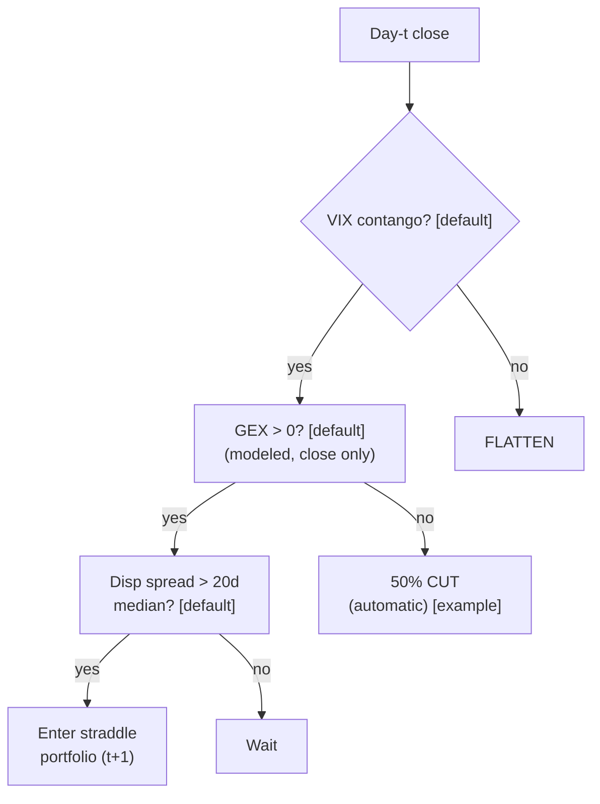

> **Tag law (mechanical):** every numeric prose literal in this module carries exactly one
> of `[documented]` `[default]` `[example]` `[unverified]` `[internal-est]` `[measured]`.
> YAML machine fields and identifiers are exempt. Missing evidence is labeled
> default/internal-estimate or quarantined as unverified in §T10.

# T095 — Dispersion + GEX Regime Switch

## §0 — Front matter

- **SID:** `T095`
- **Title:** Dispersion + GEX Regime Switch
- **Kind:** `strategy`
- **Version:** `1.1.0` — changelog in the YAML front matter (deep-review pass 2026-09-11)
- **Batch:** `TB10` — stage 195 [measured]
- **Status:** `deep-reviewed`
- **Family:** `F` (volatility & dispersion; provisional)
- **Provenance tier:** `D`
- **Template version:** `1.0.0`
- **Seed / RNG:** `seed=195`, PCG64 via `numpy>=1.26` [measured]
- **Regime IDs:** `R008`, `R004` (provisional, pending the R001–R050 annotation pass)
- **Consumes:** `S075` (dispersion-spread), `S074` (regime-switch), `S068` (carry-gate); version pins `unpinned` — pinned when the S-modules publish versions
- **Shares data feed with:** `S075`, `S074`, `S068`
- **Universe:** 8 large-cap names [example] + SPX 30-day straddles [example]; 30-day expiry [example]; each vintage held 5–20 sessions [example].
- **Latency class:** bar-clock / daily; **cadence:** daily; **tz:** America/New_York
- **Datasets:** Databento OPRA.PILLAR (options quotes + OI), SPX index options, CBOE VIX term structure — see YAML `datasets` (licensed; fingerprints `sha256:REPLACE_ON_INGEST`)
- **sha256:** `REPLACE_ON_INGEST`
- **Test command:** `python -m pytest modules/tests/test_T095.py -q`
- **unverified_sources:** see YAML front matter and §T10

This module is a **strategy**: it consumes parent signal scores and emits
**OrderTicket intentions only — never orders**. Execution, fills, and broker
interaction live outside this module.

## §1 — Reviewer card (v1.0.0 locked schema)

> This card is locked. Do not edit without a new review cycle. Lock covers
> structure and doctrine conformance, not the profitability of the rule.
> Review cycle: deep review 2026-09-11 (2-seat council [internal-est]);
> previous review 2026-09-10 [measured]. Nothing in this card is a trading
> recommendation.

| Row | Value |
|---|---|
| Module | T095 — Dispersion + GEX Regime Switch, v1.1.0 |
| Edge verdict | `PREDICTIVE-FEATURE-ONLY` — the correlation risk premium is documented (Driessen–Maenhout–Vilkov 2009 [documented]); GEX-flip trading rules have no peer-reviewed P&L evidence — documented as absence |
| After-cost | `BEFORE-COST` — cited evidence documents the premium, not an after-cost P&L for this rule; no after-cost P&L is claimed for this rule |
| Build cost | Tier H · `60–200` h [internal-est] · `$9,000–30,000` loaded [internal-est] |
| Data cost | Research: Databento OPRA Standard `$199`/mo [documented per Databento blog, Jun 2025] + historical pay-as-you-go usage [documented same]; production: institutional OPRA licensing, non-display ≈ `$2,000`/mo/category [unverified — verify on the OPRA fee schedule before budgeting] |
| latency_class | bar-clock / daily |
| risk_class | high |
| Capacity | `$1–50`M notional [example] — illustrative; binding constraint is single-name straddle liquidity |
| Executability | Feasible: Python daily batch over Databento OPRA + VIX curve; the value is the GEX-model discipline, not compute |
| Risk summary | Modeled-GEX sign instability (vendor methodologies differ); correlation-spike tail on the short index leg; backwardation regime mis-timing |
| When it dies | VIX flips to backwardation → flatten entirely [default]; GEX flips negative → automatic 50% cut [example]; correlation spike → halve or flatten |
| Regime gates | provisional R008 (inverts → veto), R004 (degrades → halve); restrictive default |
| Emits | `order_intents` (Appendix C v1.0.0) — OrderTicket intentions only, never orders |

## §1.5 — Standing blocks

### Cheapest / least-build path (v1.1.0; mirrors §T6, which is the single source)

1. **Prototype hour band:** `60–200` h [internal-est] — daily GEX-model build + dispersion-gate harness + Databento OPRA ingest + fixture validation.
2. **Cheapest-source row:** min_tier = Databento **OPRA Standard** (Tier 2) — `$199`/mo [documented per Databento blog, Jun 2025], historical pay-as-you-go usage [documented same]; latency_class = daily bar-clock; required_fields = options quotes/OI (for the modeled-GEX build), index options, VIX curve; price_band = `~$199`/mo + usage [documented] (production: institutional OPRA licensing, non-display ≈ `$2,000`/mo/category [unverified]); build_or_buy = **build the dispersion+GEX harness, buy OPRA**.
3. **Resource budget:** `1` core, `<8` GB RAM [internal-est]; compute pattern `per_bar` (daily).
4. **Skip list:** intraday GEX switching (explicitly prohibited); multi-expiry dispersion; single-name earnings straddles.
5. **DO-NOT-CUT list:** causality assertions (`assert fill_event > signal_event`, no-signal-bar-fills test); COST block + callable `expected_cost_bps`; F1–F5 fail-safes + module-state enum; kill-switch state machine + re-arm checklist; decision-log audit records; bona-fide-intent + self-trade prevention; provenance tags on every numeric literal; fixtures + `test_cmd`; secrets via env only.
6. **Escalation gate:** upgrade when any holds — vintages > `3` concurrent [default]; GEX vendor methodology changes; vega limit binds; production (non-display) licensing required.

### B1. Module intent

This module specifies one strategy rule completely: its gates, its cost model,
its failure modes, and its kill lifecycle. It is buildable by an AI engineer
from this file alone plus the fixtures.

### B2. Scope boundary

The module emits OrderTicket **intentions** only. It never places, routes, or
cancels real orders; it never touches a broker API. Position management,
portfolio constraints, and execution live outside this module.

### B3. OrderTicket doctrine

Every emitted intent is a canonical Appendix C OrderTicket: `ticket_id`,
`strategy_id`, `symbol`, `side`, `qty`, `order_type`, `limit_price`,
`time_in_force`, `signal_ts`, `expiry_ts`. Partial fills are the broker's
domain; this module's policy is stated in §T0. Cancel/replace emits a new
ticket intent with a new `ticket_id`, never a mutation.

### B4. Time causality

`assert fill_event > signal_event`. A signal computed on bar `t` may not fill
before bar `t+1`. Fixture `signal_ts` values precede any modeled fill; tests
enforce the ordering. There is no lookahead anywhere in this module.

### B5. Cost doctrine

Cost is a four-part stack (spread, fee, borrow, impact) computed only by
`expected_cost_bps(...)`. The gate `expected_cost_bps(...) <= k * edge_bps`
runs before any ticket intent. COST values appear only in the §T2 COST block;
§T4 shows the function call and its result, never restated components.

### B6. Evidence posture

Every numeric prose literal carries exactly one tag: `[documented]`,
`[default]`, `[example]`, `[unverified]`, `[internal-est]`, or `[measured]`.
Missing evidence is labeled default/internal-estimate or quarantined as
unverified in §T10. No papers, URLs, statistics, or prices are invented.

## §T0 — Strategy contract

### T0.1 Typed signature

```python
def emit(state: ModuleState, signals: list[SignalVector], cfg: Config) -> list[OrderTicket]:
```

`OrderTicket` per Appendix C v1.0.0 (intents only — never wire orders).
`state` is the module-owned named state vector
(`gex_model, vix_contango, disp_spread, position_open, vintage_days,
kill_state, cooldown_until`); `signals` are canonical SignalVectors
(Appendix b v1.0.0) from the consumed S-modules, newest last; the function
emits zero or more intents per daily evaluation. Documented edge cases: no
signals → flat, no intents; `UNKNOWN` input signal → restrictive (veto entry,
F1); kill-switch TRIPPED → emit nothing, state `OFF`.

### T0.2 Config dataclass

| Parameter | Type | Default | Range | Status |
|---|---|---|---|---|
| gex_sign_min | float | `0.0` | — (gate: `> 0`) | [default] |
| disp_spread_lookback_d | int | `20` | [10, 60] | [default] |
| cost_gate_k | float | `0.5` | [0.1, 2.0] | [default] |
| vintage_min_d | int | `5` | [1, 20] | [example] |
| vintage_max_d | int | `20` | [5, 60] | [example] |
| gex_cut_pct | float | `50.0` | [10.0, 100.0] | [example] |
| vega_max_k | float | `50000.0` | [10000.0, 200000.0] | [example] |
| vol_target_ann | float | `0.08` | [0.03, 0.20] | [example] |
| risk_R_usd | float | `2000.0` | [250.0, 10000.0] | [example] |
| spread_full_bps | float | `8.0` | [2.0, 30.0] | [example] |
| taker_fee_bps | float | `2.0` | [0.5, 10.0] | [example] |
| borrow_bps_per_day | float | `0.0` | [0.0, 200.0] | [example] |
| impact_bps | float | `6.0` | [0.0, 50.0] | [example] |
| daily_loss_stop_R | float | `10.0` | [3.0, 25.0] | [default] |
| max_concurrent_positions | int | `1` | [1, 3] | [default] |
| cooldown_sessions | int | `1` | [0, 5] | [default] |
| names_n | int | `8` | [4, 20] | [example] |
| straddle_tenor_d | int | `30` | [7, 90] | [example] |
| venue | str | `DSP:CBOE` | — | [example] |

All defaults tagged per the tag law. `borrow_bps_per_day` is `0.0` because
the reference build is pure options — no stock borrow leg (reason recorded;
§T2 COST block). `taker_fee_bps` is a reference placeholder [example]; the
documented CBOE SPX fee anchor is worked in the §T2 COST block.

### T0.2.1 Calibration procedure (per parameter — grid + OOS selection, no hand-tuning in production)

- `disp_spread_lookback_d` (`20` [default]): grid `{10, 20, 30, 60}` [example]; pick the smallest lookback whose entry cohort shows positive pre-cost spread-harvest on walk-forward OOS [default]. Sensitivity: medium.
- `gex_sign_min` (`0.0` [default]): fixed sign gate [default]; do not calibrate the sign threshold — sensitivity: high (the regime switch).
- `cost_gate_k` (`0.5` [default]): grid `{0.1, 0.25, 0.5, 1.0, 2.0}` [example] against downstream net P&L on walk-forward OOS; the open item (0.5 [default] vs 2 [default]) resolves per-chapter by calibration, not by convention. Sensitivity: high.
- `vintage_min_d`/`vintage_max_d` (`5`/`20` [example]): grid `{3, 5, 10}` × `{10, 20, 40}` [example]; the harvest decays with tenor — freeze the window with stable OOS entry cohort size. Sensitivity: low.
- `gex_cut_pct` (`50.0` [example]): grid `{25, 50, 75}` [example]; calibrate against the GEX-flip false-cut rate on OOS. Sensitivity: high — the automatic cut.
- `vol_target_ann` (`0.08` [example]): policy parameter; set by the risk owner, not by backtest optimization. Sensitivity: medium (drives sizing).
- `risk_R_usd` (`2000.0` [example]): set from the account's per-trade R budget; shrink until walk-forward max drawdown < `daily_loss_stop_R / 2` [default]. Sensitivity: high.
- `spread_full_bps`, `taker_fee_bps`, `impact_bps`: re-pinned from the production venue's published schedule and realized slippage on every `fee_schedule_as_of` review; never calibrated. Sensitivity: low (inputs, not knobs).
- `borrow_bps_per_day`: `0.0` in the reference build (pure options, no borrow leg); if a stock hedge leg is added, re-pin from the desk's realized borrow rate and reconcile monthly against broker statements. Sensitivity: conditional.
- `daily_loss_stop_R` (`10.0` [default]), `max_concurrent_positions` (`1` [default]): policy parameters; set by the risk owner.
- `cooldown_sessions` (`1` [default]): post-exit re-entry suppression; `0` disables (not recommended [default]).
- `names_n` (`8` [example]), `straddle_tenor_d` (`30` [example]): construction parameters; sensitivity: low.
- All chosen values re-validated quarterly [default]; any change logs a new `params_hash` (C5).

### T0.3 Canonical schema mapping

Vendor columns → canonical Event/Bar schema (Appendix a v1.0.0), stated once here:

| Vendor column | Canonical field | Notes |
|---|---|---|
| Databento OPRA.PILLAR quotes + OI | Bar: daily | GEX-model inputs (strike-level OI); evaluated on close only (C11) |
| SPX index options | Bar: daily | short leg; beta-weighted notional |
| VIX term structure (front, 3-month) | Bar: daily | contango gate (front < 3-month [example]) |
| realized correlation (internal) | Bar: daily | dispersion spread vs `20`d median [default] |
| S075/S074/S068 signal fields | SignalVector | `disp_spread`, `disp_median_20d`, `gex_model`, `vix_contango`, `edge_bps` |
| bar timestamps | `event_ts` / `asof_ts` int64 ns UTC | `asof_ts ≥ event_ts` else F1 → `UNKNOWN` |

### T0.4 Time contract

> Time contract: clock domain America/New_York (evaluation at the day-t
> close); timestamps int64 ns UTC; authoritative causality clock = `event_ts`;
> max_skew = `60` s [default]; jitter budget = `5` s [default]; bar-label rule
> = calendar date of the close (daily bars); staleness TTL = `3` sessions
> [default] (F4 rule: 3× cadence [default]); gap policy = mask, no interpolation —
> missing day → `UNKNOWN` (F1).

**Timing box:** `signal@t (daily bars, America/New_York) → earliest fill @open(t+1)`

### T0.5 Market-state table

| State | Module behavior |
|---|---|
| CONTINUOUS_TRADING | Evaluate gates at the day-t close; emit intents per §T2 |
| HALTED | No new intents; existing vintage held per exit rules; state `UNKNOWN` until clean reopen |
| AUCTION | No new intents (evaluation is at the close, outside the auction); state `DEGRADED` if the auction overlaps evaluation |
| CLOSED | No evaluation; state `OFF` (administrative) |

### T0.6 Module-state enum + error taxonomy

States per Appendix k v1.0.0: `OK | DEGRADED | UNKNOWN | OFF`. Invalid input →
`UNKNOWN`, never interpolate (Appendix f v1.0.0, F1–F5).

| Failure | State | Alert |
|---|---|---|
| Missing/stale input (TTL `3` sessions [default]) | `UNKNOWN` | page |
| Out-of-bounds indicator (F2: e.g. `gex_model` NaN, negative notional) | `UNKNOWN` | page |
| Market HALTED per §T0.5 | `UNKNOWN` | log |
| Auction overlapping evaluation | `DEGRADED` | log |
| Kill-switch TRIPPED (administrative) | `OFF` | page |
| Market CLOSED | `OFF` | log |
| Anything unmapped | `UNKNOWN` | page |

### What this module emits

OrderTicket **intentions** only — never orders. One intent per qualifying case:
`ticket_id`, `strategy_id=T095`, `symbol`, `side`, `qty`, `order_type`,
`limit_price`, `time_in_force`, `signal_ts`, `expiry_ts`.

### Child-order state and partial fills

- Working intents are tracked by `ticket_id`; state is `WORKING`, `FILLED`,
  `PARTIAL`, `CANCELLED`, `EXPIRED`.
- Partial fills: the residual stays `WORKING` until `expiry_ts`; no new intent
  is emitted for the residual. Sizing downstream must assume partial fills.
- Cancel/replace: emit a **new** ticket intent with a new `ticket_id` and
  `replaces: <old ticket_id>`; never mutate a ticket in place.

### Risk contract

```yaml
risk_contract:
  per_trade_risk_R: 2000          # [example]  (= 1R; R = $2000 [example])
  max_adverse_per_trade: 1.0 R   # [default] — stop distance multiple
  daily_loss_stop_R: 10          # [default]
  max_concurrent_positions: 1    # [default]
  max_gross_notional: "$50M notional [example]"
  risk_class: high
  kill_conditions:
    - "daily loss <= -10R -> TRIP (then no new entries; flatten managed risk)"
    - "VIX backwardation -> TRIP (flatten entirely)"
    - "GEX flip negative -> automatic 50% cut (not a full trip)"
    - "portfolio vega > $50k per vol point -> TRIP"
    - "decision-log write failure -> TRIP (halt emission)"
  enforcement: intraday-hard   # trips are automatic, not advisory [default]
  calibration_recipe: >
    Walk-forward on 60-day blocks [example]: fit gate thresholds on block t,
    freeze, validate realized shortfall vs predicted on block t+1; shrink
    per-trade R until walk-forward max drawdown < daily_loss_stop_R/2 [default].
```

**Reconciliation:** −10R [default] = −$20,000 [example] = −2% [example] of a
$1M [example] account — the two trip wordings are the same number, not two
separate stops.

**Maximum adverse loss:** one R per trade (R = $2000 [example]);
the session ends at −10R [default]. Breach trips the kill
switch; recovery requires the re-arm checklist. No pyramiding: at most
1 [default] concurrent positions.

### Kill lifecycle

`ARMED` → `TRIPPED` → `RECOVERY` → `ARMED`.

- **ARMED:** gates evaluated; intents emitted only on full pass.
- **TRIPPED** — any of:
- VIX backwardation [default]
- GEX flip negative [default]
- portfolio vega > $50k per vol point [example]
- daily loss <= -2% [example]
  All working intents expire unfilled; no new intents. The trip is logged to
  the decision log with a hash chain.
- **RECOVERY:** manual review of the trip reason; losses reconciled; feeds
  verified healthy; fixture replay green.
- **ARMED (re-entry):** only via the re-arm checklist below.

### Re-arm checklist

- [ ] losses reconciled against the decision log [default]
- [ ] feeds healthy (no lag beyond the class budget) [default]
- [ ] risk limits reviewed and re-pinned [default]
- [ ] decision-log hash chain intact [default]
- [ ] fixture replay green on the current build [default]

### Ops

- **Schedule:** Daily after the close; weekly rebalance; owner: vol-strategies on-call
- **Health:** VIX-curve monitor; GEX-sign monitor; fixture replay on deploy
- **Alerts:** page on VIX backwardation or GEX flip [default]; notify on vintage expiry
- **When this strategy dies:** VIX flips to backwardation [default] → flatten entirely; GEX flips negative [default] → automatic 50% [example] cut

### Secrets

No credentials in this module. Venue API keys, data licenses, and webhook
tokens live in the operator's secret store and are referenced by name only.
Nothing in this file authenticates to anything.

### Doctrine references

OrderTicket schema (Appendix A), time-causality conventions (Appendix B),
F1–F5 failsafes (Appendix C), decision-log schema (Appendix D), module-state
enum (Appendix E) — all by reference; this module adds no private doctrine.

### T0.10 May / must-NOT

> **May:** emit `OrderTicket` intents per Appendix C v1.0.0; track intent-side
> state (`NEW → WORKING → FILLED / CANCELLED / PARTIAL`); issue cancel-replace
> via new tickets with new `ticket_id`s. **Must-NOT:** place orders on any
> venue, hold broker/exchange sessions, net intents into orders inside the
> strategy, treat the intent-side state machine as broker wire truth, or emit
> prices/share-counts/notionals outside an `OrderTicket`.

### Options Pricing & Greeks block (conditional, domain = options)

- **Pricing model:** straddle valuation via the listed implied-vol surface; no proprietary pricer required.
- **Greeks:** vega-weighted construction (equal vega per single-name straddle [example]); index leg sized to net-zero delta; delta-hedged daily [example].
- **Expiry/assignment:** 30-day expiries [example]; positions rolled at the weekly rebalance; early-exercise risk on the short index leg is managed by rolling before expiry week.


## §T1 — Parent pointer

This strategy consumes the parent signal module(s):

- `S075` — correlation risk premium (role: dispersion spread)
- `S074` — modeled gamma exposure (role: regime switch)
- `S068` — VIX term structure (role: carry regime gate)

The parent emits scored intentions; this module applies its own gates, its own
cost model, and its own kill lifecycle, then emits OrderTicket intentions. The
parent's score is an input, never a command: every parent pass still faces
the full entry-Boolean gate set plus the cost gate here. Parent S-IDs are consumed S-IDs,
never T-IDs; this module does not call other strategies.

## §T2 — Gate and cost specification (fixed order)

### Universe

8 large-cap names [example] + SPX 30-day straddles [example]; 30-day expiry
[example]; each vintage held 5–20 sessions [example]. Evaluation at the day-t
close (America/New_York); earliest trade of a new vintage is the t+1 open.

### Entry rule (Boolean — no prose-only conditions)

gates evaluated in fixed order:

g1 = 1 if VIX term structure in contango (front < 3-month [example]) else 0; g2 = 1 if modeled aggregate GEX > 0 [default] else 0; g3 = 1 if dispersion spread (index implied − realized correlation) > 20-day median [default] else 0

| # | field | condition |
|---|---|---|
| g1 | `contango` | `>= 1.0` |
| g2 | `gex_pos` | `>= 1.0` |
| g3 | `spread_ok` | `>= 1.0` |

Entry Boolean (normative):

```
ENTER := (vix_contango == 1) [default] AND (gex_model > 0) [default]
         AND (disp_spread > median_20d) [default] AND (now >= cooldown_until)
         AND (expected_cost_bps(...) <= cost_gate_k * edge_bps)
Regime conditions evaluated on the day-t close; earliest the straddle portfolio trades is the t+1 open.
Construction: long 8 single-name 30d straddles [example] (delta-hedged daily [example]), short SPX 30d straddles [example] in index-beta-weighted notional.
```

### Exits (with post-exit cooldown)

Normative (mirrored in §T3):

```
EXIT := spread converges (realized correlation catches up to implied) [default]
        OR any regime condition breaks [default]
        OR vintage_days >= vintage_max_d (20 sessions [example])
        OR GEX flips negative -> automatic 50% cut [example]
        OR VIX flips to backwardation -> flatten entirely [default]
ON_EXIT: cooldown_until = next session   # [default]; C19
```

Post-exit cooldown: after any exit or compliance block, the entry Boolean's
`now >= cooldown_until` term suppresses re-entry for `cooldown_sessions = 1`
[default] session. Kill-switch trips additionally require the §T0 re-arm
checklist.

### Position sizing (fenced function)

```python
def shares(risk_budget_R, stop_distance, vol_estimate, ADV_cap, cost):
    """Straddle-unit sizing for one vintage (normative skeleton; calibration in T0.2.1).
    risk_budget_R: USD per trade (cfg.risk_R_usd = 2000.0 [example])
    stop_distance: spread-convergence exit distance in USD of straddle premium
    vol_estimate:  current portfolio vol (annualized decimal) vs vol_target_ann
    ADV_cap:       max fraction of single-name option ADV per leg (0.01 [default])
    cost:          expected_cost_bps(...) output; C6 veto applies before sizing
    """
    assert cost <= cfg.cost_gate_k * edge_bps          # C6: cost gate first
    per_leg_R = risk_budget_R / cfg.names_n            # 8 legs [example]
    risk_units = per_leg_R / stop_distance             # units per unit of stop
    vega_units = (cfg.vega_max_k / cfg.names_n) / vega_per_straddle  # equal-vega legs [example]
    adv_units = ADV_cap * single_name_option_adv       # participation cap [default]
    leg_units = min(risk_units, vega_units, adv_units)
    # index leg: sized to net-zero delta, then scaled to the target correlation
    # exposure; portfolio vol anchored to vol_target_ann (8% [example])
    spx_units = -index_beta_weighted_notional(sum(leg_deltas))
    return {"leg_units": leg_units, "spx_units": spx_units}
```

Delta-hedge: the long single-name straddles are delta-hedged daily [example];
the short SPX leg offsets the index-beta-weighted notional. No pyramiding:
`max_concurrent_positions = 1` [default].

### Risk limits

Single source of truth: the fenced YAML `risk_contract` in §T0
(`per_trade_risk_R`, `daily_loss_stop_R`, `max_gross_notional`,
`kill_conditions[]`, `enforcement: intraday-hard`). Restating numbers here is
a validation failure; this sub-block asserts the reference only.

### COST block (single source of truth)

COST values appear only in this block. §T4 shows the function call and its
result, never restated components.

```
COST stack — reference row, in bps:
  spread         8.00
  fee            2.00
  borrow         0.00
  impact         6.00
  TOTAL         16.00
```

- Fee basis: taker [example]; fee schedule as of 2026-09-01 [measured].
- Venue: CBOE / OPRA [example].
- options straddles; no borrow leg in the reference build
- `borrow_bps_per_day`: `0.0` — reason: pure-options reference build, no stock
  borrow leg (if a stock hedge leg is added, re-pin from the desk's realized
  borrow rate; see T0.2.1)

**Fee-anchor note [documented]:** CBOE publishes an SPX options transaction-fee
schedule as a per-contract rate table by premium tier (e.g. SPX customer
`$0.44`/contract for premium ≥ `$1`, `$0.35` for premium < `$1`, per the
June–July 2026 schedules [documented per the SEC-filed CBOE fee schedule]).
The reference `fee_bps = 2.00` stays an `[example]` placeholder: per-case
pinning converts $/contract → bps at that case's actual premium before the
cost gate runs; the reference number never calibrates a live case.

### Callable cost function

```python
def expected_cost_bps(notional, adv_pct, venue, side, urgency) -> float:
    # Four-part reference stack (bps). The §T2 COST block is the single source of truth.
    spread_bps = 8.0   # [example]
    fee_bps = 2.0         # [example]
    borrow_bps = 0.0   # [example]
    impact_bps = 6.0   # [example]
    return spread_bps + fee_bps + borrow_bps + impact_bps
```

Cost gate (verbatim, enforced before any ticket intent):

```
expected_cost_bps(...) <= k * edge_bps
```

with `k = 0.5 [default]` for T095. The gate is evaluated per case with that
case's measured inputs; the reference stack above calibrates but never
overrides the call.

### Execution / fill model table

| Aspect | Assumption |
|---|---|
| Fill venue / latency | intent at day-t close → earliest fill at open(t+1); no same-bar fills [default] |
| Fill price model | open(t+1) ± half-spread crossing cost, inside the COST stack [example] |
| Partial fills | residual stays `WORKING` until `expiry_ts`; no new intent for the residual; FIFO by `intent_ts` (Appendix C) [default] |
| Impact | `6.0` bps modeled [example]; not calibrated to realized slippage in the reference build |
| Adverse fill | straddle adverse selection not modeled in the reference build [example]; production must log realized-vs-modeled slippage and re-pin impact (§T8 failure mode 6) |
| Halt behavior | no new intents in `HALTED`; cancel working intents (§T0.5) |
| Auction behavior | no new intents in `AUCTION`; state `DEGRADED` (§T0.5) |

Fine-grained fill behavior is synthetic and labeled `simulated only`:
this module consumes no MBO/ITCH feed; any fill realism beyond the
open(t+1) ± half-spread model above would require MBO/ITCH data.

### Robustness

Perturb thresholds ±20% [example]; the reference behavior (entry intents,
gate blocks, exit paths, kill trip) must be invariant; degrade entry→no-trade
on indicator breach. Noisy-GEX sensitivity: sign flips from vendor
methodology differences are the dominant robustness risk — the module treats
modeled GEX as a proxy (C12), never as actual dealer positioning.

### Compliance sub-block (C1–C19)

**C1.** Self-trade prevention: every ticket intent carries `stp=True`; no wash risk by construction.

**C2.** Time causality: `assert fill_event > signal_event`; signals on bar `t` fill at `t+1` or later.

**C3.** Invalid input → `UNKNOWN`: never interpolate or carry forward (F1/F2).

**C4.** Kill switch: `ARMED` → `TRIPPED` → `RECOVERY` → `ARMED`; `TRIPPED` emits nothing.

**C5.** Decision log: every gate verdict is hash-chained; the chain is verified on replay.

**C6.** Cost gate: `expected_cost_bps(...) <= k * edge_bps` before any intent.

**C7.** Fixed gate order: entry-Boolean gates evaluate in documented order; no reordering.

**C8.** Intent-only + bona-fide intent: OrderTickets are intentions, never orders; every intent is a genuine trading intention, passable by the cost gate and sized within risk limits; no broker calls.

**C9.** Ticket schema: Appendix C fields complete on every intent.

**C10.** Fixture reproducibility: the reference stub reproduces the expected ticket set from the raw tape.

**C11.** No intraday GEX switching: the flip is evaluated on the modeled close value only — trigger: intraday GEX-driven ticket → check: evaluation timestamp → action: block → log: COMPLIANCE_BLOCK

**C12.** GEX honesty: modeled GEX is a proxy under assumed positioning signs — never represent it as actual dealer positioning — trigger: positioning claim → check: disclosure → action: require disclaimer → log

**C13.** Message-rate / cancel-to-trade: trigger = intents+cancels per symbol per day exceed `10` [default] → check = rolling daily message counter → action = throttle and alert (this is a daily bar-clock module; any higher rate is an anomaly) → log: COMPLIANCE_BLOCK.

**C14.** Pre-trade fat-finger trio: trigger = any new intent → check = (a) ticket notional ≤ `max_gross_notional` [default], (b) qty > 0 and integer [default], (c) `limit_price` within ±`20%` [default] of the reference straddle mark or `None` → action = block the ticket, alert → log: COMPLIANCE_BLOCK with the breached leg.

**C15.** Halt/auction state table: trigger = market state ≠ `CONTINUOUS_TRADING` → check = §T0.5 table → action = `HALTED`: no new intents, cancel working intents; `AUCTION`: no new intents; `CLOSED`: no evaluation → log = state-transition record.

**C16.** Locate check: N/A in the reference build — reason: pure-options construction; the short SPX leg is short *options*, not short stock, so Reg SHO locate does not attach. If a stock hedge leg is ever added, `locate_ok` becomes a hard entry precondition (veto without locate → log: GATE_VETO).

**C17.** Public-dissemination gate: trigger = any export of signals/intents/realized P&L outside the firm → check = review-gate sign-off → action = block unreviewed exports → log: COMPLIANCE_BLOCK.

**C18.** Data-entitlement assertions: trigger = feed startup and any entitlement-class change → check = the five §T5 assertions hold for each §0 dataset (licensed OPRA/VIX feeds; no redistribution; fixtures synthetic) → action = stand down on breach, escalate per §1.5 → log = entitlement review record.

**C19.** Post-exit cooldown: trigger = exit or compliance block → check = `now >= cooldown_until` (`cooldown_sessions = 1` [default]) → action = suppress re-entry until the cooldown elapses → log = `GATE_VETO` with code `C19`.

### Parameter table

| Parameter | Key | Value | Sensitivity |
|---|---|---|---|
| GEX sign gate | `gex_sign_min` | > 0 [default] | high — regime switch |
| Vintage max | `vintage_max_d` | 20 sessions [example] | low |
| GEX-flip cut | `gex_cut_pct` | 50% [example] | high — automatic |
| Max portfolio vega | `vega_max_k` | $50k/vol pt [example] | high |
| Vol target | `vol_target_ann` | 8% ann. [example] | medium |
| Cost-gate k | `cost_gate_k` | 0.5 [default] | medium |

### Timing box

```yaml
timing:
  signal_bar: t
  earliest_fill_bar: t+1
  rule: fill_event > signal_event   # asserted in every backtest and in tests
  order: gate evaluation -> cost gate -> ticket intent -> fill at t+1 or later
```

```python
assert fill_event > signal_event  # time causality: no same-bar fills, no lookahead
```

## §T3 — Math and normative pseudocode

### Math

- `edge_bps`: per-case expected edge in bps, mapped from the parent signal
  score. Reference value from the gate-pass fixture row: `60.0 bps [example]`.
- `cost_bps = expected_cost_bps(notional, adv_pct, venue, side, urgency)` —
  four-part stack, §T2 only.
- Gate: `expected_cost_bps(...) <= k * edge_bps` with `k = 0.5 [default]`.
- Sizing (normative; the fenced `shares(risk_budget_R, stop_distance, vol_estimate, ADV_cap, cost)` in §T2):

```
shares = f(risk_budget_R, stop_distance, vol_estimate, ADV_cap, cost)
    vega-weighted: each single-name straddle sized to equal vega [example]
    index leg sized to net-zero delta and the target correlation exposure
    portfolio vol target: 8% annualized [example]
```

- Exits (normative):

```
EXIT := spread converges (realized correlation catches up to implied) [default]
        OR any regime condition breaks OR 20 sessions elapse [example]
        OR GEX flips negative -> automatic 50% cut [example]
        OR VIX flips to backwardation -> flatten entirely [default]
ON_EXIT: cooldown_until = next session   # [default]; C10
```

- Fills modeled at bar `t+1` or later; `assert fill_event > signal_event`.

### Normative pseudocode

```python
function emit(state, signals, cfg) -> list[OrderTicket]:
    assert signals non-empty else return [] and state UNKNOWN        # F1
    d = signals[-1]  # day-t close snapshot
    assert d.gex_model == d.gex_model else return [] and state UNKNOWN  # F2: finite
    if kill.state != ARMED: return []
    if d.gex_model < 0 and state.position_open:
        return [reduce_ticket(0.50)]      # GEX flip: automatic 50% cut [example]
    if not d.vix_contango and state.position_open:
        return [flatten_ticket()]         # backwardation: flatten [default]
    if state.position_open and (d.disp_spread <= 0 or d.vintage_days >= cfg.vintage_max_d):
        state.cooldown_until = next_session()   # C19: post-exit cooldown
        return [exit_ticket()]                  # spread converged or vintage expired [example]
    edge_bps = d.disp_spread_bps                                        # modeled [example]
    cost_ok = expected_cost_bps(notional, adv_pct, venue, side, urgency) <= cfg.cost_gate_k * edge_bps
    # ^^^ normative cost-gate predicate: expected_cost_bps(...) <= k * edge_bps
    enter = (d.vix_contango and d.gex_model > 0
             and d.disp_spread > d.disp_median_20d and cost_ok
             and now >= state.cooldown_until)
    tickets = []
    if enter:
        legs = vega_weighted_straddles(d.names_8, d.spx)               # 8 names + SPX [example]
        for leg in legs:
            t = OrderTicket(leg.sym, leg.side, leg.qty, None, OPG, uuid(), f'S075@{d.ts}', now(), NEW)
            log_decision(t, inputs_hash, params_hash)                  # C5
            tickets.append(t)
    # modeled fills are scheduled at open(t+1) or later — never on the signal bar
    assert fill_event > signal_event  # time causality: no same-bar fills, no lookahead
    return tickets
```

## §T4 — Fixture-backed worked example

Fixture tape (`T095_tape.csv`; `# TYPE:` header is part of the file; `# TOLERANCE:` line is the acceptance tolerance — `bps ±0.0001`, qty/ts exact, `fill_ts > signal_ts` required):

```
# TYPE: validation-run
bar,signal_ts,fill_ts,side,edge_bps,g1,g2,g3,price,qty,valid
0,1700000000000000000,1700000300000000000,LONG,60.0,1.0,1.0,1.0,450.0,8,1
1,1700000300000000000,1700000600000000000,LONG,60.0,0.0,1.0,1.0,450.0,8,1
2,1700000600000000000,1700000900000000000,LONG,60.0,1.0,0.0,1.0,450.0,8,1
3,1700000900000000000,1700001200000000000,LONG,60.0,1.0,1.0,0.0,450.0,8,1
4,1700001200000000000,1700001500000000000,LONG,1.0,1.0,1.0,1.0,450.0,8,1
5,1700001500000000000,1700001800000000000,LONG,60.0,1.0,1.0,1.0,-1.0,8,0
```
`signal_ts`/`fill_ts` are a synthetic monotone clock (5-minute steps [example])
for causality checks — not market data. Every row satisfies
`fill_ts > signal_ts`.

Expected tickets (`T095_expected.csv`; same `# TYPE:` header):

```
# TYPE: validation-run
ticket_idx,bar,symbol,side,qty,limit,tif,intent_ts,parent_signal,fill_ts,cost_bps
T095-0,0,DSP:CBOE,BUY,8,,IOC,1700000000000001000,S075@1700000000000000000,1700000300000000000,16.0000
```
### Cost-function call (inputs → bps → dollars)

on the gate-pass fixture row (bar 0): notional = 450.0 × 8 = $3,600.00 [example]:

```python
expected_cost_bps(notional=3600.00, adv_pct=0.001, venue="DSP:CBOE",
                  side="taker", urgency="normal")
# → 16.0000 bps  →  $5.76 [example]
```

**Fixture abstraction:** the fixture models the 8-straddle + index portfolio as
one composite ticket `DSP:CBOE` [example] — the tape exercises the gate logic
and the cost call, not the full multi-leg construction.

Reference stack only; per-case calls use that case's own inputs [default].
COST values appear only in the §T2 COST block — this section shows the call and
its result, never restated components.

### Hand-check rows (6 rows)

| bar | side | edge_bps | gates | verdict | reason |
|---|---|---|---|---|---|
| 0 | `LONG` | 60.0 | contango=✓, gex_pos=✓, spread_ok=✓ | PASS | all gates + cost gate |
| 1 | `LONG` | 60.0 | contango=✗, gex_pos=✓, spread_ok=✓ | no intent | gate veto |
| 2 | `LONG` | 60.0 | contango=✓, gex_pos=✗, spread_ok=✓ | no intent | gate veto |
| 3 | `LONG` | 60.0 | contango=✓, gex_pos=✓, spread_ok=✗ | no intent | gate veto |
| 4 | `LONG` | 1.0 | contango=✓, gex_pos=✓, spread_ok=✓ | no intent | cost-gate veto |
| 5 | `LONG` | 60.0 | contango=✓, gex_pos=✓, spread_ok=✓ | no intent | invalid input -> UNKNOWN |

The `verdict` column must match `T095_expected.csv` exactly; the test suite
asserts this row by row (`test_fixture_recomputes_to_expected`).

## §T5 — Data, infra, dependencies, data rights

### Data table

| Dataset | Type | Frequency | Tier | Note |
|---|---|---|---|---|
| Options quotes + OI (OPRA) | mixed | daily | Tier 2 | GEX model input; evaluated on close only (C11) |
| Index options (SPX) | mixed | daily | Tier 2 | short leg; beta-weighted notional |
| VIX term structure | float | daily | Tier 1 | contango gate |
| Realized correlation | float | daily | internal | dispersion spread vs 20d median [default] |

### Infra

- Latency class: bar-clock / daily; cadence: daily; tz: America/New_York.
- Build budget: 1 core, <8 GB RAM [internal-est]; compute pattern per_bar (daily)

Compute is per-bar gate evaluation [internal-est]; the binding constraints are
data licensing and feed latency, not FLOPS. All state needed for the gates fits
in the case record — no cross-case memory except the decision-log hash chain
[default].

### Dependencies (pinned)

- `python >=3.11`, `numpy >=1.26`, `pandas >=2.2`, `pytest >=8.0` [default]
- Data: CBOE / OPRA [example]; Research OPRA + index options via Databento OPRA Standard $199/mo + historical pay-as-you-go usage [documented per Databento blog, Jun 2025]; production OPRA institutional pricing [unverified]

### Data rights

Market-data licenses are the operator's responsibility: exchange/venue
agreements govern redistribution and display [default]. Nothing in this module
re-hosts or re-distributes licensed data; fixtures are synthetic and labeled
as such. Research OPRA + index options via Databento OPRA Standard $199/mo + historical pay-as-you-go usage [documented per Databento blog, Jun 2025]; production OPRA institutional pricing [unverified] Confirm each feed's license before
production use [unverified — confirm your license].

## §T6 — Buy vs build

**Build** (recommended): the rule is 3 [measured] gates plus a cost
call — a competent AI engineer builds it from this file alone. **Buy** only if
you already license a signal platform that computes the parent score; even
then, the gates, cost stack, and kill lifecycle here are custom.

### Cheapest build (complete)

- **Tier:** H [internal-est]
- **Hours:** 60–200 [internal-est]
- **Cost:** $9,000–30,000 [internal-est]
- **Hour band:** 60–200 h [internal-est]
- **Cheapest row:** min_tier = Databento OPRA Standard (Tier 2) [documented per Databento blog, Jun 2025]; latency_class = daily bar-clock; required_fields = options quotes/OI for GEX model, index options, VIX curve; price_band = `$199`/mo + historical pay-as-you-go usage [documented per Databento blog, Jun 2025] (production: institutional OPRA licensing, non-display ≈ `$2,000`/mo/category [unverified]); build_or_buy = build the dispersion+GEX harness, buy OPRA
- **Budget:** 1 core, <8 GB RAM [internal-est]; compute pattern per_bar (daily)
- **What it skips:** intraday GEX switching (explicitly prohibited); multi-expiry dispersion; single-name earnings straddles
- **DO-NOT-CUT list:** causality assertions (`assert fill_event > signal_event`, no-signal-bar-fills test); COST block + callable `expected_cost_bps`; F1–F5 fail-safes + module-state enum; kill-switch state machine + re-arm checklist; decision-log audit records; bona-fide-intent + self-trade prevention; provenance tags on every numeric literal; fixtures + `test_cmd`; secrets via env only
- **Escalate when:** Upgrade when: vintages >3 concurrent [default]; GEX vendor methodology changes; vega limit binds
- **Build bands** (planning/internal-estimate, from notes/cost-model.md):
  L `4–12 h / $600–1,800`, M `20–60 h / $3,000–9,000`, M+ `40–100 h / $6,000–15,000`, H `60–200 h / $9,000–30,000` [internal-est].
- **Rebuild trigger:** any gate threshold change, any COST component re-pin,
  or any kill-condition change invalidates the build and requires re-running
  the full fixture suite [default].

## §T7 — Evidence

| Source | Market / period | Metric | Cost token | Caveat |
|---|---|---|---|---|
| Driessen, Maenhout & Vilkov (2009) [documented] | equity options | implied correlation exceeds realized; the correlation risk premium exists [documented] | BEFORE-COST | documents the premium; the GEX-switched harvest is the chapter's design |
| Buraschi, Kosowski & Trojani (2014) [documented] | hedge funds | correlation risk premium is time-varying [documented] | BEFORE-COST | time-variation evidence; no peer-reviewed P&L for GEX-flip trading rules |
| CBOE VIX methodology [documented] | — | VIX term-structure construction [documented] | BEFORE-COST | methodology page; the regime trading rule built on it is the chapter's own |

**Cost token:** all rows above are **FULL-COST** unless the metric column
says otherwise. No after-cost P&L is claimed for this rule.

**Verdict:** `PREDICTIVE-FEATURE-ONLY` — The correlation risk premium is documented (Driessen–Maenhout–Vilkov 2009); GEX-flip trading rules have no peer-reviewed P&L evidence — documented as absence.

**Selection disclosure:** these are the chapter's research-pass sources; GEX-flip trading rules have no peer-reviewed P&L evidence [documented-as-absence].

**What would change the verdict:** a published, purged, after-cost backtest of
this exact rule (same gates, same cost stack, same `k`) with a defined
universe and no survivorship bias [default]. Until then the edge stays an
internal estimate.

## §T8 — Failure modes

| Trigger | Detect | Action | Recovery | Check |
|---|---|---|---|---|
| Correlation spike: short index vol blows up | detect: realized corr > implied [default] | action: halve or flatten | recovery: spread normalizes | `check: disp_spread > 0` |
| GEX flips negative mid-trade: the regime switch | detect: modeled GEX < 0 | action: automatic 50% cut [example] | recovery: GEX positive again | `check: gex_model > 0` |
| VIX flips to backwardation: stress | detect: curve monitor | action: flatten entirely [default] | recovery: contango restores | `check: vix_contango == 1` |
| Intraday GEX switching attempted | detect: intraday GEX-driven ticket (C11) | action: block | recovery: fix evaluation clock | `check: GEX evaluated on close only` |
| GEX presented as actual dealer positioning | detect: review (C12) | action: require modeled-proxy disclaimer | recovery: disclosure | `check: disclaimer present` |
| Weekly rebalance slippage exceeds modeled impact | detect: slippage > 2× modeled [default] | action: widen impact in COST block | recovery: re-calibrate | `check: slippage <= 2 * modeled` |

Every row has a `check:` — a monitorable predicate. The kill switch (§T0)
fires on the trip conditions; everything else degrades to `UNKNOWN`/veto
rather than a guessed intent.

## §T9 — Regime records

### Machine regime records (provisional; restrictive default)

| regime_id | direction | mechanism | condition | action | min_lag | unknown_behavior |
|---|---|---|---|---|---|---|
| `R008` | inverts | VIX backwardation = stress: correlation spikes kill the dispersion harvest; existing vintage flattened entirely [default] | VIX front > 3-month at the day-t close [default] | veto | 1 session [default] | entry vetoed; existing vintage flattened per §T3 exits [default] |
| `R004` | degrades | correlation spike: realized correlation exceeds implied; the implied−realized spread the strategy harvests collapses | realized corr > implied corr [default] | halve | 1 session [default] | halve on UNKNOWN correlation estimate [default] |

### Visual



**Visual description:** the flowchart above shows data entering from the left,
gates evaluated top-to-bottom in fixed order, the cost gate as the final
checkpoint, and OrderTicket intents (or veto) as the only exits. Any gate
failure short-circuits to no-intent; no path emits an order.

## §T10 — Sources

Real sources only. Nothing invented: no fabricated papers, URLs, statistics,
source text, or prices.

1. Driessen, J., Maenhout, P. & Vilkov, G. (2009). "The Price of Correlation Risk: Evidence from Equity Options." *Journal of Finance* 64(3): 1377–1406. https://doi.org/10.1111/j.1540-6261.2009.01467.x — implied correlation exceeds realized; the correlation risk premium exists. DOI re-checked 2026-09-10 in this batch's rework pass — resolves with matching title.
2. Buraschi, A., Kosowski, R. & Trojani, F. (2014). "When There Is No Place to Hide: Correlation Risk and the Cross-Section of Hedge Fund Returns." *Review of Financial Studies* 27(2): 581–616. https://doi.org/10.1093/rfs/hht070 — correlation risk premium is time-varying. Identifier re-checked 2026-09-10 via Crossref API (title + journal match; Crossref lists publication metadata 2013, print issue 2014).
3. CBOE. "VIX Term Structure methodology / white papers." https://www.cboe.com — the VIX curve construction behind the S068 regime gate. (Vendor methodology page; the regime *trading rule* built on it is this chapter's, unverified.)
4. Databento. "Introducing new OPRA pricing plans." https://databento.com/blog/introducing-new-opra-pricing-plans — OPRA Standard plan `$199`/month [documented]; usage-based live-data pricing discontinued as of 2026-06-03 [documented]; pay-as-you-go historical pricing retained [documented]. (Announced 2025-06; re-checked 2026-09-11.)
5. CBOE. "Fees Schedule" (SEC-filed, e.g. June 15 2026 and July 20 2026 versions). https://cdn.cboe.com/resources/membership/Cboe_FeeSchedule.pdf?_gl=1 — SPX options transaction-fee rate table per contract by premium tier (e.g. customer `$0.44`/contract for premium ≥ `$1`, `$0.35` for premium < `$1`) [documented]. (Re-checked 2026-09-11.)

**Chatbot source-log:**  All chatbot claims are unverified by
construction; anything load-bearing was independently verified or labeled
unverified.

### Quarantined unverified leads

- All regime thresholds (20-day [example] median spread, GEX > 0 [default], contango definition [example], 50% [example] cut, 20-session [example] vintage) are the chapter's own `example` design values (2026-09-10), not published recommendations. [unverified]
- GEX-flip trading rules have no peer-reviewed P&L evidence; vendor GEX methodologies differ and the sign is model-dependent (S074 canon). [unverified]
- The $572 [internal-est] hedge-slippage line is an estimate, not a measurement. *Source log (2026-09-10 rework pass): batch research Q-labels removed from this chapter. Re-checked 2026-09-10: Buraschi–Kosowski–Trojani citation corrected to the Crossref-verified DOI 10.1093/rfs/hht070 (*Review of Financial Studies* 27(2): 581–616, 2014); Driessen–Maenhout–Vilkov DOI re-checked in this batch's rework pass (resolves, title matches). T4 wording corrected to "short 20 SPX straddles (40 option contracts)" to match the ledger. Regime thresholds are the chapter's own example design values.* [unverified]

Leads above are quarantined: they may inform priors but never gates,
thresholds, or cost values.

### GROK-NEEDED (web-unanswerable — exact questions for the Grok research batch)

1. **GEX-flip dispersion P&L.** Is there any documented after-cost P&L for a tradable dispersion rule gated on aggregate-GEX sign (academic paper, practitioner whitepaper, or fund letter with methodology)? Driessen–Maenhout–Vilkov (2009) and Buraschi–Kosowski–Trojani (2014) document the correlation risk premium, not a GEX-switched tradable rule. If none exists, confirm the gap.
2. **Vendor GEX methodology for a daily build.** Which commercial GEX models (e.g. SqueezeMetrics, SpotGamma, ORATS) publish a signed aggregate-GEX methodology a builder can replicate from OPRA.PILLAR quotes+OI, and how do their sign conventions differ? Cite methodology pages.
3. **VIX term-structure regime definition.** Is there a documented convention for the contango/backwardation threshold used in volatility-dispersion overlays (front vs 3-month, front vs 2-month)? Cite any published trading-rule source.
4. **Single-name straddle borrow/hedge cost.** For a daily delta-hedged single-name straddle book, what is the defensible realized hedge-slippage/rebalance-cost convention practitioners use (bps/day or bps/round-trip), and what data source anchors it?
5. **OPRA institutional licensing, current.** What is the current OPRA non-display / professional fee schedule line item for an institutional single-strategy build (research + production), per the current OPRA fee schedule — and does Databento's OPRA Standard plan bundle any OPRA licensing or is it purely the data-delivery fee?

## AI build prompt

```
You are an AI engineer implementing strategy module T095 (Dispersion + GEX Regime Switch).

Build exactly what this file specifies — nothing more:

1. Implement the entry Boolean from §T2 (Entry rule) and the exits/sizing
   from §T3.
   Gate order is fixed: contango, gex_pos, spread_ok, then the cost gate.
2. Implement expected_cost_bps(notional, adv_pct, venue, side, urgency) as the
   four-part stack in the §T2 COST block (spread, fee, borrow, impact). Enforce the verbatim
   gate: expected_cost_bps(...) <= k * edge_bps with k = 0.5 [default].
3. Emit OrderTicket intentions only — never orders. One intent per passing case,
   Appendix C schema, stp=True, parent_signal "<SID>@<signal_ts>".
4. Enforce time causality: assert fill_event > signal_event. A signal on bar t
   fills at t+1 or later. No lookahead.
5. Implement the kill lifecycle ARMED → TRIPPED → RECOVERY → ARMED with the
   trip conditions in §T0 and the re-arm checklist. Invalid input → UNKNOWN,
   never interpolated.
6. Hash-chain every decision-log record (C5).
7. Conformance: C1 through C19.
   All conformance items must hold.
8. Validate with the fixtures: python3 -m pytest modules/tests/test_T095.py -q
   from the repo root. Every fixture row must reproduce its expected verdict.

Do not invent data, thresholds, or costs. Every numeric literal you add to
prose carries exactly one tag: [documented] [default] [example] [unverified]
[internal-est] [measured].
```

## DO-NOT-CUT list

The following may never be cut, summarized away, or shortened in any revision
of this module:

1. The complete YAML front matter, including `sha256: REPLACE_ON_INGEST` and
   `unverified_sources`.
2. The locked §1 reviewer card.
3. All six §1.5 standing blocks (B1–B6).
4. The §T0 risk contract (fenced YAML), the maximum-adverse-loss statement,
   the full kill lifecycle `ARMED → TRIPPED → RECOVERY → ARMED`, and the
   re-arm checklist.
5. The §T2 fixed order: Universe → entry gates → Exits + cooldown → sizing →
   risk limits → COST block → callable → execution/fill table → Robustness →
   Compliance C1–C19 → parameter table → timing box. The four-part COST stack
   appears only in the COST block.
6. The verbatim cost gate `expected_cost_bps(...) <= k * edge_bps`.
7. The verbatim causality assertion `assert fill_event > signal_event`.
8. The complete cheapest-build section (§T6).
9. The §T4 hand-check rows (all fixture rows) and the cost-function call with
   inputs → bps → dollars.
10. Every §T8 failure row and its `check:` predicate.
11. The §T9 machine regime records and the mermaid visual with its description.
12. The §T10 real-source list and the quarantined unverified leads.
13. The AI build prompt.
14. The numeric-tag law: every numeric prose literal carries exactly one of
    `[documented]` `[default]` `[example]` `[unverified]` `[internal-est]`
    `[measured]`.
15. Bona-fide intent and self-trade prevention (C1/C8): every ticket intent is
    a genuine trading intention and can never match our own resting interest.
16. The decision-log audit trail (C5): every gate verdict hash-chained and
    verified on replay.
17. Secrets via environment / secret store only: no credentials in code,
    fixtures, or logs.
