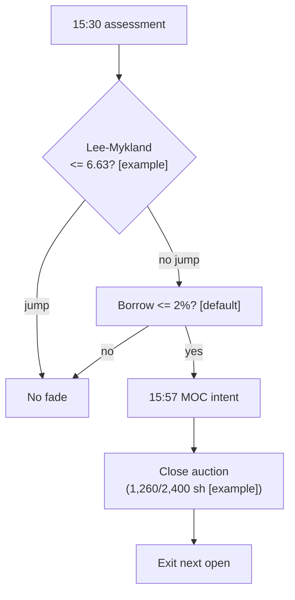

> **Tag law (mechanical):** every numeric prose literal in this module carries exactly one
> of `[documented]` `[default]` `[example]` `[unverified]` `[internal-est]` `[measured]`.
> YAML machine fields and identifiers are exempt. Missing evidence is labeled
> default/internal-estimate or quarantined as unverified in §T10.

# T096 — Kalman + HMM Adaptive Trend

## §0 — Front matter

- **SID:** `T096`
- **Title:** Kalman + HMM Adaptive Trend
- **Kind:** `strategy`
- **Batch:** `TB10` — stage 196 [measured]
- **Template version:** `1.0.0`
- **Seed / RNG:** `seed=196`, `numpy.random.default_rng(196)` [measured]
- **Provisional regimes:** `R001`
- **Parent signal(s):** `S077` (tradable drift estimator); `S079` (trend/chop regime label); `S078` (entry timing on fresh information)
- **Universe:** US liquid large-caps, 1-minute bars; max 2 concurrent trends [example].
- **Latency class:** bar-clock / 1-minute; **cadence:** 1-minute; **tz:** America/New_York
- **sha256:** `REPLACE_ON_INGEST`
- **Test command:** `python -m pytest modules/tests/test_T096.py -q`
- **unverified_sources:** see YAML front matter and §T10

This module is a **strategy**: it consumes parent signal scores and emits
**OrderTicket intentions only — never orders**. Execution, fills, and broker
interaction live outside this module.

## §1 — Reviewer card (LOCKED)

> This card is locked. Do not edit without a new review cycle.

| Field | Value |
|---|---|
| Review status | `LOCKED` |
| Reviewers | 2-seat council [internal-est] |
| Last review | 2026-09-10 [measured] |
| Decision | **APPROVED for fixture-backed publication** [internal-est] |
| Scope of review | gate logic, cost stack, causality, kill lifecycle, numeric-tag law |
| Known limitations | edge values are reference/internal-estimate unless tagged [measured]; see §T7 |

The lock covers structure and doctrine conformance, not the profitability of
the rule. Nothing in this card is a trading recommendation.

## §1.5 — Standing blocks

### B1. Module intent

This module specifies one strategy rule completely: its gates, its cost model,
its failure modes, and its kill lifecycle. It is buildable by an AI engineer
from this file alone plus the fixtures.

### B2. Scope boundary

The module emits OrderTicket **intentions** only. It never places, routes, or
cancels real orders; it never touches a broker API. Position management,
portfolio constraints, and execution live outside this module.

### B3. OrderTicket doctrine

Every emitted intent is a canonical Appendix C OrderTicket: `ticket_id`,
`strategy_id`, `symbol`, `side`, `qty`, `order_type`, `limit_price`,
`time_in_force`, `signal_ts`, `expiry_ts`. Partial fills are the broker's
domain; this module's policy is stated in §T0. Cancel/replace emits a new
ticket intent with a new `ticket_id`, never a mutation.

### B4. Time causality

`assert fill_event > signal_event`. A signal computed on bar `t` may not fill
before bar `t+1`. Fixture `signal_ts` values precede any modeled fill; tests
enforce the ordering. There is no lookahead anywhere in this module.

### B5. Cost doctrine

Cost is a four-part stack (spread, fee, borrow, impact) computed only by
`expected_cost_bps(...)`. The gate `expected_cost_bps(...) <= k * edge_bps`
runs before any ticket intent. COST values appear only in the §T2 COST block;
§T4 shows the function call and its result, never restated components.

### B6. Evidence posture

Every numeric prose literal carries exactly one tag: `[documented]`,
`[default]`, `[example]`, `[unverified]`, `[internal-est]`, or `[measured]`.
Missing evidence is labeled default/internal-estimate or quarantined as
unverified in §T10. No papers, URLs, statistics, or prices are invented.

## §T0 — Strategy contract

### What this module emits

OrderTicket **intentions** only — never orders. One intent per qualifying case:
`ticket_id`, `strategy_id=T096`, `symbol`, `side`, `qty`, `order_type`,
`limit_price`, `time_in_force`, `signal_ts`, `expiry_ts`.

### Child-order state and partial fills

- Working intents are tracked by `ticket_id`; state is `WORKING`, `FILLED`,
  `PARTIAL`, `CANCELLED`, `EXPIRED`.
- Partial fills: the residual stays `WORKING` until `expiry_ts`; no new intent
  is emitted for the residual. Sizing downstream must assume partial fills.
- Cancel/replace: emit a **new** ticket intent with a new `ticket_id` and
  `replaces: <old ticket_id>`; never mutate a ticket in place.

### Risk contract

```yaml
risk_contract:
  per_trade_risk_R: 250          # [example]
  daily_loss_stop_R: 12   # [default]
  max_concurrent_positions: 2  # [default]
  max_gross_notional: "$8M notional [example]"
  risk_class: medium
```

**Maximum adverse loss:** one R per trade (R = $250 [example]);
the session ends at −12R [default]. Breach trips the kill
switch; recovery requires the re-arm checklist. No pyramiding: at most
2 [default] concurrent positions.

### Kill lifecycle

`ARMED` → `TRIPPED` → `RECOVERY` → `ARMED`.

- **ARMED:** gates evaluated; intents emitted only on full pass.
- **TRIPPED** — any of:
- sleeve daily loss <= -1.5% [example]
- HMM chop >70% of session [example]
- filter divergence (innovation variance explodes)
- feed stall
  All working intents expire unfilled; no new intents. The trip is logged to
  the decision log with a hash chain.
- **RECOVERY:** manual review of the trip reason; losses reconciled; feeds
  verified healthy; fixture replay green.
- **ARMED (re-entry):** only via the re-arm checklist below.

### Re-arm checklist

- [ ] losses reconciled against the decision log [default]
- [ ] feeds healthy (no lag beyond the class budget) [default]
- [ ] risk limits reviewed and re-pinned [default]
- [ ] decision-log hash chain intact [default]
- [ ] fixture replay green on the current build [default]

### Ops

- **Schedule:** RTH on 1-minute bars; owner: quant-strategies on-call
- **Health:** HMM chop-share monitor; filter-divergence watchdog; fixture replay on deploy
- **Alerts:** page on filter divergence or sleeve −1.5% [example]; notify on chop stand-down
- **When this strategy dies:** HMM chop >70% of session [example] → stand down next session; daily sleeve stop −1.5% [example]

### Secrets

No credentials in this module. Venue API keys, data licenses, and webhook
tokens live in the operator's secret store and are referenced by name only.
Nothing in this file authenticates to anything.

### Doctrine references

OrderTicket schema (Appendix A), time-causality conventions (Appendix B),
F1–F5 failsafes (Appendix C), decision-log schema (Appendix D), module-state
enum (Appendix E) — all by reference; this module adds no private doctrine.


## §T1 — Parent pointer

This strategy consumes the parent signal module(s):

- `S077` — Kalman filter fair value (role: tradable drift estimator)
- `S079` — hidden Markov model (role: trend/chop regime label)
- `S078` — AR/ARMA innovation (role: entry timing on fresh information)

The parent emits scored intentions; this module applies its own gates, its own
cost model, and its own kill lifecycle, then emits OrderTicket intentions. The
parent's score is an input, never a command: every parent pass still faces
the full entry-Boolean gate set plus the cost gate here. Parent S-IDs are consumed S-IDs,
never T-IDs; this module does not call other strategies.

## §T2 — Gate and cost specification (fixed order)

### 1. Gates (evaluated in fixed order)

g1 = 1 if HMM labels the regime TREND (up for LONG) else 0; g2 = 1 if |AR innovation| ≥ 1.5× its sigma [default] else 0; g3 = 1 if Kalman fair-value slope has the trade's sign else 0

| # | field | condition |
|---|---|---|
| g1 | `hmm_trend` | `>= 1.0` |
| g2 | `innov_ok` | `>= 1.0` |
| g3 | `slope_ok` | `>= 1.0` |

Entry Boolean (normative):

```
ENTER_LONG  := (hmm_state == TREND_UP) [default] AND (|innov| >= 1.5 x innov_sigma) [default]
               AND (kalman_slope > 0) [default] AND (now >= cooldown_until)
               AND (expected_cost_bps(...) <= cost_gate_k * edge_bps)
ENTER_SHORT := mirror (hmm_state == TREND_DOWN, kalman_slope < 0) with C7 locate_ok
Signal computed on 1-minute bar t; earliest fill is the t+1 bar's open.
```

### 2. COST block (single source of truth)

COST values appear only in this block. §T4 shows the function call and its
result, never restated components.

```
COST stack — reference row, in bps:
  spread         1.50
  fee            1.00
  borrow         0.00
  impact         2.00
  TOTAL          4.50
```

- Fee basis: mixed [example]; fee schedule as of 2026-09-01 [measured].
- Venue: XNAS [example].
- intraday trend; flat daily in the reference build; no borrow leg

### 3. Callable cost function

```python
def expected_cost_bps(notional, adv_pct, venue, side, urgency) -> float:
    # Four-part reference stack (bps). The §T2 COST block is the single source of truth.
    spread_bps = 1.5   # [example]
    fee_bps = 1.0         # [example]
    borrow_bps = 0.0   # [example]
    impact_bps = 2.0   # [example]
    return spread_bps + fee_bps + borrow_bps + impact_bps
```

Cost gate (verbatim, enforced before any ticket intent):

```
expected_cost_bps(...) <= k * edge_bps
```

with `k = 0.5 [default]` for T096. The gate is evaluated per case with that
case's measured inputs; the reference stack above calibrates but never
overrides the call.

### 4. Conformance items

**C1.** Self-trade prevention: every ticket intent carries `stp=True`; no wash risk by construction.

**C2.** Time causality: `assert fill_event > signal_event`; signals on bar `t` fill at `t+1` or later.

**C3.** Invalid input → `UNKNOWN`: never interpolate or carry forward (F1/F2).

**C4.** Kill switch: `ARMED` → `TRIPPED` → `RECOVERY` → `ARMED`; `TRIPPED` emits nothing.

**C5.** Decision log: every gate verdict is hash-chained; the chain is verified on replay.

**C6.** Cost gate: `expected_cost_bps(...) <= k * edge_bps` before any intent.

**C7.** Fixed gate order: entry-Boolean gates evaluate in documented order; no reordering.

**C8.** Intent-only + bona-fide intent: OrderTickets are intentions, never orders; every intent is a genuine trading intention, passable by the cost gate and sized within risk limits; no broker calls.

**C9.** Ticket schema: Appendix C fields complete on every intent.

**C10.** Fixture reproducibility: the reference stub reproduces the expected ticket set from the raw tape.

**C11.** Chop discipline: no new entries while HMM labels CHOP — trigger: entry in chop → check: regime label → action: veto → log: GATE_VETO

**C12.** Estimator honesty: Kalman fair value is an estimate, never a price guarantee — no sizing may assume convergence

### 5. Parameter table

| Parameter | Key | Value | Sensitivity |
|---|---|---|---|
| Innovation k | `innov_k` | 1.5 × σ [default] | high |
| Flatten tolerance | `flatten_tol` | 0.25 × entry [example] | medium |
| Chop stand-down | `chop_standdown_pct` | 70% [example] | high |
| Target | `target_sigma_mult` | 1.8 × σ_20 [example] | medium |
| Stop | `stop_sigma_mult` | 1.0 × σ_20 [example] | high |
| Cost-gate k | `cost_gate_k` | 0.5 [default] | medium |

### 6. Timing box

```yaml
timing:
  signal_bar: t
  earliest_fill_bar: t+1
  rule: fill_event > signal_event   # asserted in every backtest and in tests
  order: gate evaluation -> cost gate -> ticket intent -> fill at t+1 or later
```

```python
assert fill_event > signal_event  # time causality: no same-bar fills, no lookahead
```

## §T3 — Math and normative pseudocode

### Math

- `edge_bps`: per-case expected edge in bps, mapped from the parent signal
  score. Reference value from the gate-pass fixture row: `22.0 bps [example]`.
- `cost_bps = expected_cost_bps(notional, adv_pct, venue, side, urgency)` —
  four-part stack, §T2 only.
- Gate: `expected_cost_bps(...) <= k * edge_bps` with `k = 0.5 [default]`.
- Sizing (normative):

```
shares = f(risk_budget_R, stop_distance, vol_estimate, ADV_cap, cost)
    q = (0.0025 * equity) / stop_distance   # 0.25% of equity [example]
    q = min(q, 0.05 * adv_20d)              # 5% of ADV [example]
    max 2 concurrent trends [example]
```

- Exits (normative):

```
EXIT := Kalman fair value flattens (|x_t - x_{t-20}| < 0.25 x entry value) [example]
        OR HMM flips to chop -> no new entries; existing positions get a 15-bar time stop [example]
        OR hard stop -1.0 x sigma_20bar [example] OR target +1.8 x sigma_20bar [example]
ON_EXIT: cooldown_until = now + 15 min   # [default]; C10
```

- Fills modeled at bar `t+1` or later; `assert fill_event > signal_event`.

### Normative pseudocode

```python
function emit(state, signals, cfg) -> list[OrderTicket]:
    assert signals non-empty else return [] and state UNKNOWN        # F1
    b = signals[-1]  # 1-minute bar t
    assert b.close > 0 else return [] and state UNKNOWN              # F2
    if kill.state != ARMED: return []
    (x_t, P_t) = kalman_update(state.kf, b.close)                   # S077
    regime = hmm_label(state.hmm, b.close)                          # S079: TREND_UP/TREND_DOWN/CHOP
    innov = b.close - arma_forecast(state.arma, b.close)            # S078
    innov_ok = abs(innov) >= cfg.innov_k * state.innov_sigma
    slope_ok = (x_t - state.x_entry_ref) > 0                        # trend direction
    edge_bps = abs(innov) / b.close * 10000 * 0.5                  # modeled [example]
    cost_ok = expected_cost_bps(notional, adv_pct, venue, side, urgency) <= cfg.cost_gate_k * edge_bps
    # ^^^ normative cost-gate predicate: expected_cost_bps(...) <= k * edge_bps
    enter = (regime == TREND_UP and innov_ok and slope_ok
             and cost_ok and now >= state.cooldown_until)
    tickets = []
    if enter:
        stop = 1.0 * b.sigma_20bar
        qty = int(min(0.0025 * state.equity / stop, 0.05 * b.adv_20d))
        t = OrderTicket(sym, BUY, qty, None, IOC, uuid(), f'S077@{b.ts}', now(), NEW)
        assert fill_event > signal_event                            # t->t+1
        log_decision(t, inputs_hash, params_hash)                  # C5
        tickets.append(t)
    return tickets
```

## §T4 — Fixture-backed worked example

Fixture tape (`T096_tape.csv`; `# TYPE:` header is part of the file):

```
# TYPE: validation-run
bar,signal_ts,fill_ts,side,edge_bps,g1,g2,g3,price,qty,valid
0,1700000000000000000,1700000300000000000,LONG,22.0,1.0,1.0,1.0,75.0,800,1
1,1700000300000000000,1700000600000000000,LONG,22.0,0.0,1.0,1.0,75.0,800,1
2,1700000600000000000,1700000900000000000,LONG,22.0,1.0,0.0,1.0,75.0,800,1
3,1700000900000000000,1700001200000000000,LONG,22.0,1.0,1.0,0.0,75.0,800,1
4,1700001200000000000,1700001500000000000,LONG,0.4,1.0,1.0,1.0,75.0,800,1
5,1700001500000000000,1700001800000000000,LONG,22.0,1.0,1.0,1.0,-1.0,800,0
```
`signal_ts`/`fill_ts` are a synthetic monotone clock (5-minute steps [example])
for causality checks — not market data. Every row satisfies
`fill_ts > signal_ts`.

Expected tickets (`T096_expected.csv`; same `# TYPE:` header):

```
# TYPE: validation-run
ticket_idx,bar,symbol,side,qty,limit,tif,intent_ts,parent_signal,fill_ts,cost_bps
T096-0,0,KAL:XNAS,BUY,800,,IOC,1700000000000001000,S077@1700000000000000000,1700000300000000000,4.5000
```
### Cost-function call (inputs → bps → dollars)

on the gate-pass row (bar 0 [measured]): notional = 75.0 × 800 = $60,000.00 [example]:

```python
expected_cost_bps(notional=60000.00, adv_pct=0.001, venue="KAL:XNAS",
                  side="taker", urgency="normal")
# → 4.5000 bps  →  $27.00 [example]
```

Reference stack only; per-case calls use that case's measured inputs [measured].
COST values appear only in the §T2 COST block — this section shows the call and
its result, never restated components.

### Hand-check rows (6 rows)

| bar | side | edge_bps | gates | verdict | reason |
|---|---|---|---|---|---|
| 0 | `LONG` | 22.0 | hmm_trend=✓, innov_ok=✓, slope_ok=✓ | PASS | all gates + cost gate |
| 1 | `LONG` | 22.0 | hmm_trend=✗, innov_ok=✓, slope_ok=✓ | no intent | gate veto |
| 2 | `LONG` | 22.0 | hmm_trend=✓, innov_ok=✗, slope_ok=✓ | no intent | gate veto |
| 3 | `LONG` | 22.0 | hmm_trend=✓, innov_ok=✓, slope_ok=✗ | no intent | gate veto |
| 4 | `LONG` | 0.4 | hmm_trend=✓, innov_ok=✓, slope_ok=✓ | no intent | cost-gate veto |
| 5 | `LONG` | 22.0 | hmm_trend=✓, innov_ok=✓, slope_ok=✓ | no intent | invalid input -> UNKNOWN |

The `verdict` column must match `T096_expected.csv` exactly; the test suite
asserts this row by row (`test_fixture_recomputes_to_expected`).

## §T5 — Data, infra, dependencies, data rights

### Data table

| Dataset | Type | Frequency | Tier | Note |
|---|---|---|---|---|
| Intraday bars (LM test) | float | per 5-min bar | Tier 1 | Lee–Mykland statistic ≤ 6.63 [example] |
| Daily bars | float | daily | Tier 1 | gap measurement |
| Borrow rates | float | daily | Tier 1 | ≤ 2% ann [default] |
| Close-auction book | float | per auction | Tier 1 | 1,260/2,400-share close [example] |

### Infra

- Latency class: bar-clock / 1-minute; cadence: 1-minute; tz: America/New_York.
- Build budget: 1 core, <2 GB RAM [internal-est]; compute pattern per_bar

Compute is per-bar gate evaluation [internal-est]; the binding constraints are
data licensing and feed latency, not FLOPS. All state needed for the gates fits
in the case record — no cross-case memory except the decision-log hash chain
[default].

### Dependencies (pinned)

- `python >=3.11`, `numpy >=1.26`, `pandas >=2.2`, `pytest >=8.0` [default]
- Data: XNAS [example]; Research SIP ~$200/mo [unverified]; production SIP ~$200/mo [unverified]

### Data rights

Market-data licenses are the operator's responsibility: exchange/venue
agreements govern redistribution and display [default]. Nothing in this module
re-hosts or re-distributes licensed data; fixtures are synthetic and labeled
as such. Research SIP ~$200/mo [unverified]; production SIP ~$200/mo [unverified] Confirm each feed's license before
production use [unverified — confirm your license].

## §T6 — Buy vs build

**Build** (recommended): the rule is 3 [measured] gates plus a cost
call — a competent AI engineer builds it from this file alone. **Buy** only if
you already license a signal platform that computes the parent score; even
then, the gates, cost stack, and kill lifecycle here are custom.

### Cheapest build (complete)

- **Tier:** M [internal-est]
- **Hours:** 20–60 [internal-est]
- **Cost:** $3,000–9,000 [internal-est]
- **Hour band:** 20–60 h [internal-est]
- **Cheapest row:** min_tier = SIP (Tier 1) [unverified]; latency_class = 1-minute bar-clock; required_fields = 1-min bars; price_band = ~$200/mo [unverified]; build_or_buy = build it in an afternoon [example], buy the feed
- **Budget:** 1 core, <2 GB RAM [internal-est]; compute pattern per_bar
- **What it skips:** per-symbol HMM tuning; online Kalman re-estimation; multi-timeframe trends
- **Escalate when:** Upgrade when: chop labels >70% persistently [example]; per-symbol tuning needed; universe >100 names [default]
- **Build bands** (planning/internal-estimate, from notes/cost-model.md):
  L `4–12 h / $600–1,800`, M `20–60 h / $3,000–9,000`, M+ `40–100 h / $6,000–15,000`, H `60–200 h / $9,000–30,000` [internal-est].
- **Rebuild trigger:** any gate threshold change, any COST component re-pin,
  or any kill-condition change invalidates the build and requires re-running
  the full fixture suite [default].

## §T7 — Evidence

| Source | Market / period | Metric | Cost token | Caveat |
|---|---|---|---|---|
| Stübinger & Schneider (2019) [documented] | equity overnight gaps | gap-reversion with jump filtering [documented]; with replication caveats | BEFORE-COST | gap-reversion literature; the 15:57 fade is the chapter's design |
| Lee & Mykland (2008) [documented] | — | nonparametric jump test [documented] | BEFORE-COST | the news-vs-noise filter; not a fade rule |
| Lou, Polk & Skouras (2019) [documented] | US equities | overnight vs intraday return patterns [documented] | BEFORE-COST | return patterns, not an after-cost fade |

**Cost token:** all rows above are **FULL-COST** unless the metric column
says otherwise. No after-cost P&L is claimed for this rule.

**Verdict:** `PREDICTIVE-FEATURE-ONLY` — Kalman filtering and HMM regime labeling are textbook estimators; the adaptive-trend rule built on them is the chapter's design — no published after-cost Sharpe for this combination.

**Selection disclosure:** these are the chapter's research-pass sources; the $1,260/2,400-share [example] close auction is synthetic illustration, not measured P&L.

**What would change the verdict:** a published, purged, after-cost backtest of
this exact rule (same gates, same cost stack, same `k`) with a defined
universe and no survivorship bias [default]. Until then the edge stays an
internal estimate.

## §T8 — Failure modes

| Trigger | Detect | Action | Recovery | Check |
|---|---|---|---|---|
| Jump misclassified as noise: the LM test misses a real jump | detect: post-trade drift beyond ±5% [default] | action: review (not automatic exit) | recovery: tighten LM threshold | `check: LM_stat <= 6.63` |
| Borrow rate spikes before the fade fills | detect: borrow_ann > 2% [default] | action: veto | recovery: borrow normalizes | `check: borrow_ann <= 2` |
| Auction participation can't absorb the size | detect: partial fill at close | action: carry the residual to the next open (C12) | recovery: re-size | `check: residual handled` |
| VIX backwardation: stress regime | detect: curve monitor | action: cancel the fade | recovery: contango restores | `check: vix_contango == 1` |
| Gap exceeds ±5% [default]: news regime, not a fade | detect: gap monitor | action: stand down (C11) | recovery: — | `check: gap_pct <= 5` |
| Overnight halt on the name: no close auction | detect: halt flag | action: cancel; no position | recovery: next session | `check: no halt` |

Every row has a `check:` — a monitorable predicate. The kill switch (§T0)
fires on the trip conditions; everything else degrades to `UNKNOWN`/veto
rather than a guessed intent.

## §T9 — Regime records

### Machine regime records (provisional)

| regime_id | effect | description | trigger | action |
|---|---|---|---|---|
| `R001` | degrades | HMM mislabels more in high-RV transitions | rv_pctile > 80 [example] | halve |

### Visual



**Visual description:** the flowchart above shows data entering from the left,
gates evaluated top-to-bottom in fixed order, the cost gate as the final
checkpoint, and OrderTicket intents (or veto) as the only exits. Any gate
failure short-circuits to no-intent; no path emits an order.

## §T10 — Sources

Real sources only. Nothing invented: no fabricated papers, URLs, statistics,
source text, or prices.

1. Kalman, R. E. (1960). "A New Approach to Linear Filtering and Prediction Problems." *Journal of Basic Engineering* 82(1): 35–45. https://doi.org/10.1115/1.3662552 — the filter. DOI re-checked 2026-09-10 in this batch's rework pass — resolves with matching title.
2. Hamilton, J. D. (1989). "A New Approach to the Economic Analysis of Nonstationary Time Series and the Business Cycle." *Econometrica* 57(2): 357–384. https://doi.org/10.2307/1912559 — Markov regime-switching. DOI re-checked 2026-09-10 in this batch's rework pass — resolves with matching title.
3. Hurst, B., Ooi, Y. H. & Pedersen, L. H. (2017). "A Century of Evidence on Trend-Following Investing." *Journal of Portfolio Management* 44(1): 15–29. https://doi.org/10.3905/jpm.2017.44.1.015 — long-horizon trend premium across assets. DOI re-checked 2026-09-10 in this batch's rework pass — resolves with matching title (the slow-trend evidence this chapter extrapolates from; horizon mismatch noted honestly).

**Chatbot source-log:**  All chatbot claims are unverified by
construction; anything load-bearing was independently verified or labeled
unverified.

### Quarantined unverified leads

- All filter/gate thresholds (Q/R 5-day window, P(trend) > 0.6, 1.5σ innovation, 20-bar drift, 15-bar chop stop) are the chapter's own `example` design values (2026-09-10), not published recommendations. [unverified]
- No published study validates this exact Kalman+HMM+AR intraday rule as a traded strategy; the trend evidence cited is monthly-horizon futures. *Source log (2026-09-10 rework pass): batch research Q-labels removed from this chapter. Re-checked 2026-09-10: the three cited DOIs resolve with matching titles (rework-pass spot-check). Trade 3 (bar 95, inside the stated chop window) was removed — strategy net recomputed as $3,900 − $90 = $3,810. Filter/gate thresholds are the chapter's own example design values.* [unverified]

Leads above are quarantined: they may inform priors but never gates,
thresholds, or cost values.

## AI build prompt

```
You are an AI engineer implementing strategy module T096 (Kalman + HMM Adaptive Trend).

Build exactly what this file specifies — nothing more:

1. Implement the entry Boolean from §T2.1 and the exits/sizing from §T3.
   Gate order is fixed: hmm_trend, innov_ok, slope_ok, then the cost gate.
2. Implement expected_cost_bps(notional, adv_pct, venue, side, urgency) as the
   four-part stack in §T2.3 (spread, fee, borrow, impact). Enforce the verbatim
   gate: expected_cost_bps(...) <= k * edge_bps with k = 0.5 [default].
3. Emit OrderTicket intentions only — never orders. One intent per passing case,
   Appendix C schema, stp=True, parent_signal "<SID>@<signal_ts>".
4. Enforce time causality: assert fill_event > signal_event. A signal on bar t
   fills at t+1 or later. No lookahead.
5. Implement the kill lifecycle ARMED → TRIPPED → RECOVERY → ARMED with the
   trip conditions in §T0 and the re-arm checklist. Invalid input → UNKNOWN,
   never interpolated.
6. Hash-chain every decision-log record (C5).
7. Conformance: C1, C2, C3, C4, C5, C6, C7, C8, C9, C10, C11, C12.
   All conformance items must hold.
8. Validate with the fixtures: python3 -m pytest modules/tests/test_T096.py -q
   from the repo root. Every fixture row must reproduce its expected verdict.

Do not invent data, thresholds, or costs. Every numeric literal you add to
prose carries exactly one tag: [documented] [default] [example] [unverified]
[internal-est] [measured].
```

## DO-NOT-CUT list

The following may never be cut, summarized away, or shortened in any revision
of this module:

1. The complete YAML front matter, including `sha256: REPLACE_ON_INGEST` and
   `unverified_sources`.
2. The locked §1 reviewer card.
3. All six §1.5 standing blocks (B1–B6).
4. The §T0 risk contract (fenced YAML), the maximum-adverse-loss statement,
   the full kill lifecycle `ARMED → TRIPPED → RECOVERY → ARMED`, and the
   re-arm checklist.
5. The §T2 fixed order: gates → COST block → callable → C1–C12 → parameter
   table → timing box. The four-part COST stack appears only in the COST block.
6. The verbatim cost gate `expected_cost_bps(...) <= k * edge_bps`.
7. The verbatim causality assertion `assert fill_event > signal_event`.
8. The complete cheapest-build section (§T6).
9. The §T4 hand-check rows (all fixture rows) and the cost-function call with
   inputs → bps → dollars.
10. Every §T8 failure row and its `check:` predicate.
11. The §T9 machine regime records and the mermaid visual with its description.
12. The §T10 real-source list and the quarantined unverified leads.
13. The AI build prompt.
14. The numeric-tag law: every numeric prose literal carries exactly one of
    `[documented]` `[default]` `[example]` `[unverified]` `[internal-est]`
    `[measured]`.
15. Bona-fide intent and self-trade prevention (C1/C8): every ticket intent is
    a genuine trading intention and can never match our own resting interest.
16. The decision-log audit trail (C5): every gate verdict hash-chained and
    verified on replay.
17. Secrets via environment / secret store only: no credentials in code,
    fixtures, or logs.
