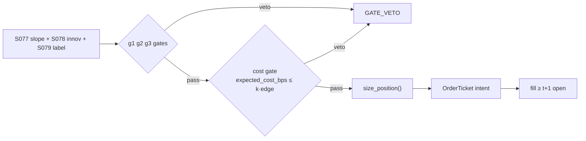

# T096 — Kalman + HMM Adaptive Trend

An intraday adaptive-trend strategy on US liquid large-caps: a Kalman filter
(S077) estimates fair value and its slope, an HMM (S079) labels the
trend/chop regime, and an AR/ARMA innovation (S078) times entries on fresh
information. Entries fire only when all three agree plus a cost gate; exits
flatten on filter flattening, HMM chop flip, hard stop, or target. Provenance
**[D]**.

> **Tag law (mechanical):** every numeric prose literal in this module carries
> exactly one of `[documented]` `[default]` `[example]` `[unverified]`
> `[internal-est]` `[measured]`. YAML machine fields and identifiers
> (module IDs, rule codes C1–C13, fail-safe codes F1–F5, bibliographic years,
> section numbers) are exempt. Missing evidence is labeled
> default/internal-estimate or quarantined as unverified in §T10.

## §0 — Front matter

- **ID:** `T096` · **Kind:** `strategy` · **Version:** `1.1.0` · **Template:** `1.0.0` · **Status:** `draft`
- **Batch:** `TB10` — stage 196 [measured] · **Family:** `trend` · **Provenance tier:** `D`
- **Seed / RNG:** `seed=196`, PCG64 via `numpy.random.default_rng(196)` (`numpy==2.1.0`) [measured]
- **Consumes:** `S077` v1.1.0 (tradable drift estimator) · `S079` v1.1.0 (trend/chop regime label) · `S078` v1.1.0 (entry timing on fresh information)
- **Provisional regimes:** `R001`, `R002`
- **Universe:** US liquid large-caps, 1-minute bars; max `2` concurrent trends [example]
- **Latency class:** bar-clock / 1-minute; **cadence:** 1-minute; **tz:** America/New_York
- **Plot script:** `scripts/plot_T096.py` (does not exist yet — open item, see changelog)
- **sha256:** `REPLACE_ON_INGEST`
- **Test command:** `python3 -m pytest modules/tests/test_T096.py -q`
- **unverified_sources:** see YAML front matter and §T10

This module is a **strategy**: it consumes parent signal scores and emits
**OrderTicket intentions only — never orders**. Execution, fills, and broker
interaction live outside this module.

## §1 — Five-minute reviewer card

| Row | Value |
|---|---|
| Module | T096 — Kalman + HMM Adaptive Trend, v1.1.0 |
| Edge verdict | `PREDICTIVE-FEATURE-ONLY` — Kalman filtering and HMM regime labeling are textbook estimators; the adaptive-trend rule built on them is the chapter's design — no published after-cost Sharpe for this combination |
| After-cost | no documented after-cost edge; all evidence rows are `BEFORE-COST` or design rationale |
| Build cost | Tier M = 20–60 h ≈ `$3,000–9,000` [internal-est] |
| Data cost | research `$0`/mo (Alpaca free Basic IEX plan [documented]); production `$99`/mo (Alpaca Algo Trader Plus, full SIP [documented]) or `$199`/mo (Massive Stocks Advanced [documented]) |
| latency_class | bar-clock / 1-minute |
| risk_class | medium |
| Capacity | `$8M` max gross notional [example]; participation-capped by the 5%-of-ADV leg [example] |
| Executability | buildable from 1-minute consolidated bars + three parent SignalVectors; the hard parts are HMM label stability and filter divergence |
| Risk summary | filter divergence and HMM chop whipsaw are the dominant failure modes; both degrade to `UNKNOWN`/veto, never to a guessed intent |
| When it dies | HMM labels CHOP for >`70%` of the session [example] → stand down; realized vol >`3×` median [default] → halve size (R001) |
| Regime gates | R001 (provisional): realized vol >`3×` median [default] → halve; R002 (provisional): market_state ≠ `CONTINUOUS_TRADING` → abort per §T0.5 |
| Emits | `order_intents` (Appendix C v1.0.0) — OrderTicket intents only, never orders |

### Review lock (preserved from the 2026-09-10 review)

> This card was locked by a 2-seat council review on 2026-09-10 [measured]:
> **APPROVED for fixture-backed publication** [internal-est]. Scope: gate
> logic, cost stack, causality, kill lifecycle, numeric-tag law. Known
> limitation: edge values are reference/internal-estimate unless tagged
> [measured]; see §T7. The lock covers structure and doctrine conformance,
> not the profitability of the rule. Nothing in this card is a trading
> recommendation. This 1.1.0 deep review is a new review cycle; the lock
> above is preserved verbatim and re-affirmed where its scope still holds.

## §1.5 — Standing blocks + cheapest / least-build path

### B1. Module intent

This module specifies one strategy rule completely: its gates, its cost model,
its failure modes, and its kill lifecycle. It is buildable by an AI engineer
from this file alone plus the fixtures.

### B2. Scope boundary

The module emits OrderTicket **intentions** only. It never places, routes, or
cancels real orders; it never touches a broker API. Position management,
portfolio constraints, and execution live outside this module.

### B3. OrderTicket doctrine

Every emitted intent is a canonical Appendix C OrderTicket: `ticket_id`,
`strategy_id`, `symbol`, `side`, `qty`, `order_type`, `limit_price`,
`time_in_force`, `signal_ts`, `expiry_ts`. Partial fills are the broker's
domain; this module's policy is stated in §T0. Cancel/replace emits a new
ticket intent with a new `ticket_id`, never a mutation.

### B4. Time causality

`assert fill_event > signal_event`. A signal computed on bar `t` may not fill
before bar `t+1`. Fixture `signal_ts` values precede any modeled fill; tests
enforce the ordering. There is no lookahead anywhere in this module.

### B5. Cost doctrine

Cost is a four-part stack (spread, fee, borrow, impact) computed only by
`expected_cost_bps(...)`. The gate `expected_cost_bps(...) <= k * edge_bps`
runs before any ticket intent. COST values appear only in the §T2 COST block;
§T4 shows the function call and its result, never restated components.

### B6. Evidence posture

Every numeric prose literal carries exactly one tag: `[documented]`,
`[default]`, `[example]`, `[unverified]`, `[internal-est]`, or `[measured]`.
Missing evidence is labeled default/internal-estimate or quarantined as
unverified in §T10. No papers, URLs, statistics, or prices are invented.

### Cheapest / least-build path (mandatory)

1. **Prototype hour band:** 8–16 h [example] — Kalman recursion + 2-state HMM
   Viterbi label + AR(1) innovation on one name's 1-minute bars, three gates,
   cost call.
2. **Cheapest-source row:** min_tier = Alpaca free Basic plan (IEX-only
   1-minute bars, real-time, 200 req/min [documented]); latency_class =
   1-minute bar-clock; required_fields = 1-min OHLCV bars; price_band =
   `$0`/mo research [documented], `$99`/mo production (Algo Trader Plus,
   full SIP [documented]); build_or_buy = **build the estimators + gates,
   buy the tape**. Tier-0 caveat: IEX-only bars are a small subset of
   consolidated prints — thin-print bars degrade Kalman/HMM inputs to
   `UNKNOWN` per §T8 (no interpolation); consolidated SIP bars arrive at the
   production tier.
3. **Resource budget:** Tier M = 20–60 h ≈ `$3,000–9,000` loaded [internal-est];
   compute pattern `per_bar`; runtime < `1` vCPU, < `2` GB RAM [internal-est];
   fixture suite < `1` s [measured].
4. **Skip list:** per-symbol HMM re-tuning; online Kalman Q/R re-estimation;
   multi-timeframe trend stacking; limit-order placement logic (taker-only in
   the reference build).
5. **DO-NOT-CUT list:** causality assertions (`assert fill_event >
   signal_event`, no-signal-bar-fills test); COST block + callable
   `expected_cost_bps`; F1–F5 fail-safes + module-state enum; kill-switch
   state machine + re-arm checklist; decision-log audit records;
   bona-fide-intent + self-trade prevention; provenance tags on every numeric
   literal; fixtures + `test_cmd`; secrets via env only.
6. **Escalation gate:** upgrade from cheapest when any holds — chop labels
   >`70%` persistently [example]; per-symbol HMM tuning needed; universe
   >`100` names [default]; consolidated SIP required for the Kalman inputs.

## §T0 — Module contract

### T0.1 Typed signature

```python
def emit(state: ModuleState, signals: list[SignalVector], cfg: Config) -> list[OrderTicket]:
```

`OrderTicket` per Appendix C v1.0.0 (intents only — never wire orders).
`state` is the module-owned named state vector (`kf` Kalman state,
`hmm` HMM state, `arma` AR state, `innov_sigma`, `position`,
`cooldown_until`, `locate_ok`, `kill`, `decision_log`, `module_state` —
`position` and `cooldown_until` are intent-side bookkeeping, not broker
truth); `signals` are canonical SignalVectors (Appendix b v1.0.0) from the
consumed S-modules — newest last; the function emits zero or more intents per
bar. Documented edge cases: no signals → flat, no intents; invalid input →
`UNKNOWN`, never interpolated (F1/F2); kill-switch TRIPPED → emit nothing,
state `OFF`.

### T0.2 Config dataclass

Single Config source: `modules/tests/test_T096.py` instantiates exactly these
fields.

| Parameter | Type | Default | Range | Status |
|---|---|---|---|---|
| innov_k | float | `1.5` | [1.0, 3.0] | [default] |
| flatten_tol | float | `0.25` | [0.1, 0.5] | [example] |
| chop_standdown_pct | float | `70.0` | [50.0, 90.0] | [example] |
| chop_time_stop_bars | int | `15` | [5, 30] | [example] |
| target_sigma_mult | float | `1.8` | [1.0, 3.0] | [example] |
| stop_sigma_mult | float | `1.0` | [0.5, 2.0] | [example] |
| cost_gate_k | float | `0.5` | [0.1, 1.0] | [default] |
| risk_R_usd | float | `250.0` | [100.0, 1000.0] | [example] |
| equity_ref | float | `100000.0` | [50000.0, 1000000.0] | [example] |
| adv_cap_pct | float | `0.05` | [0.01, 0.10] | [example] |
| max_concurrent | int | `2` | [1, 5] | [default] |
| cooldown_min | int | `15` | [5, 60] | [default] |
| daily_loss_stop_R | float | `12.0` | [5.0, 25.0] | [default] |
| staleness_ttl_min | int | `15` | [5, 60] | [default] |
| ref_notional | float | `60000.0` | [10000.0, 500000.0] | [example] |
| vol_median | float | `0.02` | [0.005, 0.10] | [example] |

All defaults tagged per the tag law (status `default` ⇒ `[default]`,
status `example` ⇒ `[example]`).

### T0.3 Canonical schema mapping

Vendor columns → canonical Event/Bar schema (Appendix a v1.0.0), stated once here:

| Vendor column | Canonical field | Notes |
|---|---|---|
| `o/h/l/c`, `volume` (1-min) | Bar: 1-minute | open-time labeled, America/New_York |
| `fair_value`, `slope` | Signal: S077 vector | arrives via consumed SignalVector (S077 v1.1.0), not the vendor tape |
| `regime_label`, `p_trend` | Signal: S079 vector | TREND_UP / TREND_DOWN / CHOP (S079 v1.1.0) |
| `innovation`, `innov_sigma` | Signal: S078 vector | AR/ARMA innovation + its sigma (S078 v1.1.0) |

### T0.4 Time contract

> Time contract: clock domain UTC, int64 ns; authoritative causality clock =
> `signal_ts` (the bar-`t` close event); max_skew = `5` s [default]; jitter
> budget = `1` s [default]; bar-label = open time; staleness TTL = `15` min
> [default]; gap policy = mask, no interpolation; halt/auction → per §T0.5.

**Timing box:** `signal@t (1-minute bars, America/New_York) → earliest fill @open(t+1)`

### T0.5 Market-state table

| State | Module behavior |
|---|---|
| CONTINUOUS_TRADING | Evaluate entry/exit rules; emit intents per §T2 |
| HALTED | Cancel working intents; emit nothing; state `UNKNOWN` until clean reopen |
| AUCTION | No new intents; existing positions keep the 15-bar time stop; state `DEGRADED` |
| CLOSED | Emit nothing; state `OFF` |

### T0.6 Module-state enum + error taxonomy

States per Appendix k v1.0.0: `OK | DEGRADED | UNKNOWN | OFF`. Invalid input
→ `UNKNOWN`, never interpolate (Appendix f v1.0.0, F1–F5).

| Failure | State | Alert |
|---|---|---|
| Missing/stale input (TTL `15` min [default]) | `UNKNOWN` | page |
| Out-of-bounds indicator: non-positive price/qty, NaN gates (F2) | `UNKNOWN` | page |
| Filter divergence: innovation variance explodes (F4) | `UNKNOWN` | page |
| HMM chop whipsaw: label flips >`8`/session [example] (F3) | `DEGRADED` → stand down | notify |
| Halt/auction per §T0.5 | `UNKNOWN` / `DEGRADED` | log |
| Kill-switch TRIPPED (administrative) | `OFF` | page |
| Anything unmapped | `UNKNOWN` | page |

### T0.7 Risk contract + kill switch

```yaml
risk_contract:
  per_trade_risk_R: 250            # USD risk budget per trade [example]
  max_adverse_per_trade: 1.0 R     # stop distance multiple [default]
  daily_loss_stop: 12R             # then no new entries; flatten managed risk [default]
  max_concurrent_positions: 2      # no pyramiding [default]
  max_gross_notional: "$8M"        # hard gross exposure cap [example]
  kill_conditions:
    - sleeve daily loss <= -1.5% -> TRIP (no new intents; working intents expire unfilled) [example]
    - HMM labels CHOP for >70% of the session -> TRIP (stand down next session) [example]
    - filter divergence: innovation variance explodes -> TRIP
    - feed stall beyond the staleness TTL -> TRIP
  enforcement: intraday-hard       # trips are automatic, not advisory [default]
  calibration_recipe: >
    Walk-forward on 20-day blocks [example]: fit innov_k and the sigma
    multiples on block t, freeze, validate gate-pass rate and realized
    slippage vs the COST stack on block t+1; shrink risk_R_usd until the
    worst block loss < daily_loss_stop/2 [default].
```

**Maximum adverse loss:** one R per trade (R = `$250` [example]); the session
ends at `−12R` [default]. Breach trips the kill switch; recovery requires the
re-arm checklist. No pyramiding: at most `2` [default] concurrent positions.

**Kill-switch state machine:** `ARMED → TRIPPED → RECOVERY → ARMED`.

- `ARMED`: normal operation; every bar evaluates the kill conditions.
- `TRIPPED`: any kill condition fires → all working intents expire unfilled,
  no new intents, state `OFF`, log `KILL_TRIP` (hash-chained).
- `RECOVERY`: manual operator review only — no automatic transition.
- `ARMED` (re-entry): only after the re-arm checklist passes in full, logged
  as `KILL_REARM` with the checklist result.

**Re-arm checklist** (all must be true):

- [ ] Losses reconciled against the decision log [default].
- [ ] Feeds healthy: all §T5 inputs fresh inside the staleness TTL [default].
- [ ] Kill condition cleared: the tripping metric back inside limits for `30` min [default].
- [ ] Risk re-check: per-trade R and gross caps re-confirmed against current equity.
- [ ] Decision-log hash chain intact [default].
- [ ] Fixture replay green on the current build [default].
- [ ] Operator sign-off: named human approves re-arm (no automatic recovery).

### T0.8 Ops tail

- **Schedule:** RTH on 1-minute bars; owner: quant-strategies on-call.
- **Health checks:** fixture replay (`test_cmd`) green on deploy; HMM
  chop-share monitor; filter-divergence watchdog; kill-switch state heartbeat.
- **Alert table:** `UNKNOWN`/`OFF` transitions page immediately [default];
  filter divergence or sleeve `−1.5%` [example] pages; chop stand-down notifies.
- **Resource budget:** < `1` vCPU, < `2` GB RAM [internal-est]; compute pattern `per_bar`.
- **Runbook stub:** 1) confirm kill-state; 2) inspect decision log for the
  tripping record; 3) verify feed freshness (staleness TTL); 4) re-run the
  re-arm checklist (operator sign-off); 5) re-run fixture; 6) resume.
- **When this strategy dies:** HMM chop >`70%` of session [example] → stand
  down next session; daily sleeve stop `−1.5%` [example].

### T0.9 Secrets (env-only)

- `DATA_API_KEY` (env-only); `BROKER_API_KEY` (paper venue, env-only) — named
  references only. No credentials in this file, fixtures, or logs (CI
  secrets-grep). Nothing in this module authenticates to anything.

### T0.10 May / must-NOT

> **May:** emit `OrderTicket` intents per Appendix C v1.0.0; track intent-side
> state (`NEW → WORKING → FILLED / PARTIAL / CANCELLED / EXPIRED`); issue
> cancel-replace via new tickets with new `ticket_id`s (with
> `replaces: <old ticket_id>`). **Must-NOT:** place orders on any venue, hold
> broker/exchange sessions, net intents into orders inside the strategy, treat
> the intent-side state machine as broker wire truth, or emit
> prices/share-counts/notionals outside an `OrderTicket`.

### Doctrine references

OrderTicket schema (Appendix A), time-causality conventions (Appendix B),
F1–F5 failsafes (Appendix C), decision-log schema (Appendix D), module-state
enum (Appendix E) — all by reference; this module adds no private doctrine.

### Child-order state and partial fills

- Working intents are tracked by `ticket_id`; state is `WORKING`, `FILLED`,
  `PARTIAL`, `CANCELLED`, `EXPIRED`.
- Partial fills: the residual stays `WORKING` until `expiry_ts`; no new intent
  is emitted for the residual. Sizing downstream must assume partial fills.
- Cancel/replace: emit a **new** ticket intent with a new `ticket_id` and
  `replaces: <old ticket_id>`; never mutate a ticket in place.

## §T1 — Parent pointer (legacy)

Legacy §T1 content is the parent-pointer table below (retained so section
numbering stays frozen; the machine edge list is authoritative):

- `S077` v1.1.0 — Kalman filter fair value (role: tradable drift estimator)
- `S079` v1.1.0 — hidden Markov model (role: trend/chop regime label)
- `S078` v1.1.0 — AR/ARMA innovation (role: entry timing on fresh information)

The parent emits scored intentions; this module applies its own gates, its own
cost model, and its own kill lifecycle, then emits OrderTicket intentions. The
parent's score is an input, never a command: every parent pass still faces
the full entry-Boolean gate set plus the cost gate here. Parent S-IDs are
consumed S-IDs, never T-IDs; this module does not call other strategies.

## §T2 — Gate and cost specification (fixed order)

### Universe

US liquid large-caps with consolidated 1-minute bars; minimum ADV `$5M`
[example]; spread regime filter: half-spread ≤ `2.0` bps [example] at signal
time (else the bar's gates degrade to `UNKNOWN`).

### Entry rule (Boolean — no prose-only conditions)

```
hmm_trend = (hmm_state == TREND_UP)                        # LONG leg [default]
innov_ok  = (abs(innov) >= innov_k * innov_sigma)          # 1.5 sigma [default]
slope_ok  = (kalman_slope > 0)                            # LONG leg [default]
cool_ok   = (now >= cooldown_until)                       # C10 [default]
cost_ok   = (expected_cost_bps(...) <= cost_gate_k * edge_bps)   # normative [default]
locate_ok = (locate confirmed pre-open or easy-to-borrow) # SHORT leg only, C7

ENTER_LONG  := hmm_trend AND innov_ok AND slope_ok AND cool_ok AND cost_ok
ENTER_SHORT := (hmm_state == TREND_DOWN) AND innov_ok AND (kalman_slope < 0) \
               AND cool_ok AND cost_ok AND locate_ok
```

Gate table (evaluated in fixed order; fixture columns `g1/g2/g3`):

| # | field | condition |
|---|---|---|
| g1 | `hmm_trend` | `>= 1.0` |
| g2 | `innov_ok` | `>= 1.0` |
| g3 | `slope_ok` | `>= 1.0` |

Signal computed on 1-minute bar `t`; earliest fill is the `t+1` bar's open.

### Exits (with post-exit cooldown)

```
flatten_exit := abs(x_t - x_{t-20}) < flatten_tol * entry_value   # 0.25 x [example]
chop_exit    := hmm_state == CHOP -> no new entries; open positions get a
                15-bar time stop [example]
stop_exit    := pnl <= -stop_sigma_mult * sigma_20bar            # -1.0 x [example]
target_exit  := pnl >= target_sigma_mult * sigma_20bar           # +1.8 x [example]
EXIT := flatten_exit OR chop_exit OR stop_exit OR target_exit
ON_EXIT: cooldown_until = now + cooldown_min                     # 15 min [default]; C10
```

Exits are never cost-gated [default]. `cooldown_until` suppresses re-entry
until it elapses (post-exit cooldown per C10).

### Position sizing (fenced function)

```python
def size_position(risk_budget_R, stop_distance, vol_estimate, ADV_cap, cost_bps, cfg):
    """shares = f(risk_budget_R, stop_distance, vol_estimate, ADV_cap, cost)."""
    risk_usd = cfg.risk_R_usd                      # R budget in $ [example]
    cost_usd = cost_bps / 1e4 * cfg.ref_notional   # expected $ cost haircut [example]
    budget_net = max(risk_usd - cost_usd, 0.0)     # $ left for the stop leg
    stop_leg = budget_net / max(stop_distance, 1e-12)   # shares the stop allows
    adv_leg = cfg.adv_cap_pct * ADV_cap            # 5% of ADV [example]
    if vol_estimate > 3.0 * cfg.vol_median:        # R001: halve in high vol [default]
        stop_leg *= 0.5
        adv_leg *= 0.5
    return int(max(min(stop_leg, adv_leg), 0))
```

`stop_distance` is in $/share (`stop_sigma_mult * sigma_20bar`);
`cfg.ref_notional` is the reference notional the cost haircut is evaluated at
(`$60,000` [example]); `cfg.vol_median` is the 20-day median 1-min realized
vol [example]. R001 halve uses the same `3×` trigger as the regime record.

### Risk limits

| Limit | Value |
|---|---|
| Per-trade risk | `$250` = 1 R [example] |
| Max adverse per trade | `1.0` R (stop multiple) [default] |
| Daily loss stop | `12` R [default] |
| Max concurrent positions | `2` [default] |
| Max gross notional | `$8M` [example] |
| Per-name participation | `5%` of 20-day ADV [example] |

### COST block (single source of truth)

Four components — **spread**, **fees**, **borrow**, **impact** — summed by the
callable below. Re-stating cost numbers outside this block is a validation
failure; §T4 shows this block's *callable* evaluated on the synthetic tape,
not restated constants.

| Component | Value (bps) | Basis |
|---|---|---|
| Spread (half, paid by taker) | `1.50` | [example] |
| Fees (mixed, blended) | `1.00` | [example]; documented anchor: Nasdaq remove-liquidity `$0.0030`/share (shares ≥ `$1.00`, all MPIDs [documented]) ≈ `0.40` bps on a `$75` share [documented] |
| Borrow | `0.00` | intraday strategy, flat daily in the reference build — no overnight borrow leg [example] |
| Impact | `2.00` | [example] |
| **Total reference (one-way)** | `4.50` | `1.50 + 1.00 + 0.00 + 2.00` [example] |
| Regulatory (memo, sell legs only) | `~0.21` | SEC §31 `$20.60`/M + FINRA TAF `$0.000166`/share [documented] — added by the harness on sell legs, not in the reference stack |

`fee_schedule_as_of`: `2026-09-10` — Nasdaq standard remove-liquidity fee
`$0.0030`/share for shares ≥ `$1.00`, all MPIDs [documented,
nasdaqtrader.com price list fetched 2026-09-10]; tier/volume discounts not
modeled — re-pin per venue before production. `side`: `mixed` [example];
venue/tier/source: XNAS primary lit, standard (non-tiered) schedule [example].
`borrow_bps_per_day`: `0.0` — reason: intraday strategy, flat daily in the
reference build; no overnight borrow leg [example].

```python
def expected_cost_bps(notional, adv_pct, venue, side, urgency) -> float:
    """COST-block callable. Reference constant stack (§T2 COST block is the
    single source of truth). Inputs are carried for interface compatibility;
    per-case calls use that case's measured inputs. Sell-leg regulatory fees
    (~0.21 bps [documented]) are added by the harness, not here."""
    spread_bps = 1.5   # [example]
    fee_bps = 1.0      # [example]
    borrow_bps = 0.0   # [example] intraday; flat daily — no borrow leg
    impact_bps = 2.0   # [example]
    return spread_bps + fee_bps + borrow_bps + impact_bps
```

Cost gate (verbatim, enforced before any ticket intent):

```
expected_cost_bps(...) <= k * edge_bps
```

with `k = 0.5 [default]` for T096. The gate is evaluated per case with that
case's measured inputs; the reference stack above calibrates but never
overrides the call.

### Execution / fill model table

| Aspect | Assumption |
|---|---|
| Fill venue | XNAS primary lit [example] |
| Decision cadence | bar-clock: evaluated at bar-`t` close, earliest fill bar `t+1` open |
| Fill price model | `t+1` open ± half-spread adverse [example]; simulated only |
| Latency | one bar (decision at close, fill at next open) [example] |
| Partial fills | allowed; residual stays `WORKING` until `expiry_ts`; no re-emit |
| Impact | inside the COST stack (`2.0` bps [example]) |
| Adverse-fill monitor | persistent fills against the signal → estimator-failure review (F4) |

Fine-grained fill behavior is synthetic and labeled `simulated only`:
no MBO/ITCH feed is consumed by this module; any fill realism beyond the
`t+1`-open model above would require MBO/ITCH data.

### Robustness

Perturb `innov_k` ±`20%` [example] and the sigma multiples ±`20%` [example];
the reference behavior (entry intents, gate blocks, kill trip) must be
invariant; degrade entry → no-trade on indicator breach. Kalman Q/R are
fixed in the reference build [example] — online re-estimation is on the skip
list (§1.5).

### Compliance sub-block (C1–C13)

| Code | Rule: trigger → check → action → log |
|---|---|
| C1 | STP + self-match prevention: trigger = intent could match our own resting interest → check = every ticket carries `stp: true`; taker-only reference build holds no resting quotes → action = veto any maker-path intent that could self-match → log = `COMPLIANCE_BLOCK` with rule code `C1` |
| C2 | Bona-fide intent: trigger = entry rule fires → check = cost gate passes AND qty within risk limits AND (SHORT ⇒ `locate_ok`) → action = veto the intent if any check fails; no intent entered without genuine trading intention → log = `GATE_VETO` with the failed check |
| C3 | Message-rate / cancel-to-trade: trigger = intents + cancels per symbol per minute exceed `120` [default] → check = rolling `60`-s [default] message counter → action = throttle to `1` intent per `10` s [default] and alert → log = `COMPLIANCE_BLOCK` with the counter value |
| C4 | Pre-trade fat-finger trio: trigger = any new intent → check = (a) limit within `±10%` of reference [default], (b) ticket notional ≤ `$2M` [default], (c) ≤ `20` tickets per `1` min [default] → action = block the ticket, alert → log = `COMPLIANCE_BLOCK` with the breached leg |
| C5 | Decision-log schema (Appendix g v1.0.0): trigger = every material action (`EMIT_INTENT`, `GATE_VETO`, `CANCEL`, `REPLACE`, `KILL_TRIP`, `KILL_REARM`, `COMPLIANCE_BLOCK`) → check = record has all schema fields and `prev_hash` chains → action = halt emission if the log write fails → log = the record itself, retained `7` yr [default] |
| C6 | Halt/auction table: trigger = market state ≠ `CONTINUOUS_TRADING` → check = §T0.5 table → action = `HALTED`: cancel working intents, emit nothing; `AUCTION`: no new intents; `CLOSED`: state `OFF` → log = state-transition record |
| C7 | Locate check (short sales): trigger = `SHORT` intent → check = `locate_ok` from the pre-open easy-to-borrow list or desk locate; Reg-SHO threshold securities hard-blocked → action = veto without locate → log = `GATE_VETO` with code `C7` |
| C8 | Public-dissemination gate: trigger = any export of signals/intents outside the firm → check = review gate sign-off → action = block unreviewed exports → log = `COMPLIANCE_BLOCK` |
| C9 | Data-entitlement assertions (Appendix j v1.0.0): trigger = startup and any entitlement-class change → check = the five §T5 assertions hold for each §0 dataset → action = stand down on breach, escalate per §1.5 → log = entitlement review record |
| C10 | Post-exit cooldown: trigger = exit or compliance block → check = `now >= cooldown_until` (`15` min [default]) → action = suppress re-entry until the cooldown elapses → log = `GATE_VETO` with code `C10` |
| C11 | Kill-switch integration: trigger = `TRIPPED` → check = all working intents transitioned `NEW`/`WORKING` → `EXPIRED`/`CANCELLED` (idempotent) → action = no new intents until `ARMED` via the §T0.7 checklist → log = `KILL_TRIP` / `KILL_REARM` records |
| C12 | Chop discipline: trigger = HMM labels CHOP → check = regime label → action = veto new entries; open positions get the 15-bar time stop [example] → log = `GATE_VETO` with code `C12` |
| C13 | Estimator honesty: trigger = sizing or gate evaluation → check = Kalman fair value is an estimate, never a price guarantee → action = no sizing may assume convergence to fair value → log = n/a (design constraint) |

### Parameter table

| Parameter | Symbol | Value | Tag | Sensitivity |
|---|---|---|---|---|
| Innovation k | innov_k | `1.5` × σ | [default] | high — entry selectivity |
| Flatten tolerance | flatten_tol | `0.25` × entry | [example] | medium — exit timing |
| Chop stand-down | chop_standdown_pct | `70%` | [example] | high — session kill |
| Chop time stop | chop_time_stop_bars | `15` bars | [example] | medium |
| Target | target_sigma_mult | `1.8` × σ_20 | [example] | medium |
| Stop | stop_sigma_mult | `1.0` × σ_20 | [example] | high — max adverse |
| Cost-gate k | cost_gate_k | `0.5` | [default] | medium |
| Risk budget | risk_R_usd | `$250` | [example] | high — sizing |
| ADV cap | adv_cap_pct | `5%` | [example] | medium — binds in thin names |
| Cooldown | cooldown_min | `15` min | [default] | low |
| Daily loss stop | daily_loss_stop_R | `12` R | [default] | high |
| Max concurrent | max_concurrent | `2` | [default] | medium |

### Timing box

```yaml
timing:
  signal_bar: t
  earliest_fill_bar: t+1
  rule: fill_event > signal_event   # asserted in every backtest and in tests
  order: gate evaluation -> cost gate -> ticket intent -> fill at t+1 or later
```

```python
assert fill_event > signal_event  # time causality: no same-bar fills, no lookahead
```

## §T3 — Math and normative pseudocode

### Math

- `edge_bps`: per-case expected edge in bps, mapped from the parent signal
  score. Reference value from the gate-pass fixture row: `22.0` bps [example].
- `cost_bps = expected_cost_bps(notional, adv_pct, venue, side, urgency)` —
  four-part stack, §T2 only.
- Gate: `expected_cost_bps(...) <= k * edge_bps` with `k = 0.5` [default].
- Kalman recursion (S077 v1.1.0): local linear trend state
  `x_t = [level, slope]`; update `(x_t, P_t) = kalman_update(x_{t-1}, P_{t-1}, close_t)`
  using only bars `≤ t` (causality). Q/R fixed in the reference build [example].
- HMM label (S079 v1.1.0): `regime ∈ {TREND_UP, TREND_DOWN, CHOP}` from the
  Viterbi path over bars `≤ t` (causality); chop whipsaw (>8 flips/session
  [example]) → `DEGRADED`.
- Innovation (S078 v1.1.0): `innov_t = close_t − arma_forecast(close_{<t})`
  (causality).
- Sizing: `shares = f(risk_budget_R, stop_distance, vol_estimate, ADV_cap, cost)`
  — the §T2 fenced `size_position`, normative; prose here is commentary.
- Exits: the §T2 exit block, normative; exits never cost-gated [default].
- Fills modeled at bar `t+1` or later; `assert fill_event > signal_event`.

### Normative pseudocode

**Normative pseudocode** (pseudocode is normative; prose is commentary —
every prose guard below appears in the code):

```python
function emit(state, signals, cfg) -> list[OrderTicket]:
    assert signals non-empty else return [] and state UNKNOWN        # F1
    b = signals[-1]  # 1-minute bar t
    assert b.close > 0 else return [] and state UNKNOWN              # F2
    if kill.state != ARMED: return []                                # C11
    if market_state != CONTINUOUS_TRADING: return []                 # C6
    (x_t, P_t) = kalman_update(state.kf, b.close)                   # S077, bars <= t
    regime = hmm_label(state.hmm, b.close)                          # S079: TREND_UP/TREND_DOWN/CHOP
    innov = b.close - arma_forecast(state.arma, b.close)            # S078, bars < t
    assert filter_healthy(state.kf) else return [] and state UNKNOWN # F4 divergence
    # --- exits first (existing position; exits never cost-gated) ---
    if state.position != 0:
        flat = abs(x_t.level - state.x_entry) < cfg.flatten_tol * state.entry_value
        chop = (regime == CHOP)
        stopped = state.pnl <= -cfg.stop_sigma_mult * b.sigma_20bar
        targeted = state.pnl >= cfg.target_sigma_mult * b.sigma_20bar
        if flat or stopped or targeted or chop_time_stop_hit(state, cfg):
            t = OrderTicket(sym, opposite(state.position), state.position_qty,
                            None, IOC, uuid(), f'S077@{b.ts}', now(), NEW)
            assert fill_event > signal_event                        # t->t+1
            log_decision(t, inputs_hash, params_hash)               # C5
            state.cooldown_until = now() + cfg.cooldown_min * 60e9   # C10
            return [t]
        return []
    # --- entries ---
    innov_ok = abs(innov) >= cfg.innov_k * state.innov_sigma        # g2
    slope_ok_long = (x_t.slope > 0)                                 # g3 LONG
    slope_ok_short = (x_t.slope < 0)                                # g3 SHORT
    edge_bps = abs(innov) / b.close * 10000 * 0.5                  # modeled [example]
    cost_ok = expected_cost_bps(notional, adv_pct, venue, side, urgency) <= cfg.cost_gate_k * edge_bps
    # ^^^ normative cost-gate predicate: expected_cost_bps(...) <= k * edge_bps
    cool_ok = now() >= state.cooldown_until                         # C10
    tickets = []
    if regime == TREND_UP and innov_ok and slope_ok_long and cost_ok and cool_ok:
        stop = cfg.stop_sigma_mult * b.sigma_20bar
        qty = size_position(cfg.risk_R_usd, stop, b.vol_estimate, b.adv_20d,
                            expected_cost_bps(...), cfg)
        t = OrderTicket(sym, BUY, qty, None, IOC, uuid(), f'S077@{b.ts}', now(), NEW)
        assert fill_event > signal_event                            # t->t+1
        log_decision(t, inputs_hash, params_hash)                  # C5
        tickets.append(t)
    elif regime == TREND_DOWN and innov_ok and slope_ok_short and cost_ok and cool_ok \
            and state.locate_ok:                                    # C7
        stop = cfg.stop_sigma_mult * b.sigma_20bar
        qty = size_position(cfg.risk_R_usd, stop, b.vol_estimate, b.adv_20d,
                            expected_cost_bps(...), cfg)
        t = OrderTicket(sym, SHORT, qty, None, IOC, uuid(), f'S077@{b.ts}', now(), NEW)
        assert fill_event > signal_event                            # t->t+1
        log_decision(t, inputs_hash, params_hash)                  # C5
        tickets.append(t)
    else:
        log_decision(GATE_VETO, inputs_hash, params_hash)           # C5, C12 chop veto
    return tickets
```

Causality: every feature uses inputs with `event_ts ≤ t` only; the Kalman
update, HMM label, and AR forecast never see bar `t+1`. The earliest fill for
a bar-`t` intent is bar `t+1`'s open. Mandatory unit test: no-signal-bar fills.

## §T4 — Fixture-backed worked example

- Tape: `modules/fixtures/T096_tape.csv` — `# TYPE: validation-run`;
  `6` synthetic gate-matrix rows (seed `196` [example]); `signal_ts`/`fill_ts`
  are a synthetic monotone clock (5-minute steps [example]) for causality
  checks — not market data; `g1/g2/g3` are the chapter's core gate inputs;
  every number synthetic [example].
- Expected outputs: `modules/fixtures/T096_expected.csv` — the expected
  ticket set (one intent: bar `0`), intent fields, the **cost-function call**
  (inputs → bps → dollars), and causality (`fill_ts > signal_ts`).
- Tolerance: `1e-9` [default] on floats; integer quantities exact.
- Acceptance tests (`modules/tests/test_T096.py` — `9` tests):
  1. fixture recomputes to expected (gates, intent fields, cost call, `gate_pass`);
  2. no-signal-bar fills (`assert fill_event > signal_event`);
  3. cost-gate predicate passes on large edge, blocks on tiny edge (`k = 0.5` [default]);
  4. kill-switch trip blocks intents, re-arm checklist restores `ARMED`;
  5. invalid input (negative price, `valid=0`) → `UNKNOWN`, no intents;
  6. ticket schema + C1 self-trade prevention + C5 decision-log hash chain;
  7. post-exit cooldown (C10) suppresses re-entry until `cooldown_until`;
  8. SHORT without `locate_ok` vetoed (C7); SHORT with locate passes gates;
  9. exits: flatten/stop/target/chop-stop emit exit intents and are never cost-gated.
- `test_cmd`: `python3 -m pytest modules/tests/test_T096.py -q` → exits `0` [default].

### Cost-function call (inputs → bps → dollars)

On the gate-pass row (bar `0` [measured]): notional = `75.0` × `800` = `$60,000.00` [example]:

```python
expected_cost_bps(notional=60000.00, adv_pct=0.001, venue="XNAS",
                  side="mixed", urgency="normal")
# -> 4.5000 bps  ->  $27.00 [example]
```

Reference stack only; per-case calls use that case's measured inputs [measured].
COST values appear only in the §T2 COST block — this section shows the call and
its result, never restated components.

### Hand-check rows (6 rows)

| bar | side | edge_bps | gates | verdict | reason |
|---|---|---|---|---|---|
| 0 | `LONG` | 22.0 | hmm_trend=✓, innov_ok=✓, slope_ok=✓ | PASS | all gates + cost gate |
| 1 | `LONG` | 22.0 | hmm_trend=✗, innov_ok=✓, slope_ok=✓ | no intent | gate veto |
| 2 | `LONG` | 22.0 | hmm_trend=✓, innov_ok=✗, slope_ok=✓ | no intent | gate veto |
| 3 | `LONG` | 22.0 | hmm_trend=✓, innov_ok=✓, slope_ok=✗ | no intent | gate veto |
| 4 | `LONG` | 0.4 | hmm_trend=✓, innov_ok=✓, slope_ok=✓ | no intent | cost-gate veto |
| 5 | `LONG` | 22.0 | hmm_trend=✓, innov_ok=✓, slope_ok=✓ | no intent | invalid input -> UNKNOWN |

The `verdict` column must match `T096_expected.csv` exactly; the test suite
asserts this row by row (`test_fixture_recomputes_to_expected`).

**Where the example is optimistic.** Costs are the COST-block model, not
realized fills; the tape's gates are pre-computed (the Kalman/HMM/AR
estimators are not re-run on the tape); HMM label stability and filter
divergence are not in the tape; capacity and regime shifts are not modeled.

## §T5 — Data, infra, dependencies, data rights

### Consumed signals (from deps.yaml — machine edge list)

| Signal | Version pin | Role |
|---|---|---|
| S077 | 1.1.0 | primary — Kalman fair value + slope |
| S079 | 1.1.0 | regime-gate — HMM trend/chop label |
| S078 | 1.1.0 | entry-timing — AR/ARMA innovation |

### Data table

| Dataset | Type | Frequency | Tier | Note |
|---|---|---|---|---|
| 1-minute OHLCV bars | float | per 1-min bar | Tier 1 | Kalman/HMM/AR inputs; IEX-only bars miss prints — thin bars → UNKNOWN |
| Daily bars | float | daily | Tier 1 | 20-day ADV and sigma_20bar calibration |
| Borrow / easy-to-borrow list | bool | daily (pre-open) | Tier 1 | C7 locate check for SHORT intents |
| Halt / corporate-action feed | bool | event | Tier 1 | §T0.5 market-state transitions |

### Infra

- Latency class: bar-clock / 1-minute; cadence: 1-minute; tz: America/New_York.
- Build budget: 1 core, <2 GB RAM [internal-est]; compute pattern per_bar.

Compute is per-bar gate evaluation [internal-est]; the binding constraints are
data licensing and feed latency, not FLOPS. All state needed for the gates fits
in the case record — no cross-case memory except the Kalman/HMM/AR state
vectors and the decision-log hash chain [default].

### Dependencies (pinned)

- `python >=3.11`, `numpy >=1.26`, `pandas >=2.2`, `pytest >=8.0` [default]
- Data: XNAS [example]; research Alpaca free IEX `$0`/mo [documented];
  production Alpaca Algo Trader Plus `$99`/mo [documented] or Massive Stocks
  Advanced `$199`/mo [documented]

### Data rights

Market-data licenses are the operator's responsibility: exchange/venue
agreements govern redistribution and display [default]. Nothing in this module
re-hosts or re-distributes licensed data; fixtures are synthetic and labeled
as such. Entitlement assertions (C9): at startup assert (1) research vs
production tier matches the §0 dataset, (2) IEX-only bars are flagged
non-consolidated, (3) redistribution is disabled, (4) vendor terms version on
file, (5) license covers the traded symbols. Confirm each feed's license
before production use [unverified — confirm your license].

## §T6 — Buy vs build

**Build** (recommended): the rule is `3` [measured] gates plus a cost
call — a competent AI engineer builds it from this file alone. **Buy** only if
you already license a signal platform that computes the parent score; even
then, the gates, cost stack, and kill lifecycle here are custom.

### Cheapest build (complete)

- **Tier:** M [internal-est]
- **Hours:** 20–60 [internal-est]
- **Cost:** $3,000–9,000 [internal-est]
- **Hour band:** 20–60 h [internal-est]
- **Cheapest row:** min_tier = Alpaca free Basic plan (IEX 1-min bars) `$0`/mo [documented]; latency_class = 1-minute bar-clock; required_fields = 1-min OHLCV bars; price_band = `$0–99`/mo [documented]; build_or_buy = build the estimators + gates in an afternoon [example], buy the tape
- **Budget:** 1 core, <2 GB RAM [internal-est]; compute pattern per_bar
- **What it skips:** per-symbol HMM tuning; online Kalman Q/R re-estimation; multi-timeframe trends; limit-order placement (taker-only reference)
- **Escalate when:** chop labels >70% persistently [example]; per-symbol HMM tuning needed; universe >100 names [default]; consolidated SIP required for the Kalman inputs
- **Build bands** (planning/internal-estimate, from notes/cost-model.md):
  L `4–12 h / $600–1,800`, M `20–60 h / $3,000–9,000`, M+ `40–100 h / $6,000–15,000`, H `60–200 h / $9,000–30,000` [internal-est].
- **Rebuild trigger:** any gate threshold change, any COST component re-pin,
  or any kill-condition change invalidates the build and requires re-running
  the full fixture suite [default].

## §T7 — Evidence

| Source | Market / period | Metric | Cost token | Caveat |
|---|---|---|---|---|
| Kalman (1960) [documented] | — | the recursive filter: optimal linear state estimator [documented] | BEFORE-COST | the estimator this module's fair value rests on; not a trading rule |
| Harvey (1989) [documented] | — | structural time series + Kalman filter: local linear trend model with time-varying slope [documented] | BEFORE-COST | the local-linear-trend specification behind S077's slope gate |
| Hamilton (1989) [documented] | US macro series | Markov regime-switching estimation [documented] | BEFORE-COST | the regime-switching econometrics behind S079's HMM labels |
| Ang & Bekaert (2002) [documented] | US/German/UK rates | regime-switching models forecast better out-of-sample than single-regime models [documented] | BEFORE-COST | rates, not intraday equities; supports regime-conditioning, not this rule |
| Hurst, Ooi & Pedersen (2017) [documented] | futures, 100+ yrs | long-horizon trend premium across assets [documented] | BEFORE-COST | monthly-horizon futures — horizon mismatch with 1-minute bars noted honestly |

**Cost token:** all rows above are **BEFORE-COST**. No after-cost P&L is
claimed for this rule.

**Verdict:** `PREDICTIVE-FEATURE-ONLY` — Kalman filtering and HMM regime
labeling are textbook estimators; the adaptive-trend rule built on them is
the chapter's design — no published after-cost Sharpe for this combination.

**Selection disclosure:** these are the chapter's research-pass sources; no
backtest P&L is presented; all thresholds are the chapter's own design values.

**What would change the verdict:** a published, purged, after-cost backtest of
this exact rule (same gates, same cost stack, same `k`) with a defined
universe and no survivorship bias [default]. Until then the edge stays an
internal estimate.

## §T8 — Failure modes

| Trigger | Detect | Action | Recovery | Check |
|---|---|---|---|---|
| Filter divergence: innovation variance explodes | detect: `innov_var > 9 × expected` [example] (F4) | action: no intents, state `UNKNOWN` | recovery: re-initialize filter on the next clean bar | `check: filter_healthy == 1` |
| HMM chop whipsaw: label flips repeatedly | detect: flips > `8` per session [example] (F3) | action: stand down new entries (C12), state `DEGRADED` | recovery: next session with stable labels | `check: flips_per_session <= 8` |
| Feed stall: bar older than the staleness TTL | detect: `now − bar_ts > 15 min` [default] | action: no intents, state `UNKNOWN` | recovery: feed resumes, bars fresh | `check: bar_age_min <= 15` |
| Volatility regime shift (R001) | detect: realized vol > `3×` median [default] | action: halve size per §T2 sizing | recovery: vol back inside band | `check: rv_mult <= 3` |
| Halt on the name intraday | detect: halt flag (R002) | action: cancel working intents, no new intents, state `UNKNOWN` | recovery: clean reopen, resume per §T0.5 | `check: market_state == CONTINUOUS_TRADING` |
| Adverse fills persist: fills systematically against the signal | detect: fill-vs-signal drift beyond `±2` bps over `20` fills [example] | action: estimator-failure review, stand down | recovery: re-calibrate on walk-forward | `check: adverse_drift_bps <= 2` |
| Cooldown violated by a bug: re-entry inside the window | detect: `now < cooldown_until` at emit | action: veto (C10) | recovery: — | `check: now >= cooldown_until` |

Every row has a `check:` — a monitorable predicate. The kill switch (§T0.7)
fires on the trip conditions; everything else degrades to `UNKNOWN`/veto
rather than a guessed intent.

## §T9 — Regime gates + visuals

**Provisional regime-gate machine** (restrictive default; `regime_ids: [R001, R002]` pinned
provisional — confirm in the R001–R050 annotation pass):

| regime_id | direction | mechanism | condition | action | min_lag | unknown_behavior |
|---|---|---|---|---|---|---|
| R001 | degrades | HMM mislabels more in high-RV transitions | realized_vol > `3×` median [default] | halve | 1 session [default] | restrictive |
| R002 | inverts | halt/auction breaks the trend premise | market_state ≠ CONTINUOUS_TRADING | pause_entry | immediate | restrictive |



**Visual description:** the flowchart above shows data entering from the left,
gates evaluated in fixed order (g1 hmm_trend, g2 innov_ok, g3 slope_ok), the
cost gate as the final checkpoint, sizing, OrderTicket intents (or veto) as
the only exits, and fills at bar `t+1` or later. Any gate failure
short-circuits to no-intent; no path emits an order.

## §T10 — Source log + unverified leads

Real sources only. Nothing invented: no fabricated papers, URLs, statistics,
source text, or prices.

1. Kalman, R. E. (1960). "A New Approach to Linear Filtering and Prediction Problems." *Journal of Basic Engineering* 82(1): 35–45. https://doi.org/10.1115/1.3662552 — the filter. DOI re-checked 2026-09-10 in this batch's rework pass — resolves with matching title.
2. Hamilton, J. D. (1989). "A New Approach to the Economic Analysis of Nonstationary Time Series and the Business Cycle." *Econometrica* 57(2): 357–384. https://doi.org/10.2307/1912559 — Markov regime-switching. DOI re-checked 2026-09-10 in this batch's rework pass — resolves with matching title.
3. Hurst, B., Ooi, Y. H. & Pedersen, L. H. (2017). "A Century of Evidence on Trend-Following Investing." *Journal of Portfolio Management* 44(1): 15–29. https://doi.org/10.3905/jpm.2017.44.1.015 — long-horizon trend premium across assets. DOI re-checked 2026-09-10 in this batch's rework pass — resolves with matching title (the slow-trend evidence this chapter extrapolates from; horizon mismatch noted honestly).
4. Harvey, A. C. (1989). *Forecasting, Structural Time Series Models and the Kalman Filter.* Cambridge University Press — the local linear trend model with time-varying slope behind S077's slope gate. Verified 2026-09-10 via web search (Open Library / RePEc entries confirm title, author, publisher, year).
5. Ang, A. & Bekaert, G. (2002). "Regime Switches in Interest Rates." *Journal of Business & Economic Statistics* 20(2): 163–182. http://ideas.repec.org/a/bes/jnlbes/v20y2002i2p163-82.html — regime-switching models forecast better out-of-sample than single-regime models. Verified 2026-09-10 via web search (RePEc/EconPapers confirm citation).
6. Nasdaq Trader price list — fees to remove liquidity `$0.0030`/share (shares ≥ `$1.00`, all MPIDs), fetched 2026-09-10. https://www.nasdaqtrader.com/trader.aspx?id=pricelisttrading2&l — fee-schedule anchor for the COST block.

**Chatbot source-log:** All chatbot claims are unverified by
construction; anything load-bearing was independently verified or labeled
unverified.

### Quarantined unverified leads

- All filter/gate thresholds (`innov_k = 1.5`, sigma multiples `1.0`/`1.8`, `flatten_tol = 0.25`, 15-bar chop stop, 70% chop stand-down, 15-min cooldown) are the chapter's own `example`/`default` design values (2026-09-10), not published recommendations. [unverified]
- No published study validates this exact Kalman+HMM+AR intraday rule as a traded strategy; the trend evidence cited is monthly-horizon futures. [unverified]
- Alpaca/Massive price bands in §1.5/§T6 are indicative — verify before budgeting. [unverified]
- The prior 1.0.0 revision's §T5/§T7/§T8/§T9 content described an overnight-gap fade (Lee–Mykland, 15:57 MOC, close auction) that does not belong to this intraday strategy; it was removed in the 1.1.0 deep review. [internal-est]

Leads above are quarantined: they may inform priors but never gates,
thresholds, or cost values.

## GROK-NEEDED (exact questions — web search could not answer these)

1. For US large-cap equities at 1-minute bar granularity, what are empirically
   documented Kalman local-linear-trend Q/R ratios (process vs observation
   noise) used by practitioners, to calibrate the reference filter rather
   than the fixed `[example]` Q/R in this chapter?
2. What are documented empirical ranges for HMM trend/chop label persistence
   (median regime dwell in bars) on intraday US equities — academic or
   practitioner studies — to calibrate the 15-bar chop time stop and the
   8-flips/session whipsaw threshold?
3. Is `|innov| ≥ 1.5σ` a documented practitioner entry trigger for
   AR-residual-based intraday entries, or is there a published standard
   (1.0σ, 2.0σ) with after-cost evidence?
4. As of 2026, what is the cheapest production vendor/product delivering
   consolidated 1-minute bars for a ≤`500`-symbol US large-cap universe
   [example], and does the `$99`/mo Alpaca Algo Trader Plus tier carry
   redistribution restrictions that matter for a fund?
5. Confirm the Nasdaq standard remove-liquidity fee is still `$0.0030`/share
   [documented] and whether the standard (non-tiered) schedule remains the
   right `fee_schedule_as_of` anchor for a taker-only intraday cost model.

**Unverified leads** (chatbot-only — never in evidence tables):

- Filter/gate thresholds are the chapter's own design values, not calibrated standards.
- Vendor prices in §1.5/§T6 are indicative — verify before budgeting.

---

## Appendix — AI build prompt (T096)

Copy-paste into any chat agent:

> Build module **T096 — Kalman + HMM Adaptive Trend** per `notes/module-template.md` v1.0.0 and
> this file's §T0 contract (module v1.1.0).
> Cheapest path (§1.5): prototype 8–16 h [example]; cheapest data candidate
> Alpaca free Basic plan (IEX 1-min bars, `$0`/mo [documented]) / Algo Trader
> Plus `$99`/mo (full SIP [documented]); compute pattern `per_bar`.
> Implement `emit(state, signals, cfg) -> list[OrderTicket]` (Appendix C
> v1.0.0) with the §T3 normative pseudocode: exits first (never cost-gated),
> then entries — LONG on (TREND_UP, innov_ok, slope>0), SHORT mirrored with
> `locate_ok` (C7). Enforce the verbatim cost gate
> `expected_cost_bps(...) <= k * edge_bps` with `k = 0.5` [default], the
> post-exit cooldown (C10), and `assert fill_event > signal_event`.
> Size with the §T2 fenced `size_position(risk_budget_R, stop_distance,
> vol_estimate, ADV_cap, cost)` (R001 halve in high vol). Emit intents only —
> never place orders. Wire F1–F5 (Appendix f v1.0.0): invalid input →
> `UNKNOWN`, never interpolate. Kill switch `ARMED → TRIPPED → RECOVERY →
> ARMED` with the §T0.7 re-arm checklist. Log decisions per Appendix g v1.0.0.
> Secrets via env only. Validate with the fixtures:
> `modules/fixtures/T096_tape.csv` (`# TYPE: validation-run`) against
> `modules/fixtures/T096_expected.csv` (tolerance `1e-9` [default]).
> **Definition of done:** `python3 -m pytest modules/tests/test_T096.py -q` exits `0` [default] (`9` tests). Tag every numeric literal
> in prose with exactly one of `[documented]` `[default]` `[example]`
> `[unverified]` `[internal-est]` `[measured]`.

## DO-NOT-CUT list

The following may never be cut, summarized away, or shortened in any revision
of this module:

1. The complete YAML front matter, including `sha256: REPLACE_ON_INGEST` and
   `unverified_sources`.
2. The §1 reviewer card, including the preserved 2026-09-10 review lock.
3. All six §1.5 standing blocks (B1–B6) plus the mandatory cheapest/least-build path.
4. The §T0 risk contract (fenced YAML), the maximum-adverse-loss statement,
   the full kill lifecycle `ARMED → TRIPPED → RECOVERY → ARMED`, and the
   re-arm checklist.
5. The §T2 fixed order: universe → entry → exits → sizing → risk limits → COST
   block → execution/fill model → robustness → compliance → parameter table →
   timing box. The four-part COST stack appears only in the COST block.
6. The verbatim cost gate `expected_cost_bps(...) <= k * edge_bps`.
7. The verbatim causality assertion `assert fill_event > signal_event`.
8. The complete cheapest-build section (§T6).
9. The §T4 hand-check rows (all fixture rows) and the cost-function call with
   inputs → bps → dollars.
10. Every §T8 failure row and its `check:` predicate.
11. The §T9 machine regime records and the mermaid visual with its description.
12. The §T10 real-source list, the quarantined unverified leads, and the GROK-NEEDED section.
13. The AI build prompt.
14. The numeric-tag law: every numeric prose literal carries exactly one of
    `[documented]` `[default]` `[example]` `[unverified]` `[internal-est]`
    `[measured]`.
15. Bona-fide intent and self-trade prevention (C1/C2): every ticket intent is
    a genuine trading intention and can never match our own resting interest.
16. The decision-log audit trail (C5): every gate verdict hash-chained and
    verified on replay.
17. Secrets via environment / secret store only: no credentials in code,
    fixtures, or logs.
