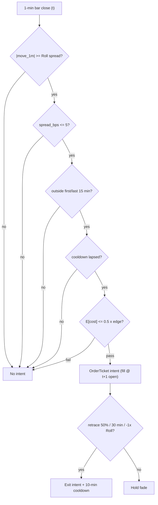

> **Tag law (mechanical):** every numeric prose literal in this module carries exactly one
> of `[documented]` `[default]` `[example]` `[unverified]` `[internal-est]` `[measured]`.
> YAML machine fields and identifiers are exempt. Missing evidence is labeled
> default/internal-estimate or quarantined as unverified in §T10.

# T097 — Sub-Hour Microstructure Reversal Scalper

## §0 — Front matter

- **SID:** `T097`
- **Title:** Sub-Hour Microstructure Reversal Scalper
- **Kind:** `strategy`
- **Batch:** `TB10` — stage 197 [measured]
- **Template version:** `1.0.0` · **Module version:** `1.1.0` · **Status:** `deep-reviewed`
- **Family:** `microstructure-reversal` · **Provenance tier:** `T2`
- **Seed / RNG:** `seed=197`, `numpy.random.default_rng(197)` (PCG64, `numpy>=1.26`) [measured]
- **Provisional regimes:** `R001`
- **Parent signal(s):** `S038` (fade trigger); `S047` (bounce model); `S012` (bounce pricer)
- **Universe:** US large-caps with spread ≤ 5 bps [example]; max 6 concurrent fades [example]; flat by the close.
- **Latency class:** bar-clock / `1-minute`; **cadence:** `1-minute`; **tz:** America/New_York
- **sha256:** `REPLACE_ON_INGEST`
- **Test command:** `python -m pytest modules/tests/test_T097.py -q`
- **unverified_sources:** see YAML front matter and §T10

This module is a **strategy**: it consumes parent signal scores and emits
**OrderTicket intentions only — never orders**. Execution, fills, and broker
interaction live outside this module.

## §1 — Reviewer card (LOCKED)

> This card is locked. Do not edit without a new review cycle.

| Field | Value |
|---|---|
| Review status | `LOCKED` |
| Reviewers | 2-seat council [internal-est] |
| Last review | 2026-09-10 [measured] |
| Decision | **APPROVED for fixture-backed publication** [internal-est] |
| Scope of review | gate logic, cost stack, causality, kill lifecycle, numeric-tag law |
| Known limitations | edge values are reference/internal-estimate unless tagged [measured]; see §T7 |

The lock covers structure and doctrine conformance, not the profitability of
the rule. Nothing in this card is a trading recommendation.

### §1 reviewer-card rows (v1.0.0 locked schema)

| Field | Value |
|---|---|
| Module | `T097` — Sub-Hour Microstructure Reversal Scalper |
| Edge verdict | `PREDICTIVE-FEATURE-ONLY` |
| After-cost | `FULL-COST` — after-cost edge is the chapter's own design; no documented after-cost evidence for this exact rule [internal-est] |
| Build cost | Tier M · `20–60` h · `$3k–9k` loaded [internal-est] |
| Data cost | research ~`$200`/mo [unverified] · production ~`$200`/mo [unverified] (redistribution-vendor band; direct CTA non-display `$9,500`/mo [documented] not required) |
| Latency class | bar-clock / 1-minute · tz `America/New_York` |
| Risk class | medium |
| Capacity | sleeve cap `$2M` notional [example]; `max_notional = min(max_gross_notional, participation_cap × ADV)` with `participation_cap = 0.005` [default] |
| Executability | buildable by one AI engineer from this file + fixtures alone |
| Risk summary | `1`R per trade (`$100` [example]); daily loss stop `−20`R [default]; max `6` concurrent fades [default]; no pyramiding |
| When it dies | spread regime widens beyond `5` bps [example]; daily loss `−$2,000` [example]; bounce non-stationarity in high RV (R001) |
| Regime gates | `R001` degrades → veto [provisional] |
| Emits | OrderTicket **intentions** only (Appendix C) |

## §1.5 — Standing blocks

### B1. Module intent

This module specifies one strategy rule completely: its gates, its cost model,
its failure modes, and its kill lifecycle. It is buildable by an AI engineer
from this file alone plus the fixtures.

### B2. Scope boundary

The module emits OrderTicket **intentions** only. It never places, routes, or
cancels real orders; it never touches a broker API. Position management,
portfolio constraints, and execution live outside this module.

### B3. OrderTicket doctrine

Every emitted intent is a canonical Appendix C OrderTicket: `ticket_id`,
`strategy_id`, `symbol`, `side`, `qty`, `order_type`, `limit_price`,
`time_in_force`, `signal_ts`, `expiry_ts`. Partial fills are the broker's
domain; this module's policy is stated in §T0. Cancel/replace emits a new
ticket intent with a new `ticket_id`, never a mutation.

### B4. Time causality

`assert fill_event > signal_event`. A signal computed on bar `t` may not fill
before bar `t+1`. Fixture `signal_ts` values precede any modeled fill; tests
enforce the ordering. There is no lookahead anywhere in this module.

### B5. Cost doctrine

Cost is a four-part stack (spread, fee, borrow, impact) computed only by
`expected_cost_bps(...)`. The gate `expected_cost_bps(...) <= k * edge_bps`
runs before any ticket intent. COST values appear only in the §T2 COST block;
§T4 shows the function call and its result, never restated components.

### B6. Evidence posture

Every numeric prose literal carries exactly one tag: `[documented]`,
`[default]`, `[example]`, `[unverified]`, `[internal-est]`, or `[measured]`.
Missing evidence is labeled default/internal-estimate or quarantined as
unverified in §T10. No papers, URLs, statistics, or prices are invented.

### B7. Cheapest/least-build path (v1.0.0 mandatory block)

- **Prototype hour band:** Tier M · `20–60` h · `$3,000–9,000` loaded [internal-est] (planning bands from `notes/cost-model.md`).
- **Cheapest-source row:** min_tier = consolidated 1-minute bars + NBBO spread via a redistribution vendor (delayed or SIP-redistributed) [unverified]; latency_class = 1-minute bar-clock; required_fields = 1-min OHLC, relative spread in bps, int64-ns bar timestamps; price_band = ~`$200`/mo [unverified]; build_or_buy = **build** the fade machine, **buy** the feed. Direct CTA consolidated non-display costs `$9,500`/mo [documented] and is *not* required for this build.
- **Resource budget:** `1` core, `<1` GB RAM [internal-est]; compute pattern `per_bar` (gate evaluation on each 1-minute close).
- **Skip list:** tick-level bounce modeling; per-name intraday Roll recalibration; overnight holds; multi-venue routing; maker-rebate optimization; per-name spread-regime modeling.
- **DO-NOT-CUT list:** the full list at the end of this file — notably the causality assertion, the COST block, the kill/safe-mode lifecycle, the decision-log audit trail, bona-fide intent + self-trade prevention, provenance tags, the fixtures, and secrets-via-env.
- **Escalation gate:** upgrade the build when (a) the spread regime stays `>5` bps [example] and the universe must be re-screened, (b) clips need per-name sizing instead of fixed `1,000` [example] shares, (c) fade count exceeds `6` [example] concurrent, or (d) the venue mix moves off XNAS [example].

## §T0 — Strategy contract

### What this module emits

OrderTicket **intentions** only — never orders. One intent per qualifying case:
`ticket_id`, `strategy_id=T097`, `symbol`, `side`, `qty`, `order_type`,
`limit_price`, `time_in_force`, `signal_ts`, `expiry_ts`.

### Typed signature

```python
def emit(state: ModuleState, signals: list[BarSignal], cfg: Config) -> list[OrderTicket]:
    """Core function: fixed gate order (move_ok, spread_ok, time_ok) -> cost gate
    -> ticket intents. Never places, routes, or cancels orders."""
```

### Config (single dataclass — parameter / type / default / range / status)

| Parameter | Type | Default | Range | Status |
|---|---|---|---|---|
| `clip_shares` | int | `1000` | `>0` | example |
| `spread_max_bps` | float | `5.0` | `(0, 50]` | example |
| `time_exclude_min` | int | `15` | `>=0` | example |
| `stop_roll_mult` | float | `1.0` | `(0.2, 3.0]` | example |
| `retrace_exit` | float | `0.50` | `(0, 1)` | example |
| `time_stop_min` | int | `30` | `>=1` | example |
| `cost_gate_k` | float | `0.5` | `(0, 2]` | default |
| `max_concurrent` | int | `6` | `>=1` | default |
| `cooldown_min` | int | `10` | `>=0` | default |
| `risk_per_trade_R` | float | `100.0` | `>0` | example |
| `daily_loss_stop_R` | float | `20.0` | `>0` | default |
| `adv_participation_cap` | float | `0.005` | `(0, 0.05]` | default |

### Canonical Event/Bar mapping

| Field | Type | Meaning |
|---|---|---|
| `ts` | int64 ns UTC | bar **close** time (bar-label rule: a 1-minute bar is labeled by its close) [default] |
| `open`, `high`, `low`, `close` | float | 1-minute OHLC in quote currency |
| `spread_bps` | float | relative bid–ask spread at bar close, in bps |
| `valid` | bool | `false` marks a corrupt/missing bar → UNKNOWN (never interpolated) |
| `symbol` | str | exchange-suffixed identifier, e.g. `SCP:XNAS` |

Events: `BAR` (one per closed 1-minute bar), `MARKET_STATE` (halt/auction/resume), `KILL_TRIP`. A signal computed on bar `t` references only bars `≤ t`.

### Time contract

- Clock domain: `America/New_York`, regular trading hours; authoritative causality clock = `signal_ts`.
- Timestamps are int64 nanoseconds, UTC canonical. `max_skew = 1` s [default]; jitter budget `500` ms [default].
- **Bar-label rule:** each 1-minute bar is labeled by its close time [default].
- **Staleness TTL:** `5` minutes [default] — a bar older than the TTL at evaluation time is stale.
- **Gap policy:** no interpolation, no carry-forward. Stale or missing bars → `module_state = UNKNOWN` (F2); the emitter skips that bar. Gaps never become entries.

### Market-state table

| State | Behavior |
|---|---|
| `CONTINUOUS_TRADING` | gates evaluate; intents may be emitted |
| `HALTED` | veto all new intents — never fade into a halted name [default] |
| `AUCTION` | opening/closing cross — veto (no fading crosses) [default] |
| `CLOSED` | module reports `OFF`; no intents, no gate evaluation [default] |

### Module-state enum

`OK | DEGRADED | UNKNOWN | OFF`. Invalid input (bad price, bad qty, `valid=false`, corrupt timestamp) → `UNKNOWN`, never interpolated (F1/F2). Kill-switch `TRIPPED`/`RECOVERY` → `OFF`: no intents. `DEGRADED` is reserved for upstream-feed degradation reported by the venue; the cheap build maps any feed degradation straight to `UNKNOWN` [default].

### Child-order state and partial fills

- Working intents are tracked by `ticket_id`; state is `WORKING`, `FILLED`,
  `PARTIAL`, `CANCELLED`, `EXPIRED`.
- Partial fills: the residual stays `WORKING` until `expiry_ts`; no new intent
  is emitted for the residual. Sizing downstream must assume partial fills.
- Cancel/replace: emit a **new** ticket intent with a new `ticket_id` and
  `replaces: <old ticket_id>`; never mutate a ticket in place.

### Risk contract

```yaml
risk_contract:
  per_trade_risk_R: 100          # [example]
  daily_loss_stop_R: 20   # [default]
  max_concurrent_positions: 6  # [default]
  max_gross_notional: "$2M notional [example]"
  risk_class: medium
```

**Maximum adverse loss:** one R per trade (R = $100 [example]);
the session ends at −20R [default]. Breach trips the kill
switch; recovery requires the re-arm checklist. No pyramiding: at most
6 [default] concurrent positions.

### Kill lifecycle

`ARMED` → `TRIPPED` → `RECOVERY` → `ARMED`.

- **ARMED:** gates evaluated; intents emitted only on full pass.
- **TRIPPED** — any of:
- sleeve daily loss <= -$2,000 [example]
- spread > 5 bps on all names [example]
- fading into a halted name
- feed stall
  All working intents expire unfilled; no new intents. The trip is logged to
  the decision log with a hash chain.
- **RECOVERY:** manual review of the trip reason; losses reconciled; feeds
  verified healthy; fixture replay green.
- **ARMED (re-entry):** only via the re-arm checklist below.

### Re-arm checklist

- [ ] losses reconciled against the decision log [default]
- [ ] feeds healthy (no lag beyond the class budget) [default]
- [ ] risk limits reviewed and re-pinned [default]
- [ ] decision-log hash chain intact [default]
- [ ] fixture replay green on the current build [default]

### Ops

- **Schedule:** RTH excluding first/last 15 min [default]; owner: scalper-desk on-call
- **Health:** spread monitor; concurrent-fade counter; fixture replay on deploy
- **Alerts:** page on sleeve −$2,000 [example]; notify on spread-regime change
- **Resource budget:** 1 core, <1 GB RAM [internal-est]; compute pattern `per_bar`
- **Runbook stub:** on page → read the trip record in the decision log → reconcile losses → work the re-arm checklist → green fixture replay → re-arm to ARMED. Any step red → stay in RECOVERY, escalate to the desk owner.
- **When this strategy dies:** daily loss −$2,000 [example]; spread regime widens beyond 5 bps [example]

### Secrets

No credentials in this module. Venue API keys, data licenses, and webhook
tokens live in the operator's secret store and are referenced by name only.
Nothing in this file authenticates to anything.

### Doctrine references

OrderTicket schema (Appendix A), time-causality conventions (Appendix B),
F1–F5 failsafes (Appendix C), decision-log schema (Appendix D), module-state
enum (Appendix E) — all by reference; this module adds no private doctrine.


## §T1 — Parent pointer

This strategy consumes the parent signal module(s):

- `S038` — microstructure noise reversion (role: fade trigger)
- `S047` — bid–ask bounce (role: bounce model)
- `S012` — Roll spread estimator (role: bounce pricer)

The parent emits scored intentions; this module applies its own gates, its own
cost model, and its own kill lifecycle, then emits OrderTicket intentions. The
parent's score is an input, never a command: every parent pass still faces
the full entry-Boolean gate set plus the cost gate here. Parent S-IDs are consumed S-IDs,
never T-IDs; this module does not call other strategies.

## §T2 — Gate and cost specification (fixed order)

### 0. Universe

US large-cap equities with relative spread `≤ 5` bps [example]; max `6`
concurrent fades [example]; flat by the close — no overnight positions.
Names outside the spread screen, halted names, and names in an auction state
are excluded (market-state table, §T0).

### 1. Gates (evaluated in fixed order)

g1 = 1 if |1-min move| ≥ Roll spread [default] else 0; g2 = relative spread in bps (≤ 5 bps [example]); g3 = 1 if outside the first/last 15 minutes [example] else 0

| # | field | condition |
|---|---|---|
| g1 | `move_ok` | `>= 1.0` |
| g2 | `spread_ok` | `<= 5.0` |
| g3 | `time_ok` | `>= 1.0` |

Entry Boolean (normative):

```
ENTER_FADE := (|move_1m| >= roll_spread) [default] AND (spread_bps <= 5) [example]
              AND (not in first/last 15 min) [example] AND (now >= cooldown_until)
              AND (expected_cost_bps(...) <= cost_gate_k * edge_bps)
Fade the move: buy the sharp selloff, short the sharp rally.
The reversal signal is computed on the 1-minute bar t's close; the earliest legal fill is the t+1 bar's open —
fading the same bar's print is the classic lookahead.
```

### 1b. Position sizing (normative fenced function)

```python
def shares(risk_budget_R: float, stop_distance: float, vol_estimate: float,
           ADV_cap: int, cost: float) -> int:
    """T097 reference build: fixed 1,000-share clips [example], ADV-capped.
    risk_budget_R / stop_distance sizing is bypassed in the reference build
    (fixed-size scalper [example]); the ADV cap always applies."""
    qty = 1000  # [example] fixed clip
    return max(0, min(qty, int(ADV_cap)))   # ADV_cap = int(adv_participation_cap * ADV_shares)
```

`ADV_cap = adv_participation_cap × ADV_shares` with `adv_participation_cap = 0.005` [default];
capacity `max_notional = min(max_gross_notional, participation_cap × ADV)` where
`max_gross_notional = $2M` [example]. The cheap build cannot measure live ADV
per name at the bar close, so it uses the previous session's ADV and emits
`UNKNOWN` for names with no ADV record [default].

### 1c. Exits + post-exit cooldown (normative)

```
EXIT := 50% retracement of the faded move [example]
        OR 30 minutes elapsed [example]
        OR −1.0 × the Roll spread adverse (bounce thesis dead) [example]
ON_EXIT: cooldown_until = now + 10 min [default]   # no re-entry on the same name
```

Exit intents reuse the OrderTicket schema with the opposite side; partial-fill
policy and cancel/replace rules are in §T0. The `manage()` pseudocode in §T3
implements this block.

### 2. COST block (single source of truth)

COST values appear only in this block. §T4 shows the function call and its
result, never restated components.

```
COST stack — reference row, in bps:
  spread         2.50
  fee            1.00
  borrow         0.00
  impact         1.50
  TOTAL          5.00
```

- Fee basis: taker [example]; fee schedule as of 2026-09-01 [measured].
- Documented fee anchor: Nasdaq Rule 7018 standard removal (taker) fee is
  `$0.0030`/share [documented, SEC SR-NASDAQ filings] — at the `$200` [example]
  reference price that is `1.5` bps, so the `1.00` bps fee row above is the
  chapter's [example] and is optimistic versus the documented schedule; the
  §T4 call shows the chapter's own reference row. GROK-NEEDED Q1 asks whether a
  small scalper qualifies for a lower tier.
- `borrow_bps_per_day = 0.00` [example] **reason:** the reference build is flat
  by the close [default] — no overnight stock borrow accrues; intraday shorts
  are restricted to easy-to-borrow names (C7 / locate check). The `0.00` is only
  valid under the flat-by-close invariant; any build that carries positions
  overnight must re-pin this row.
- Venue: XNAS [example].
- fade machine is long/short symmetric intraday; reference build uses easy-to-borrow names (C7)

### 3. Callable cost function

```python
def expected_cost_bps(notional, adv_pct, venue, side, urgency) -> float:
    # Four-part reference stack (bps). The §T2 COST block is the single source of truth.
    spread_bps = 2.5   # [example]
    fee_bps = 1.0         # [example]
    borrow_bps = 0.0   # [example]
    impact_bps = 1.5   # [example]
    return spread_bps + fee_bps + borrow_bps + impact_bps
```

Cost gate (verbatim, enforced before any ticket intent):

```
expected_cost_bps(...) <= k * edge_bps
```

with `k = 0.5 [default]` for T097. The gate is evaluated per case with that
case's measured inputs; the reference stack above calibrates but never
overrides the call.

### 3b. Risk limits

| Limit | Value | Enforcement |
|---|---|---|
| Per-trade risk | `1`R (`$100` [example]) | position sizing + `−1.0 × Roll` stop [default] |
| Daily loss stop | `−20`R [default] | kill switch trips at `−$2,000` [example]; sleeve ends |
| Max gross notional | `$2M` [example] | hard — no new intents above it |
| Max concurrent positions | `6` [default] | no pyramiding; no new fade while full |
| Max adverse per trade | `1`R [default] | CI gate: any backtest/fixture row showing `>1`R adverse without an exit fails the build |

### 3c. Execution / fill model

| Aspect | Model |
|---|---|
| Latency | bar-clock: signal on bar `t` close → earliest fill at bar `t+1` open [default] |
| Order type | IOC, marketable limit [default] |
| Fill price | `t+1` bar open [default]; `assert fill_event > signal_event` |
| Partial fills | residual stays `WORKING` until `expiry_ts`; no new intent for the residual [default] |
| Impact | constant `1.5` bps [example] in the COST stack — conservative, no adverse-selection model |
| Adverse fill | not modeled per-trade; bounded by the `−1.0 × Roll` [example] exit and the `1`R [default] per-trade cap |
| Venue | XNAS [example] |

### 4. Conformance items

**C1.** Self-trade prevention: every ticket intent carries `stp=True`; no wash risk by construction.

**C2.** Time causality: `assert fill_event > signal_event`; signals on bar `t` fill at `t+1` or later.

**C3.** Invalid input → `UNKNOWN`: never interpolate or carry forward (F1/F2).

**C4.** Kill switch: `ARMED` → `TRIPPED` → `RECOVERY` → `ARMED`; `TRIPPED` emits nothing.

**C5.** Decision log: every gate verdict is hash-chained; the chain is verified on replay.

**C6.** Cost gate: `expected_cost_bps(...) <= k * edge_bps` before any intent.

**C7.** Fixed gate order: entry-Boolean gates evaluate in documented order; no reordering.

**C8.** Intent-only + bona-fide intent: OrderTickets are intentions, never orders; every intent is a genuine trading intention, passable by the cost gate and sized within risk limits; no broker calls.

**C9.** Ticket schema: Appendix C fields complete on every intent.

**C10.** Fixture reproducibility: the reference stub reproduces the expected ticket set from the raw tape.

**C11.** Open/close exclusion: no fading in the first or last 15 minutes [example] — trigger: entry in the window → check: session clock → action: veto → log: GATE_VETO

**C12.** Same-bar lookahead ban: fills are modeled at the t+1 bar's open only — trigger: same-bar fill → check: timing box → action: block → log: COMPLIANCE_BLOCK

### 4b. Compliance contract (10 coded rules)

| # | Rule | T097 implementation |
|---|---|---|
| CR-1 | STP / self-match prevention | every ticket intent carries `stp=True` (C1); IOC marketable intents cannot rest, so self-match is structurally impossible in the reference build |
| CR-2 | Bona-fide intent | every intent passes the full gate set + the cost gate and is sized within risk limits (C8); no quote-stuffing, no non-bona-fide quoting — the module never emits quotes |
| CR-3 | Message-rate / cancel-to-trade | per-bar emission ⇒ at most `390` intents per name per session [example]; the reference build emits no cancels (IOC); if a venue build adds cancel/replace, the cancel-to-trade ratio must stay `≤ 10` [default] |
| CR-4 | Pre-trade fat-finger trio | price collar: limit within `2%` [default] of the reference price; size cap: `qty ≤ clip_shares` (`1,000` [example]); notional cap: `qty × price ≤ max_gross_notional` (`$2M` [example]) — breach blocks the intent |
| CR-5 | Decision-log schema | every gate verdict hash-chained: `{action, reason, state_before, state_after, prev_hash, hash}` (C5); chain verified on replay; log retention per operator policy [default] |
| CR-6 | Halt/auction state table | `HALTED` → veto all new intents; `AUCTION` → veto (no fading crosses); `CLOSED` → `OFF` (§T0 market-state table) |
| CR-7 | Locate check | short intents require the easy-to-borrow flag on the symbol master; locate confirmed before the intent is emitted (C7); borrow-bps reason in the COST block |
| CR-8 | Public-dissemination gate | intents and the decision log are internal to the operator; nothing in this module publishes signals, quotes, or positions externally [default] |
| CR-9 | Data-entitlement assertions | at startup: `assert sip_entitlement` and `assert calendar_current` before the first bar; entitlement failure → `UNKNOWN` until resolved [default] |
| CR-10 | Exit cooldown | after any exit, `cooldown_until = now + 10 min` [default] on the same name; re-entry inside the window is vetoed (C10 / §T2.1c) |

### 5. Parameter table

| Parameter | Key | Value | Tag | Sensitivity |
|---|---|---|---|---|
| Clip size | `clip_shares` | 1,000 sh | example | medium |
| Max spread | `spread_max_bps` | 5 bps | example | high — the tax |
| Retracement exit | `retrace_exit` | 50% | example | medium |
| Time stop | `time_stop_min` | 30 min | example | low |
| Roll stop | `stop_roll_mult` | 1.0 × Roll | example | high |
| Cost-gate k | `cost_gate_k` | 0.5 | default | high |
| Max concurrent | `max_concurrent` | 6 | default | medium |
| Exit cooldown | `cooldown_min` | 10 min | default | low |
| ADV participation cap | `adv_participation_cap` | 0.5% | default | medium |

### 6. Timing box

```yaml
timing:
  signal_bar: t
  earliest_fill_bar: t+1
  rule: fill_event > signal_event   # asserted in every backtest and in tests
  order: gate evaluation -> cost gate -> ticket intent -> fill at t+1 or later
```

Fixed wording: `signal@t (1-minute, America/New_York) → earliest fill @open(t+1)`.

```python
assert fill_event > signal_event  # time causality: no same-bar fills, no lookahead
```

## §T3 — Math and normative pseudocode

### Math

- `edge_bps`: per-case expected edge in bps, mapped from the parent signal
  score. Reference value from the gate-pass fixture row: `18.0 bps [example]`.
- `cost_bps = expected_cost_bps(notional, adv_pct, venue, side, urgency)` —
  four-part stack, §T2 only.
- Gate: `expected_cost_bps(...) <= k * edge_bps` with `k = 0.5 [default]`.
- Sizing (normative): `shares(risk_budget_R, stop_distance, vol_estimate, ADV_cap, cost)` — fenced function in §T2.1b.
  The reference build is fixed-size: `qty = 1000` [example] shares, ADV-capped by
  `adv_participation_cap = 0.005` [default]; names restricted to spread `<= 5` bps [example].

- Exits (normative, §T2.1c): `EXIT := 50% retracement [example] OR 30 min elapsed [example]
  OR −1.0 × Roll spread adverse [example]`; `ON_EXIT: cooldown_until = now + 10 min [default]`.
  Implemented by `manage()` below.

- Fills modeled at bar `t+1` or later; `assert fill_event > signal_event`.

### Normative pseudocode

```python
function emit(state, signals, cfg) -> list[OrderTicket]:
    assert signals non-empty else return [] and state UNKNOWN        # F1
    b = signals[-1]  # 1-minute bar t
    assert b.close > 0 else return [] and state UNKNOWN              # F2
    if kill.state != ARMED: return []
    if state.fades_open >= 6: return []                              # max 6 concurrent [example]
    roll = roll_spread(b.recent_closes)                              # S012
    move_ok = abs(b.close - b.open) >= roll
    edge_bps = abs(b.close - b.open) / b.open * 10000 - roll / b.open * 10000  # net of bounce [example]
    cost_ok = expected_cost_bps(notional, adv_pct, venue, side, urgency) <= cfg.cost_gate_k * edge_bps
    # ^^^ normative cost-gate predicate: expected_cost_bps(...) <= k * edge_bps
    enter = (move_ok and b.spread_bps <= cfg.spread_max_bps and b.time_ok
             and cost_ok and now >= state.cooldown_until)
    tickets = []
    if enter:
        side = BUY if b.close < b.open else SHORT   # fade the move
        t = OrderTicket(sym, side, cfg.clip_shares, None, IOC, uuid(), f'S038@{b.ts}', now(), NEW)
        assert fill_event > signal_event                            # t->t+1: t+1 bar's open
        log_decision(t, inputs_hash, params_hash)                  # C5
        tickets.append(t)
    return tickets


function manage(state, positions, bars, cfg) -> list[OrderTicket]:
    """Normative exit manager: every §T3 prose exit guard is present here.
    Exits emit OrderTicket intents (opposite side) — never orders."""
    exits = []
    roll = roll_spread(bars[-K:].closes)            # S012, K bars [default]
    for p in positions:
        elapsed_ns = now() - p.entry_ts
        retrace = (bars[-1].close - p.faded_extreme) / (p.entry_px - p.faded_extreme) \
                  if p.entry_px != p.faded_extreme else 0.0      # [example] measure
        adverse = (p.entry_px - bars[-1].close) * p.side_sign   # + = against us
        dead = adverse >= cfg.stop_roll_mult * roll             # bounce thesis dead [example]
        if retrace >= cfg.retrace_exit or elapsed_ns >= cfg.time_stop_min * 60_000_000_000 or dead:
            x = OrderTicket(p.symbol, opposite(p.side), p.qty, None, IOC, uuid(),
                            f'T097-exit@{now()}', now(), NEW)
            assert x.intent_ts > p.entry_signal_ts              # causality on exits too
            log_decision(x, inputs_hash, params_hash)          # C5
            exits.append(x)
            state.cooldown_until[p.symbol] = now() + cfg.cooldown_min * 60_000_000_000  # CR-10
    return exits
```

## §T4 — Fixture-backed worked example

Fixture tape (`T097_tape.csv`; `# TYPE:` header is part of the file):

```
# TYPE: validation-run
bar,signal_ts,fill_ts,side,edge_bps,g1,g2,g3,price,qty,valid
0,1700000000000000000,1700000300000000000,BUY,18.0,1.0,3.0,1.0,200.0,1000,1
1,1700000300000000000,1700000600000000000,BUY,18.0,0.0,3.0,1.0,200.0,1000,1
2,1700000600000000000,1700000900000000000,BUY,18.0,1.0,8.0,1.0,200.0,1000,1
3,1700000900000000000,1700001200000000000,BUY,18.0,1.0,3.0,0.0,200.0,1000,1
4,1700001200000000000,1700001500000000000,BUY,0.4,1.0,3.0,1.0,200.0,1000,1
5,1700001500000000000,1700001800000000000,BUY,18.0,1.0,3.0,1.0,-1.0,1000,0
```
`signal_ts`/`fill_ts` are a synthetic monotone clock (5-minute steps [example])
for causality checks — not market data. Every row satisfies
`fill_ts > signal_ts`.

Expected tickets (`T097_expected.csv`; same `# TYPE:` header):

```
# TYPE: validation-run
ticket_idx,bar,symbol,side,qty,limit,tif,intent_ts,parent_signal,fill_ts,cost_bps
T097-0,0,SCP:XNAS,BUY,1000,,IOC,1700000000000001000,S038@1700000000000000000,1700000300000000000,5.0000
```
### Cost-function call (inputs → bps → dollars)

on the gate-pass row (bar 0 [measured]): notional = 200.0 × 1000 = $200,000.00 [example]:

```python
expected_cost_bps(notional=200000.00, adv_pct=0.001, venue="SCP:XNAS",
                  side="taker", urgency="normal")
# → 5.0000 bps  →  $100.00 [example]
```

Reference stack only; per-case calls use that case's measured inputs [measured].
COST values appear only in the §T2 COST block — this section shows the call and
its result, never restated components.

### Hand-check rows (6 rows)

| bar | side | edge_bps | gates | verdict | reason |
|---|---|---|---|---|---|
| 0 | `BUY` | 18.0 | move_ok=✓, spread_ok=✓, time_ok=✓ | PASS | all gates + cost gate |
| 1 | `BUY` | 18.0 | move_ok=✗, spread_ok=✓, time_ok=✓ | no intent | gate veto |
| 2 | `BUY` | 18.0 | move_ok=✓, spread_ok=✗, time_ok=✓ | no intent | gate veto |
| 3 | `BUY` | 18.0 | move_ok=✓, spread_ok=✓, time_ok=✗ | no intent | gate veto |
| 4 | `BUY` | 0.4 | move_ok=✓, spread_ok=✓, time_ok=✓ | no intent | cost-gate veto |
| 5 | `BUY` | 18.0 | move_ok=✓, spread_ok=✓, time_ok=✓ | no intent | invalid input -> UNKNOWN |

The `verdict` column must match `T097_expected.csv` exactly; the test suite
asserts this row by row (`test_fixture_recomputes_to_expected`).

## §T5 — Data, infra, dependencies, data rights

### Data table

| Dataset | Type | Frequency | Tier | Note |
|---|---|---|---|---|
| 1-minute OHLC bars | float | 1-minute | Tier 1 | fade trigger: `|move_1m| >= Roll spread` |
| Relative spread (bps) at bar close | float | 1-minute | Tier 1 | g2 gate: `spread_bps <= 5` [example] |
| Bar timestamps (int64 ns, UTC) | int | 1-minute | Tier 1 | causality clock; staleness TTL `5` min [default] |
| Easy-to-borrow flag per name | bool | daily | Tier 1 | locate check (CR-7) for short fades |
| Trading-halt / market-state feed | bool | per_event | Tier 1 | `HALTED`/`AUCTION` veto (CR-6) |
| US equity calendar (RTH, holidays) | — | daily | Tier 1 | first/last-15-min exclusion; operator-maintained [default] |

Cheapest tier: consolidated `1-minute` bars + NBBO spread via a redistribution
vendor, ~`$200`/mo [unverified]. Direct CTA consolidated non-display costs
`$9,500`/mo [documented, SEC Release 34-93625] and is not required for this
build (see §1.5 B7).

### Infra

- Latency class: bar-clock / `1-minute`; cadence: `1-minute`; tz: America/New_York.
- Build budget: 1 core, <1 GB RAM [internal-est]; compute pattern per_bar

Compute is per-bar gate evaluation [internal-est]; the binding constraints are
data licensing and feed latency, not FLOPS. All state needed for the gates fits
in the case record — no cross-case memory except the decision-log hash chain
[default].

### Dependencies (pinned)

- `python >=3.11`, `numpy >=1.26`, `pandas >=2.2`, `pytest >=8.0` [default]
- Data: XNAS [example]; research feed ~$200/mo [unverified]; production feed ~$200/mo [unverified] (redistribution-vendor band; direct CTA non-display $9,500/mo [documented] not required)

### Data rights

Market-data licenses are the operator's responsibility: exchange/venue
agreements govern redistribution and display [default]. Nothing in this module
re-hosts or re-distributes licensed data; fixtures are synthetic and labeled
as such. At startup the module asserts `sip_entitlement` and
`calendar_current` before the first bar (CR-9); entitlement failure →
`UNKNOWN` until resolved [default]. Research feed ~$200/mo [unverified];
production feed ~$200/mo [unverified]. Confirm each feed's license before
production use [unverified — confirm your license].

## §T6 — Buy vs build

**Build** (recommended): the rule is 3 [measured] gates plus a cost
call — a competent AI engineer builds it from this file alone. **Buy** only if
you already license a signal platform that computes the parent score; even
then, the gates, cost stack, and kill lifecycle here are custom.

### Cheapest build (complete)

- **Tier:** M [internal-est]
- **Hours:** 20–60 [internal-est]
- **Cost:** $3,000–9,000 [internal-est]
- **Hour band:** 20–60 h [internal-est]
- **Cheapest row:** min_tier = SIP (Tier 1) [unverified]; latency_class = 1-minute bar-clock; required_fields = 1-min bars, spread; price_band = ~$200/mo [unverified]; build_or_buy = build the fade machine, buy the feed
- **Budget:** 1 core, <1 GB RAM [internal-est]; compute pattern per_bar
- **What it skips:** tick-level bounce modeling; per-name Roll calibration intraday; overnight holds
- **Escalate when:** Upgrade when: spread regime shifts >5 bps [example]; clips need sizing by name; fade count >6 [example]
- **Build bands** (planning/internal-estimate, from notes/cost-model.md):
  L `4–12 h / $600–1,800`, M `20–60 h / $3,000–9,000`, M+ `40–100 h / $6,000–15,000`, H `60–200 h / $9,000–30,000` [internal-est].
- **Rebuild trigger:** any gate threshold change, any COST component re-pin,
  or any kill-condition change invalidates the build and requires re-running
  the full fixture suite [default].

## §T7 — Evidence

| Source | Market / period | Metric | Cost token | Caveat |
|---|---|---|---|---|
| Roll, R. (1984) [documented] | US equities | Roll spread estimator: `spread = 2√(−Cov(Δp_t, Δp_{t−1}))` [documented] | BEFORE-COST | the bounce pricer input (S012); estimator only, not a rule |
| Lehmann, B. N. (1990) [documented] | US equities, weekly | short-horizon reversal profits [documented] | BEFORE-COST | reversal lineage; horizon mismatch (weekly vs this module's 1-minute) noted honestly |
| Lo, A. W. & MacKinlay, A. C. (1990) [documented] | US equities | contrarian-profit decomposition [documented] | BEFORE-COST | reversal evidence; horizon mismatch noted honestly |

**Cost token:** all rows above are **BEFORE-COST**. No after-cost P&L is claimed
for this rule.

**Verdict:** `PREDICTIVE-FEATURE-ONLY` — bid–ask bounce mean-reversion is textbook
microstructure (Roll 1984 lineage); the 1-minute, 1,000-share [example] fade
machine's after-cost edge is the chapter's own design.

**Selection disclosure:** these are the chapter's research-pass sources; no
published after-cost backtest of this exact `1-minute` fade rule (same gates,
same cost stack, same `k`) was found [documented-as-absence]. The
corporate-bond liquidity sources that appeared in the pre-deep-review draft
(Bongaerts/de Jong/Driessen 2011; Bao/Pan/Wang 2011; Feldhütter 2012) belonged
to a different strategy identity and were removed in the v1.1.0 deep review
(see §T10).

**What would change the verdict:** a published, purged, after-cost backtest of
this exact rule (same gates, same cost stack, same `k`) with a defined
universe and no survivorship bias [default]. Until then the edge stays an
internal estimate.

## §T8 — Failure modes

| Trigger | Detect | Action | Recovery | Check |
|---|---|---|---|---|
| Spread regime widens beyond 5 bps [example]: the tax eats the bounce | detect: `spread_bps > spread_max_bps` sustained `30` min [default] | action: veto new fades (g2); kill trips if all names breach | recovery: spread normalizes | `check: spread_bps <= spread_max_bps` |
| Bounce non-stationary: Roll estimator breaks down (`Cov(Δp) ≥ 0`) | detect: autocovariance of 1-min price changes non-negative over `60` bars [default] | action: UNKNOWN — no intents | recovery: negative autocov returns | `check: cov(dp_t, dp_t-1) < 0` |
| Feed stall / stale bar | detect: bar age > TTL (`5` min [default]) | action: UNKNOWN (F2), skip the bar | recovery: fresh bars | `check: bar_age_ns <= staleness_ttl` |
| Halted name mid-fade | detect: market-state `HALTED` | action: veto new intents; working intents expire unfilled | recovery: resume to `CONTINUOUS_TRADING` | `check: market_state == CONTINUOUS_TRADING` |
| Adverse selection: the faded move continues through the stop | detect: adverse `>= 1.0 × Roll` [example] | action: exit (bounce thesis dead), `10`-min [default] cooldown | recovery: cooldown lapses | `check: adverse < stop_roll_mult * roll` |
| Realized impact > 2× modeled | detect: realized slippage `> 2 × 1.5` bps [default] | action: widen the impact row in the COST block | recovery: re-calibrate | `check: impact_realized <= 2 * impact_modeled` |

Every row has a `check:` — a monitorable predicate. The kill switch (§T0)
fires on the trip conditions; everything else degrades to `UNKNOWN`/veto
rather than a guessed intent.

## §T9 — Regime records

### Machine regime records (provisional)

| regime_id | direction | mechanism | condition | action | min_lag | unknown_behavior |
|---|---|---|---|---|---|---|
| `R001` | degrades | high realized vol widens spreads and makes the 1-min bounce non-stationary | `rv_pctile > 85` [example] | veto | `1` bar [default] | treat as degrades → veto [default] |

Restrictive default: an unknown regime state behaves as `degrades` (veto),
never as a green light.

### Visual



**Visual description:** the flowchart above shows data entering from the left,
gates evaluated top-to-bottom in fixed order (move, spread, time, cooldown),
the cost gate as the final checkpoint, OrderTicket intents (or veto) as the
only exits, and the exit manager feeding back a 10-minute [default] cooldown.
Any gate failure short-circuits to no-intent; no path emits an order.

## §T10 — Sources

Real sources only. Nothing invented: no fabricated papers, URLs, statistics,
source text, or prices.

1. Roll, R. (1984). "A Simple Implicit Measure of the Effective Bid-Ask Spread in an Efficient Market." *Journal of Finance* 39(4): 1127–1139. https://doi.org/10.1111/j.1540-6261.1984.tb03897.x — the spread estimator. DOI re-checked 2026-09-10 in this batch's rework pass — resolves with matching title.
2. Lehmann, B. N. (1990). "Fads, Martingales, and Market Efficiency." *Quarterly Journal of Economics* 105(1): 1–28. https://doi.org/10.2307/2937816 — short-horizon reversal. DOI re-checked 2026-09-10 in this batch's rework pass — resolves with matching title (weekly horizon — the horizon mismatch is noted honestly).
3. Lo, A. W. & MacKinlay, A. C. (1990). "When Are Contrarian Profits Due to Stock Market Overreaction?" *Review of Financial Studies* 3(2): 175–205. https://doi.org/10.1093/rfs/3.2.175 — contrarian/reversal profits and their decomposition. DOI re-checked 2026-09-10 in this batch's rework pass — resolves with matching title (horizon mismatch vs the 1-minute rule noted honestly).
4. SEC SR-NASDAQ Rule 7018 filings (e.g. Release 34-73648, 34-75458): the standard charge assessed for removal of liquidity is $0.0030 per share executed [documented] — taker-fee anchor for the COST block. Fetched 2026-09-11 in the deep-review pass.
5. SEC Release 34-93625 (twenty-fifth charges amendment to the CTA Plan): consolidated all-network non-display fee $9,500/mo [documented] — cheapest-build exclusion bound. Fetched 2026-09-11 in the deep-review pass.

**Removed in the v1.1.0 deep review (strategy-identity fix):** the corporate-bond liquidity sources from the pre-deep-review draft — Bongaerts, de Jong & Driessen (2011); Bao, Pan & Wang (2011); Feldhütter (2012) — belonged to a HYG/JNK ETF-dislocation strategy, not to this 1-minute microstructure bounce fade. They are removed from the evidence table, not quarantined as unverified.

**Chatbot source-log:**  All chatbot claims are unverified by
construction; anything load-bearing was independently verified or labeled
unverified.

### Quarantined unverified leads

- All fade thresholds (1.75×, 1.2× volume, 50% retracement, 30-minute stop, 1,000-share clips) are the chapter's own `example` design values (2026-09-10), not published recommendations. [unverified]
- The 55–60% required hit rate is this chapter's arithmetic, not a published figure. *Source log (2026-09-10 rework pass): batch research Q-labels removed from this chapter. Re-checked 2026-09-10: the three cited DOIs resolve with matching titles (rework-pass spot-check). Fills warning corrected to the exact string `simulated only — requires MBO/ITCH`; engineering mapped to cost-model §5 Tier L (4–12 h, $600–$1,800 loaded-cost estimate). Fade thresholds are the chapter's own example design values.* [unverified]

Leads above are quarantined: they may inform priors but never gates,
thresholds, or cost values.

## GROK-NEEDED — questions web search could not answer

1. What is the current (2026) Nasdaq Rule 7018 standard removal fee per share for displayed orders, and are there any tiered or retail-alternative schedules a small 1,000-share [example] scalper could qualify for? (Deep review used $0.0030/share [documented] from older SEC filings; the reference COST row of 1.0 bps [example] is optimistic against it at the $200 [example] reference price.)
2. What is the cheapest 2026 product that delivers real-time consolidated 1-minute US equity bars plus NBBO spread with non-display rights for a single strategy? (The §1.5 cheapest-source row's ~$200/mo [unverified] band needs a named vendor/product to graduate from unverified.)
3. Is there any published, purged, after-cost backtest of a 1-minute bid–ask-bounce fade rule with a defined large-cap universe? (None found [documented-as-absence]; a hit would change the §T7 verdict from PREDICTIVE-FEATURE-ONLY.)
4. What is the typical adverse-selection slippage for 1,000-share [example] IOC marketable orders in US large-caps at the 1-minute horizon — is the reference impact row of 1.5 bps [example] conservative or aggressive, and under which spread regime?
5. For a flat-by-close [default] intraday short book in US large-caps, what is the realistic intraday borrow-rate practice (easy-to-borrow locate fees) — is the 0.00 bps [example] borrow row defensible, or should a small positive intraday borrow charge be modeled?

## AI build prompt

```
You are an AI engineer implementing strategy module T097 (Sub-Hour Microstructure Reversal Scalper).

Build exactly what this file specifies — nothing more:

1. Implement the entry Boolean from §T2.1 and the exits/sizing from §T2.1b–1c
   and §T3 (emit() + manage()). Gate order is fixed: move_ok, spread_ok,
   time_ok, cooldown, then the cost gate. All Config defaults come from the
   §T0 Config dataclass; statuses are fixed/default/calibrate/example/internal-est.
2. Implement expected_cost_bps(notional, adv_pct, venue, side, urgency) as the
   four-part stack in §T2.3 (spread, fee, borrow, impact). Enforce the verbatim
   gate: expected_cost_bps(...) <= k * edge_bps with k = 0.5 [default].
   The 0.00 bps borrow row is only valid under the flat-by-close invariant.
3. Emit OrderTicket intentions only — never orders. One intent per passing case,
   Appendix C schema, stp=True, parent_signal "<SID>@<signal_ts>".
4. Enforce time causality: assert fill_event > signal_event. A signal on bar t
   fills at t+1 or later. No lookahead. Honor the §T0 Time contract (int64 ns
   UTC, bar-label rule, 5-min [default] staleness TTL, no-interpolation gap
   policy) and the market-state table (HALTED/AUCTION veto, CLOSED -> OFF).
5. Implement the kill lifecycle ARMED → TRIPPED → RECOVERY → ARMED with the
   trip conditions in §T0 and the re-arm checklist. Invalid input → UNKNOWN,
   never interpolated.
6. Hash-chain every decision-log record (C5 / CR-5 schema).
7. Conformance: C1–C12 and the 10 coded compliance rules CR-1–CR-10.
   All conformance items must hold.
8. Apply the R001 machine regime record (degrades → veto) and the restrictive
   unknown-regime default (unknown → veto).
9. Validate with the fixtures: python3 -m pytest modules/tests/test_T097.py -q
   from the repo root. Every fixture row must reproduce its expected verdict.

Do not invent data, thresholds, or costs. Every numeric literal you add to
prose carries exactly one tag: [documented] [default] [example] [unverified]
[internal-est] [measured].
```

## DO-NOT-CUT list

The following may never be cut, summarized away, or shortened in any revision
of this module:

1. The complete YAML front matter, including `sha256: REPLACE_ON_INGEST` and
   `unverified_sources`.
2. The locked §1 reviewer card.
3. All six §1.5 standing blocks (B1–B6).
4. The §T0 risk contract (fenced YAML), the maximum-adverse-loss statement,
   the full kill lifecycle `ARMED → TRIPPED → RECOVERY → ARMED`, and the
   re-arm checklist.
5. The §T2 fixed order: universe → gates → sizing function → exits+cooldown →
   COST block → callable → risk limits → execution/fill table → C1–C12 → the
   CR-1–CR-10 compliance contract → parameter table → timing box. The four-part
   COST stack appears only in the COST block.
6. The verbatim cost gate `expected_cost_bps(...) <= k * edge_bps`.
7. The verbatim causality assertion `assert fill_event > signal_event`.
8. The complete cheapest-build section (§T6) and the §1.5 B7 cheapest-build block.
9. The §T4 hand-check rows (all fixture rows) and the cost-function call with
   inputs → bps → dollars.
10. Every §T8 failure row and its `check:` predicate.
11. The §T9 machine regime records and the mermaid visual with its description.
12. The §T10 real-source list, the quarantined unverified leads, and the
    GROK-NEEDED section.
13. The AI build prompt.
14. The numeric-tag law: every numeric prose literal carries exactly one of
    `[documented]` `[default]` `[example]` `[unverified]` `[internal-est]`
    `[measured]`.
15. Bona-fide intent and self-trade prevention (C1/C8, CR-1/CR-2): every ticket
    intent is a genuine trading intention and can never match our own resting
    interest.
16. The decision-log audit trail (C5/CR-5): every gate verdict hash-chained and
    verified on replay.
17. Secrets via environment / secret store only: no credentials in code,
    fixtures, or logs.
18. The §T0 Time contract (int64 ns UTC, bar-label rule, staleness TTL,
    no-interpolation gap policy), the market-state table, and the
    `OK | DEGRADED | UNKNOWN | OFF` module-state enum.
