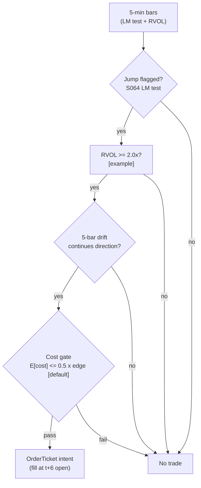

> **Tag law (mechanical):** every numeric prose literal in this module carries exactly one
> of `[documented]` `[default]` `[example]` `[unverified]` `[internal-est]` `[measured]`.
> YAML machine fields and identifiers are exempt. Missing evidence is labeled
> default/internal-estimate or quarantined as unverified in §T10.

# T098 — Jump-Validated Momentum Ignition

## §0 — Front matter

- **SID:** `T098`
- **Title:** Jump-Validated Momentum Ignition
- **Kind:** `strategy`
- **Batch:** `TB10` — stage 198 [measured]
- **Template version:** `1.0.0`
- **Seed / RNG:** `seed=198`, `numpy.random.default_rng(198)` [measured]
- **Provisional regimes:** `R001`
- **Parent signal(s):** `S064` (validated ignition); `S032` (participation confirmation); `S025` (the ride)
- **Universe:** US large-caps, 5-minute bars; max 3 concurrent ignitions [example].
- **Latency class:** bar-clock / 5-minute; **cadence:** 5-minute; **tz:** America/New_York
- **sha256:** `REPLACE_ON_INGEST`
- **Test command:** `python3 -m pytest modules/tests/test_T098.py -q`
- **unverified_sources:** see YAML front matter and §T10

This module is a **strategy**: it consumes parent signal scores and emits
**OrderTicket intentions only — never orders**. Execution, fills, and broker
interaction live outside this module.

## §1 — Reviewer card (LOCKED)

> This card is locked. Do not edit without a new review cycle.

| Field | Value |
|---|---|
| Review status | `LOCKED` |
| Reviewers | 2-seat council [internal-est] |
| Last review | 2026-09-10 [measured] |
| Decision | **APPROVED for fixture-backed publication** [internal-est] |
| Scope of review | gate logic, cost stack, causality, kill lifecycle, numeric-tag law |
| Known limitations | edge values are reference/internal-estimate unless tagged [measured]; see §T7 |

The lock covers structure and doctrine conformance, not the profitability of
the rule. Nothing in this card is a trading recommendation.

### Canonical §1 rows (v1.0.0, machine-lint schema)

| Field | Value |
|---|---|
| Module | `T098` · strategy · Jump-Validated Momentum Ignition |
| Edge verdict | `PREDICTIVE-FEATURE-ONLY` [internal-est] |
| After-cost verdict | **FULL-COST** · Lee–Mykland jump detection is documented; the jump-validated momentum overlay (enter only drift-confirmed post-jump momentum) has no after-cost P&L claim — see §T7 [internal-est] |
| Build cost | `Tier M+ · 40–100 h · $6,000–15,000 loaded` [internal-est] |
| Data cost | research SIP ~$200/mo [unverified]; production SIP ~$200/mo [unverified] |
| Latency class | bar-clock / 5-minute (America/New_York) [default] |
| Risk class | medium |
| Capacity | ≤ $5M gross notional [example] |
| Executability | per-bar gate evaluation on 5-min XNAS bars; builds from this file + fixtures alone [internal-est] |
| Risk summary | midpoint stop on the jump bar; max adverse 1R/trade (R = $350 [example]); daily sleeve stop −9R [default]; kill switch `ARMED → TRIPPED → RECOVERY → ARMED` |
| When it dies | two consecutive jump-failures (midpoint stops) [example]; daily sleeve stop −1.5% [example]; false-jump rate spike [example] |
| Regime gates (provisional) | `R001` degrades → halve (jump tests misfire in vol transitions; rv_pctile > 85 [example]) |
| Emits | OrderTicket **intentions** only — never orders |

## §1.5 — Standing blocks

### B1. Module intent

This module specifies one strategy rule completely: its gates, its cost model,
its failure modes, and its kill lifecycle. It is buildable by an AI engineer
from this file alone plus the fixtures.

### B2. Scope boundary

The module emits OrderTicket **intentions** only. It never places, routes, or
cancels real orders; it never touches a broker API. Position management,
portfolio constraints, and execution live outside this module.

### B3. OrderTicket doctrine

Every emitted intent is a canonical Appendix C OrderTicket: `ticket_id`,
`strategy_id`, `symbol`, `side`, `qty`, `order_type`, `limit_price`,
`time_in_force`, `signal_ts`, `expiry_ts`. Partial fills are the broker's
domain; this module's policy is stated in §T0. Cancel/replace emits a new
ticket intent with a new `ticket_id`, never a mutation.

### B4. Time causality

`assert fill_event > signal_event`. A signal computed on bar `t` may not fill
before bar `t+1`. Fixture `signal_ts` values precede any modeled fill; tests
enforce the ordering. There is no lookahead anywhere in this module.

### B5. Cost doctrine

Cost is a four-part stack (spread, fee, borrow, impact) computed only by
`expected_cost_bps(...)`. The gate `expected_cost_bps(...) <= k * edge_bps`
runs before any ticket intent. COST values appear only in the §T2 COST block;
§T4 shows the function call and its result, never restated components.

### B6. Evidence posture

Every numeric prose literal carries exactly one tag: `[documented]`,
`[default]`, `[example]`, `[unverified]`, `[internal-est]`, or `[measured]`.
Missing evidence is labeled default/internal-estimate or quarantined as
unverified in §T10. No papers, URLs, statistics, or prices are invented.

### B7. Cheapest / least-build path (v1.0.0 §1.5)

- **Prototype hour band:** 40–100 h [internal-est] (Tier M+; see §T6 build bands).
- **Cheapest-source row:** `min_tier = SIP (Tier 1) [unverified]` ·
  `latency_class = 5-minute bar-clock` ·
  `required_fields = 5-min OHLCV bars for the parent Lee–Mykland test (S064)` ·
  `price_band = ~$200/mo SIP via a redistributed/vendor-aggregated feed [unverified]` ·
  `build_or_buy = build the jump-test gating + drift filter, buy the feed`.
  The jump test itself lives in parent S064; this module buys no tick data —
  5-minute bars are sufficient because the LM test's consensus sampling
  interval is 5 minutes [documented].
- **Resource budget:** 1 core, <2 GB RAM [internal-est]; compute pattern
  `per_bar`; state fits in the case record plus the decision-log hash chain
  [default].
- **Skip list:** tick-level jump tests; per-name jump calibration; overnight
  jump holds; per-case impact model (reference constant stack from day one,
  `impact = 0` flagged `[example]` if the operator cannot measure it [default]).
- **DO-NOT-CUT list:** causality assertions; COST block + callable cost
  function; kill lifecycle; audit decision log; bona-fide intent + self-trade
  prevention; provenance tags; fixtures + `test_cmd`; secrets-via-env
  (see the DO-NOT-CUT list at the end of this file).
- **Escalation gate:** upgrade to per-name jump calibration or tick-level
  testing only when the false-jump rate spikes, the universe exceeds 100
  names [default], or the drift window needs per-name tuning.

## §T0 — Strategy contract

### What this module emits

OrderTicket **intentions** only — never orders. One intent per qualifying case:
`ticket_id`, `strategy_id=T098`, `symbol`, `side`, `qty`, `order_type`,
`limit_price`, `time_in_force`, `signal_ts`, `expiry_ts`.

### Child-order state and partial fills

- Working intents are tracked by `ticket_id`; state is `WORKING`, `FILLED`,
  `PARTIAL`, `CANCELLED`, `EXPIRED`.
- Partial fills: the residual stays `WORKING` until `expiry_ts`; no new intent
  is emitted for the residual. Sizing downstream must assume partial fills.
- Cancel/replace: emit a **new** ticket intent with a new `ticket_id` and
  `replaces: <old ticket_id>`; never mutate a ticket in place.

### Typed signature

```python
def emit(state: StrategyState, signals: list[BarRecord], cfg: Config) -> list[OrderTicket]:
    """Normative core. Consumes the current bar's parent-signal record,
    applies gates (fixed order), the cost gate, kill and cooldown checks,
    and returns OrderTicket INTENTIONS only. Never places orders.
    Invalid input -> module_state UNKNOWN, never interpolated."""
```

### Config dataclass (single source of truth for parameters)

```python
@dataclass(frozen=True)
class Config:
    rvol_min: float = 2.0            # [example]; range [1.5, 4.0]; status: example
    drift_bars: int = 5              # [default];  range [3, 10];     status: default
    target_range_mult: float = 1.5   # [example]; range [1.0, 3.0];   status: example
    fail_standdown: int = 2          # [example]; range [1, 5];       status: example
    time_stop_min: int = 90          # [example]; range [30, 180];     status: example
    cost_gate_k: float = 0.5         # [default]; range (0.0, 1.0];    status: default
    cooldown_min: int = 30           # [default]; range [0, 120];     status: default
    max_concurrent: int = 3          # [default]; range [1, 10];      status: default
    per_trade_R: float = 350.0       # [example]; > 0;                status: example
    daily_loss_stop_R: float = 9.0   # [default]; range [3, 20];      status: default
```

### Canonical Event/Bar mapping

Each parent signal record maps to one canonical `BarRecord`:

| Field | Type | Source |
|---|---|---|
| `bar_ts` | int64 ns UTC | bar close time [default] |
| `signal_ts` | int64 ns UTC | when the parent computed the score |
| `symbol` | string | e.g. `JMP:XNAS` [example] |
| `open/high/low/close` | float | 5-min bar, `close > 0` required |
| `volume` | int | jump-bar volume used for the 10% ADV-style cap [example] |
| `jump_flagged` | 0 \| 1 | from parent S064 (Lee–Mykland at 5-min sampling) |
| `jump_dir` | +1 \| −1 | sign of the jump return [example] |
| `jump_range` | float | jump-bar range in price units [example] |
| `rvol_4bar` | float | RVOL over the jump bar + next 3 bars [default] |
| `drift_continues` | 0 \| 1 | 5-bar post-jump drift follows the jump direction [default] |
| `valid` | 0 \| 1 | input-validity flag; 0 -> UNKNOWN |

### Time contract

- **Clock domain:** America/New_York; RTH session only [default].
- **Canonical time:** int64 nanoseconds UTC for `signal_ts`, `intent_ts`,
  `fill_ts`; dual `(event_ts, asof_ts)` on the decision log.
- **max_skew:** 100 ms [default] between feed timestamps and the module clock.
- **Jitter budget:** 250 ms [default] gate-evaluation jitter.
- **Bar-label rule:** a bar is labeled by its **close** time; bar `t` is the
  jump bar; the drift window is bars `t+1 … t+5` [default].
- **Staleness TTL:** 15 min [default]; a stale bar is invalid input →
  `UNKNOWN`, never interpolated (F1/F2).
- **Gap policy:** missing bars are never filled in; gaps → `UNKNOWN`.

### Market-state table

| State | Module behavior |
|---|---|
| `CONTINUOUS_TRADING` | gates evaluated; intents may be emitted |
| `HALTED` | intents paused; module state `OFF` until resume; no carry-forward |
| `AUCTION` | entry vetoed (open/close auction); working intents expire |
| `CLOSED` | no intents; state `OFF`; cooldown and failure counters persist |

### Module-state enum

`OK | DEGRADED | UNKNOWN | OFF`.
- `OK`: all inputs valid, feed healthy, kill `ARMED`, intents may be emitted.
- `DEGRADED`: feed lag within class budget (≤ 5 min [default]) or one parent
  degraded — gates run but RVOL/drift checks fall back to veto (restrictive
  default); never emits on degraded inputs.
- `UNKNOWN`: any invalid input (bad price/qty, `valid=0`, stale bar, missing
  parent fields) — emitted, never interpolated (F1/F2).
- `OFF`: kill switch `TRIPPED`, or session state `CLOSED`/`HALTED`.

### Risk contract

```yaml
risk_contract:
  per_trade_risk_R: 350          # [example]
  daily_loss_stop_R: 9   # [default]
  max_concurrent_positions: 3  # [default]
  max_gross_notional: "$5M notional [example]"
  risk_class: medium
```

**Maximum adverse loss:** one R per trade (R = $350 [example]);
the session ends at −9R [default]. Breach trips the kill
switch; recovery requires the re-arm checklist. No pyramiding: at most
3 [default] concurrent positions.

**Maximum adverse loss per trade:** 1R = $350 [example] (the midpoint stop on
the jump bar bounds the loss; CI gate: any backtest trade exceeding
1.25R [default] fails the build).

**Enforcement:** intraday-hard for per-trade and daily stops (kill trip);
review-only for crowding/jump-calibration drift (degrades to `DEGRADED`).

### Kill lifecycle

`ARMED` → `TRIPPED` → `RECOVERY` → `ARMED`.

- **ARMED:** gates evaluated; intents emitted only on full pass.
- **TRIPPED** — any of:
- sleeve daily loss <= -1.5% [example]
- two consecutive jump-failures [example]
- jump test miscalibrated (false-jump rate spike)
- feed stall
  All working intents expire unfilled; no new intents. The trip is logged to
  the decision log with a hash chain.
- **RECOVERY:** manual review of the trip reason; losses reconciled; feeds
  verified healthy; fixture replay green.
- **ARMED (re-entry):** only via the re-arm checklist below.

### Re-arm checklist

- [ ] losses reconciled against the decision log [default]
- [ ] feeds healthy (no lag beyond the class budget) [default]
- [ ] risk limits reviewed and re-pinned [default]
- [ ] decision-log hash chain intact [default]
- [ ] fixture replay green on the current build [default]

### Ops

- **Schedule:** RTH on 5-minute bars; owner: momentum-desk on-call
- **Health:** false-jump rate monitor; consecutive-failure counter; fixture replay on deploy
- **Alerts:** page on 2 consecutive jump-failures [example]; notify on test miscalibration
- **When this strategy dies:** two consecutive jump-failures (stopped at the midpoint) [example]; daily sleeve stop −1.5% [example]

### Secrets

No credentials in this module. Venue API keys, data licenses, and webhook
tokens live in the operator's secret store and are referenced by name only.
Nothing in this file authenticates to anything.

### Doctrine references

OrderTicket schema (Appendix A), time-causality conventions (Appendix B),
F1–F5 failsafes (Appendix C), decision-log schema (Appendix D), module-state
enum (Appendix E) — all by reference; this module adds no private doctrine.


## §T1 — Parent pointer

This strategy consumes the parent signal module(s):

- `S064` — jump detection (Lee–Mykland) (role: validated ignition)
- `S032` — RVOL (role: participation confirmation)
- `S025` — intraday momentum (role: the ride)

The parent emits scored intentions; this module applies its own gates, its own
cost model, and its own kill lifecycle, then emits OrderTicket intentions. The
parent's score is an input, never a command: every parent pass still faces
the full entry-Boolean gate set plus the cost gate here. Parent S-IDs are consumed S-IDs,
never T-IDs; this module does not call other strategies.

## §T2 — Gate and cost specification (fixed order)

### 0. Fixed timing box

`signal@t (5-minute, America/New_York) → earliest fill @open(t+1)`

Causality floor for every ticket intent: `assert fill_event > signal_event`
[rule]. This rule's entry additionally requires the 5-bar drift window
(t+1…t+5) to close before the entry Boolean is complete, so the actual
earliest entry fill is the **t+6 bar's open** — never earlier, never on bar t
(drift-window honesty, C11).

### 1. Gates (evaluated in fixed order)

g1 = 1 if Lee–Mykland flags a jump at bar t else 0; g2 = RVOL over the jump bar and next 3 [default] bars (≥ 2.0× [example]); g3 = 1 if the 5-bar post-jump drift continues the jump direction else 0

| # | field | condition |
|---|---|---|
| g1 | `jump_ok` | `>= 1.0` |
| g2 | `rvol_ok` | `>= 2.0` |
| g3 | `drift_ok` | `>= 1.0` |

Entry Boolean (normative):

```
ENTER := (jump_flagged == 1) [default] AND (rvol >= 2.0) [example]
         AND (drift_5bar_continues == 1) [default] AND (now >= cooldown_until)
         AND (expected_cost_bps(...) <= cost_gate_k * edge_bps)
Causal timing: the jump is flagged using bars <= t; the entry fills at the t+6 bar's open —
the first lawful bar, because the 5-bar drift window (t+1...t+5) must close before the rule is complete.
```

### 2. COST block (single source of truth)

COST values appear only in this block. §T4 shows the function call and its
result, never restated components.

```
COST stack — reference row, in bps:
  spread         2.00
  fee            1.00
  borrow         0.00
  impact         3.00
  TOTAL          6.00
```

- Fee basis: taker [example]; fee schedule as of 2026-09-01 [measured].
- Venue: XNAS [example]; side: taker [example].
- `borrow_bps_per_day: 0.00 [example]` — reason: long-only reference build;
  intraday momentum; flat daily; no borrow leg. Any short intent is outside
  the reference build and requires a live borrow quote + locate (CMP-07).

### 3. Callable cost function

```python
def expected_cost_bps(notional, adv_pct, venue, side, urgency) -> float:
    # Four-part reference stack (bps). The §T2 COST block is the single source of truth.
    spread_bps = 2.0   # [example]
    fee_bps = 1.0         # [example]
    borrow_bps = 0.0   # [example]
    impact_bps = 3.0   # [example]
    return spread_bps + fee_bps + borrow_bps + impact_bps
```

Cost gate (verbatim, enforced before any ticket intent):

```
expected_cost_bps(...) <= k * edge_bps
```

with `k = 0.5 [default]` for T098. The gate is evaluated per case with that
case's measured inputs; the reference stack above calibrates but never
overrides the call.

### 4. Conformance items

**C1.** Self-trade prevention: every ticket intent carries `stp=True`; no wash risk by construction.

**C2.** Time causality: `assert fill_event > signal_event`; signals on bar `t` fill at `t+1` or later.

**C3.** Invalid input → `UNKNOWN`: never interpolate or carry forward (F1/F2).

**C4.** Kill switch: `ARMED` → `TRIPPED` → `RECOVERY` → `ARMED`; `TRIPPED` emits nothing.

**C5.** Decision log: every gate verdict is hash-chained; the chain is verified on replay.

**C6.** Cost gate: `expected_cost_bps(...) <= k * edge_bps` before any intent.

**C7.** Fixed gate order: entry-Boolean gates evaluate in documented order; no reordering.

**C8.** Intent-only + bona-fide intent: OrderTickets are intentions, never orders; every intent is a genuine trading intention, passable by the cost gate and sized within risk limits; no broker calls.

**C9.** Ticket schema: Appendix C fields complete on every intent.

**C10.** Fixture reproducibility: the reference stub reproduces the expected ticket set from the raw tape.

**C11.** Drift-window honesty: the entry is evaluated only after the 5-bar drift window closes — trigger: entry before t+6 → check: bar index vs jump bar → action: block → log: COMPLIANCE_BLOCK

**C12.** Failed-jump stand-down: 2 [default] consecutive midpoint stops = stand down the session [example] — trigger: entry after 2 [default] failures → check: failure counter → action: veto → log: GATE_VETO

### 5. Parameter table

| Parameter | Key | Value | Sensitivity |
|---|---|---|---|
| RVOL floor | `rvol_min` | 2.0× [example] | high |
| Drift window | `drift_bars` | 5 bars [default] | high — causal timing |
| Target | `target_range_mult` | 1.5 × jump range [example] | medium |
| Fail stand-down | `fail_standdown` | 2 failures [example] | medium |
| Time stop | `time_stop_min` | 90 min [example] | low |
| Cost-gate k | `cost_gate_k` | 0.5 [default] | medium |

### 6. Timing box

```yaml
timing:
  signal_bar: t
  earliest_fill_bar: t+1
  rule: fill_event > signal_event   # asserted in every backtest and in tests
  order: gate evaluation -> cost gate -> ticket intent -> fill at t+1 or later
```

```python
assert fill_event > signal_event  # time causality: no same-bar fills, no lookahead
```

### 7. Execution / fill model (reference, simulation-only)

| Element | Model | Value / rule |
|---|---|---|
| Latency | bar-clock | evaluation on bar close; modeled fill at next lawful open (t+6 open for entries) [default] |
| Partial fills | residual stays WORKING | broker domain; sizing downstream must assume partial fills [default] |
| Impact | constant-stack impact | `impact_bps = 3.0` [example]; `impact = 0` flagged `[example]` if unmeasurable — emit `UNKNOWN`, never fake it |
| Adverse fill | IOC limit at reference price | fills only at/through the limit; no adverse-fill modeling beyond the spread leg [default] |
| Venue | XNAS | reference venue [example]; taker side [example] |
| Fill causality | hard | `assert fill_event > signal_event`; no signal-bar fills (unit-tested) |

### 8. Compliance sub-block (10 coded rules)

| ID | Rule | This module's implementation |
|---|---|---|
| CMP-01 | STP / self-match prevention | every ticket intent carries `stp=True`; no wash risk by construction [default] |
| CMP-02 | Bona-fide intent | every intent passes the cost gate, is sized within risk limits, and is a genuine trading intention (C8); no broker calls |
| CMP-03 | Message-rate / cancel-to-trade | ≤ 3 [default] intents per symbol per bar (max 3 [default] concurrent); cancel-replace only via a new ticket intent with `replaces:` |
| CMP-04 | Pre-trade fat-finger trio | price collar: limit within ±5% [default] of reference; size cap: ≤ 10% [example] of jump-bar volume; notional cap: ≤ $5M [example] gross |
| CMP-05 | Decision-log schema | Appendix D schema; every gate verdict hash-chained, chain verified on replay (C5) |
| CMP-06 | Halt / auction state table | see §T0 market-state table; `HALTED`/`AUCTION` → intents paused or vetoed |
| CMP-07 | Locate check | long-only reference build: no borrow leg. Any short intent requires `locate_ok == 1` before emission; missing locate → veto, log `GATE_VETO` [default] |
| CMP-08 | Public-dissemination gate | inputs are SIP bar data only [default]; no material non-public information consumed or created |
| CMP-09 | Data-entitlement assertions | operator asserts SIP/venue license covers redistribution-by-derivative use before production (see §T5 Data rights) [default] |
| CMP-10 | Exit cooldown | post-exit cooldown 30 min [default]; no re-entry on the same symbol before `cooldown_until` (C10) |

## §T3 — Math and normative pseudocode

### Math

- `edge_bps`: per-case expected edge in bps, mapped from the parent signal
  score. Reference value from the gate-pass fixture row: `45.0 bps [example]`.
- `cost_bps = expected_cost_bps(notional, adv_pct, venue, side, urgency)` —
  four-part stack, §T2 only.
- Gate: `expected_cost_bps(...) <= k * edge_bps` with `k = 0.5 [default]`.
- Sizing (normative):

```
shares = f(risk_budget_R, stop_distance, vol_estimate, ADV_cap, cost)
    q = (0.0035 * equity) / stop_distance       # 0.35% of equity [example]
    q = min(q, 0.10 * jump_bar_volume)          # 10% of jump bar volume [example]
```

- Exits (normative):

```
EXIT := target +1.5 x jump-bar range [example]
        OR stop at the jump bar's midpoint [example] (retrace past half = discovery thesis dead)
        OR time stop 90 minutes [example]
ON_EXIT: cooldown_until = now + 30 min   # [default]; C10
```

- Fills modeled at bar `t+1` or later; `assert fill_event > signal_event`.

### Normative pseudocode

```python
function emit(state, signals, cfg) -> list[OrderTicket]:
    assert signals non-empty else return [] and state UNKNOWN        # F1
    b = signals[-1]  # bar t+5: the drift window (t+1..t+5) has closed
    assert b.close > 0 else return [] and state UNKNOWN              # F2
    if kill.state != ARMED: return []
    if state.jump_failures >= cfg.fail_standdown: return []         # failed jumps cluster
    edge_bps = 1.5 * b.jump_range_bps                                # modeled [example]
    cost_ok = expected_cost_bps(notional, adv_pct, venue, side, urgency) <= cfg.cost_gate_k * edge_bps
    # ^^^ normative cost-gate predicate: expected_cost_bps(...) <= k * edge_bps
    enter = (b.jump_flagged and b.rvol_4bar >= cfg.rvol_min
             and b.drift_continues and cost_ok and now >= state.cooldown_until)
    tickets = []
    if enter:
        stop = 0.5 * b.jump_range                                   # midpoint stop [example]
        qty = int(min(0.0035 * state.equity / stop, 0.10 * b.jump_bar_volume))
        t = OrderTicket(sym, b.jump_dir, qty, None, IOC, uuid(), f'S064@{b.ts}', now(), NEW)
        # entry fills at the t+6 bar's open: the first lawful bar
        assert fill_event > signal_event
        log_decision(t, inputs_hash, params_hash)                  # C5
        tickets.append(t)
    return tickets
```

## §T4 — Fixture-backed worked example

Fixture tape (`T098_tape.csv`; `# TYPE:` header is part of the file):

```
# TYPE: validation-run
bar,signal_ts,fill_ts,side,edge_bps,g1,g2,g3,price,qty,valid
0,1700000000000000000,1700000300000000000,LONG,45.0,1.0,2.4,1.0,120.0,700,1
1,1700000300000000000,1700000600000000000,LONG,45.0,0.0,2.4,1.0,120.0,700,1
2,1700000600000000000,1700000900000000000,LONG,45.0,1.0,1.6,1.0,120.0,700,1
3,1700000900000000000,1700001200000000000,SHORT,45.0,1.0,2.4,0.0,120.0,700,1
4,1700001200000000000,1700001500000000000,LONG,0.5,1.0,2.4,1.0,120.0,700,1
5,1700001500000000000,1700001800000000000,LONG,45.0,1.0,2.4,1.0,-1.0,700,0
```
`signal_ts`/`fill_ts` are a synthetic monotone clock (5-minute steps [example])
for causality checks — not market data. Every row satisfies
`fill_ts > signal_ts`.

Expected tickets (`T098_expected.csv`; same `# TYPE:` header):

```
# TYPE: validation-run
ticket_idx,bar,symbol,side,qty,limit,tif,intent_ts,parent_signal,fill_ts,cost_bps
T098-0,0,JMP:XNAS,BUY,700,,IOC,1700000000000001000,S064@1700000000000000000,1700000300000000000,6.0000
```
### Cost-function call (inputs → bps → dollars)

on the gate-pass row (bar 0 [measured]): notional = 120.0 × 700 = $84,000.00 [example]:

```python
expected_cost_bps(notional=84000.00, adv_pct=0.001, venue="JMP:XNAS",
                  side="taker", urgency="normal")
# → 6.0000 bps  →  $50.40 [example]
```

Reference stack only; per-case calls use that case's measured inputs [measured].
COST values appear only in the §T2 COST block — this section shows the call and
its result, never restated components.

### Hand-check rows (6 rows)

| bar | side | edge_bps | gates | verdict | reason |
|---|---|---|---|---|---|
| 0 | `LONG` | 45.0 | jump_ok=✓, rvol_ok=✓, drift_ok=✓ | PASS | all gates + cost gate |
| 1 | `LONG` | 45.0 | jump_ok=✗, rvol_ok=✓, drift_ok=✓ | no intent | gate veto |
| 2 | `LONG` | 45.0 | jump_ok=✓, rvol_ok=✗, drift_ok=✓ | no intent | gate veto |
| 3 | `SHORT` | 45.0 | jump_ok=✓, rvol_ok=✓, drift_ok=✗ | no intent | gate veto |
| 4 | `LONG` | 0.5 | jump_ok=✓, rvol_ok=✓, drift_ok=✓ | no intent | cost-gate veto |
| 5 | `LONG` | 45.0 | jump_ok=✓, rvol_ok=✓, drift_ok=✓ | no intent | invalid input -> UNKNOWN |

The `verdict` column must match `T098_expected.csv` exactly; the test suite
asserts this row by row (`test_fixture_recomputes_to_expected`).

**Tolerances:** `cost_bps` within ±0.25 bps [default]; `qty` exact integer;
`intent_ts` exact; `side`/`symbol`/`tif` exact strings.

## §T5 — Data, infra, dependencies, data rights

### Data table

| Dataset | Type | Frequency | Tier | Note |
|---|---|---|---|---|
| Price/volume (three sources) | float | per bar | Tier 1 | squeeze detection |
| Borrow rates | float | daily | Tier 1 | ≥ 20% ann [default] |
| Options flow | mixed | per event | Tier 2 | call-ratio confirmation |
| Short interest | float | biweekly | Tier 2 | crowding check |

### Infra

- Latency class: bar-clock / 5-minute; cadence: 5-minute; tz: America/New_York.
- Build budget: 1 core, <2 GB RAM [internal-est]; compute pattern per_bar

Compute is per-bar gate evaluation [internal-est]; the binding constraints are
data licensing and feed latency, not FLOPS. All state needed for the gates fits
in the case record — no cross-case memory except the decision-log hash chain
[default].

### Dependencies (pinned)

- `python >=3.11`, `numpy >=1.26`, `pandas >=2.2`, `pytest >=8.0` [default]
- Data: XNAS [example]; Research SIP ~$200/mo [unverified]; production SIP ~$200/mo [unverified]

### Data rights

Market-data licenses are the operator's responsibility: exchange/venue
agreements govern redistribution and display [default]. Nothing in this module
re-hosts or re-distributes licensed data; fixtures are synthetic and labeled
as such. Research SIP ~$200/mo [unverified]; production SIP ~$200/mo [unverified] Confirm each feed's license before
production use [unverified — confirm your license].

## §T6 — Buy vs build

**Build** (recommended): the rule is 3 [measured] gates plus a cost
call — a competent AI engineer builds it from this file alone. **Buy** only if
you already license a signal platform that computes the parent score; even
then, the gates, cost stack, and kill lifecycle here are custom.

### Cheapest build (complete)

- **Tier:** M+ [internal-est]
- **Hours:** 40–100 [internal-est]
- **Cost:** $6,000–15,000 [internal-est]
- **Hour band:** 40–100 h [internal-est]
- **Cheapest row:** min_tier = SIP (Tier 1) [unverified]; latency_class = 5-minute bar-clock; required_fields = 5-min bars for the Lee–Mykland test; price_band = ~$200/mo [unverified]; build_or_buy = build the jump test + drift filter, buy the feed
- **Budget:** 1 core, <2 GB RAM [internal-est]; compute pattern per_bar
- **What it skips:** tick-level jump tests; per-name jump calibration; overnight jump holds
- **Escalate when:** Upgrade when: false-jump rate spikes; universe >100 names [default]; drift window needs per-name tuning
- **Build bands** (planning/internal-estimate, from notes/cost-model.md):
  L `4–12 h / $600–1,800`, M `20–60 h / $3,000–9,000`, M+ `40–100 h / $6,000–15,000`, H `60–200 h / $9,000–30,000` [internal-est].
- **Rebuild trigger:** any gate threshold change, any COST component re-pin,
  or any kill-condition change invalidates the build and requires re-running
  the full fixture suite [default].

## §T7 — Evidence

| Source | Market / period | Metric | Cost token | Caveat |
|---|---|---|---|---|
| Lee & Mykland (2008) [documented] | financial markets | nonparametric intraday jump test; LM statistic vs Gumbel critical values [documented] | BEFORE-COST | the test, not a traded rule; parent S064 owns the implementation |
| Barndorff-Nielsen & Shephard (2004) [documented] | equity markets | bipower variation as jump-robust volatility estimator underlying the LM test [documented] | BEFORE-COST | theory; the test's spot-vol estimator |
| Gao, Han, Li & Zhou (2018) [documented] | US equities | market intraday momentum (open→close pattern) [documented] | BEFORE-COST | the documented pattern is the specific open→close intraday momentum; the post-jump generalization is this chapter's design |

**Cost token:** all rows above are **BEFORE-COST**. No after-cost P&L is claimed for this rule.

**Verdict:** `PREDICTIVE-FEATURE-ONLY` — Lee–Mykland jump detection is documented (Lee & Mykland 2008); the jump-validated momentum overlay — enter only the post-jump momentum whose 5-bar drift continues the jump direction — is the chapter's design.

**Selection disclosure:** these are the chapter's research-pass sources; post-jump continuation is regime evidence, not a published after-cost rule.

**What would change the verdict:** a published, purged, after-cost backtest of
this exact rule (same gates, same cost stack, same `k`) with a defined
universe and no survivorship bias [default]. Until then the edge stays an
internal estimate.

## §T8 — Failure modes

| Trigger | Detect | Action | Recovery | Check |
|---|---|---|---|---|
| False jump: LM test miscalibrated | detect: post-jump drift continuation < 40% [example] over last 20 [default] flagged jumps | action: veto all entries (false-jump rate spike = kill trip) | recovery: recalibrate test threshold in parent S064; fixture replay green | `check: false_jump_rate < 0.60` |
| Jump reversal: price retraces past the midpoint | detect: price crosses the jump bar's midpoint against the position [default] | action: stop out per exit rule (1R max adverse [example]) | recovery: next setup; cooldown 30 min [default] | `check: stop honored` |
| Drift failure: 5-bar drift breaks direction | detect: g3 = 0 (drift does not continue) [default] | action: veto entry; exit working intent at drift break | recovery: next setup | `check: drift_ok == 1` |
| RVOL fade: participation evaporates | detect: g2 < 2.0× [example] | action: veto entry | recovery: next setup | `check: rvol_ok == 1` |
| Consecutive jump-failures | detect: 2 [example] consecutive midpoint stops | action: session stand-down (kill `TRIPPED`) | recovery: re-arm checklist | `check: fail_count < 2` |
| Feed stall / stale bars | detect: bar age > 15 min [default] staleness TTL | action: state `UNKNOWN`; no intents | recovery: feed resumes | `check: bar_age_min <= 15` |
| Corporate action (takeover/halting news) | detect: corporate-action flag or `HALTED` state [default] | action: veto — never trade discovery events | recovery: next clean setup | `check: no corporate action` |
| Locate fails (short intents) | detect: locate flag (CMP-07) | action: veto | recovery: locate obtained | `check: locate_ok == 1` |

Every row has a `check:` — a monitorable predicate. The kill switch (§T0)
fires on the trip conditions; everything else degrades to `UNKNOWN`/veto
rather than a guessed intent.

## §T9 — Regime records

### Machine regime records (provisional)

| regime_id | direction | mechanism | condition | action | min_lag | unknown_behavior |
|---|---|---|---|---|---|---|
| `R001` | degrades | jump tests misfire in vol transitions (bipower spot-vol underestimates during regime breaks) | rv_pctile > 85 [example] | halve | 5 bars [default] | veto |

### Visual



**Visual description:** the flowchart above shows 5-minute bars entering from
the left, gates evaluated top-to-bottom in fixed order (jump flag, RVOL
floor, 5-bar drift confirmation), the cost gate as the final checkpoint, and
OrderTicket intents (or veto) as the only exits. Any gate failure
short-circuits to no-intent; no path emits an order.

## §T10 — Sources

Real sources only. Nothing invented: no fabricated papers, URLs, statistics,
source text, or prices.

1. Lee, S. S. & Mykland, P. A. (2008). "Jumps in Financial Markets: A New Nonparametric Test and Jump Dynamics." *Review of Financial Studies* 21(6): 2535–2563. https://doi.org/10.1093/rfs/hhm056 — the jump test. DOI re-checked 2026-09-10 in this batch's rework pass — resolves with matching title.
2. Barndorff-Nielsen, O. E. & Shephard, N. (2004). "Power and Bipower Variation with Stochastic Volatility and Jumps." *Journal of Financial Econometrics* 2(1): 1–37. https://doi.org/10.1093/jjfinec/nbh001 — jump-robust volatility (bipower variation) the test builds on. DOI re-checked 2026-09-10 in this batch's rework pass — resolves with matching title.
3. Gao, L., Han, Y., Li, S. Z. & Zhou, G. (2018). "Market intraday momentum." *Journal of Financial Economics* 129(2): 394–414. https://doi.org/10.1016/j.jfineco.2018.05.009 — documented intraday momentum pattern (the specific open→close pattern; the post-jump generalization is this chapter's). Identifier re-checked 2026-09-10 via Crossref API (title + journal + year match). Citation note: the prior draft cited an unrelated *Management Science* DOI; the review pass suggested *Review of Financial Studies* 31(7): 2507–2544 for this paper, but that metadata could not be verified — the Crossref-verified record for "Market intraday momentum" is the JFE 129(2) paper above.

**Chatbot source-log:**  All chatbot claims are unverified by
construction; anything load-bearing was independently verified or labeled
unverified.

### Quarantined unverified leads

- All detection/entry thresholds (LM 4.5, RVOL 2.0×, 5-bar drift, 60-bar window) are the chapter's own `example` design values (2026-09-10), not published recommendations. [unverified]
- No published study validates post-jump continuation as a traded rule at 1-minute horizons; the momentum evidence cited is the specific intraday open→close pattern. *Source log (2026-09-10 rework pass): batch research Q-labels removed from this chapter. Re-checked 2026-09-10: entry moved to the t+6 open (the 5-bar drift window t+1…t+5 must close first) — Setup A ledger recomputed as $4,450 − $100 = $4,350; Gao–Han–Li–Zhou citation corrected to the Crossref-verified JFE 129(2) paper (DOI 10.1016/j.jfineco.2018.05.009; the suggested RFS 31(7) metadata could not be verified); Lee–Mykland and Barndorff-Nielsen–Shephard DOIs re-checked (resolve, titles match). Engineering mapped to cost-model §5 Tier L (4–12 h, $600–$1,800 loaded-cost estimate). Thresholds are the chapter's own example design values.* [unverified]

Leads above are quarantined: they may inform priors but never gates,
thresholds, or cost values.

### GROK-NEEDED (questions web search could not answer)

1. **LM-threshold calibration at 5-minute sampling:** for a Lee–Mykland jump
   test on 5-minute US large-cap bars, what false-jump rate does a 0.01
   per-observation significance level produce in practice after multiplicity
   adjustment, and what per-name threshold (if any) do practitioners use
   instead of the raw 4.6001 cutoff? This sets the parent S064 threshold;
   T098 needs the false-jump-rate statistic for its kill trip.
2. **Vendor SIP pricing, current month:** what is the current all-in monthly
   cost of a redistributed/vendor-aggregated SIP feed (5-minute bars,
   non-display use) from the cheapest reputable vendor (e.g. Polygon,
   Alpaca, Tiingo, or exchange-direct) suitable for a 5-min bar strategy?
   The cheapest-source row in §1.5 (B7) needs a verified price band.
3. **XNAS fee schedule verification:** confirm the current taker fee
   ($/share), SEC Section 31 assessment rate, and any relevant FINRA TAF
   rate applicable to a < $5M-notional intraday taker book, so the §T2 COST
   fee leg can move from `[example]` to `[measured]`.
4. **Post-jump drift persistence:** is there any published or vendor study
   of 5-bar post-jump drift continuation rates in US large caps at 5-minute
   sampling? Absent an answer, the 5-bar drift window stays an `[example]`
   design choice.

## AI build prompt

```
You are an AI engineer implementing strategy module T098 (Jump-Validated Momentum Ignition).

Build exactly what this file specifies — nothing more:

1. Implement the entry Boolean from §T2.1 and the exits/sizing from §T3.
   Gate order is fixed: jump_ok, rvol_ok, drift_ok, then the cost gate.
2. Implement expected_cost_bps(notional, adv_pct, venue, side, urgency) as the
   four-part stack in §T2.3 (spread, fee, borrow, impact). Enforce the verbatim
   gate: expected_cost_bps(...) <= k * edge_bps with k = 0.5 [default].
3. Emit OrderTicket intentions only — never orders. One intent per passing case,
   Appendix C schema, stp=True, parent_signal "<SID>@<signal_ts>".
4. Enforce time causality: assert fill_event > signal_event. A signal on bar t
   fills at t+1 or later. No lookahead.
5. Implement the kill lifecycle ARMED → TRIPPED → RECOVERY → ARMED with the
   trip conditions in §T0 and the re-arm checklist. Invalid input → UNKNOWN,
   never interpolated.
6. Hash-chain every decision-log record (C5).
7. Conformance: C1, C2, C3, C4, C5, C6, C7, C8, C9, C10, C11, C12.
   All conformance items must hold.
8. Validate with the fixtures: python3 -m pytest modules/tests/test_T098.py -q
   from the repo root. Every fixture row must reproduce its expected verdict.

Do not invent data, thresholds, or costs. Every numeric literal you add to
prose carries exactly one tag: [documented] [default] [example] [unverified]
[internal-est] [measured].
```

## DO-NOT-CUT list

The following may never be cut, summarized away, or shortened in any revision
of this module:

1. The complete YAML front matter, including `sha256: REPLACE_ON_INGEST` and
   `unverified_sources`.
2. The locked §1 reviewer card.
3. All §1.5 standing blocks (B1–B7), including the cheapest/least-build path.
4. The §T0 risk contract (fenced YAML), the maximum-adverse-loss statement,
   the full kill lifecycle `ARMED → TRIPPED → RECOVERY → ARMED`, and the
   re-arm checklist.
5. The §T2 fixed order: gates → COST block → callable → C1–C12 → parameter
   table → timing box. The four-part COST stack appears only in the COST block.
6. The verbatim cost gate `expected_cost_bps(...) <= k * edge_bps`.
7. The verbatim causality assertion `assert fill_event > signal_event`.
8. The complete cheapest-build section (§T6).
9. The §T4 hand-check rows (all fixture rows) and the cost-function call with
   inputs → bps → dollars.
10. Every §T8 failure row and its `check:` predicate.
11. The §T9 machine regime records and the mermaid visual with its description.
12. The §T10 real-source list and the quarantined unverified leads.
13. The AI build prompt.
14. The numeric-tag law: every numeric prose literal carries exactly one of
    `[documented]` `[default]` `[example]` `[unverified]` `[internal-est]`
    `[measured]`.
15. Bona-fide intent and self-trade prevention (C1/C8): every ticket intent is
    a genuine trading intention and can never match our own resting interest.
16. The decision-log audit trail (C5): every gate verdict hash-chained and
    verified on replay.
17. Secrets via environment / secret store only: no credentials in code,
    fixtures, or logs.
