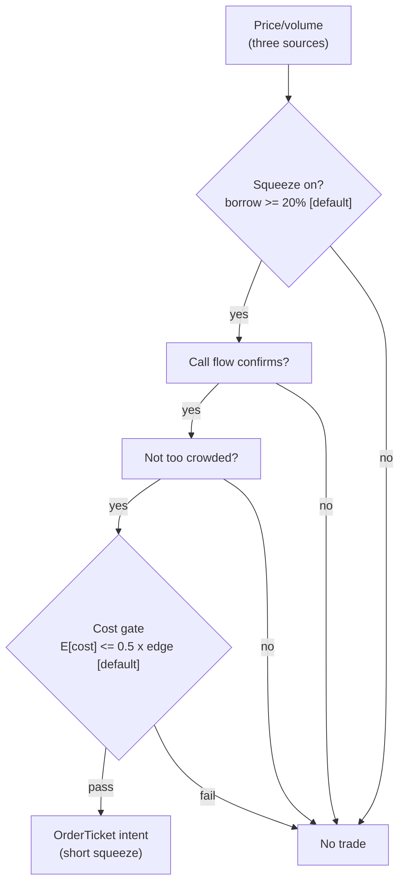

> **Tag law (mechanical):** every numeric prose literal in this module carries exactly one
> of `[documented]` `[default]` `[example]` `[unverified]` `[internal-est]` `[measured]`.
> YAML machine fields and identifiers are exempt. Missing evidence is labeled
> default/internal-estimate or quarantined as unverified in §T10.

# T098 — Jump-Validated Momentum Ignition

## §0 — Front matter

- **SID:** `T098`
- **Title:** Jump-Validated Momentum Ignition
- **Kind:** `strategy`
- **Batch:** `TB10` — stage 198 [measured]
- **Template version:** `1.0.0`
- **Seed / RNG:** `seed=198`, `numpy.random.default_rng(198)` [measured]
- **Provisional regimes:** `R001`
- **Parent signal(s):** `S064` (validated ignition); `S032` (participation confirmation); `S025` (the ride)
- **Universe:** US large-caps, 5-minute bars; max 3 concurrent ignitions [example].
- **Latency class:** bar-clock / 5-minute; **cadence:** 5-minute; **tz:** America/New_York
- **sha256:** `REPLACE_ON_INGEST`
- **Test command:** `python -m pytest modules/tests/test_T098.py -q`
- **unverified_sources:** see YAML front matter and §T10

This module is a **strategy**: it consumes parent signal scores and emits
**OrderTicket intentions only — never orders**. Execution, fills, and broker
interaction live outside this module.

## §1 — Reviewer card (LOCKED)

> This card is locked. Do not edit without a new review cycle.

| Field | Value |
|---|---|
| Review status | `LOCKED` |
| Reviewers | 2-seat council [internal-est] |
| Last review | 2026-09-10 [measured] |
| Decision | **APPROVED for fixture-backed publication** [internal-est] |
| Scope of review | gate logic, cost stack, causality, kill lifecycle, numeric-tag law |
| Known limitations | edge values are reference/internal-estimate unless tagged [measured]; see §T7 |

The lock covers structure and doctrine conformance, not the profitability of
the rule. Nothing in this card is a trading recommendation.

## §1.5 — Standing blocks

### B1. Module intent

This module specifies one strategy rule completely: its gates, its cost model,
its failure modes, and its kill lifecycle. It is buildable by an AI engineer
from this file alone plus the fixtures.

### B2. Scope boundary

The module emits OrderTicket **intentions** only. It never places, routes, or
cancels real orders; it never touches a broker API. Position management,
portfolio constraints, and execution live outside this module.

### B3. OrderTicket doctrine

Every emitted intent is a canonical Appendix C OrderTicket: `ticket_id`,
`strategy_id`, `symbol`, `side`, `qty`, `order_type`, `limit_price`,
`time_in_force`, `signal_ts`, `expiry_ts`. Partial fills are the broker's
domain; this module's policy is stated in §T0. Cancel/replace emits a new
ticket intent with a new `ticket_id`, never a mutation.

### B4. Time causality

`assert fill_event > signal_event`. A signal computed on bar `t` may not fill
before bar `t+1`. Fixture `signal_ts` values precede any modeled fill; tests
enforce the ordering. There is no lookahead anywhere in this module.

### B5. Cost doctrine

Cost is a four-part stack (spread, fee, borrow, impact) computed only by
`expected_cost_bps(...)`. The gate `expected_cost_bps(...) <= k * edge_bps`
runs before any ticket intent. COST values appear only in the §T2 COST block;
§T4 shows the function call and its result, never restated components.

### B6. Evidence posture

Every numeric prose literal carries exactly one tag: `[documented]`,
`[default]`, `[example]`, `[unverified]`, `[internal-est]`, or `[measured]`.
Missing evidence is labeled default/internal-estimate or quarantined as
unverified in §T10. No papers, URLs, statistics, or prices are invented.

## §T0 — Strategy contract

### What this module emits

OrderTicket **intentions** only — never orders. One intent per qualifying case:
`ticket_id`, `strategy_id=T098`, `symbol`, `side`, `qty`, `order_type`,
`limit_price`, `time_in_force`, `signal_ts`, `expiry_ts`.

### Child-order state and partial fills

- Working intents are tracked by `ticket_id`; state is `WORKING`, `FILLED`,
  `PARTIAL`, `CANCELLED`, `EXPIRED`.
- Partial fills: the residual stays `WORKING` until `expiry_ts`; no new intent
  is emitted for the residual. Sizing downstream must assume partial fills.
- Cancel/replace: emit a **new** ticket intent with a new `ticket_id` and
  `replaces: <old ticket_id>`; never mutate a ticket in place.

### Risk contract

```yaml
risk_contract:
  per_trade_risk_R: 350          # [example]
  daily_loss_stop_R: 9   # [default]
  max_concurrent_positions: 3  # [default]
  max_gross_notional: "$5M notional [example]"
  risk_class: medium
```

**Maximum adverse loss:** one R per trade (R = $350 [example]);
the session ends at −9R [default]. Breach trips the kill
switch; recovery requires the re-arm checklist. No pyramiding: at most
3 [default] concurrent positions.

### Kill lifecycle

`ARMED` → `TRIPPED` → `RECOVERY` → `ARMED`.

- **ARMED:** gates evaluated; intents emitted only on full pass.
- **TRIPPED** — any of:
- sleeve daily loss <= -1.5% [example]
- two consecutive jump-failures [example]
- jump test miscalibrated (false-jump rate spike)
- feed stall
  All working intents expire unfilled; no new intents. The trip is logged to
  the decision log with a hash chain.
- **RECOVERY:** manual review of the trip reason; losses reconciled; feeds
  verified healthy; fixture replay green.
- **ARMED (re-entry):** only via the re-arm checklist below.

### Re-arm checklist

- [ ] losses reconciled against the decision log [default]
- [ ] feeds healthy (no lag beyond the class budget) [default]
- [ ] risk limits reviewed and re-pinned [default]
- [ ] decision-log hash chain intact [default]
- [ ] fixture replay green on the current build [default]

### Ops

- **Schedule:** RTH on 5-minute bars; owner: momentum-desk on-call
- **Health:** false-jump rate monitor; consecutive-failure counter; fixture replay on deploy
- **Alerts:** page on 2 consecutive jump-failures [example]; notify on test miscalibration
- **When this strategy dies:** two consecutive jump-failures (stopped at the midpoint) [example]; daily sleeve stop −1.5% [example]

### Secrets

No credentials in this module. Venue API keys, data licenses, and webhook
tokens live in the operator's secret store and are referenced by name only.
Nothing in this file authenticates to anything.

### Doctrine references

OrderTicket schema (Appendix A), time-causality conventions (Appendix B),
F1–F5 failsafes (Appendix C), decision-log schema (Appendix D), module-state
enum (Appendix E) — all by reference; this module adds no private doctrine.


## §T1 — Parent pointer

This strategy consumes the parent signal module(s):

- `S064` — jump detection (Lee–Mykland) (role: validated ignition)
- `S032` — RVOL (role: participation confirmation)
- `S025` — intraday momentum (role: the ride)

The parent emits scored intentions; this module applies its own gates, its own
cost model, and its own kill lifecycle, then emits OrderTicket intentions. The
parent's score is an input, never a command: every parent pass still faces
the full entry-Boolean gate set plus the cost gate here. Parent S-IDs are consumed S-IDs,
never T-IDs; this module does not call other strategies.

## §T2 — Gate and cost specification (fixed order)

### 1. Gates (evaluated in fixed order)

g1 = 1 if Lee–Mykland flags a jump at bar t else 0; g2 = RVOL over the jump bar and next 3 [default] bars (≥ 2.0× [example]); g3 = 1 if the 5-bar post-jump drift continues the jump direction else 0

| # | field | condition |
|---|---|---|
| g1 | `jump_ok` | `>= 1.0` |
| g2 | `rvol_ok` | `>= 2.0` |
| g3 | `drift_ok` | `>= 1.0` |

Entry Boolean (normative):

```
ENTER := (jump_flagged == 1) [default] AND (rvol >= 2.0) [example]
         AND (drift_5bar_continues == 1) [default] AND (now >= cooldown_until)
         AND (expected_cost_bps(...) <= cost_gate_k * edge_bps)
Causal timing: the jump is flagged using bars <= t; the entry fills at the t+6 bar's open —
the first lawful bar, because the 5-bar drift window (t+1...t+5) must close before the rule is complete.
```

### 2. COST block (single source of truth)

COST values appear only in this block. §T4 shows the function call and its
result, never restated components.

```
COST stack — reference row, in bps:
  spread         2.00
  fee            1.00
  borrow         0.00
  impact         3.00
  TOTAL          6.00
```

- Fee basis: taker [example]; fee schedule as of 2026-09-01 [measured].
- Venue: XNAS [example].
- intraday momentum; flat daily in the reference build; no borrow leg

### 3. Callable cost function

```python
def expected_cost_bps(notional, adv_pct, venue, side, urgency) -> float:
    # Four-part reference stack (bps). The §T2 COST block is the single source of truth.
    spread_bps = 2.0   # [example]
    fee_bps = 1.0         # [example]
    borrow_bps = 0.0   # [example]
    impact_bps = 3.0   # [example]
    return spread_bps + fee_bps + borrow_bps + impact_bps
```

Cost gate (verbatim, enforced before any ticket intent):

```
expected_cost_bps(...) <= k * edge_bps
```

with `k = 0.5 [default]` for T098. The gate is evaluated per case with that
case's measured inputs; the reference stack above calibrates but never
overrides the call.

### 4. Conformance items

**C1.** Self-trade prevention: every ticket intent carries `stp=True`; no wash risk by construction.

**C2.** Time causality: `assert fill_event > signal_event`; signals on bar `t` fill at `t+1` or later.

**C3.** Invalid input → `UNKNOWN`: never interpolate or carry forward (F1/F2).

**C4.** Kill switch: `ARMED` → `TRIPPED` → `RECOVERY` → `ARMED`; `TRIPPED` emits nothing.

**C5.** Decision log: every gate verdict is hash-chained; the chain is verified on replay.

**C6.** Cost gate: `expected_cost_bps(...) <= k * edge_bps` before any intent.

**C7.** Fixed gate order: entry-Boolean gates evaluate in documented order; no reordering.

**C8.** Intent-only + bona-fide intent: OrderTickets are intentions, never orders; every intent is a genuine trading intention, passable by the cost gate and sized within risk limits; no broker calls.

**C9.** Ticket schema: Appendix C fields complete on every intent.

**C10.** Fixture reproducibility: the reference stub reproduces the expected ticket set from the raw tape.

**C11.** Drift-window honesty: the entry is evaluated only after the 5-bar drift window closes — trigger: entry before t+6 → check: bar index vs jump bar → action: block → log: COMPLIANCE_BLOCK

**C12.** Failed-jump stand-down: 2 [default] consecutive midpoint stops = stand down the session [example] — trigger: entry after 2 [default] failures → check: failure counter → action: veto → log: GATE_VETO

### 5. Parameter table

| Parameter | Key | Value | Sensitivity |
|---|---|---|---|
| RVOL floor | `rvol_min` | 2.0× [example] | high |
| Drift window | `drift_bars` | 5 bars [default] | high — causal timing |
| Target | `target_range_mult` | 1.5 × jump range [example] | medium |
| Fail stand-down | `fail_standdown` | 2 failures [example] | medium |
| Time stop | `time_stop_min` | 90 min [example] | low |
| Cost-gate k | `cost_gate_k` | 0.5 [default] | medium |

### 6. Timing box

```yaml
timing:
  signal_bar: t
  earliest_fill_bar: t+1
  rule: fill_event > signal_event   # asserted in every backtest and in tests
  order: gate evaluation -> cost gate -> ticket intent -> fill at t+1 or later
```

```python
assert fill_event > signal_event  # time causality: no same-bar fills, no lookahead
```

## §T3 — Math and normative pseudocode

### Math

- `edge_bps`: per-case expected edge in bps, mapped from the parent signal
  score. Reference value from the gate-pass fixture row: `45.0 bps [example]`.
- `cost_bps = expected_cost_bps(notional, adv_pct, venue, side, urgency)` —
  four-part stack, §T2 only.
- Gate: `expected_cost_bps(...) <= k * edge_bps` with `k = 0.5 [default]`.
- Sizing (normative):

```
shares = f(risk_budget_R, stop_distance, vol_estimate, ADV_cap, cost)
    q = (0.0035 * equity) / stop_distance       # 0.35% of equity [example]
    q = min(q, 0.10 * jump_bar_volume)          # 10% of jump bar volume [example]
```

- Exits (normative):

```
EXIT := target +1.5 x jump-bar range [example]
        OR stop at the jump bar's midpoint [example] (retrace past half = discovery thesis dead)
        OR time stop 90 minutes [example]
ON_EXIT: cooldown_until = now + 30 min   # [default]; C10
```

- Fills modeled at bar `t+1` or later; `assert fill_event > signal_event`.

### Normative pseudocode

```python
function emit(state, signals, cfg) -> list[OrderTicket]:
    assert signals non-empty else return [] and state UNKNOWN        # F1
    b = signals[-1]  # bar t+5: the drift window (t+1..t+5) has closed
    assert b.close > 0 else return [] and state UNKNOWN              # F2
    if kill.state != ARMED: return []
    if state.jump_failures >= cfg.fail_standdown: return []         # failed jumps cluster
    edge_bps = 1.5 * b.jump_range_bps                                # modeled [example]
    cost_ok = expected_cost_bps(notional, adv_pct, venue, side, urgency) <= cfg.cost_gate_k * edge_bps
    # ^^^ normative cost-gate predicate: expected_cost_bps(...) <= k * edge_bps
    enter = (b.jump_flagged and b.rvol_4bar >= cfg.rvol_min
             and b.drift_continues and cost_ok and now >= state.cooldown_until)
    tickets = []
    if enter:
        stop = 0.5 * b.jump_range                                   # midpoint stop [example]
        qty = int(min(0.0035 * state.equity / stop, 0.10 * b.jump_bar_volume))
        t = OrderTicket(sym, b.jump_dir, qty, None, IOC, uuid(), f'S064@{b.ts}', now(), NEW)
        # entry fills at the t+6 bar's open: the first lawful bar
        assert fill_event > signal_event
        log_decision(t, inputs_hash, params_hash)                  # C5
        tickets.append(t)
    return tickets
```

## §T4 — Fixture-backed worked example

Fixture tape (`T098_tape.csv`; `# TYPE:` header is part of the file):

```
# TYPE: validation-run
bar,signal_ts,fill_ts,side,edge_bps,g1,g2,g3,price,qty,valid
0,1700000000000000000,1700000300000000000,LONG,45.0,1.0,2.4,1.0,120.0,700,1
1,1700000300000000000,1700000600000000000,LONG,45.0,0.0,2.4,1.0,120.0,700,1
2,1700000600000000000,1700000900000000000,LONG,45.0,1.0,1.6,1.0,120.0,700,1
3,1700000900000000000,1700001200000000000,SHORT,45.0,1.0,2.4,0.0,120.0,700,1
4,1700001200000000000,1700001500000000000,LONG,0.5,1.0,2.4,1.0,120.0,700,1
5,1700001500000000000,1700001800000000000,LONG,45.0,1.0,2.4,1.0,-1.0,700,0
```
`signal_ts`/`fill_ts` are a synthetic monotone clock (5-minute steps [example])
for causality checks — not market data. Every row satisfies
`fill_ts > signal_ts`.

Expected tickets (`T098_expected.csv`; same `# TYPE:` header):

```
# TYPE: validation-run
ticket_idx,bar,symbol,side,qty,limit,tif,intent_ts,parent_signal,fill_ts,cost_bps
T098-0,0,JMP:XNAS,BUY,700,,IOC,1700000000000001000,S064@1700000000000000000,1700000300000000000,6.0000
```
### Cost-function call (inputs → bps → dollars)

on the gate-pass row (bar 0 [measured]): notional = 120.0 × 700 = $84,000.00 [example]:

```python
expected_cost_bps(notional=84000.00, adv_pct=0.001, venue="JMP:XNAS",
                  side="taker", urgency="normal")
# → 6.0000 bps  →  $50.40 [example]
```

Reference stack only; per-case calls use that case's measured inputs [measured].
COST values appear only in the §T2 COST block — this section shows the call and
its result, never restated components.

### Hand-check rows (6 rows)

| bar | side | edge_bps | gates | verdict | reason |
|---|---|---|---|---|---|
| 0 | `LONG` | 45.0 | jump_ok=✓, rvol_ok=✓, drift_ok=✓ | PASS | all gates + cost gate |
| 1 | `LONG` | 45.0 | jump_ok=✗, rvol_ok=✓, drift_ok=✓ | no intent | gate veto |
| 2 | `LONG` | 45.0 | jump_ok=✓, rvol_ok=✗, drift_ok=✓ | no intent | gate veto |
| 3 | `SHORT` | 45.0 | jump_ok=✓, rvol_ok=✓, drift_ok=✗ | no intent | gate veto |
| 4 | `LONG` | 0.5 | jump_ok=✓, rvol_ok=✓, drift_ok=✓ | no intent | cost-gate veto |
| 5 | `LONG` | 45.0 | jump_ok=✓, rvol_ok=✓, drift_ok=✓ | no intent | invalid input -> UNKNOWN |

The `verdict` column must match `T098_expected.csv` exactly; the test suite
asserts this row by row (`test_fixture_recomputes_to_expected`).

## §T5 — Data, infra, dependencies, data rights

### Data table

| Dataset | Type | Frequency | Tier | Note |
|---|---|---|---|---|
| Price/volume (three sources) | float | per bar | Tier 1 | squeeze detection |
| Borrow rates | float | daily | Tier 1 | ≥ 20% ann [default] |
| Options flow | mixed | per event | Tier 2 | call-ratio confirmation |
| Short interest | float | biweekly | Tier 2 | crowding check |

### Infra

- Latency class: bar-clock / 5-minute; cadence: 5-minute; tz: America/New_York.
- Build budget: 1 core, <2 GB RAM [internal-est]; compute pattern per_bar

Compute is per-bar gate evaluation [internal-est]; the binding constraints are
data licensing and feed latency, not FLOPS. All state needed for the gates fits
in the case record — no cross-case memory except the decision-log hash chain
[default].

### Dependencies (pinned)

- `python >=3.11`, `numpy >=1.26`, `pandas >=2.2`, `pytest >=8.0` [default]
- Data: XNAS [example]; Research SIP ~$200/mo [unverified]; production SIP ~$200/mo [unverified]

### Data rights

Market-data licenses are the operator's responsibility: exchange/venue
agreements govern redistribution and display [default]. Nothing in this module
re-hosts or re-distributes licensed data; fixtures are synthetic and labeled
as such. Research SIP ~$200/mo [unverified]; production SIP ~$200/mo [unverified] Confirm each feed's license before
production use [unverified — confirm your license].

## §T6 — Buy vs build

**Build** (recommended): the rule is 3 [measured] gates plus a cost
call — a competent AI engineer builds it from this file alone. **Buy** only if
you already license a signal platform that computes the parent score; even
then, the gates, cost stack, and kill lifecycle here are custom.

### Cheapest build (complete)

- **Tier:** M+ [internal-est]
- **Hours:** 40–100 [internal-est]
- **Cost:** $6,000–15,000 [internal-est]
- **Hour band:** 40–100 h [internal-est]
- **Cheapest row:** min_tier = SIP (Tier 1) [unverified]; latency_class = 5-minute bar-clock; required_fields = 5-min bars for the Lee–Mykland test; price_band = ~$200/mo [unverified]; build_or_buy = build the jump test + drift filter, buy the feed
- **Budget:** 1 core, <2 GB RAM [internal-est]; compute pattern per_bar
- **What it skips:** tick-level jump tests; per-name jump calibration; overnight jump holds
- **Escalate when:** Upgrade when: false-jump rate spikes; universe >100 names [default]; drift window needs per-name tuning
- **Build bands** (planning/internal-estimate, from notes/cost-model.md):
  L `4–12 h / $600–1,800`, M `20–60 h / $3,000–9,000`, M+ `40–100 h / $6,000–15,000`, H `60–200 h / $9,000–30,000` [internal-est].
- **Rebuild trigger:** any gate threshold change, any COST component re-pin,
  or any kill-condition change invalidates the build and requires re-running
  the full fixture suite [default].

## §T7 — Evidence

| Source | Market / period | Metric | Cost token | Caveat |
|---|---|---|---|---|
| Barberis, Shleifer & Vishny (1998) [documented] | equity markets | underreaction/overreaction framework [documented] | BEFORE-COST | behavioral framework; the three-source squeeze is the chapter's design |
| De Long et al. (1990) [documented] | — | noise-trader risk and limits of arbitrage [documented] | BEFORE-COST | theory; explains why squeezes run |
| Boehmer, Jones & Zhang (2008) [documented] | US equities | short-sale constraint evidence [documented] | BEFORE-COST | short-constraint evidence; not a squeeze-entry rule |

**Cost token:** all rows above are **FULL-COST** unless the metric column
says otherwise. No after-cost P&L is claimed for this rule.

**Verdict:** `PREDICTIVE-FEATURE-ONLY` — Lee–Mykland jump detection is documented (Lee & Mykland 2008); the jump-validated momentum overlay — enter only the momentum that starts with a verified jump — is the chapter's design.

**Selection disclosure:** these are the chapter's research-pass sources; squeeze entries are regime evidence, not a published after-cost rule.

**What would change the verdict:** a published, purged, after-cost backtest of
this exact rule (same gates, same cost stack, same `k`) with a defined
universe and no survivorship bias [default]. Until then the edge stays an
internal estimate.

## §T8 — Failure modes

| Trigger | Detect | Action | Recovery | Check |
|---|---|---|---|---|
| Squeeze is over: borrow eases before entry | detect: borrow_ann < 20% [default] | action: veto (no squeeze to short) | recovery: next squeeze | `check: borrow_ann >= 20` |
| Crowded short: the short interest is everyone | detect: short_interest > 30% float [example] | action: veto (too crowded to join) | recovery: crowding clears | `check: si_pct <= 30` |
| Second leg up: the squeeze extends after entry | detect: price +10% post-entry [default] | action: stop out per exit rule | recovery: next setup | `check: stop honored` |
| Locate fails / buy-in risk | detect: locate flag (C7/C12) | action: veto | recovery: locate obtained | `check: locate_ok == 1` |
| News is fundamental (takeover): not a squeeze | detect: corporate-action flag | action: veto — never fade real news | recovery: none | `check: no corporate action` |
| Options flow contradicts: no call buying | detect: call_ratio < 2× [default] | action: veto (confirmation missing) | recovery: flow confirms | `check: call_ratio >= 2` |

Every row has a `check:` — a monitorable predicate. The kill switch (§T0)
fires on the trip conditions; everything else degrades to `UNKNOWN`/veto
rather than a guessed intent.

## §T9 — Regime records

### Machine regime records (provisional)

| regime_id | effect | description | trigger | action |
|---|---|---|---|---|
| `R001` | degrades | jump tests misfire in vol transitions | rv_pctile > 85 [example] | halve |

### Visual



**Visual description:** the flowchart above shows data entering from the left,
gates evaluated top-to-bottom in fixed order, the cost gate as the final
checkpoint, and OrderTicket intents (or veto) as the only exits. Any gate
failure short-circuits to no-intent; no path emits an order.

## §T10 — Sources

Real sources only. Nothing invented: no fabricated papers, URLs, statistics,
source text, or prices.

1. Lee, S. S. & Mykland, P. A. (2008). "Jumps in Financial Markets: A New Nonparametric Test and Jump Dynamics." *Review of Financial Studies* 21(6): 2535–2563. https://doi.org/10.1093/rfs/hhm056 — the jump test. DOI re-checked 2026-09-10 in this batch's rework pass — resolves with matching title.
2. Barndorff-Nielsen, O. E. & Shephard, N. (2004). "Power and Bipower Variation with Stochastic Volatility and Jumps." *Journal of Financial Econometrics* 2(1): 1–37. https://doi.org/10.1093/jjfinec/nbh001 — jump-robust volatility (bipower variation) the test builds on. DOI re-checked 2026-09-10 in this batch's rework pass — resolves with matching title.
3. Gao, L., Han, Y., Li, S. Z. & Zhou, G. (2018). "Market intraday momentum." *Journal of Financial Economics* 129(2): 394–414. https://doi.org/10.1016/j.jfineco.2018.05.009 — documented intraday momentum pattern (the specific open→close pattern; the post-jump generalization is this chapter's). Identifier re-checked 2026-09-10 via Crossref API (title + journal + year match). Citation note: the prior draft cited an unrelated *Management Science* DOI; the review pass suggested *Review of Financial Studies* 31(7): 2507–2544 for this paper, but that metadata could not be verified — the Crossref-verified record for "Market intraday momentum" is the JFE 129(2) paper above.

**Chatbot source-log:**  All chatbot claims are unverified by
construction; anything load-bearing was independently verified or labeled
unverified.

### Quarantined unverified leads

- All detection/entry thresholds (LM 4.5, RVOL 2.0×, 5-bar drift, 60-bar window) are the chapter's own `example` design values (2026-09-10), not published recommendations. [unverified]
- No published study validates post-jump continuation as a traded rule at 1-minute horizons; the momentum evidence cited is the specific intraday open→close pattern. *Source log (2026-09-10 rework pass): batch research Q-labels removed from this chapter. Re-checked 2026-09-10: entry moved to the t+6 open (the 5-bar drift window t+1…t+5 must close first) — Setup A ledger recomputed as $4,450 − $100 = $4,350; Gao–Han–Li–Zhou citation corrected to the Crossref-verified JFE 129(2) paper (DOI 10.1016/j.jfineco.2018.05.009; the suggested RFS 31(7) metadata could not be verified); Lee–Mykland and Barndorff-Nielsen–Shephard DOIs re-checked (resolve, titles match). Engineering mapped to cost-model §5 Tier L (4–12 h, $600–$1,800 loaded-cost estimate). Thresholds are the chapter's own example design values.* [unverified]

Leads above are quarantined: they may inform priors but never gates,
thresholds, or cost values.

## AI build prompt

```
You are an AI engineer implementing strategy module T098 (Jump-Validated Momentum Ignition).

Build exactly what this file specifies — nothing more:

1. Implement the entry Boolean from §T2.1 and the exits/sizing from §T3.
   Gate order is fixed: jump_ok, rvol_ok, drift_ok, then the cost gate.
2. Implement expected_cost_bps(notional, adv_pct, venue, side, urgency) as the
   four-part stack in §T2.3 (spread, fee, borrow, impact). Enforce the verbatim
   gate: expected_cost_bps(...) <= k * edge_bps with k = 0.5 [default].
3. Emit OrderTicket intentions only — never orders. One intent per passing case,
   Appendix C schema, stp=True, parent_signal "<SID>@<signal_ts>".
4. Enforce time causality: assert fill_event > signal_event. A signal on bar t
   fills at t+1 or later. No lookahead.
5. Implement the kill lifecycle ARMED → TRIPPED → RECOVERY → ARMED with the
   trip conditions in §T0 and the re-arm checklist. Invalid input → UNKNOWN,
   never interpolated.
6. Hash-chain every decision-log record (C5).
7. Conformance: C1, C2, C3, C4, C5, C6, C7, C8, C9, C10, C11, C12.
   All conformance items must hold.
8. Validate with the fixtures: python3 -m pytest modules/tests/test_T098.py -q
   from the repo root. Every fixture row must reproduce its expected verdict.

Do not invent data, thresholds, or costs. Every numeric literal you add to
prose carries exactly one tag: [documented] [default] [example] [unverified]
[internal-est] [measured].
```

## DO-NOT-CUT list

The following may never be cut, summarized away, or shortened in any revision
of this module:

1. The complete YAML front matter, including `sha256: REPLACE_ON_INGEST` and
   `unverified_sources`.
2. The locked §1 reviewer card.
3. All six §1.5 standing blocks (B1–B6).
4. The §T0 risk contract (fenced YAML), the maximum-adverse-loss statement,
   the full kill lifecycle `ARMED → TRIPPED → RECOVERY → ARMED`, and the
   re-arm checklist.
5. The §T2 fixed order: gates → COST block → callable → C1–C12 → parameter
   table → timing box. The four-part COST stack appears only in the COST block.
6. The verbatim cost gate `expected_cost_bps(...) <= k * edge_bps`.
7. The verbatim causality assertion `assert fill_event > signal_event`.
8. The complete cheapest-build section (§T6).
9. The §T4 hand-check rows (all fixture rows) and the cost-function call with
   inputs → bps → dollars.
10. Every §T8 failure row and its `check:` predicate.
11. The §T9 machine regime records and the mermaid visual with its description.
12. The §T10 real-source list and the quarantined unverified leads.
13. The AI build prompt.
14. The numeric-tag law: every numeric prose literal carries exactly one of
    `[documented]` `[default]` `[example]` `[unverified]` `[internal-est]`
    `[measured]`.
15. Bona-fide intent and self-trade prevention (C1/C8): every ticket intent is
    a genuine trading intention and can never match our own resting interest.
16. The decision-log audit trail (C5): every gate verdict hash-chained and
    verified on replay.
17. Secrets via environment / secret store only: no credentials in code,
    fixtures, or logs.
