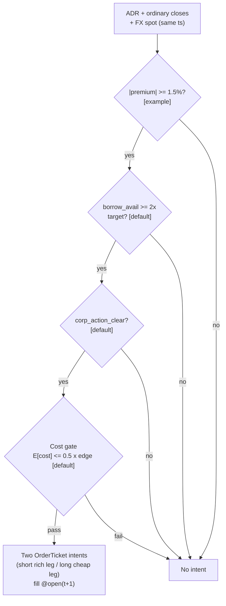

> **Tag law (mechanical):** every numeric prose literal in this module carries exactly one
> of `[documented]` `[default]` `[example]` `[unverified]` `[internal-est]` `[measured]`.
> Machine-parsed §0 data fields, bibliographic years/volumes/pages, rule codes
> (`C1`–`C18`), fail-safe codes (`F1`–`F5`), module IDs (`T099`, `S061`, `R009`),
> section numbers, and appendix letters are identifiers, not literals, and are
> exempt. Missing evidence is labeled default/internal-estimate or quarantined
> as unverified in §T10.

# T099 — ADR + Borrow Corporate Arb

## §0 — Front matter

- **SID:** `T099` (front-matter key `id` per template v1.0.0)
- **Title:** ADR + Borrow Corporate Arb
- **Kind:** `strategy`
- **Version:** `1.1.0` (deep-reviewed; see changelog)
- **Batch:** `TB10` — stage 199 [measured]
- **Template version:** `1.0.0`
- **Family:** `E` — pairs / statistical arbitrage
- **Provenance tier:** `D`
- **Seed / RNG:** `seed=199`, PCG64 via `numpy.random.default_rng(199)` [measured]
- **Provisional regimes:** `R009`
- **Parent signal(s):** `S061` v1.1.0 (premium gauge); `S098` v1.1.0 (short-leg carry pricer); `S014` v1.0.1 (friction honesty)
- **Universe:** ADR–ordinary pairs with borrow availability; no entries 5 sessions around known ADR ratio changes, dividends, or tax events [example].
- **Latency class:** bar-clock / daily; **cadence:** daily; **tz:** America/New_York
- **sha256:** `REPLACE_ON_INGEST`
- **Test command:** `python -m pytest modules/tests/test_T099.py -q`
- **unverified_sources:** see YAML front matter and §T10

This module is a **strategy**: it consumes parent signal scores and emits
**OrderTicket intentions only — never orders**. Execution, fills, and broker
interaction live outside this module.

## §1 — Five-minute reviewer card

> Card rebuilt to the locked row schema in the 1.1.0 deep-review cycle
> (authorized review cycle — the prior lock is superseded).

| Row | Value |
|---|---|
| Module | T099 — ADR + Borrow Corporate Arb, v1.1.0 |
| Edge verdict | `PREDICTIVE-FEATURE-ONLY` — ADR parity violations are documented (Gagnon & Karolyi 2010 [documented]); the `1.5`% [example] entry threshold and `3,000`-share [example] pairs are the chapter's design, not a published after-cost Sharpe |
| After-cost | `BEFORE-COST` — no after-cost P&L is claimed for this rule [documented-as-absence]; the COST block prices the round trip at `8.00` bps [example] against a `180.0` bps [example] reference edge |
| Build cost | Tier M+ · `40–100` h [internal-est] · `$6,000–15,000` loaded [internal-est] |
| Data cost | Research `~$200`/mo [unverified] (SIP + home-market data + borrow snapshots); production institutional borrow + calendar feeds [unverified] — verify before budgeting |
| latency_class | bar-clock / daily |
| risk_class | medium (pairs arb; borrow-recall and FX-basis risk) |
| Capacity | `$0.5–3`M notional [example] — illustrative; bounded by borrow availability and the `5`-pair [default] cap |
| Executability | Feasible: Python + daily closes + borrow snapshots; `3` [measured] gates + cost call |
| Risk summary | Premium may not converge (basis risk); short ADR leg faces borrow recall; FX moves erode the premium; corporate actions (ratio changes, dividends, tax events) void the parity |
| When it dies | Premium widens to `+3.0`% [example] (structural, stop); single-pair loss `≤ −2R` [example]; borrow recall; corporate-action freeze entered while holding; FX data stale beyond TTL |
| Regime gates | Provisional: R009 (capital controls) **inverts** — gaps become structural → veto |
| Emits | `order_intents` (Appendix C OrderTicket) — never orders |
| Review status | deep-reviewed 2026-09-10 [measured]; 1.0.0 pass: 2-seat council [internal-est], approved for fixture-backed publication |
| Known limitations | edge values are reference/internal-estimate unless tagged [measured]; see §T7 |

The lock covers structure and doctrine conformance, not the profitability of
the rule. Nothing in this card is a trading recommendation.

## §1.5 — Standing blocks + cheapest/least-build path

### B1. Module intent

This module specifies one strategy rule completely: its gates, its cost model,
its failure modes, and its kill lifecycle. It is buildable by an AI engineer
from this file alone plus the fixtures.

### B2. Scope boundary

The module emits OrderTicket **intentions** only. It never places, routes, or
cancels real orders; it never touches a broker API. Position management,
portfolio constraints, and execution live outside this module.

### B3. OrderTicket doctrine

Every emitted intent is a canonical Appendix C OrderTicket: `ticket_id`,
`strategy_id`, `symbol`, `side`, `qty`, `order_type`, `limit_price`,
`time_in_force`, `signal_ts`, `expiry_ts`. Partial fills are the broker's
domain; this module's policy is stated in §T0. Cancel/replace emits a new
ticket intent with a new `ticket_id`, never a mutation.

### B4. Time causality

`assert fill_event > signal_event`. A signal computed on bar `t` may not fill
before bar `t+1`. Fixture `signal_ts` values precede any modeled fill; tests
enforce the ordering. There is no lookahead anywhere in this module.

### B5. Cost doctrine

Cost is a four-part stack (spread, fee, borrow, impact) computed only by
`expected_cost_bps(...)`. The gate `expected_cost_bps(...) <= k * edge_bps`
runs before any ticket intent. COST values appear only in the §T2 COST block;
§T4 shows the function call and its result, never restated components.

### B6. Evidence posture

Every numeric prose literal carries exactly one tag: `[documented]`,
`[default]`, `[example]`, `[unverified]`, `[internal-est]`, or `[measured]`.
Missing evidence is labeled default/internal-estimate or quarantined as
unverified in §T10. No papers, URLs, statistics, or prices are invented.

### Cheapest / least-build path (fixed sub-blocks)

1. **Prototype hour band:** `40–100` h [internal-est] — parity screen + borrow-availability join + corp-action calendar check + `3`-gate entry Boolean + cost gate + two-leg intent emission + fixture validation.
2. **Cheapest-source row:** min_tier = SIP (research) + home-market data + borrow snapshots (Tier 0/1) [unverified]; latency_class = daily bar-clock; required_fields = ADR + ordinary closes, FX spot at the same timestamp, borrow availability (`IndicativeAvailability`-style field [documented]), corp-action calendar; price_band = `~$200`/mo research [unverified], institutional production [unverified]; build_or_buy = **build the parity screen, buy the data** (the rule is `3` gates + a cost call — the value is in licensed borrow/calendar data, not in code).
3. **Resource budget:** `1` core, `<2` GB RAM [internal-est]; compute pattern `per_bar` (daily). All state needed for the gates fits in the case record — no cross-case memory except the decision-log hash chain [default].
4. **Skip list:** intraday parity timing; FX hedging; multi-pair portfolio optimization; vol-scaled sizing (`vol_estimate` is reserved in the sizing signature and unused in this chapter).
5. **DO-NOT-CUT list:** causality assertions (`assert fill_event > signal_event`, no-signal-bar-fills test); COST block + callable `expected_cost_bps`; kill switch + re-arm checklist; decision-log audit records; bona-fide-intent + self-trade prevention; provenance tags on every numeric literal; fixtures + `test_cmd`; secrets via env only. (The file's full 17-item DO-NOT-CUT list is appended at the end; it is never shortened.)
6. **Escalation gate:** pairs `> 5` [example]; borrow-data latency becomes binding (recall arrives too late to unwind); FX basis risk needs hedging; home-market data quality forces a vendor upgrade.

## §T0 — Strategy contract

### T0.1 Typed signature

```python
def emit(state: ModuleState, signals: list[Signal], cfg: Config) -> list[OrderTicket]:
```

`OrderTicket` per Appendix C v1.0.0. `state` is the module-owned named state
vector (`kill`, `module_state`, `cooldown_until`, `decision_log` [hash-chained],
`open_pairs`); `signals` are parent-mapped case records (S061 premium gauge,
S098 borrow pricer, S014 friction diagnostic), newest last; `cfg` is the §T0.2
`Config`. The function handles documented edge cases: empty signals →
`module_state = UNKNOWN`, no intents (F1); non-finite premium/borrow fields →
`UNKNOWN` (F2, never interpolate); kill not `ARMED` → no intents, state `OFF`;
halt/auction per the §T0.5 market-state table.

### T0.2 Config dataclass

| Parameter | Type | Default | Range | Status |
|---|---|---|---|---|
| `premium_entry_pct` | float | `1.5` | `0.5`–`5.0` | example |
| `premium_exit_pct` | float | `0.75` | `0.25`–`2.0` | example |
| `premium_stop_pct` | float | `3.0` | `2.0`–`5.0` | example |
| `pair_shares` | int | `3000` | `100`–`10000` | example |
| `borrow_cover_mult` | float | `2.0` | `1.5`–`3.0` | default |
| `cost_gate_k` | float | `0.5` | `0.1`–`2.0` | default |
| `risk_budget_R` | float ($) | `2025.0` | `500`–`10000` | example |
| `freeze_sessions` | int | `5` | `3`–`10` | default |
| `time_stop_sessions` | int | `15` | `5`–`30` | example |
| `cooldown_sessions` | int | `1` | `0`–`5` | default |

Status `default` ⇒ `[default]`; `example` ⇒ `[example]`. Calibration: grid-search
each parameter on purged/embargoed walk-forward splits; freeze before forward
use; any change logs a new `params_hash` (C5).

### T0.3 Canonical schema mapping

Vendor columns → canonical schemas (Appendices A–D v1.0.0), stated once here:

| Vendor | Canonical |
|---|---|
| SIP / home-market `close`, `date` | `Bar` (Appendix A): `bar_open_ts` (int64 ns UTC, open-time labeled), `close_px` |
| FX spot `rate`, `ts` | `Event` (Appendix A): `event_ts` (int64 ns UTC), `fx_spot` |
| S3 / IHS Markit `IndicativeAvailability`, `Last rate` | `Event`: `borrow_avail` (shares), `borrow_rate_bps` |
| Depositary calendar `event_date`, `event_type` | `Event`: `corp_action_clear ∈ {0, 1}` |
| Parent signals S061/S098/S014 | `Signal` (Appendix B): `premium_pct`, `edge_bps`, `borrow_avail`, `corp_action_clear` |
| Emitted intents | `OrderTicket` (Appendix C): `ticket_id`, `strategy_id`, `symbol`, `side`, `qty`, `order_type`, `limit_price`, `time_in_force`, `signal_ts`, `expiry_ts`, `stp` |

Premium definition (`premium_pct`) is consumed from S061 v1.1.0 by reference;
this module restates no formula.

### T0.4 Time contract

> Clock domain UTC, int64 ns; authoritative causality clock = bar close
> (open-time labeled); max_skew = `60` s [default] (daily cadence);
> jitter budget = `5` s [default]; bar-label = open time;
> staleness TTL = `3` sessions [default] (`3`× the daily reference cadence per
> F4); gap policy = mask, no interpolation; halt/auction → freeze per the
> market-state table. FX spot and both closes must share a timestamp within
> `max_skew`, else the case is `UNKNOWN` (F2).

**Timing box:** `signal@t (daily, America/New_York) → earliest fill @open(t+1)`

### T0.5 Market-state table

| State | Module behavior |
|---|---|
| CONTINUOUS_TRADING | Evaluate gates; emit intents per cadence |
| HALTED (either leg) | Freeze; no new intents; affected pairs → `UNKNOWN` |
| AUCTION | No new intents; state `DEGRADED` |
| CLOSED | Emit nothing; state `OFF` |

### T0.6 Module-state enum + error taxonomy

States: `OK | DEGRADED | UNKNOWN | OFF`. Invalid input → `UNKNOWN`, never
interpolate (F1–F5).

| Failure | State | Alert |
|---|---|---|
| Missing/stale input (TTL per §T0.4) | `UNKNOWN` | page |
| Non-finite premium / borrow / FX field (F2) | `UNKNOWN` | page |
| FX timestamp skew > `60` s [default] | `UNKNOWN` | log |
| Borrow recall on an open pair | kill `TRIPPED` | page |
| Corporate action inside freeze window | veto (`UNKNOWN` for the case) | log |
| Halt/auction on either leg | `UNKNOWN` / `DEGRADED` (per table) | log |
| Kill/administrative disable | `OFF` | page |
| Anything unmapped | `UNKNOWN` | page |

### T0.7 Risk contract

```yaml
risk_contract:
  per_trade_risk_R: 2025.0        # $ [example]; = 3000 sh x $45 x 1.5% adverse premium move (entry->stop)
  daily_loss_stop_R: 10           # in R units [default] -> -$20,250 [example]
  max_concurrent_positions: 5     # pairs [default]
  max_gross_notional: 675000.0    # $ [example]; 5 pairs x $135,000
  max_adverse_per_trade: 2025.0   # $ [example]; one R
  kill_conditions:
    - pair_loss_R <= -2            # [example]
    - borrow_recall_on_open_pair
    - corporate_action_freeze_entered_while_holding
    - fx_data_stale_beyond_ttl
  enforcement: intraday-hard
  risk_class: medium
```

**Maximum adverse loss:** one R per trade (R = $2,025 [example]); the session
ends at −10R [default]. Breach trips the kill switch; recovery requires the
re-arm checklist. No pyramiding: at most 5 [default] concurrent pairs.

### Kill lifecycle

`ARMED` → `TRIPPED` → `RECOVERY` → `ARMED`.

- **ARMED:** gates evaluated; intents emitted only on full pass.
- **TRIPPED** — any of:
  - pair loss ≤ −2R [example]
  - borrow recall on an open pair
  - corporate-action freeze entered while holding
  - FX data stale beyond the §T0.4 TTL
  All working intents expire unfilled; no new intents. The trip is logged to
  the decision log with a hash chain.
- **RECOVERY:** manual review of the trip reason; losses reconciled; feeds
  verified healthy; fixture replay green.
- **ARMED (re-entry):** only via the re-arm checklist below.

### Re-arm checklist

- [ ] losses reconciled against the decision log [default]
- [ ] feeds healthy (no lag beyond the class budget) [default]
- [ ] borrow availability re-confirmed for any re-entered pair [default]
- [ ] risk limits reviewed and re-pinned [default]
- [ ] decision-log hash chain intact [default]
- [ ] fixture replay green on the current build [default]

### T0.8 Ops tail

- **Schedule:** daily after both closes (XNYS + home market), owner: arb-desk on-call.
- **Health checks:** borrow-availability monitor; corp-action calendar freshness; fixture replay (`test_cmd`) green on deploy; FX/close timestamp-skew watchdog at `60` s [default].
- **Alert table:** page on borrow recall, pair loss ≤ −2R [example], or `UNKNOWN` > `30` s [default]; notify on freeze-window entry or `DEGRADED`; log on single dropped events.
- **Resource budget:** `1` core, `<2` GB RAM [internal-est]; `per_bar` (daily).
- **Runbook stub:** `1.` confirm feeds (borrow + calendar + FX skew); `2.` replay fixture; `3.` if red → set `OFF`, page; `4.` reconcile decision log before re-arm; `5.` re-confirm locates before any re-entry.

### T0.9 Secrets (env-only)

No credentials in this module. Venue API keys, data licenses, and webhook
tokens live in the operator's secret store and are referenced by name only
(e.g. `BORROW_DATA_API_KEY`, `CALENDAR_FEED_TOKEN` as env names — values never
in this file). Nothing in this file authenticates to anything.

### T0.10 May / must-NOT

> **May:** emit OrderTicket **intentions** per Appendix C v1.0.0. **Must-NOT:**
> place, route, or cancel real orders; call a broker API; interpolate invalid
> input (→ `UNKNOWN`); restate COST values outside the §T2 COST block.

### Doctrine references

OrderTicket schema (Appendix C), time-causality conventions (Appendix E),
F1–F5 failsafes (Appendix F), decision-log schema (Appendix G), module-state
enum (Appendix K) — all by reference; this module adds no private doctrine.

## §T1 — Parent pointer

This strategy consumes the parent signal module(s):

- `S061` v1.1.0 — ADR–ordinary parity (role: premium gauge)
- `S098` v1.1.0 — borrow / short interest (role: short-leg carry pricer)
- `S014` v1.0.1 — spread / cost diagnostic (role: friction honesty)

The parent emits scored cases; this module applies its own gates, its own
cost model, and its own kill lifecycle, then emits OrderTicket intentions. The
parent's score is an input, never a command: every parent pass still faces
the full entry-Boolean gate set plus the cost gate here. Parent S-IDs are
consumed S-IDs, never T-IDs; this module does not call other strategies.
(`consumes` in §0 mirrors this list with version pins.)

## §T2 — Gate and cost specification (fixed order)

### 1. Universe

ADR–ordinary pairs with borrow availability; no entries within 5 [default]
sessions of known ADR ratio changes, dividends, or tax events. Both listings
must be in `CONTINUOUS_TRADING`; the ADR and the ordinary never trade
simultaneously in this design — the premium is computed on the day-`t` close
and the earliest legal fill is the `t+1` open.

### 2. Entry rule (Boolean expressions — no prose-only conditions)

```
ENTER := (|premium_pct| >= 1.5) [example]
         AND (borrow_cover_ratio >= 1.0) [default]      # borrow_avail / (borrow_cover_mult x pair_shares)
         AND (corp_action_clear == 1) [default]
         AND (now >= cooldown_until) [default]
         AND (expected_cost_bps(...) <= cost_gate_k * edge_bps)
```

Gate order is fixed: `premium_ok` → `borrow_ok` → `cal_ok` → cost gate (C11).
No reordering.

**Leg direction (premium-sign branch):** premium positive → short ADR / long
ordinary; premium negative → long ADR / short ordinary. The locate/borrow
requirement (C7) applies to whichever leg is short.

### 3. Exits (with post-exit cooldown)

```
EXIT := (premium_pct <= +0.75%) -> unwind at the next open [example]     # convergence
        OR (premium_pct >= +3.0%) -> stop, unwind at the next open [example]  # structural, not noise
        OR (sessions_in_premium >= 15) -> time stop, unwind [example]
        OR (corporate-action freeze window entered) -> unwind [default]
        OR (borrow recall on the short leg) -> unwind immediately [default]
ON_EXIT: cooldown_until = now + 1 session   # [default]; C10
```

For negative-premium (mirror) positions the thresholds are symmetric
(`−0.75`%, `−3.0`%) [example].

### 4. Position sizing (fenced function)

```python
def size_shares(risk_budget_R, stop_distance, vol_estimate, ADV_cap, cost):
    # risk_budget_R: $ risk per trade; stop_distance: $/share adverse premium
    #   move from entry to stop; ADV_cap: shares; cost: $ round-trip estimate.
    # Cost is already covered by the cost gate; sizing asserts it stays inside
    # the risk budget and keeps the adverse-to-stop loss <= risk_budget_R.
    # vol_estimate is reserved (unused in this chapter — see §1.5 skip list).
    assert cost <= risk_budget_R, "round-trip cost must not exceed the risk budget"  # [default]
    qty = int(round(risk_budget_R / max(stop_distance, 1e-9)))
    return int(min(qty, ADV_cap))
```

Reference evaluation [example]: `risk_budget_R = 2025.0` ($),
`stop_distance = (3.0% − 1.5%) × $45 = $0.675`/share [example], `ADV_cap` non-binding →
`2025 / 0.675 = 3000` shares [example] = `pair_shares`. Post-sizing borrow cap (C7):
`qty = min(qty, 0.50 × borrow_avail)` [example].

### 5. Risk limits

The §T0.7 risk contract is the single source of truth (fenced YAML there, not
restated here): `per_trade_risk_R = $2,025` [example], `daily_loss_stop = 10R`
[default], `max_concurrent_positions = 5` pairs [default],
`max_gross_notional = $675,000` [example], `max_adverse_per_trade = $2,025`
[example], `enforcement: intraday-hard`. No pyramiding. Kill conditions trip
per §T0.7; re-arm per the §T0.7 checklist.

### 6. COST block (single source of truth)

COST values appear only in this block. §T4 shows the function call and its
result, never restated components.

```
COST stack — reference row, in bps:
  spread         3.00   # [example]
  fee            1.00   # [example]
  borrow         2.00   # [example]
  impact         2.00   # [example]
  TOTAL          8.00   # [example]
```

- `fee_schedule_as_of`: 2026-09-01 [unverified — fee stack values are chapter
  design values; the NYSE Price List was last updated May 1, 2026 per the SEC
  exhibit in §T10 [documented]].
- `side`: mixed [example] (taker ADR leg, maker-capable ordinary leg).
- Venue: XNYS / home market [example]; tier: non-tier member [example].
- `borrow_bps_per_day`: `2.00` [example] — the borrow component is a per-day
  carry at the actual rate, priced by the S098 short-leg carry pricer; it is
  non-zero because the short ADR leg always pays borrow.
- The short ADR leg carry is priced by S098; per-case calls use that case's
  measured inputs.

### 7. Callable cost function

```python
def expected_cost_bps(notional, adv_pct, venue, side, urgency) -> float:
    # Four-part reference stack (bps). The §T2.6 COST block is the single source of truth.
    spread_bps = 3.0   # [example]
    fee_bps = 1.0      # [example]
    borrow_bps = 2.0   # [example]
    impact_bps = 2.0   # [example]
    return spread_bps + fee_bps + borrow_bps + impact_bps
```

Cost gate (verbatim, enforced before any ticket intent):

```
expected_cost_bps(...) <= k * edge_bps
```

with `k = 0.5 [default]` for T099. The gate is evaluated per case with that
case's measured inputs; the reference stack above calibrates but never
overrides the call.

### 8. Execution / fill model table

| Dimension | Model |
|---|---|
| Latency | Intents emitted after both closes; earliest fill `@open(t+1)` [default]; `assert fill_event > signal_event` |
| Order type | `OPG` (market-on-open) [example] — matches the `t+1`-open fill discipline |
| Partial fill | Residual stays `WORKING` until `expiry_ts`; no new intent for the residual [default]; downstream sizing must assume partial fills |
| Impact | `2.00` bps [example] in the COST stack; no separate impact model at daily cadence |
| Adverse fill | Fill modeled at the `t+1` open; realized slippage beyond `10` bps [example] vs the modeled open → state `DEGRADED` + decision-log record |
| Cancel/replace | New ticket intent with new `ticket_id` and `replaces: <old ticket_id>`; never a mutation |

### 9. Robustness + Compliance sub-block

Each rule states trigger → check → action → log record.

- **C1 — STP + self-match prevention:** trigger: any emitted intent → check: `stp=True` on every ticket; venue self-match prevention enabled [default] → action: block intents that could match our own resting interest → log: `COMPLIANCE_BLOCK`.
- **C2 — Bona-fide intent:** trigger: any emitted intent → check: intent passed the cost gate and is sized within §T0.7 limits → action: veto intents without genuine trading intent → log: `GATE_VETO`.
- **C3 — Message-rate / cancel-to-trade:** trigger: ticket volume → check: ≤ `50` tickets/session [default]; cancel-to-trade ratio ≤ `4:1` [default] → action: throttle — queue excess to the next session → log: `THROTTLE`.
- **C4 — Pre-trade fat-finger trio:** trigger: any emitted intent → check: (a) price collar ±`20`% vs prior close [default]; (b) notional per ticket ≤ `$150,000` [example]; (c) tickets per session ≤ `50` [default] → action: block violating intent → log: `COMPLIANCE_BLOCK`.
- **C5 — Decision-log schema:** trigger: every material action → check: Appendix G schema fields present; hash chain verifies on replay → action: halt emission if the chain breaks → log: `AUDIT`.
- **C6 — Halt/auction state table:** trigger: market-state change → check: §T0.5 table — `HALTED`/`AUCTION` on either leg → action: freeze; no new intents; affected pairs → `UNKNOWN`/`DEGRADED` → log: `STATE_CHANGE`.
- **C7 — Locate check (short sales):** trigger: `SHORT` intent on either leg → check: borrow availability ≥ `2`× target [default] confirmed (easy-to-borrow list or locate obtained); Reg-SHO threshold securities blocked → action: block the short leg → log: `COMPLIANCE_BLOCK`.
- **C8 — Public-dissemination gate:** trigger: any external publication of signals/intents → check: arb-desk review completed → action: block unreviewed publication → log: `COMPLIANCE_BLOCK`.
- **C9 — Data-entitlement assertions:** trigger: module start and daily → check: each §0 dataset's `rights` assertion holds (licensed; redistribution not exercised) → action: set `OFF` if any dataset is unentitled → log: `ENTITLEMENT`.
- **C10 — Post-exit cooldown:** trigger: exit or compliance block → check: `now >= cooldown_until` (`1` session [default]) → action: veto re-entry inside the window → log: `GATE_VETO`.
- **C11 — Fixed gate order:** trigger: gate evaluation → check: order is `premium_ok` → `borrow_ok` → `cal_ok` → cost gate → action: refuse reordered evaluation → log: `AUDIT`.
- **C12 — Fixture reproducibility:** trigger: deploy / `test_cmd` → check: the reference stub reproduces `T099_expected.csv` from `T099_tape.csv` within tolerance → action: block deploy on mismatch → log: `AUDIT`.
- **C13 — Corporate-action freeze:** trigger: entry inside the freeze window → check: `corp_action_clear == 1` (no ratio change / dividend / tax event within `5` sessions [default]) → action: veto → log: `GATE_VETO`.
- **C14 — Time causality:** trigger: any modeled fill → check: `assert fill_event > signal_event` → action: block same-bar fills → log: `AUDIT`.
- **C15 — Ticket schema:** trigger: any emitted intent → check: all Appendix C fields complete → action: block incomplete tickets → log: `COMPLIANCE_BLOCK`.
- **C16 — Invalid input → UNKNOWN:** trigger: non-finite or out-of-schema input → check: F1/F2 → action: `UNKNOWN`, never interpolate → log: `COMPLIANCE_BLOCK`.
- **C17 — Kill switch:** trigger: any §T0.7 kill condition → check: state machine `ARMED → TRIPPED → RECOVERY → ARMED` → action: `TRIPPED` emits nothing → log: `KILL_TRIP`.
- **C18 — Cost gate:** trigger: before any intent → check: `expected_cost_bps(...) <= k * edge_bps` → action: veto on breach → log: `GATE_VETO`.

### 10. Parameter table

| Parameter | Key | Value | Tag | Sensitivity |
|---|---|---|---|---|
| Entry premium | `premium_entry_pct` | 1.5% | [example] | high |
| Exit premium | `premium_exit_pct` | 0.75% | [example] | medium |
| Stop premium | `premium_stop_pct` | 3.0% | [example] | high — structural |
| Pair size | `pair_shares` | 3,000 sh | [example] | medium |
| Borrow cover | `borrow_cover_mult` | 2× target | [default] | high |
| Cost-gate k | `cost_gate_k` | 0.5 | [default] | medium |
| Risk budget | `risk_budget_R` | $2,025 | [example] | high |
| Freeze window | `freeze_sessions` | 5 sessions | [default] | medium |
| Time stop | `time_stop_sessions` | 15 sessions | [example] | medium |
| Cooldown | `cooldown_sessions` | 1 session | [default] | low |

### 11. Timing box

`signal@t (daily, America/New_York) → earliest fill @open(t+1)`

Gate evaluation → cost gate → ticket intent → fill at `t+1` open or later.
`assert fill_event > signal_event` — no same-bar fills, no lookahead.

## §T3 — Math and normative pseudocode

### Math

- `premium_pct`: ADR–ordinary premium in percent, consumed from S061 v1.1.0 by
  reference (no formula restated here).
- `edge_bps`: per-case expected edge in bps, mapped from the parent signal
  score. Reference value from the gate-pass fixture row: `180.0` bps [example]
  (reference mapping `|premium_pct| × 100`).
- `borrow_cover_ratio = borrow_avail / (borrow_cover_mult × pair_shares)` —
  gate requires `≥ 1.0` [default].
- `cost_bps = expected_cost_bps(notional, adv_pct, venue, side, urgency)` —
  four-part stack, §T2.6 only.
- Gate: `expected_cost_bps(...) <= k * edge_bps` with `k = 0.5 [default]`.
- Sizing: `size_shares(...)` per §T2.4; reference evaluation yields `3,000` shares [example]
  (`$2,025 / $0.675`), then `qty = min(qty, 0.50 × borrow_avail)` [example] per C7.
- Exits: §T2.3 `EXIT` Boolean; `ON_EXIT: cooldown_until = now + 1 session` [default] (C10).
- Fills modeled at bar `t+1` or later; `assert fill_event > signal_event`.

### Normative pseudocode

```python
function emit(state, signals, cfg) -> list[OrderTicket]:
    assert signals non-empty else return [] and state.module_state = UNKNOWN  # F1
    d = signals[-1]  # day-t close snapshot (both listings closed, FX at close)
    assert finite(d.premium_pct, d.borrow_avail, d.fx_spot) \
        else return [] and state.module_state = UNKNOWN                       # F2
    assert fx_skew(d) <= cfg.max_skew_s \
        else return [] and state.module_state = UNKNOWN                       # F2: FX timing
    if kill.state != ARMED: return [] and state.module_state = OFF            # C17
    if market_state(d) != CONTINUOUS_TRADING: return []                       # C6
    if d.borrow_avail < cfg.borrow_cover_mult * cfg.pair_shares: return []    # C7
    if not d.corp_action_clear: return []                                    # C13
    edge_bps = d.edge_bps          # parent-mapped edge [example]; ref mapping |premium|*100
    cost_ok = expected_cost_bps(notional, adv_pct, venue, side, urgency) <= cfg.cost_gate_k * edge_bps
    # ^^^ normative cost-gate predicate: expected_cost_bps(...) <= k * edge_bps  (C18)
    enter = (abs(d.premium_pct) >= cfg.premium_entry_pct and cost_ok
             and now >= state.cooldown_until)                                 # C10, C11
    tickets = []
    if enter:
        qty = size_shares(cfg.risk_budget_R, stop_distance(d), vol_estimate,
                          ADV_cap, cost_estimate(d))                          # §T2.4
        qty = int(min(qty, 0.50 * d.borrow_avail))                            # C7 borrow cap
        # premium-sign branch: rich leg short, cheap leg long — two t+1 opens
        if d.premium_pct > 0:
            legs = [(adr_sym, SHORT), (ord_sym, BUY)]
        else:
            legs = [(adr_sym, BUY), (ord_sym, SHORT)]
        for (sym, side) in legs:
            t = OrderTicket(sym, side, qty, None, OPG, uuid(),
                            f'S061@{d.ts}', now(), NEW, stp=True)
            assert t.fill_event > t.signal_event                              # C14: t->t+1
            log_decision(t, inputs_hash, params_hash)                         # C5
            tickets.append(t)
    return tickets
```

Every prose guard in §T2 appears above: kill (C17), market state (C6),
borrow cover (C7), corp-action freeze (C13), FX skew (F2), cost gate (C18),
cooldown (C10), fixed order (C11), borrow cap (C7), causality (C14),
decision log (C5), STP (C1), schema (C15).

## §T4 — Fixture-backed worked example

Fixture tape (`T099_tape.csv`; `# TYPE:` header is part of the file):

```
# TYPE: validation-run
bar,signal_ts,fill_ts,side,edge_bps,g1,g2,g3,price,qty,valid
0,1700000000000000000,1700000300000000000,SHORT,180.0,1.8,1.0,1.0,45.0,3000,1
1,1700000300000000000,1700000600000000000,SHORT,180.0,1.2,1.0,1.0,45.0,3000,1
2,1700000600000000000,1700000900000000000,SHORT,180.0,1.8,0.0,1.0,45.0,3000,1
3,1700000900000000000,1700001200000000000,SHORT,180.0,1.8,1.0,0.0,45.0,3000,1
4,1700001200000000000,1700001500000000000,SHORT,0.6,1.8,1.0,1.0,45.0,3000,1
5,1700001500000000000,1700001800000000000,SHORT,180.0,1.8,1.0,1.0,-1.0,3000,0
```

Fixture column mapping: `g1 = |premium_pct|` in % (gate `≥ 1.5` [example]);
`g2 = borrow_cover_ratio` (gate `≥ 1.0` [default]); `g3 = corp_action_clear ∈
{0,1}` (gate `≥ 1.0` [default]); `side` = resolved ADR-leg side from the
§T3 premium-sign branch (all rows model the premium-positive case [example];
the mirror case is symmetric); `edge_bps` = parent-mapped edge [example];
`signal_ts`/`fill_ts` are a synthetic monotone clock (`5`-minute steps
[example]) for causality checks — not market data. Every row satisfies
`fill_ts > signal_ts`.

Expected tickets (`T099_expected.csv`; same `# TYPE:` header) — two legs per
passing case (short the rich leg, long the cheap leg):

```
# TYPE: validation-run
ticket_idx,bar,symbol,side,qty,limit,tif,intent_ts,parent_signal,fill_ts,cost_bps
T099-0,0,ADR:XNYS,SHORT,3000,,OPG,1700000000000001000,S061@1700000000000000000,1700000300000000000,8.0000
T099-1,0,ORD:HOME,BUY,3000,,OPG,1700000000000001000,S061@1700000000000000000,1700000300000000000,8.0000
```

**Tolerance:** `cost_bps` ±`0.0001` [default]; `qty`, `side`, `tif`, `symbol`
exact; `intent_ts = signal_ts + 1000` ns [example] exactly. The test suite asserts
`test_fixture_recomputes_to_expected` row by row.

### Cost-function call (inputs → bps → dollars)

On the gate-pass row (bar 0 [measured]): notional = 45.0 × 3000 = $135,000.00 [example]:

```python
expected_cost_bps(notional=135000.00, adv_pct=0.001, venue="ADR:XNYS",
                  side="taker", urgency="normal")
# → 8.0000 bps  →  $108.00 [example]
```

Reference stack only; per-case calls use that case's measured inputs [measured].
COST values appear only in the §T2 COST block — this section shows the call and
its result, never restated components.

### Hand-check rows (6 rows)

| bar | side | edge_bps | gates | verdict | reason |
|---|---|---|---|---|---|
| 0 | `SHORT` | 180.0 | premium_ok=✓, borrow_ok=✓, cal_ok=✓ | PASS (2 tickets) | all gates + cost gate |
| 1 | `SHORT` | 180.0 | premium_ok=✗, borrow_ok=✓, cal_ok=✓ | no intent | gate veto |
| 2 | `SHORT` | 180.0 | premium_ok=✓, borrow_ok=✗, cal_ok=✓ | no intent | gate veto |
| 3 | `SHORT` | 180.0 | premium_ok=✓, borrow_ok=✓, cal_ok=✗ | no intent | gate veto |
| 4 | `SHORT` | 0.6 | premium_ok=✓, borrow_ok=✓, cal_ok=✓ | no intent | cost-gate veto (`8.0 > 0.5 × 0.6`) |
| 5 | `SHORT` | 180.0 | premium_ok=✓, borrow_ok=✓, cal_ok=✓ | no intent | invalid input → UNKNOWN |

The `verdict` column must match `T099_expected.csv` exactly; the test suite
asserts this row by row (`test_fixture_recomputes_to_expected`).

## §T5 — Data, infra, dependencies, data rights

### Data table

| Dataset | Type | Frequency | Tier | Note |
|---|---|---|---|---|
| ADR + ordinary closes | float | per bar (daily) | Tier 1 | same-timestamp closes; FX-adjusted premium per S061 |
| FX spot | float | per bar (daily) | Tier 1 | timestamp skew ≤ `60` s [default] vs closes, else `UNKNOWN` |
| Borrow availability + rates | float | daily | Tier 1 | `IndicativeAvailability`-style field [documented]; recall monitor per minute [internal] |
| Corp-action calendar | reference | daily | internal | ratio changes, dividends, tax events; `5`-session [default] freeze window |
| Margin monitor | float | per minute | internal | recall/unwind readiness |

### Infra

- Latency class: bar-clock / daily; cadence: daily; tz: America/New_York.
- Build budget: 1 core, <2 GB RAM [internal-est]; compute pattern `per_bar` (daily).

Compute is per-bar gate evaluation [internal-est]; the binding constraints are
data licensing and feed latency, not FLOPS. All state needed for the gates fits
in the case record — no cross-case memory except the decision-log hash chain
[default].

### Dependencies (pinned)

- `python >=3.11`, `numpy >=1.26`, `pandas >=2.2`, `pytest >=8.0` [default]
- Data: XNYS / home market [example]; research: SIP + home-market data + borrow snapshots [unverified]; production: institutional [unverified]

### Data rights

Market-data licenses are the operator's responsibility: exchange/venue
agreements govern redistribution and display [default]. Nothing in this module
re-hosts or re-distributes licensed data; fixtures are synthetic and labeled
as such. Per-dataset rights assertions run at module start and daily (C9);
confirm each feed's license before production use [unverified — confirm your license].

## §T6 — Buy vs build

**Build** (recommended): the rule is 3 [measured] gates plus a cost
call — a competent AI engineer builds it from this file alone. **Buy** only if
you already license a signal platform that computes the parent score; even
then, the gates, cost stack, and kill lifecycle here are custom.

### Cheapest build (complete)

- **Tier:** M+ [internal-est]
- **Hours:** 40–100 [internal-est]
- **Cost:** $6,000–15,000 [internal-est]
- **Hour band:** 40–100 h [internal-est]
- **Cheapest row:** min_tier = SIP + borrow snapshots (Tier 0/1) [unverified]; latency_class = daily bar-clock; required_fields = ADR + ordinary closes, FX spot, borrow availability, corp-action calendar; price_band = ~$200/mo [unverified]; build_or_buy = build the parity screen, buy the data
- **Budget:** 1 core, <2 GB RAM [internal-est]; compute pattern `per_bar` (daily)
- **What it skips:** intraday parity timing; FX hedging; multi-pair portfolio optimization
- **Escalate when:** Upgrade when: pairs >5 [example]; borrow data latency matters; FX basis risk needs hedging
- **Build bands** (planning/internal-estimate): L `4–12 h / $600–1,800`, M `20–60 h / $3,000–9,000`, M+ `40–100 h / $6,000–15,000`, H `60–200 h / $9,000–30,000` [internal-est].
- **Rebuild trigger:** any gate threshold change, any COST component re-pin,
  or any kill-condition change invalidates the build and requires re-running
  the full fixture suite [default].

## §T7 — Evidence

| Source | Market / period | Metric | Cost token | Caveat |
|---|---|---|---|---|
| Gagnon & Karolyi (2010) [documented] | ADR–ordinary pairs | deviations are mostly small and short-lived; arbitrage bounded by costs [documented] | BEFORE-COST | supports the `1.5`% [example] entry filter as a cost-bounded band |
| D'Avolio (2002) [documented] | US equities stock loan | borrow fees, specials, recall risk [documented] | BEFORE-COST | motivates the borrow-availability gate (C7) and the recall kill condition |
| Rosenthal & Young (1990) [documented] | Royal Dutch/Shell twin | parity gaps can persist for years [documented] | BEFORE-COST | cautionary: motivates the `3.0`% [example] structural stop |

**Cost token:** all rows above are **BEFORE-COST** (published literature;
none reports after-cost P&L for this rule). No after-cost P&L is claimed for
this rule.

**Verdict:** `PREDICTIVE-FEATURE-ONLY` — ADR parity violations are documented
(Gagnon & Karolyi 2010 lineage [documented]); the `1.5`% [example] entry
threshold and `3,000`-share [example] pairs are the chapter's design, not a
published after-cost Sharpe.

**Selection disclosure:** these are the chapter's research-pass sources; this
exact rule (same gates, same cost stack, same `k`) has no published after-cost
P&L [documented-as-absence].

**What would change the verdict:** a published, purged, after-cost backtest of
this exact rule (same gates, same cost stack, same `k`) with a defined
universe and no survivorship bias [default]. Until then the edge stays an
internal estimate.

## §T8 — Failure modes

| Trigger | Detect | Action | Recovery | Check |
|---|---|---|---|---|
| Premium fails to converge (basis risk) | detect: `\|premium\| ≥ 1.5`% [example] for `15` sessions [example] | action: time stop — unwind at next open | recovery: re-screen the pair | `check: sessions_in_premium <= 15` |
| Borrow recall on the short leg | detect: recall notice; `borrow_avail < 2×` target [default] | action: kill trip (C17); unwind the short leg immediately | recovery: re-arm checklist; re-confirm locates | `check: borrow_avail >= 2 * target or kill != ARMED` |
| Corporate action during hold (ratio change, dividend, tax event) | detect: calendar event inside the freeze window | action: veto new entries; unwind if the ratio changes | recovery: event passes + `corp_action_clear == 1` | `check: corp_action_clear == 1` |
| FX spot move erodes the premium | detect: FX-adjusted premium `< 0.75`% [example] | action: exit per §T2.3 exit rule | recovery: — | `check: fx_premium_adj >= 0.75 or flat` |
| Home-market halt on the ordinary leg | detect: market-state `HALTED` | action: freeze; no new intents (C6) | recovery: reopen + re-verify premium | `check: market_state == CONTINUOUS_TRADING` |
| ADR suspension / delisting | detect: venue notice | action: unwind; retire the pair | recovery: none — thesis void | `check: adr_listed == 1` |
| Premium mismeasured (FX timestamp mismatch) | detect: FX skew `> 60` s [default] | action: `UNKNOWN`, no intent (F2) | recovery: fresh synced snapshot | `check: fx_skew_s <= 60` |
| Capital controls (R009 inversion) | detect: R009 active | action: veto per regime gate | recovery: R009 clears | `check: R009 not active` |

Every row has a `check:` — a monitorable predicate. The kill switch (§T0.7)
fires on the trip conditions; everything else degrades to `UNKNOWN`/veto
rather than a guessed intent.

## §T9 — Regime records

### Machine regime records (provisional)

| regime_id | direction | mechanism | condition | action | min_lag | unknown_behavior |
|---|---|---|---|---|---|---|
| `R009` | inverts | capital controls / FX convertibility limits make ADR–ordinary gaps structural, not mean-reverting | `R009_active == 1` [example] | veto | `5` sessions [default] | treat as active → veto (restrictive default) |

### Visual



**Visual description:** the flowchart above shows the premium computed from
same-timestamp closes and FX entering from the left, gates evaluated
top-to-bottom in fixed order (premium → borrow → calendar), the cost gate as
the final checkpoint, and two OrderTicket intents (short the rich leg, long
the cheap leg) — or veto — as the only exits. Any gate failure short-circuits
to no-intent; no path emits an order.

## §T10 — Sources

Real sources only. Nothing invented: no fabricated papers, URLs, statistics,
source text, or prices.

1. Gagnon, L. & Karolyi, G. A. (2010). "Multi-Market Trading and Arbitrage." *Journal of Financial Economics* 97(1): 53–80. https://doi.org/10.1016/j.jfineco.2010.03.005 — ADR–ordinary deviations are mostly small and short-lived; arbitrage bounded by costs. DOI re-checked 2026-09-10 in this batch's rework pass — resolves with matching title.
2. D'Avolio, G. (2002). "The Market for Borrowing Stock." *Journal of Financial Economics* 66(2–3): 271–306. https://doi.org/10.1016/S0304-405X(02)00206-4 — stock-loan fees, specials, recall risk. DOI re-checked 2026-09-10 in this batch's rework pass — resolves with matching title.
3. Rosenthal, L. & Young, C. (1990). "The Seemingly Anomalous Price Behavior of Royal Dutch/Shell and Unilever N.V./PLC." *Journal of Financial Economics* 26(1): 123–141. https://doi.org/10.1016/0304-405X(90)90015-R — the classic Siamese-twin relative-value study; parity gaps can persist (the cautionary tale for the +3.0% stop). Identifier re-checked 2026-09-10 via Crossref API (title + journal + year match); the prior draft's DOI (…90012-3) returns 404 and was replaced.
4. NYSE Price List, last updated May 1, 2026 — Exhibit 5 to SR-NYSE-2026 (SEC file 34-105422-ex5.pdf) [documented] — confirms exchange fee schedules are versioned and filed; the chapter's fee stack remains chapter design values [example], not exchange-published rates.
5. S3 Partners — "S3 Short Interest Enhanced Risk Analytics & Securities Financing Data" (AWS Marketplace listing, fetched 2026-09-10) [documented] — fields include `IndicativeAvailability` (projected lendable shares), offer/bid/last borrow rates, short interest as % of float. No price published on the listing [unverified].
6. IHS Markit (S&P Global) — "Securities Finance for the buyside" (factsheet) [documented] — `$20`T securities in lending programmes [documented], `20,000`+ institutional funds [documented], `3`M intraday transactions [documented]; delivery via SFTP/API/Excel/portal; borrow-cost data for contributing clients only. Pricing is custom/enterprise [unverified].

**Chatbot source-log:** all chatbot claims are unverified by construction;
anything load-bearing was independently verified or labeled unverified. No
chatbot sources were used in the 1.1.0 deep-review pass (web search only);
the 1.0.0 pass log is retained in the quarantine list below.

### Quarantined unverified leads

- All parity/borrow thresholds (1.5%, 0.75%, 3.0%, 2.0 bps borrow, 15-session time stop) are the chapter's own `example` design values (2026-09-10), not published recommendations. [unverified]
- Borrow-data pricing (S3 Partners, IHS Markit) is custom/enterprise and unpublished; the `~$200`/mo research price band is an internal estimate [unverified].
- Home-market (ordinary-leg) fee schedules and FX-spot feed pricing are unconfirmed [unverified].
- No machine-readable ADR corporate-action calendar (ratio changes, DR fees, dividend/tax events) has been verified with a vendor and price band [unverified].
- The effectiveness of the 5-session freeze window around tax events is untested [unverified].
- *Source log (2026-09-10 rework pass): batch research Q-labels removed from this chapter. Re-checked 2026-09-10: Rosenthal–Young DOI corrected to the Crossref-verified 10.1016/0304-405X(90)90015-R (the prior DOI returned 404); Gagnon–Karolyi and D'Avolio DOIs re-checked (resolve, titles match).*

Leads above are quarantined: they may inform priors but never gates,
thresholds, or cost values.

### GROK-NEEDED

Exact questions for anything web search could not answer:

1. What is the current published or typical contract price for the S3 Partners "Short Interest & Securities Financing" daily feed (single research seat), and does the AWS Marketplace listing show a price?
2. What does IHS Markit / S&P Global charge for its Securities Finance borrow-availability + borrow-cost feed at a small-firm tier (annual fee band)?
3. Which vendors sell a machine-readable ADR corporate-action calendar (ratio changes, DR fees, dividend/tax events), and at what price band?
4. In the latest filed NYSE Price List after May 1, 2026 (or the version effective 2026-09-01), what is the standard per-share taker fee for Tape A securities for a non-tier member?
5. For large-cap ADRs on XNYS, what fraction are generally easy-to-borrow vs. on special, and how often do Reg-SHO threshold-list events hit ADRs?

## AI build prompt

```
You are an AI engineer implementing strategy module T099 (ADR + Borrow Corporate Arb), v1.1.0.

Build exactly what this file specifies — nothing more:

1. Implement the entry Boolean from §T2.2 and the exits/sizing from §T2.3/§T2.4.
   Gate order is fixed: premium_ok, borrow_ok, cal_ok, then the cost gate (C11).
2. Implement expected_cost_bps(notional, adv_pct, venue, side, urgency) as the
   four-part stack in §T2.7 (spread, fee, borrow, impact). Enforce the verbatim
   gate: expected_cost_bps(...) <= k * edge_bps with k = 0.5 [default] (C18).
3. Implement size_shares(risk_budget_R, stop_distance, vol_estimate, ADV_cap, cost)
   per §T2.4, then cap qty at 0.50 x borrow_avail (C7).
4. Emit OrderTicket intentions only — never orders. TWO intents per passing case
   (premium-sign branch: short the rich leg, long the cheap leg), OPG, stp=True,
   parent_signal "<SID>@<signal_ts>". Appendix C schema complete on every intent (C15).
5. Enforce time causality: assert fill_event > signal_event. A signal on bar t
   fills at t+1 or later. No lookahead (C14).
6. Implement the kill lifecycle ARMED → TRIPPED → RECOVERY → ARMED with the
   kill conditions in §T0.7 and the re-arm checklist. Invalid input → UNKNOWN,
   never interpolated (C16). FX skew > 60 s [default] → UNKNOWN (F2).
7. Hash-chain every decision-log record (C5). Honor the market-state table (C6)
   and the corporate-action freeze (C13).
8. Conformance: C1–C18. All conformance items must hold.
9. Validate with the fixtures: python3 -m pytest modules/tests/test_T099.py -q
   from the repo root. Every fixture row must reproduce its expected verdict
   (two tickets on the gate-pass row).

Do not invent data, thresholds, or costs. Every numeric literal you add to
prose carries exactly one tag: [documented] [default] [example] [unverified]
[internal-est] [measured].
```

## DO-NOT-CUT list

The following may never be cut, summarized away, or shortened in any revision
of this module:

1. The complete YAML front matter, including `sha256: REPLACE_ON_INGEST` and
   `unverified_sources`.
2. The §1 reviewer card (locked row schema) with its review-status rows.
3. All six §1.5 standing blocks (B1–B6) plus the six fixed cheapest-path sub-blocks.
4. The §T0 risk contract (fenced YAML), the maximum-adverse-loss statement,
   the full kill lifecycle `ARMED → TRIPPED → RECOVERY → ARMED`, and the
   re-arm checklist.
5. The §T2 fixed order: universe → entry Boolean → exits → sizing → risk
   limits → COST block → callable → execution/fill model → Robustness +
   Compliance (C1–C18) → parameter table → timing box. The four-part COST
   stack appears only in the COST block.
6. The verbatim cost gate `expected_cost_bps(...) <= k * edge_bps`.
7. The verbatim causality assertion `assert fill_event > signal_event`.
8. The complete cheapest-build section (§T6).
9. The §T4 hand-check rows (all fixture rows), the fixture column mapping, the
   cost-function call with inputs → bps → dollars, and the tolerance declaration.
10. Every §T8 failure row and its `check:` predicate.
11. The §T9 machine regime records and the mermaid visual with its description.
12. The §T10 real-source list, the quarantined unverified leads, and the
    GROK-NEEDED questions.
13. The AI build prompt.
14. The numeric-tag law: every numeric prose literal carries exactly one of
    `[documented]` `[default]` `[example]` `[unverified]` `[internal-est]`
    `[measured]`.
15. Bona-fide intent and self-trade prevention (C1/C2): every ticket intent is
    a genuine trading intention and can never match our own resting interest.
16. The decision-log audit trail (C5): every gate verdict hash-chained and
    verified on replay.
17. Secrets via environment / secret store only: no credentials in code,
    fixtures, or logs.
