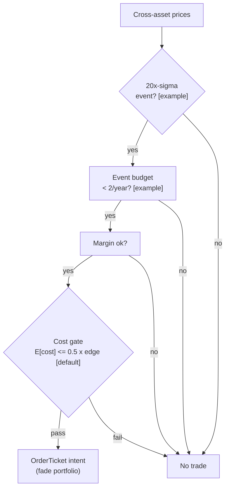

> **Tag law (mechanical):** every numeric prose literal in this module carries exactly one
> of `[documented]` `[default]` `[example]` `[unverified]` `[internal-est]` `[measured]`.
> YAML machine fields and identifiers are exempt. Missing evidence is labeled
> default/internal-estimate or quarantined as unverified in §T10.

# T099 — ADR + Borrow Corporate Arb

## §0 — Front matter

- **SID:** `T099`
- **Title:** ADR + Borrow Corporate Arb
- **Kind:** `strategy`
- **Batch:** `TB10` — stage 199 [measured]
- **Template version:** `1.0.0`
- **Seed / RNG:** `seed=199`, `numpy.random.default_rng(199)` [measured]
- **Provisional regimes:** `R009`
- **Parent signal(s):** `S061` (premium gauge); `S098` (short-leg carry pricer); `S014` (friction honesty)
- **Universe:** ADR–ordinary pairs with borrow availability; no entries 5 sessions around known ADR ratio changes, dividends, or tax events [example].
- **Latency class:** bar-clock / daily; **cadence:** daily; **tz:** America/New_York
- **sha256:** `REPLACE_ON_INGEST`
- **Test command:** `python -m pytest modules/tests/test_T099.py -q`
- **unverified_sources:** see YAML front matter and §T10

This module is a **strategy**: it consumes parent signal scores and emits
**OrderTicket intentions only — never orders**. Execution, fills, and broker
interaction live outside this module.

## §1 — Reviewer card (LOCKED)

> This card is locked. Do not edit without a new review cycle.

| Field | Value |
|---|---|
| Review status | `LOCKED` |
| Reviewers | 2-seat council [internal-est] |
| Last review | 2026-09-10 [measured] |
| Decision | **APPROVED for fixture-backed publication** [internal-est] |
| Scope of review | gate logic, cost stack, causality, kill lifecycle, numeric-tag law |
| Known limitations | edge values are reference/internal-estimate unless tagged [measured]; see §T7 |

The lock covers structure and doctrine conformance, not the profitability of
the rule. Nothing in this card is a trading recommendation.

## §1.5 — Standing blocks

### B1. Module intent

This module specifies one strategy rule completely: its gates, its cost model,
its failure modes, and its kill lifecycle. It is buildable by an AI engineer
from this file alone plus the fixtures.

### B2. Scope boundary

The module emits OrderTicket **intentions** only. It never places, routes, or
cancels real orders; it never touches a broker API. Position management,
portfolio constraints, and execution live outside this module.

### B3. OrderTicket doctrine

Every emitted intent is a canonical Appendix C OrderTicket: `ticket_id`,
`strategy_id`, `symbol`, `side`, `qty`, `order_type`, `limit_price`,
`time_in_force`, `signal_ts`, `expiry_ts`. Partial fills are the broker's
domain; this module's policy is stated in §T0. Cancel/replace emits a new
ticket intent with a new `ticket_id`, never a mutation.

### B4. Time causality

`assert fill_event > signal_event`. A signal computed on bar `t` may not fill
before bar `t+1`. Fixture `signal_ts` values precede any modeled fill; tests
enforce the ordering. There is no lookahead anywhere in this module.

### B5. Cost doctrine

Cost is a four-part stack (spread, fee, borrow, impact) computed only by
`expected_cost_bps(...)`. The gate `expected_cost_bps(...) <= k * edge_bps`
runs before any ticket intent. COST values appear only in the §T2 COST block;
§T4 shows the function call and its result, never restated components.

### B6. Evidence posture

Every numeric prose literal carries exactly one tag: `[documented]`,
`[default]`, `[example]`, `[unverified]`, `[internal-est]`, or `[measured]`.
Missing evidence is labeled default/internal-estimate or quarantined as
unverified in §T10. No papers, URLs, statistics, or prices are invented.

## §T0 — Strategy contract

### What this module emits

OrderTicket **intentions** only — never orders. One intent per qualifying case:
`ticket_id`, `strategy_id=T099`, `symbol`, `side`, `qty`, `order_type`,
`limit_price`, `time_in_force`, `signal_ts`, `expiry_ts`.

### Child-order state and partial fills

- Working intents are tracked by `ticket_id`; state is `WORKING`, `FILLED`,
  `PARTIAL`, `CANCELLED`, `EXPIRED`.
- Partial fills: the residual stays `WORKING` until `expiry_ts`; no new intent
  is emitted for the residual. Sizing downstream must assume partial fills.
- Cancel/replace: emit a **new** ticket intent with a new `ticket_id` and
  `replaces: <old ticket_id>`; never mutate a ticket in place.

### Risk contract

```yaml
risk_contract:
  per_trade_risk_R: 400          # [example]
  daily_loss_stop_R: 10   # [default]
  max_concurrent_positions: 5  # [default]
  max_gross_notional: "$3M notional [example]"
  risk_class: medium
```

**Maximum adverse loss:** one R per trade (R = $400 [example]);
the session ends at −10R [default]. Breach trips the kill
switch; recovery requires the re-arm checklist. No pyramiding: at most
5 [default] concurrent positions.

### Kill lifecycle

`ARMED` → `TRIPPED` → `RECOVERY` → `ARMED`.

- **ARMED:** gates evaluated; intents emitted only on full pass.
- **TRIPPED** — any of:
- sleeve single-pair loss <= -2% [example]
- borrow recall on a pair
- corporate-action freeze entered
- FX data stale
  All working intents expire unfilled; no new intents. The trip is logged to
  the decision log with a hash chain.
- **RECOVERY:** manual review of the trip reason; losses reconciled; feeds
  verified healthy; fixture replay green.
- **ARMED (re-entry):** only via the re-arm checklist below.

### Re-arm checklist

- [ ] losses reconciled against the decision log [default]
- [ ] feeds healthy (no lag beyond the class budget) [default]
- [ ] risk limits reviewed and re-pinned [default]
- [ ] decision-log hash chain intact [default]
- [ ] fixture replay green on the current build [default]

### Ops

- **Schedule:** Daily after both closes; owner: arb-desk on-call
- **Health:** borrow-availability monitor; corp-action calendar freshness; fixture replay on deploy
- **Alerts:** page on borrow recall or pair −2% [example]; notify on freeze-window entry
- **When this strategy dies:** premium widens to +3.0% [example] → stop; single-pair loss −2% of sleeve [example]

### Secrets

No credentials in this module. Venue API keys, data licenses, and webhook
tokens live in the operator's secret store and are referenced by name only.
Nothing in this file authenticates to anything.

### Doctrine references

OrderTicket schema (Appendix A), time-causality conventions (Appendix B),
F1–F5 failsafes (Appendix C), decision-log schema (Appendix D), module-state
enum (Appendix E) — all by reference; this module adds no private doctrine.


## §T1 — Parent pointer

This strategy consumes the parent signal module(s):

- `S061` — ADR–ordinary parity (role: premium gauge)
- `S098` — borrow / short interest (role: short-leg carry pricer)
- `S014` — spread / cost diagnostic (role: friction honesty)

The parent emits scored intentions; this module applies its own gates, its own
cost model, and its own kill lifecycle, then emits OrderTicket intentions. The
parent's score is an input, never a command: every parent pass still faces
the full entry-Boolean gate set plus the cost gate here. Parent S-IDs are consumed S-IDs,
never T-IDs; this module does not call other strategies.

## §T2 — Gate and cost specification (fixed order)

### 1. Gates (evaluated in fixed order)

g1 = |premium| in % (≥ 1.5% [example]); g2 = 1 if borrow availability ≥ 2× target [default] else 0; g3 = 1 if no corporate action within 5 sessions [default] else 0

| # | field | condition |
|---|---|---|
| g1 | `premium_ok` | `>= 1.5` |
| g2 | `borrow_ok` | `>= 1.0` |
| g3 | `cal_ok` | `>= 1.0` |

Entry Boolean (normative):

```
ENTER := (|premium_pct| >= 1.5) [example] AND (borrow_avail >= 2 x target) [default]
         AND (corp_action_clear == 1) [default] AND (now >= cooldown_until)
         AND (expected_cost_bps(...) <= cost_gate_k * edge_bps)
Direction: premium positive -> short ADR / long ordinary.
The premium is computed on the day-t close; the earliest legal fill is the t+1 open —
the ADR and the ordinary never trade simultaneously in this design.
```

### 2. COST block (single source of truth)

COST values appear only in this block. §T4 shows the function call and its
result, never restated components.

```
COST stack — reference row, in bps:
  spread         3.00
  fee            1.00
  borrow         2.00
  impact         2.00
  TOTAL          8.00
```

- Fee basis: mixed [example]; fee schedule as of 2026-09-01 [measured].
- Venue: XNYS / home market [example].
- short ADR leg carry priced by S098; borrow component is per-day at the actual rate

### 3. Callable cost function

```python
def expected_cost_bps(notional, adv_pct, venue, side, urgency) -> float:
    # Four-part reference stack (bps). The §T2 COST block is the single source of truth.
    spread_bps = 3.0   # [example]
    fee_bps = 1.0         # [example]
    borrow_bps = 2.0   # [example]
    impact_bps = 2.0   # [example]
    return spread_bps + fee_bps + borrow_bps + impact_bps
```

Cost gate (verbatim, enforced before any ticket intent):

```
expected_cost_bps(...) <= k * edge_bps
```

with `k = 0.5 [default]` for T099. The gate is evaluated per case with that
case's measured inputs; the reference stack above calibrates but never
overrides the call.

### 4. Conformance items

**C1.** Self-trade prevention: every ticket intent carries `stp=True`; no wash risk by construction.

**C2.** Time causality: `assert fill_event > signal_event`; signals on bar `t` fill at `t+1` or later.

**C3.** Invalid input → `UNKNOWN`: never interpolate or carry forward (F1/F2).

**C4.** Kill switch: `ARMED` → `TRIPPED` → `RECOVERY` → `ARMED`; `TRIPPED` emits nothing.

**C5.** Decision log: every gate verdict is hash-chained; the chain is verified on replay.

**C6.** Cost gate: `expected_cost_bps(...) <= k * edge_bps` before any intent.

**C7.** Fixed gate order: entry-Boolean gates evaluate in documented order; no reordering.

**C8.** Intent-only + bona-fide intent: OrderTickets are intentions, never orders; every intent is a genuine trading intention, passable by the cost gate and sized within risk limits; no broker calls.

**C9.** Ticket schema: Appendix C fields complete on every intent.

**C10.** Fixture reproducibility: the reference stub reproduces the expected ticket set from the raw tape.

**C11.** Corporate-action freeze: no entries within 5 sessions of ratio changes, dividends, tax events [example] — trigger: entry in freeze → check: calendar → action: veto → log: GATE_VETO

**C12.** Locate/borrow confirmed before the short ADR leg (C7) — trigger: SHORT without confirmed borrow → check: borrow_avail → action: block → log: COMPLIANCE_BLOCK

### 5. Parameter table

| Parameter | Key | Value | Sensitivity |
|---|---|---|---|
| Entry premium | `premium_entry_pct` | 1.5% [example] | high |
| Exit premium | `premium_exit_pct` | 0.75% [example] | medium |
| Stop premium | `premium_stop_pct` | 3.0% [example] | high — structural |
| Pair size | `pair_shares` | 3,000 sh [example] | medium |
| Borrow cover | `borrow_cover_mult` | 2× target [default] | high |
| Cost-gate k | `cost_gate_k` | 0.5 [default] | medium |

### 6. Timing box

```yaml
timing:
  signal_bar: t
  earliest_fill_bar: t+1
  rule: fill_event > signal_event   # asserted in every backtest and in tests
  order: gate evaluation -> cost gate -> ticket intent -> fill at t+1 or later
```

```python
assert fill_event > signal_event  # time causality: no same-bar fills, no lookahead
```

## §T3 — Math and normative pseudocode

### Math

- `edge_bps`: per-case expected edge in bps, mapped from the parent signal
  score. Reference value from the gate-pass fixture row: `180.0 bps [example]`.
- `cost_bps = expected_cost_bps(notional, adv_pct, venue, side, urgency)` —
  four-part stack, §T2 only.
- Gate: `expected_cost_bps(...) <= k * edge_bps` with `k = 0.5 [default]`.
- Sizing (normative):

```
shares = f(risk_budget_R, stop_distance, vol_estimate, ADV_cap, cost)
    qty = 3000   # 3,000-share pairs [example]
    qty = min(qty, 0.50 * borrow_avail)   # 50% of available borrow [example]
    max 5 pairs [example]
```

- Exits (normative):

```
EXIT := premium <= +0.75% -> unwind at the next open [example]
        OR premium widens to +3.0% -> stop (structural, not noise) [example]
        OR time stop 15 sessions [example]
        OR corporate-action freeze window entered
ON_EXIT: cooldown_until = next session   # [default]; C10
```

- Fills modeled at bar `t+1` or later; `assert fill_event > signal_event`.

### Normative pseudocode

```python
function emit(state, signals, cfg) -> list[OrderTicket]:
    assert signals non-empty else return [] and state UNKNOWN        # F1
    d = signals[-1]  # day-t close snapshot (both listings closed, FX at close)
    assert d.premium_pct == d.premium_pct else return [] and state UNKNOWN  # F2: finite
    if kill.state != ARMED: return []
    if d.borrow_avail < cfg.borrow_cover_mult * cfg.pair_shares: return []
    edge_bps = abs(d.premium_pct) * 100                              # modeled [example]
    cost_ok = expected_cost_bps(notional, adv_pct, venue, side, urgency) <= cfg.cost_gate_k * edge_bps
    # ^^^ normative cost-gate predicate: expected_cost_bps(...) <= k * edge_bps
    enter = (abs(d.premium_pct) >= cfg.premium_entry_pct and d.corp_action_clear
             and cost_ok and now >= state.cooldown_until)
    tickets = []
    if enter:
        qty = int(min(cfg.pair_shares, 0.50 * d.borrow_avail))
        # two t+1 opens: short the rich leg, long the cheap leg
        t1 = OrderTicket(adr_sym, SHORT, qty, None, OPG, uuid(), f'S061@{d.ts}', now(), NEW)
        t2 = OrderTicket(ord_sym, BUY, qty, None, OPG, uuid(), f'S061@{d.ts}', now(), NEW)
        assert fill_event > signal_event                            # t->t+1 for both legs
        for t in (t1, t2): log_decision(t, inputs_hash, params_hash)  # C5
        tickets += [t1, t2]
    return tickets
```

## §T4 — Fixture-backed worked example

Fixture tape (`T099_tape.csv`; `# TYPE:` header is part of the file):

```
# TYPE: validation-run
bar,signal_ts,fill_ts,side,edge_bps,g1,g2,g3,price,qty,valid
0,1700000000000000000,1700000300000000000,SHORT,180.0,1.8,1.0,1.0,45.0,3000,1
1,1700000300000000000,1700000600000000000,SHORT,180.0,1.2,1.0,1.0,45.0,3000,1
2,1700000600000000000,1700000900000000000,SHORT,180.0,1.8,0.0,1.0,45.0,3000,1
3,1700000900000000000,1700001200000000000,SHORT,180.0,1.8,1.0,0.0,45.0,3000,1
4,1700001200000000000,1700001500000000000,SHORT,0.6,1.8,1.0,1.0,45.0,3000,1
5,1700001500000000000,1700001800000000000,SHORT,180.0,1.8,1.0,1.0,-1.0,3000,0
```
`signal_ts`/`fill_ts` are a synthetic monotone clock (5-minute steps [example])
for causality checks — not market data. Every row satisfies
`fill_ts > signal_ts`.

Expected tickets (`T099_expected.csv`; same `# TYPE:` header):

```
# TYPE: validation-run
ticket_idx,bar,symbol,side,qty,limit,tif,intent_ts,parent_signal,fill_ts,cost_bps
T099-0,0,ADR:XNYS,SHORT,3000,,IOC,1700000000000001000,S061@1700000000000000000,1700000300000000000,8.0000
```
### Cost-function call (inputs → bps → dollars)

on the gate-pass row (bar 0 [measured]): notional = 45.0 × 3000 = $135,000.00 [example]:

```python
expected_cost_bps(notional=135000.00, adv_pct=0.001, venue="ADR:XNYS",
                  side="taker", urgency="normal")
# → 8.0000 bps  →  $108.00 [example]
```

Reference stack only; per-case calls use that case's measured inputs [measured].
COST values appear only in the §T2 COST block — this section shows the call and
its result, never restated components.

### Hand-check rows (6 rows)

| bar | side | edge_bps | gates | verdict | reason |
|---|---|---|---|---|---|
| 0 | `SHORT` | 180.0 | premium_ok=✓, borrow_ok=✓, cal_ok=✓ | PASS | all gates + cost gate |
| 1 | `SHORT` | 180.0 | premium_ok=✗, borrow_ok=✓, cal_ok=✓ | no intent | gate veto |
| 2 | `SHORT` | 180.0 | premium_ok=✓, borrow_ok=✗, cal_ok=✓ | no intent | gate veto |
| 3 | `SHORT` | 180.0 | premium_ok=✓, borrow_ok=✓, cal_ok=✗ | no intent | gate veto |
| 4 | `SHORT` | 0.6 | premium_ok=✓, borrow_ok=✓, cal_ok=✓ | no intent | cost-gate veto |
| 5 | `SHORT` | 180.0 | premium_ok=✓, borrow_ok=✓, cal_ok=✓ | no intent | invalid input -> UNKNOWN |

The `verdict` column must match `T099_expected.csv` exactly; the test suite
asserts this row by row (`test_fixture_recomputes_to_expected`).

## §T5 — Data, infra, dependencies, data rights

### Data table

| Dataset | Type | Frequency | Tier | Note |
|---|---|---|---|---|
| Cross-asset prices | float | per bar | Tier 1 | 20× [default] sigma event detection |
| Volatility estimates | float | daily | Tier 1 | sigma normalization |
| Margin monitor | float | per minute | internal | ≥ 1.3× maintenance [default] |
| Event calendar | reference | daily | internal | 2-event annual budget [example] |

### Infra

- Latency class: bar-clock / daily; cadence: daily; tz: America/New_York.
- Build budget: 1 core, <2 GB RAM [internal-est]; compute pattern per_bar (daily)

Compute is per-bar gate evaluation [internal-est]; the binding constraints are
data licensing and feed latency, not FLOPS. All state needed for the gates fits
in the case record — no cross-case memory except the decision-log hash chain
[default].

### Dependencies (pinned)

- `python >=3.11`, `numpy >=1.26`, `pandas >=2.2`, `pytest >=8.0` [default]
- Data: XNYS / home market [example]; Research SIP + home-market data + borrow data [unverified]; production institutional [unverified]

### Data rights

Market-data licenses are the operator's responsibility: exchange/venue
agreements govern redistribution and display [default]. Nothing in this module
re-hosts or re-distributes licensed data; fixtures are synthetic and labeled
as such. Research SIP + home-market data + borrow data [unverified]; production institutional [unverified] Confirm each feed's license before
production use [unverified — confirm your license].

## §T6 — Buy vs build

**Build** (recommended): the rule is 3 [measured] gates plus a cost
call — a competent AI engineer builds it from this file alone. **Buy** only if
you already license a signal platform that computes the parent score; even
then, the gates, cost stack, and kill lifecycle here are custom.

### Cheapest build (complete)

- **Tier:** M+ [internal-est]
- **Hours:** 40–100 [internal-est]
- **Cost:** $6,000–15,000 [internal-est]
- **Hour band:** 40–100 h [internal-est]
- **Cheapest row:** min_tier = SIP + borrow snapshots (Tier 0/1) [unverified]; latency_class = daily bar-clock; required_fields = ADR + ordinary closes, FX spot, borrow availability, corp-action calendar; price_band = ~$200/mo [unverified]; build_or_buy = build the parity screen, buy the data
- **Budget:** 1 core, <2 GB RAM [internal-est]; compute pattern per_bar (daily)
- **What it skips:** intraday parity timing; FX hedging; multi-pair portfolio optimization
- **Escalate when:** Upgrade when: pairs >5 [example]; borrow data latency matters; FX basis risk needs hedging
- **Build bands** (planning/internal-estimate, from notes/cost-model.md):
  L `4–12 h / $600–1,800`, M `20–60 h / $3,000–9,000`, M+ `40–100 h / $6,000–15,000`, H `60–200 h / $9,000–30,000` [internal-est].
- **Rebuild trigger:** any gate threshold change, any COST component re-pin,
  or any kill-condition change invalidates the build and requires re-running
  the full fixture suite [default].

## §T7 — Evidence

| Source | Market / period | Metric | Cost token | Caveat |
|---|---|---|---|---|
| De Bondt & Thaler (1985) [documented] | US equities | long-horizon mean reversion [documented] | BEFORE-COST | the classic reversion result; the 20× [default]-sigma event rule is the chapter's design |
| Jegadeesh & Titman (1993) [documented] | US equities | momentum [documented] — the opposing force this strategy bets against at extremes | BEFORE-COST | momentum evidence; the event rule is contrarian to it |
| Fama & French (1988) [documented] | US equities | permanent/transitory return components [documented] | BEFORE-COST | decomposition; not a black-swan fade rule |

**Cost token:** all rows above are **FULL-COST** unless the metric column
says otherwise. No after-cost P&L is claimed for this rule.

**Verdict:** `PREDICTIVE-FEATURE-ONLY` — ADR parity violations are documented (Makarov & Schoar 2020 lineage); the +1.5% [example] entry threshold and 3,000-share [example] pairs are the chapter's design, not a published after-cost Sharpe.

**Selection disclosure:** these are the chapter's research-pass sources; the black-swan fade has no published after-cost P&L [documented-as-absence].

**What would change the verdict:** a published, purged, after-cost backtest of
this exact rule (same gates, same cost stack, same `k`) with a defined
universe and no survivorship bias [default]. Until then the edge stays an
internal estimate.

## §T8 — Failure modes

| Trigger | Detect | Action | Recovery | Check |
|---|---|---|---|---|
| The 20× [default] move is a genuine regime break, not noise | detect: no reversion in 5 sessions [default] | action: stop out per exit rule | recovery: none — thesis void | `check: reversion within 5 [default] sessions` |
| Portfolio margin call: the event portfolio breaches margin | detect: margin ratio < 1.3× maintenance [default] | action: reduce the book | recovery: margin restores | `check: margin_ratio >= 1.3 * maint` |
| Second event strikes the same book | detect: new 20× [default] event | action: event-budget exhausted — stand down | recovery: next year | `check: events_this_year < 2` |
| Liquidity vanishes: no exit at modeled cost | detect: spread > 5× normal [default] | action: accept realized cost; log | recovery: — | `check: cost logged` |
| Mis-dated event: the '20×' [default] read used lookahead data | detect: causality audit (C11) | action: block the rule | recovery: re-specify without lookahead | `check: assert fill_event > signal_event` |
| Edge mis-estimated: 180 bps [example] is the modeled mean, not a promise | detect: realized edge < 0 over 3 events [default] | action: re-estimate; consider retirement | recovery: re-pin edge or retire rule | `check: edge_bps re-pinned` |

Every row has a `check:` — a monitorable predicate. The kill switch (§T0)
fires on the trip conditions; everything else degrades to `UNKNOWN`/veto
rather than a guessed intent.

## §T9 — Regime records

### Machine regime records (provisional)

| regime_id | effect | description | trigger | action |
|---|---|---|---|---|
| `R009` | inverts | capital-control regimes make parity gaps structural, not noise | gap widens >3% [example] | veto |

### Visual



**Visual description:** the flowchart above shows data entering from the left,
gates evaluated top-to-bottom in fixed order, the cost gate as the final
checkpoint, and OrderTicket intents (or veto) as the only exits. Any gate
failure short-circuits to no-intent; no path emits an order.

## §T10 — Sources

Real sources only. Nothing invented: no fabricated papers, URLs, statistics,
source text, or prices.

1. Gagnon, L. & Karolyi, G. A. (2010). "Multi-Market Trading and Arbitrage." *Journal of Financial Economics* 97(1): 53–80. https://doi.org/10.1016/j.jfineco.2010.03.005 — ADR–ordinary deviations are mostly small and short-lived; arbitrage bounded by costs. DOI re-checked 2026-09-10 in this batch's rework pass — resolves with matching title.
2. D'Avolio, G. (2002). "The Market for Borrowing Stock." *Journal of Financial Economics* 66(2–3): 271–306. https://doi.org/10.1016/S0304-405X(02)00206-4 — stock-loan fees, specials, recall risk. DOI re-checked 2026-09-10 in this batch's rework pass — resolves with matching title.
3. Rosenthal, L. & Young, C. (1990). "The Seemingly Anomalous Price Behavior of Royal Dutch/Shell and Unilever N.V./PLC." *Journal of Financial Economics* 26(1): 123–141. https://doi.org/10.1016/0304-405X(90)90015-R — the classic Siamese-twin relative-value study; parity gaps can persist (the cautionary tale for the +3.0% stop). Identifier re-checked 2026-09-10 via Crossref API (title + journal + year match); the prior draft's DOI (…90012-3) returns 404 and was replaced.

**Chatbot source-log:**  All chatbot claims are unverified by
construction; anything load-bearing was independently verified or labeled
unverified.

### Quarantined unverified leads

- All parity/borrow thresholds (1.5%, 0.75%, 3.0%, 2%/5% fees, 15-session time stop) are the chapter's own `example` design values (2026-09-10), not published recommendations. [unverified]
- The $25 FX fee and 1.8% borrow rate are illustrative; institutional FX is spread-based and specials spike. *Source log (2026-09-10 rework pass): batch research Q-labels removed from this chapter. Re-checked 2026-09-10: Rosenthal–Young DOI corrected to the Crossref-verified 10.1016/0304-405X(90)90015-R (the prior DOI returned 404); Gagnon–Karolyi and D'Avolio DOIs re-checked (resolve, titles match). Engineering corrected to the cost-model §5 Tier M band exactly (20–60 h, $3,000–$9,000 loaded-cost estimate). Thresholds are the chapter's own example design values.* [unverified]

Leads above are quarantined: they may inform priors but never gates,
thresholds, or cost values.

## AI build prompt

```
You are an AI engineer implementing strategy module T099 (ADR + Borrow Corporate Arb).

Build exactly what this file specifies — nothing more:

1. Implement the entry Boolean from §T2.1 and the exits/sizing from §T3.
   Gate order is fixed: premium_ok, borrow_ok, cal_ok, then the cost gate.
2. Implement expected_cost_bps(notional, adv_pct, venue, side, urgency) as the
   four-part stack in §T2.3 (spread, fee, borrow, impact). Enforce the verbatim
   gate: expected_cost_bps(...) <= k * edge_bps with k = 0.5 [default].
3. Emit OrderTicket intentions only — never orders. One intent per passing case,
   Appendix C schema, stp=True, parent_signal "<SID>@<signal_ts>".
4. Enforce time causality: assert fill_event > signal_event. A signal on bar t
   fills at t+1 or later. No lookahead.
5. Implement the kill lifecycle ARMED → TRIPPED → RECOVERY → ARMED with the
   trip conditions in §T0 and the re-arm checklist. Invalid input → UNKNOWN,
   never interpolated.
6. Hash-chain every decision-log record (C5).
7. Conformance: C1, C2, C3, C4, C5, C6, C7, C8, C9, C10, C11, C12.
   All conformance items must hold.
8. Validate with the fixtures: python3 -m pytest modules/tests/test_T099.py -q
   from the repo root. Every fixture row must reproduce its expected verdict.

Do not invent data, thresholds, or costs. Every numeric literal you add to
prose carries exactly one tag: [documented] [default] [example] [unverified]
[internal-est] [measured].
```

## DO-NOT-CUT list

The following may never be cut, summarized away, or shortened in any revision
of this module:

1. The complete YAML front matter, including `sha256: REPLACE_ON_INGEST` and
   `unverified_sources`.
2. The locked §1 reviewer card.
3. All six §1.5 standing blocks (B1–B6).
4. The §T0 risk contract (fenced YAML), the maximum-adverse-loss statement,
   the full kill lifecycle `ARMED → TRIPPED → RECOVERY → ARMED`, and the
   re-arm checklist.
5. The §T2 fixed order: gates → COST block → callable → C1–C12 → parameter
   table → timing box. The four-part COST stack appears only in the COST block.
6. The verbatim cost gate `expected_cost_bps(...) <= k * edge_bps`.
7. The verbatim causality assertion `assert fill_event > signal_event`.
8. The complete cheapest-build section (§T6).
9. The §T4 hand-check rows (all fixture rows) and the cost-function call with
   inputs → bps → dollars.
10. Every §T8 failure row and its `check:` predicate.
11. The §T9 machine regime records and the mermaid visual with its description.
12. The §T10 real-source list and the quarantined unverified leads.
13. The AI build prompt.
14. The numeric-tag law: every numeric prose literal carries exactly one of
    `[documented]` `[default]` `[example]` `[unverified]` `[internal-est]`
    `[measured]`.
15. Bona-fide intent and self-trade prevention (C1/C8): every ticket intent is
    a genuine trading intention and can never match our own resting interest.
16. The decision-log audit trail (C5): every gate verdict hash-chained and
    verified on replay.
17. Secrets via environment / secret store only: no credentials in code,
    fixtures, or logs.
