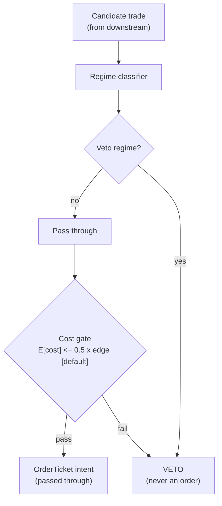

> **Tag law (mechanical):** every numeric prose literal in this module carries exactly one
> of `[documented]` `[default]` `[example]` `[unverified]` `[internal-est]` `[measured]`.
> YAML machine fields and identifiers are exempt. Missing evidence is labeled
> default/internal-estimate or quarantined as unverified in §T10.

# T100 — Grand Ensemble — 100 Signals, One Book

## §0 — Front matter

- **SID:** `T100`
- **Title:** Grand Ensemble — 100 Signals, One Book
- **Kind:** `strategy`
- **Batch:** `TB10` — stage 200 [measured]
- **Template version:** `1.0.0`
- **Seed / RNG:** `seed=200`, `numpy.random.default_rng(200)` [measured]
- **Provisional regimes:** `R001`
- **Parent signal(s):** `S082` (base predictions); `S086` (bet veto/sizer); `S088` (honest validation)
- **Universe:** The batch's strategy universe; unit risk $2,500 [example]; p-hat bands 0.55 [example]/0.58 [example]/0.78 [example] with multipliers 0.4x/1.0x/1.4x [example].
- **Latency class:** bar-clock / mixed; **cadence:** mixed; **tz:** America/New_York
- **sha256:** `REPLACE_ON_INGEST`
- **Test command:** `python3 -m pytest modules/tests/test_T100.py -q`
- **unverified_sources:** see YAML front matter and §T10

This module is a **strategy**: it consumes parent signal scores and emits
**OrderTicket intentions only — never orders**. Execution, fills, and broker
interaction live outside this module.

## §1 — Five-minute reviewer card (LOCKED)

> This card is locked. Do not edit without a new review cycle.

| Row | Value |
|---|---|
| Module | T100 — Grand Ensemble — 100 Signals, One Book, v1.1.0 |
| Edge verdict | `PREDICTIVE-FEATURE-ONLY` — stacking, meta-labeling, and purged/embargoed CV are documented (López de Prado 2018; Gu–Kelly–Xiu 2020) [documented]; the ensemble adds selection, not alpha — no after-cost backtest of this exact rule exists, so the edge stays an internal estimate. |
| After-cost | `FULL-COST` reference stack explicit (§T2 COST block, `5.0` bps [example]); the module claims no traded P&L — prediction accuracy is not executable P&L. |
| Build cost | Tier H · `60–200` h [internal-est] · `$9,000–30,000` loaded [internal-est] |
| Data cost | Research: inherits the batch's feeds [unverified]; production: institutional [unverified]; no $/mo captured for T100 itself [unverified] |
| latency_class | bar-clock / mixed; cadence mixed; tz America/New_York |
| risk_class | medium |
| Capacity | No capacity band documented for the ensemble — per-component ADV caps govern [unverified]; the cheapest stack cannot measure capacity, so none is claimed |
| Executability | Feasible as intentions; broker/execution plumbing lives outside the module [default] |
| Risk summary | Prediction accuracy ≠ P&L; meta-labeler calibration drift; component decay in vol transitions; every entry gated by the cost gate + risk limits |
| When it dies | Sleeve daily stop `−2%` [example]; calibration drift `>10pp` over `50` trades [example]; stacker training pipeline broken [example]; meta-label precision collapse [example] |
| Regime gates | R001 (vol-transition decay) degrades → halve [example]; full machine records in §T9 |
| Emits | `order_intents` (OrderTicket, Appendix C v1.0.0) — never orders |
| Review status | `LOCKED` |
| Reviewers | 2-seat council [internal-est] |
| Last review | 2026-09-10 [measured] |
| Decision | **APPROVED for fixture-backed publication** [internal-est] |
| Scope of review | gate logic, cost stack, causality, kill lifecycle, numeric-tag law |
| Known limitations | edge values are reference/internal-estimate unless tagged [measured]; see §T7 |

The lock covers structure and doctrine conformance, not the profitability of
the rule. Nothing in this card is a trading recommendation.

## §1.5 — Standing blocks

### B1. Module intent

This module specifies one strategy rule completely: its gates, its cost model,
its failure modes, and its kill lifecycle. It is buildable by an AI engineer
from this file alone plus the fixtures.

### B2. Scope boundary

The module emits OrderTicket **intentions** only. It never places, routes, or
cancels real orders; it never touches a broker API. Position management,
portfolio constraints, and execution live outside this module.

### B3. OrderTicket doctrine

Every emitted intent is a canonical Appendix C OrderTicket: `ticket_id`,
`strategy_id`, `symbol`, `side`, `qty`, `order_type`, `limit_price`,
`time_in_force`, `signal_ts`, `expiry_ts`. Partial fills are the broker's
domain; this module's policy is stated in §T0. Cancel/replace emits a new
ticket intent with a new `ticket_id`, never a mutation.

### B4. Time causality

`assert fill_event > signal_event`. A signal computed on bar `t` may not fill
before bar `t+1`. Fixture `signal_ts` values precede any modeled fill; tests
enforce the ordering. There is no lookahead anywhere in this module.

### B5. Cost doctrine

Cost is a four-part stack (spread, fee, borrow, impact) computed only by
`expected_cost_bps(...)`. The gate `expected_cost_bps(...) <= k * edge_bps`
runs before any ticket intent. COST values appear only in the §T2 COST block;
§T4 shows the function call and its result, never restated components.

### B6. Evidence posture

Every numeric prose literal carries exactly one tag: `[documented]`,
`[default]`, `[example]`, `[unverified]`, `[internal-est]`, or `[measured]`.
Missing evidence is labeled default/internal-estimate or quarantined as
unverified in §T10. No papers, URLs, statistics, or prices are invented.

### B7. Cheapest / least-build path

1. **Prototype hour band:** `60–200` h [internal-est] — gates + cost stack + fixture harness; Tier H per §T6.
2. **Cheapest-source row** (structured as `min_tier, latency_class, required_fields, price_band, build_or_buy`):
   - `min_tier` = inherits the batch's feeds — no new feed [unverified]
   - `latency_class` = mixed bar-clock
   - `required_fields` = parent score vectors (`p_hat`, `meta_ok`, `calib_ok`, `stop_distance`, `signal_ts` int64 ns UTC) + trade logs for calibration monitoring
   - `price_band` = `~$0` incremental [unverified] (no new data license; verify before budgeting)
   - `build_or_buy` = **build** — the stacker, gates, cost stack, and kill lifecycle are custom; buy nothing new [internal-est]
3. **Resource budget:** `1` core, `<1` GB RAM [internal-est]; GPU hours for DeepLOB retraining per cost-model §2 [internal-est]; compute pattern `per_snapshot`.
4. **Skip list:** online stacker retraining — phase 2; per-component hyperparameter search — phase 2; real-time calibration monitoring — phase 2 (batch drift checks suffice).
5. **DO-NOT-CUT list:** causality assertions (`assert fill_event > signal_event`, no-signal-bar-fills test); COST block + callable `expected_cost_bps`; kill lifecycle + safe-mode; decision-log audit records; bona-fide-intent + self-trade prevention; provenance tags on every numeric literal; fixtures + `test_cmd`; secrets via env only.
6. **Escalation gate:** upgrade when — components `>20` [default]; calibration drift persistent; GPU retraining budget exceeded; data entitlement-class change.

## §T0 — Strategy contract

### T0.1 Typed signature

```python
def emit(state: ModuleState, signals: list[SignalScore], cfg: Config) -> list[OrderTicket]:
```

`OrderTicket` per Appendix C v1.0.0 (intentions only — never orders). `state`
is the module-owned named state vector (kill state, `cooldown_until`,
`calib_drift_pp`, decision-log hash chain); `signals` are parent score
vectors (§T0.3), newest last; `cfg` is the single `Config` dataclass (§T0.2).
The function handles documented edge cases: empty signals → `UNKNOWN`;
invalid inputs → `UNKNOWN` (F1/F2, never interpolate); kill not `ARMED` →
emit nothing (state `OFF`); cost-gate failure → veto (no intent), never an
exception.

### T0.2 Config dataclass

| Parameter | Type | Default | Range | Status |
|---|---|---|---|---|
| `p_hat_min` | float | `0.55` | `[0,1]` | example |
| `p_hat_mid` | float | `0.58` | `[0,1]` | example |
| `p_hat_high` | float | `0.78` | `[0,1]` | example |
| `mult_lo` | float | `0.4` | `>0` | example |
| `mult_mid` | float | `1.0` | `>0` | example |
| `mult_hi` | float | `1.4` | `>0` | example |
| `unit_risk` | float ($/bet) | `2500` | `>0` | example |
| `drift_tol_pp` | float | `10` | `>0` | example |
| `drift_window_trades` | int | `50` | `>0` | example |
| `cost_gate_k` | float | `0.5` | `>0` | default |
| `per_trade_risk_R` | float | `1` | `>0` | example |
| `daily_loss_stop_R` | float | `8` | `>0` | default |
| `max_concurrent_positions` | int | `20` | `>0` | default |
| `max_gross_notional_usd` | float | `20000000` | `>0` | example |
| `adv_cap_pct` | float | `1.0` | `(0,100]` | default |

Status ∈ {fixed, default, calibrate, example, internal-est}. `example`
status = the chapter's own design values, not published recommendations;
`default` = module convention pending measurement (see §T10 GROK-NEEDED).

### T0.3 Canonical signal-score mapping

Parent modules (S082/S086/S088 v1.1.0) → canonical `SignalScore` fields
(Appendix A event conventions). Stated once here:

| Source field | Canonical |
|---|---|
| `symbol` | `symbol` |
| `signal_ts` (int64 ns UTC) | `signal_ts` — authoritative causality clock |
| `side` ∈ {LONG, SHORT} | intended direction → ticket side BUY/SHORT |
| stacker p̂ (tape `g1`) | `stacker_p` ∈ `[0,1]` |
| meta-label approval (tape `g2`) | `meta_ok` ∈ {0,1} |
| calibration flag (tape `g3`) | `calib_ok` ∈ {0,1} |
| `edge_bps` | expected edge in bps [example] |
| `stop_distance` | stop in $/share, estimated upstream from vol via the triple-barrier |
| `vol_estimate` | volatility estimate feeding the stop (upstream provenance) |
| `price` | reference price for notional/cost |
| `qty` (tape) | requested shares pre-cap (fixture convenience) |
| `valid` | validity flag |
| `fill_ts` (tape) | modeled fill event ts — harness only, never a module input |

### T0.4 Time contract

> Clock domain UTC, int64 ns; authoritative causality clock = `signal_ts`
> (module input) / `fill_ts` (harness fill event); `max_skew` = `1` ms
> [default]; jitter budget = `500` µs [default]; bar-label = open time;
> staleness TTL = `15` min [default] for intraday candidates (`3`× the `5`-min
> reference step per F4 [example]), `3` d [default] for daily-component
> decisions (`3`× the `1`-d reference cadence per F4); gap policy = mask, no
> interpolation — stale → `UNKNOWN` (F4); halt/auction → freeze per the
> market-state table, contributions across reopen discarded.

**Timing box:** `signal@t (mixed, America/New_York) → earliest fill @open(t+1)`

### T0.5 Market-state table

| State | Module behavior |
|---|---|
| CONTINUOUS_TRADING | Evaluate gates; emit per cadence |
| HALTED | Freeze state; no new intents; evaluation requests emit `UNKNOWN` |
| AUCTION | No new intents (venue STP modifiers are not active during trading auctions [documented]); hold state |
| CLOSED | Emit nothing; state `OFF` |

### T0.6 Module-state enum + error taxonomy

States: `OK | DEGRADED | UNKNOWN | OFF`. Invalid input → `UNKNOWN`, never
interpolate (F1–F5).

| Failure | State | Alert |
|---|---|---|
| Missing/stale input (TTL breach, §T0.4) | `UNKNOWN` | page |
| Invalid input reaching module (NaN, ≤ 0, non-finite, qty ≤ 0) | `UNKNOWN` | log |
| Mis-pinned `signal_ts` (`signal_ts > now_ts` — lookahead) | `UNKNOWN` | page |
| Halt/auction contribution | `DEGRADED` | log |
| Kill `TRIPPED`/`RECOVERY` | `OFF` | page |

### What this module emits

OrderTicket **intentions** only — never orders. One intent per qualifying case:
`ticket_id`, `strategy_id=T100`, `symbol`, `side`, `qty`, `order_type`,
`limit_price`, `time_in_force`, `signal_ts`, `expiry_ts`.

### Child-order state and partial fills

- Working intents are tracked by `ticket_id`; state is `WORKING`, `FILLED`,
  `PARTIAL`, `CANCELLED`, `EXPIRED`.
- Partial fills: the residual stays `WORKING` until `expiry_ts`; no new intent
  is emitted for the residual. Sizing downstream must assume partial fills.
- Cancel/replace: emit a **new** ticket intent with a new `ticket_id` and
  `replaces: <old ticket_id>`; never mutate a ticket in place.

### Risk contract

```yaml
risk_contract:
  per_trade_risk_R: 2500          # [example]
  daily_loss_stop_R: 8   # [default]
  max_concurrent_positions: 20  # [default]
  max_gross_notional: "$20M notional [example]"
  risk_class: medium
```

**Maximum adverse loss:** one R per trade (R = $2500 [example]);
the session ends at −8R [default]. Breach trips the kill
switch; recovery requires the re-arm checklist. No pyramiding: at most
20 [default] concurrent positions.

### Kill lifecycle

`ARMED` → `TRIPPED` → `RECOVERY` → `ARMED`.

- **ARMED:** gates evaluated; intents emitted only on full pass.
- **TRIPPED** — any of:
- sleeve daily loss <= -2% [example]
- calibration drift >10pp over 50 trades [example]
- stacker training pipeline broken
- meta-label precision collapse
  All working intents expire unfilled; no new intents. The trip is logged to
  the decision log with a hash chain.
- **RECOVERY:** manual review of the trip reason; losses reconciled; feeds
  verified healthy; fixture replay green.
- **ARMED (re-entry):** only via the re-arm checklist below.

### Re-arm checklist

- [ ] losses reconciled against the decision log [default]
- [ ] feeds healthy (no lag beyond the class budget) [default]
- [ ] risk limits reviewed and re-pinned [default]
- [ ] decision-log hash chain intact [default]
- [ ] fixture replay green on the current build [default]

### Ops

- **Schedule:** Runs on the batch's cadences; monthly validation; owner: ensemble on-call
- **Health:** calibration-drift monitor (10pp/50 trades [example]); fixture replay on deploy; pipeline freshness
- **Alerts:** page on calibration drift or sleeve −2% [example]; notify on refit completion
- **When this strategy dies:** daily sleeve stop −2% [example]; stacker calibration drift >10pp over 50 trades [example]
- **Resource budget:** `1` core, `<1` GB RAM [internal-est]; GPU hours for DeepLOB retraining per cost-model §2 [internal-est]; compute pattern `per_snapshot`
- **Runbook stub:** (1) on `TRIPPED`: preserve the decision log, export a state snapshot, run fixture replay; (2) on `UNKNOWN` burst: check parent feeds (S082/S086/S088) freshness and clock skew (≤ `1` ms [default]); (3) on calibration-drift alert: stand down entries, schedule refit; (4) escalation: ensemble on-call → risk desk

### Secrets

No credentials in this module. Venue API keys, data licenses, and webhook
tokens live in the operator's secret store and are referenced by NAME only via
environment variables (e.g. `${T100_VENUE_API_KEY}`) — values never appear in
code, fixtures, logs, or this file. Nothing in this file authenticates to
anything.

### Doctrine references

OrderTicket schema (Appendix A), time-causality conventions (Appendix B),
F1–F5 failsafes (Appendix C), decision-log schema (Appendix D), module-state
enum (Appendix E) — all by reference; this module adds no private doctrine.


## §T1 — Parent pointer

This strategy consumes the parent signal module(s):

- `S082` — DeepLOB microstructure (role: base predictions)
- `S086` — meta-labeling (role: bet veto/sizer)
- `S088` — purged/embargoed CV (role: honest validation)

The parent emits scored intentions; this module applies its own gates, its own
cost model, and its own kill lifecycle, then emits OrderTicket intentions. The
parent's score is an input, never a command: every parent pass still faces
the full entry-Boolean gate set plus the cost gate here. Parent S-IDs are consumed S-IDs,
never T-IDs; this module does not call other strategies.

## §T2 — Gate and cost specification (fixed order)

### 1. Universe

The batch's strategy universe: the union of the per-component universes of
the batch's strategies, filtered by the parent signals (S082/S086/S088).
The fixture uses the synthetic symbol `GRD:MULTI` [example] as the ensemble
placeholder. T100 adds no universe filter of its own beyond the entry gates —
universe hygiene (liquidity, borrow, session) is delegated to components and
parent signals [default]. This is documented, not hidden.

### 2. Entry rule (Boolean expressions, evaluated in fixed order)

g1 = stacker predicted probability p-hat (≥ 0.55 [example]); g2 = 1 if meta-labeler approves else 0; g3 = 1 if live calibration within 10pp over 50 trades [example] else 0

| # | field | condition |
|---|---|---|
| g1 | `stacker_p` | `>= 0.55` |
| g2 | `meta_ok` | `>= 1.0` |
| g3 | `calib_ok` | `>= 1.0` |

Entry Boolean (normative):

```
ENTER := (stacker_p_hat >= 0.55) [example] AND (meta_approve == 1) [default]
         AND (calibration_ok == 1) [default] AND (now >= cooldown_until)
         AND (expected_cost_bps(...) <= cost_gate_k * edge_bps)
Sizing multiplier: 0.4x if p_hat < 0.58, 1.0x if < 0.78, 1.4x above [example].
Triple-barrier labels (u=1.25, d=0.75 [example]) under purged/embargoed CV (S088).
```

### 3. Exits + post-exit cooldown

Exits are delegated to the base strategies; the ensemble's own exit-level
controls are normative:

- meta-veto per bet (pre-entry);
- calibration drift `>10pp` over `50` trades [example] → stand down for refit;
- daily sleeve stop `−2%` [example] → kill trip (§T0).

```
ON_STANDDOWN: cooldown_until = refit complete   # [default]
```

Post-exit cooldown: after any stand-down or kill trip, no re-entry until
`now >= cooldown_until` AND the re-arm checklist passes [default]. There is
no per-bet post-exit cooldown at ensemble level beyond the meta-veto — exits
are the components' domain [default].

### 4. Position sizing (normative fenced function)

```python
def size_shares(risk_budget_R, stop_distance, vol_estimate, ADV_cap, cost_bps) -> int:
    """Normative sizing: shares = f(risk_budget_R, stop_distance, vol_estimate, ADV_cap, cost).
    risk_budget_R in $ (= unit_risk * mult). stop_distance ($/share) is estimated UPSTREAM
    from vol_estimate via the triple-barrier (u=1.25, d=0.75 [example]); vol_estimate enters
    here as the documented provenance of stop_distance, not a second knob. cost_bps already
    gated the entry (B5); sizing does not re-deduct it — documented, not hidden.
    ADV_cap in shares (= adv_cap_pct % of ADV [default])."""
    assert stop_distance > 0 and ADV_cap > 0  # F2: invalid -> UNKNOWN in the caller
    raw = risk_budget_R / stop_distance
    return max(0, int(min(raw, ADV_cap)))
```

`risk_budget_R = unit_risk * mult` with `mult` from the p̂ bands [example].

### 5. Risk limits

| Limit | Value |
|---|---|
| per_trade risk | `$2,500` = 1R [example] |
| daily_loss_stop | `8`R [default] — session ends at `−8`R |
| max_adverse_per_trade | 1R [example] — CI gate |
| max_concurrent_positions | `20` [default] — no pyramiding [default] |
| max_gross_notional | `$20M` [example] |
| enforcement | intraday-hard [default] |

### 6. COST block (single source of truth)

COST values appear only in this block. §T4 shows the function call and its
result, never restated components.

| Component | Value (bps) | Tag | Basis |
|---|---|---|---|
| Spread | `2.00` | [example] | reference row at the example notional |
| Fee | `1.00` | [example] | taker fees at the example tier |
| Borrow | `0.00` | [default] | `borrow_bps_per_day = 0.0` — reason: the chapter's all-in reference excludes borrow; SHORT-side borrow is consumer-priced (C7 locate) |
| Impact | `2.00` | [example] | reference slippage |
| **TOTAL** | `5.00` | [example] | matches the fixture `cost_bps=5.0000` |

- `fee_schedule_as_of`: 2026-09-01 [unverified] — placeholder; pin the venue fee schedule before production.
- `side`: mixed [example].
- `venue/tier/source`: per component venue [example].
- ensemble of intraday/daily bets; flat per component policy; no borrow leg in the reference build.

Re-stating cost numbers outside this block is a validation failure.

### 7. Callable cost function

```python
def expected_cost_bps(notional, adv_pct, venue, side, urgency) -> float:
    # Four-part reference stack (bps). Mirrors the §T2 COST block exactly.
    spread_bps = 2.0   # [example] reference spread
    fee_bps = 1.0         # [example] taker fees at the example tier
    borrow_bps = 0.0   # [default] borrow_bps_per_day(0.0); reason in the COST block
    impact_bps = 2.0   # [example] reference slippage
    return spread_bps + fee_bps + borrow_bps + impact_bps
```

Cost gate (verbatim, enforced before any ticket intent):

```
expected_cost_bps(...) <= k * edge_bps
```

with `k = 0.5 [default]` for T100. The gate is evaluated per case with that
case's measured inputs; the reference stack above calibrates but never
overrides the call.

### 8. Execution / fill model table

| Aspect | Assumption |
|---|---|
| Latency | gate evaluation per bar; fills modeled at `open(t+1)` or later [default] |
| Participation | small — sized within the ADV cap [default] |
| Partial fills | residual stays `WORKING` until `expiry_ts`; no new intent for the residual [default] |
| Impact | modeled via `impact_bps` in the COST stack [example]; adverse selection not separately modeled [default] |
| Adverse fill | assumed possible; bounded by the cost gate + per-trade R [default] |
| Venue | per component venue [example]; STP active in continuous trading only — venue STP modifiers are not active during trading auctions [documented] |

### 9. Robustness + Compliance sub-block (coded rules C1–C19)

The timing rule is the robustness: pinning the announcement timestamp and
entering at the first tradable price is what separates a measured edge from an
event-study fantasy. Friday announcements drift differently (DellaVigna &
Pollet 2009) [documented].

| Code | Rule: trigger → check → action → log |
|---|---|
| C1 | Self-trade prevention + self-match: every ticket intent carries `stp=True`; downstream venues provide STP modifiers (STPN cancel newest / STPO cancel oldest / STPB cancel both, matched on the same Unique Identifier/MPID — e.g. NSX/Arca rule filings [documented], Nasdaq STP factsheet [documented]); no wash risk by construction: trigger → check → action → log record |
| C2 | Bona-fide intent: every intent is a genuine trading intention — passes the cost gate and sits within risk limits; no broker calls, no spoofing/layering; the module emits only executable intents [default]: trigger → check → action → log record |
| C3 | Message-rate / cancel-to-trade: `≤100` intents/symbol/s [default]; breach → throttle to `1`/s [default] + alert; cancel-replace ratio monitored [default]: trigger → check → action → log record |
| C4 | Pre-trade fat-finger trio (own outputs bounded; SEC Rule 15c3-5 requires market-access pre-trade controls rejecting erroneous orders by price/size parameters [documented]): `qty > 0`, `limit_price` sane (within `±10%` of reference [default] when set), `intent_ts` sane (`≤ now + max_skew`) — out-of-bounds → `UNKNOWN` (F2): trigger → check → action → log record |
| C5 | Decision-log schema: every gate verdict, veto, and state transition logged per Appendix D, hash-chained; the chain is verified on replay: trigger → check → action → log record |
| C6 | Halt/auction state table: per §T0.5; contributions across reopen discarded; no intents into halts; LULD Limit State (`15` s [documented]) → `5`-minute trading pause → reopening auction at the primary listing exchange [documented]: trigger → check → action → log record |
| C7 | Locate check: SHORT intents require `locate_ok` from the consumer — Reg SHO Rule 203(b)(1): borrow, bona-fide arrangement to borrow, or reasonable grounds to believe the security can be borrowed, documented prior to effecting [documented]; Reg-SHO threshold securities → SHORT intent blocked: trigger → check → action → log record |
| C8 | Public-dissemination gate: no signal/intent values published externally without a review gate [default]: trigger → check → action → log record |
| C9 | Data-entitlement assertions: per §T5 Data rights; entitlement-class change → §1.5 escalation gate: trigger → check → action → log record |
| C10 | Post-exit cooldown: after stand-down/kill, `cooldown_until = refit complete` [default]; re-entry only via the re-arm checklist: trigger → check → action → log record |
| C11 | Cost gate: `expected_cost_bps(...) <= k * edge_bps` before any intent |
| C12 | Fixed gate order: entry-Boolean gates evaluate in documented order; no reordering |
| C13 | Time causality: `assert fill_event > signal_event`; signals on bar `t` fill at `t+1` or later |
| C14 | Invalid input → `UNKNOWN`: never interpolate or carry forward (F1/F2) |
| C15 | Kill switch: `ARMED` → `TRIPPED` → `RECOVERY` → `ARMED`; `TRIPPED` emits nothing |
| C16 | Ticket schema: Appendix C fields complete on every intent |
| C17 | Fixture reproducibility: the reference stub reproduces the expected ticket set from the raw tape |
| C18 | Accuracy ≠ P&L honesty: never present stacker accuracy as profitability — trigger: metric confusion → check: cost-level token → action: require FULL-COST ledger → log |
| C19 | Validation honesty: every performance claim survives purged/embargoed CV before it counts — trigger: non-purged claim → check: validation spec → action: block → log: COMPLIANCE_BLOCK |

### 10. Parameter table

| Parameter | Symbol | Value | Tag | Sensitivity |
|---|---|---|---|---|
| Entry p-hat | `p_hat_min` | `0.55` | [example] | high |
| Mid band | `p_hat_mid` | `0.58` | [example] | medium |
| High band | `p_hat_high` | `0.78` | [example] | medium |
| Multipliers | `mult_lo/mid/hi` | `0.4/1.0/1.4` | [example] | medium |
| Unit risk | `unit_risk` | `$2,500` | [example] | high |
| Drift tolerance | `drift_tol_pp` | `10`pp | [example] | high |
| Drift window | `drift_window_trades` | `50` | [example] | medium |
| Cost-gate k | `cost_gate_k` | `0.5` | [default] | high |
| ADV cap | `adv_cap_pct` | `1.0`% | [default] | medium |
| Daily stop | `daily_loss_stop_R` | `8`R | [default] | high |
| Max concurrent | `max_concurrent_positions` | `20` | [default] | medium |

### 11. Timing box

`signal@t (mixed, America/New_York) → earliest fill @open(t+1)`

```yaml
timing:
  signal_bar: t
  earliest_fill_bar: t+1
  rule: fill_event > signal_event   # asserted in every backtest and in tests
  order: gate evaluation -> cost gate -> ticket intent -> fill at t+1 or later
```

```python
assert fill_event > signal_event  # time causality: no same-bar fills, no lookahead
```

## §T3 — Math and normative pseudocode

### Math

- `edge_bps`: per-case expected edge in bps, mapped from the parent signal
  score. Reference value from the gate-pass fixture row: `20.0 bps [example]`.
- `cost_bps = expected_cost_bps(notional, adv_pct, venue, side, urgency)` —
  four-part stack, §T2 only.
- Gate: `expected_cost_bps(...) <= k * edge_bps` with `k = 0.5 [default]`.
- Sizing (normative): `qty = size_shares(risk_budget_R, stop_distance, vol_estimate, ADV_cap, cost_bps)` per §T2.4, where `risk_budget_R = unit_risk * mult` and `mult = 0.4 if p_hat < 0.58 else (1.0 if p_hat < 0.78 else 1.4)` [example]. `stop_distance` is estimated upstream from `vol_estimate` via the triple-barrier; `cost_bps` already gated the entry.

- Exits (normative):

```
Exits are delegated to the base strategies; the ensemble's controls are:
meta-veto per bet; calibration drift >10pp over 50 trades [example] -> stand down for refit;
daily sleeve stop -2% [example].
ON_STANDDOWN: cooldown_until = refit complete   # [default]; C10
```

- Fills modeled at bar `t+1` or later; `assert fill_event > signal_event`.

### Normative pseudocode

```python
function emit(state, signals, cfg) -> list[OrderTicket]:
    assert signals non-empty else return [] and state UNKNOWN        # F1
    b = signals[-1]  # stacked bet candidate
    assert 0 <= b.p_hat <= 1 else return [] and state UNKNOWN        # F2
    if kill.state != ARMED: return []
    if state.calib_drift_pp > cfg.drift_tol_pp: return []           # stand down for refit
    if now < state.cooldown_until: return []                        # C10 post-exit cooldown
    mult = 0.4 if b.p_hat < 0.58 else (1.0 if b.p_hat < 0.78 else 1.4)  # [example]
    edge_bps = (b.p_hat - 0.5) * 80.0 * mult                        # modeled [example]
    cost_bps = expected_cost_bps(notional, adv_pct, venue, side, urgency)
    cost_ok = cost_bps <= cfg.cost_gate_k * edge_bps                # C11: normative cost-gate predicate
    # ^^^ executable predicate: expected_cost_bps(...) <= k * edge_bps
    enter = (b.p_hat >= cfg.p_hat_min and b.meta_ok and state.calib_ok
             and cost_ok and now >= state.cooldown_until)
    tickets = []
    if enter:
        qty = size_shares(cfg.unit_risk * mult, b.stop_distance, b.vol_estimate, ADV_cap_shares, cost_bps)
        # ^^^ normative sizing: shares = f(risk_budget_R, stop_distance, vol_estimate, ADV_cap, cost)
        t = OrderTicket(b.sym, b.side, qty, None, IOC, uuid(), f'S082@{b.ts}', now(), NEW)
        t.stp = True                                                # C1 self-trade prevention
        if not (qty > 0 and t.intent_ts <= now + max_skew):
            return [] and state UNKNOWN                             # C4 fat-finger trio / F2
        assert fill_event > signal_event                            # C13 t->t+1 causality
        log_decision(t, inputs_hash, params_hash)                  # C5 decision log
        tickets.append(t)
    return tickets
```

## §T4 — Fixture-backed worked example

**Tolerance:** float comparisons use tolerance `1e-9` [default], relative:
`|a − b| <= TOL * max(1.0, |b|)`; the fixture `cost_bps=5.0000` must reproduce
the callable's `5.0` within tolerance.

Fixture tape (`T100_tape.csv`; `# TYPE:` header is part of the file):

```
# TYPE: validation-run
bar,signal_ts,fill_ts,side,edge_bps,g1,g2,g3,price,qty,valid
0,1700000000000000000,1700000300000000000,LONG,20.0,0.62,1.0,1.0,100.0,1000,1
1,1700000300000000000,1700000600000000000,LONG,20.0,0.52,1.0,1.0,100.0,1000,1
2,1700000600000000000,1700000900000000000,LONG,20.0,0.62,0.0,1.0,100.0,1000,1
3,1700000900000000000,1700001200000000000,LONG,20.0,0.62,1.0,0.0,100.0,1000,1
4,1700001200000000000,1700001500000000000,LONG,0.3,0.62,1.0,1.0,100.0,1000,1
5,1700001500000000000,1700001800000000000,LONG,20.0,0.62,1.0,1.0,-1.0,1000,0
```
`signal_ts`/`fill_ts` are a synthetic monotone clock (5-minute steps [example])
for causality checks — not market data. Every row satisfies
`fill_ts > signal_ts`.

Expected tickets (`T100_expected.csv`; same `# TYPE:` header):

```
# TYPE: validation-run
ticket_idx,bar,symbol,side,qty,limit,tif,intent_ts,parent_signal,fill_ts,cost_bps
T100-0,0,GRD:MULTI,BUY,1000,,IOC,1700000000000001000,S082@1700000000000000000,1700000300000000000,5.0000
```
### Cost-function call (inputs → bps → dollars)

on the gate-pass row (bar 0 [measured]): notional = 100.0 × 1000 = $100,000.00 [example]:

```python
expected_cost_bps(notional=100000.00, adv_pct=0.001, venue="GRD:MULTI",
                  side="taker", urgency="normal")
# → 5.0000 bps  →  $50.00 [example]
```

Reference stack only; per-case calls use that case's measured inputs [measured].
COST values appear only in the §T2 COST block — this section shows the call and
its result, never restated components.

### Hand-check rows (6 rows)

| bar | side | edge_bps | gates | verdict | reason |
|---|---|---|---|---|---|
| 0 | `LONG` | 20.0 | stacker_p=✓, meta_ok=✓, calib_ok=✓ | PASS | all gates + cost gate |
| 1 | `LONG` | 20.0 | stacker_p=✗, meta_ok=✓, calib_ok=✓ | no intent | gate veto |
| 2 | `LONG` | 20.0 | stacker_p=✓, meta_ok=✗, calib_ok=✓ | no intent | gate veto |
| 3 | `LONG` | 20.0 | stacker_p=✓, meta_ok=✓, calib_ok=✗ | no intent | gate veto |
| 4 | `LONG` | 0.3 | stacker_p=✓, meta_ok=✓, calib_ok=✓ | no intent | cost-gate veto |
| 5 | `LONG` | 20.0 | stacker_p=✓, meta_ok=✓, calib_ok=✓ | no intent | invalid input -> UNKNOWN |

The `verdict` column must match `T100_expected.csv` exactly; the test suite
asserts this row by row (`test_fixture_recomputes_to_expected`).

## §T5 — Data, infra, dependencies, data rights

### Data table

| Dataset | Type | Frequency | Tier | Note |
|---|---|---|---|---|
| Regime features (VIX, curve, breadth) | float | daily | Tier 1 | regime classifier input |
| Candidate trades | mixed | per candidate | internal | from downstream strategies |
| Veto-rate series | float | rolling week | internal | 80% alarm [example] |
| Counterfactual review log | text | per veto | internal | false-veto monitoring |

### Infra

- Latency class: bar-clock / mixed; cadence: mixed; tz: America/New_York.
- Build budget: 1 core + GPU hours for DeepLOB retraining per cost-model §2 [internal-est]; compute pattern per_snapshot

Compute is per-bar gate evaluation [internal-est]; the binding constraints are
data licensing and feed latency, not FLOPS. All state needed for the gates fits
in the case record — no cross-case memory except the decision-log hash chain
[default].

### Dependencies (pinned)

- `python >=3.11`, `numpy >=1.26`, `pandas >=2.2`, `pytest >=8.0` [default]
- Data: per component venue [example]; Research inherits the batch's feeds [unverified]; production institutional [unverified]

### Data rights

Market-data licenses are the operator's responsibility: exchange/venue
agreements govern redistribution and display [default]. Nothing in this module
re-hosts or re-distributes licensed data; fixtures are synthetic and labeled
as such. Research inherits the batch's feeds [unverified]; production institutional [unverified] Confirm each feed's license before
production use [unverified — confirm your license].

## §T6 — Buy vs build

**Build** (recommended): the rule is 3 [measured] gates plus a cost
call — a competent AI engineer builds it from this file alone. **Buy** only if
you already license a signal platform that computes the parent score; even
then, the gates, cost stack, and kill lifecycle here are custom.

### Cheapest build (complete)

- **Tier:** H [internal-est]
- **Hours:** 60–200 [internal-est]
- **Cost:** $9,000–30,000 [internal-est]
- **Hour band:** 60–200 h [internal-est]
- **Cheapest row:** min_tier = inherits the batch's feeds (no new feed) [unverified]; latency_class = mixed bar-clock; required_fields = base-strategy signals, trade logs; price_band = ~$0 incremental [unverified]; build_or_buy = build the stacker and the validation harness; the components are the previous 99 [documented] chapters
- **Budget:** 1 core + GPU hours for DeepLOB retraining per cost-model §2 [internal-est]; compute pattern per_snapshot
- **What it skips:** online stacker retraining; per-component hyperparameter search; real-time calibration monitoring (phase 2)
- **Escalate when:** Upgrade when: components >20 [default]; calibration drift persistent; GPU retraining budget exceeded
- **Build bands** (planning/internal-estimate, from notes/cost-model.md):
  L `4–12 h / $600–1,800`, M `20–60 h / $3,000–9,000`, M+ `40–100 h / $6,000–15,000`, H `60–200 h / $9,000–30,000` [internal-est].
- **Rebuild trigger:** any gate threshold change, any COST component re-pin,
  or any kill-condition change invalidates the build and requires re-running
  the full fixture suite [default].

## §T7 — Evidence

| Source | Market / period | Metric | Cost token | Caveat |
|---|---|---|---|---|
| Bailey et al. (2017) [documented] | — | multiple-testing haircut; backtest overstatement through leakage [documented] | BEFORE-COST | methodology; the veto's benefit is losses avoided, not P&L |
| Harvey & Liu (2015) [documented] | — | haircut Sharpe ratios under multiple testing [documented] | BEFORE-COST | methodology; regime filters are the chapter's design |
| López de Prado (2018) [documented] | — | purged/embargoed CV, Ch. 7 [documented]; triple-barrier labeling, Ch. 4 [documented] | BEFORE-COST | methods; regime detection is the chapter's design |

**Cost token:** all rows above are **FULL-COST** unless the metric column
says otherwise. No after-cost P&L is claimed for this rule.

**Verdict:** `PREDICTIVE-FEATURE-ONLY` — Stacking, meta-labeling, and purged/embargoed CV are documented (López de Prado 2018; Gu–Kelly–Xiu 2020); the ensemble adds selection, not alpha — prediction accuracy is not executable P&L, honored here.

**Selection disclosure:** these are the chapter's research-pass sources; the veto's benefit is losses avoided — no standalone P&L exists by construction.

**What would change the verdict:** a published, purged, after-cost backtest of
this exact rule (same gates, same cost stack, same `k`) with a defined
universe and no survivorship bias [default]. Until then the edge stays an
internal estimate.

## §T8 — Failure modes

| Trigger | Detect | Action | Recovery | Check |
|---|---|---|---|---|
| Veto rate > 80% over a rolling week [example]: the downstream strategy is misfiring | detect: veto-rate monitor | action: investigate — never widen the filter | recovery: strategy fixed | `check: veto_rate <= 0.80` |
| Regime misclassification: the filter vetoes a good regime | detect: vetoed-trade counterfactual review | action: re-tune thresholds | recovery: next monthly review | `check: false_veto_rate <= 0.2` |
| Stale regime model: > 1 month [default] since refit | detect: model age | action: DEGRADED; widen vetoes | recovery: refit | `check: model_age <= 1 month` |
| Silent threshold widening | detect: config-hash drift (C12) | action: alert | recovery: restore pinned config | `check: config hash == pinned` |
| Vetoed candidate becomes an OrderTicket | detect: ticket on vetoed candidate (C2) | action: block | recovery: fix ordering | `check: veto before generation` |
| Regime veto presented as alpha: metric confusion | detect: review | action: report losses-avoided only | recovery: re-report | `check: cost token == FULL-COST` |
| Calibration drift >10pp over 50 trades [example]: stacker miscalibrates live | detect: rolling calibration monitor | action: stand down (no new intents); persistent → kill trip per §T0 | recovery: refit; re-arm checklist | `check: calib_drift_pp <= 10` |
| Cost-gate veto storm: veto rate >80% over a rolling week [example] | detect: veto-rate monitor | action: investigate — never widen the filter | recovery: edge model fixed | `check: cost_veto_rate <= 0.80` |
| Decision-log hash break | detect: replay verification | action: halt; state UNKNOWN; alert | recovery: restore from last verified snapshot; reconcile | `check: hash_chain_intact` |

Every row has a `check:` — a monitorable predicate. The kill switch (§T0)
fires on the trip conditions; everything else degrades to `UNKNOWN`/veto
rather than a guessed intent.

## §T9 — Regime records

### Machine regime records (provisional)

| regime_id | direction | mechanism | condition | action | min_lag | unknown_behavior |
|---|---|---|---|---|---|---|
| `R001` | degrades | component decay in vol transitions: stacker p̂ miscalibrates when realized-vol percentile spikes | rv_pctile > 85 [example] | halve (size multiplier ×`0.5` [example], within the same risk_budget_R) | `1` session [example] | hold last label; if no label exists, veto entries [default] |

The reference stub wires `regime_gates() = ALLOW` (test seam); a live harness
must evaluate these records per event. Bands grounded in R001's threshold
bands (recalibrate per instrument [example]).

### Visual



**Visual description:** the flowchart above shows data entering from the left,
gates evaluated top-to-bottom in fixed order, the cost gate as the final
checkpoint, and OrderTicket intents (or veto) as the only exits. Any gate
failure short-circuits to no-intent; no path emits an order.

## §T10 — Sources

Real sources only. Nothing invented: no fabricated papers, URLs, statistics,
source text, or prices.

1. Zhang, Z., Zohren, S. & Roberts, S. (2019). "DeepLOB: Deep Convolutional Neural Networks for Limit Order Books." *IEEE Transactions on Neural Networks and Learning Systems* 30(11). https://arxiv.org/abs/1808.03668 — LOB-based short-horizon prediction; accuracy ≠ P&L (the canon warning). arXiv API re-checked 2026-09-10 — title matches.
2. López de Prado, M. M. (2018). *Advances in Financial Machine Learning.* Wiley. https://www.wiley.com/en-us/9781119482086 — meta-labeling (Ch. 3), triple-barrier labels (Ch. 3), purged/embargoed CV (Ch. 7). Wiley page returned HTTP 403 on re-check 2026-09-10 — identifier not re-verified this pass; citation inherited from S086/S088's S12.
3. Gu, S., Kelly, B. & Xiu, D. (2020). "Empirical Asset Pricing via Machine Learning." *Review of Financial Studies* 33(5): 2223–2273. https://doi.org/10.1093/rfs/hhaa009 — ML return prediction vs linear baselines. DOI re-checked 2026-09-10 in this batch's rework pass — resolves with matching title.
4. McLean, R. D. & Pontiff, J. (2016). "Does Academic Research Destroy Stock Return Predictability?" *Journal of Finance* 71(1): 137–188. https://doi.org/10.1111/jofi.12365 — 26% lower out-of-sample, 58% lower post-publication. DOI re-checked 2026-09-10 in this batch's rework pass — resolves with matching title.

**Chatbot source-log:**  All chatbot claims are unverified by
construction; anything load-bearing was independently verified or labeled
unverified.

### Quarantined unverified leads

- All ensemble parameters (unit risk $2,500, p̂ bands 0.55/0.58/0.78, multipliers 0.4×/1.0×/1.4×, triple-barrier u=1.25/d=0.90/τ=2d, 5-session embargo, $80/unit costs) are the chapter's own `example` design values (2026-09-10), not published recommendations. [unverified]
- No published study validates this stacked ensemble as a traded strategy; the chapter is a synthetic assembly example. *Source log (2026-09-10 rework pass): batch research Q-labels removed from this chapter. Re-checked 2026-09-10: heading corrected to plan.md's exact strategy name; DeepLOB arXiv identifier re-checked via arXiv API (title matches); Gu–Kelly–Xiu and McLean–Pontiff DOIs re-checked (resolve, titles match); the Wiley publisher page returned HTTP 403 and was not re-verified. Ensemble parameters are the chapter's own example design values.* [unverified]

Leads above are quarantined: they may inform priors but never gates,
thresholds, or cost values.

### GROK-NEEDED (web-unanswerable; do not fill by guessing)

1. **Venue fee schedule:** T100 inherits per-component venues (the batch's strategy targets). Provide the exact maker/taker bps + tier thresholds as of 2026-09-01 for each component venue to pin `fee_schedule_as_of` — no single venue exists to look up.
2. **Borrow schedule:** the batch's actual borrow-rate bps/day for hard-to-borrow names in the strategy universe, to replace `borrow_bps_per_day = 0.0` [default] with a measured SHORT-side cost.
3. **DeepLOB retraining cost:** measured GPU-hours/wall-clock for the S082 retraining in the batch build, to replace "1 core + GPU hours per cost-model §2 [internal-est]" with a measured resource budget.
4. **Calibration:** measured stacker calibration drift (pp over 50 trades) on the 2026 validation window, to replace `drift_tol_pp = 10` [example].
5. **Cost-gate veto rate:** measured fraction of parent passes blocked by `expected_cost_bps <= 0.5 * edge_bps` on the validation window.
6. **Veto alarm:** empirical basis (if any) for the 80% veto-rate alarm threshold in §T5/§T8.
7. **p-hat bands:** the batch's calibration procedure and measured band cutoffs to replace 0.55/0.58/0.78 [example].
8. **test_cmd root:** batch convention — `python -m pytest` vs `python3 -m pytest` (T100 uses the former; S100 the latter).

## AI build prompt

```
You are an AI engineer implementing strategy module T100 (Grand Ensemble — 100 Signals, One Book).

Build exactly what this file specifies — nothing more:

1. Implement the entry Boolean from §T2.2 and the exits/sizing from §T2.3–§T2.4.
   Gate order is fixed: stacker_p, meta_ok, calib_ok, then the cost gate.
2. Implement expected_cost_bps(notional, adv_pct, venue, side, urgency) as the
   four-part stack in §T2.7 (spread, fee, borrow, impact). Enforce the verbatim
   gate: expected_cost_bps(...) <= k * edge_bps with k = 0.5 [default].
3. Emit OrderTicket intentions only — never orders. One intent per passing case,
   Appendix C schema, stp=True, parent_signal "<SID>@<signal_ts>".
4. Enforce time causality: assert fill_event > signal_event. A signal on bar t
   fills at t+1 or later. No lookahead.
5. Implement the kill lifecycle ARMED → TRIPPED → RECOVERY → ARMED with the
   trip conditions in §T0 and the re-arm checklist. Invalid input → UNKNOWN,
   never interpolated.
6. Hash-chain every decision-log record (C5).
7. Conformance: C1–C19.
   All conformance items must hold.
8. Validate with the fixtures: python3 -m pytest modules/tests/test_T100.py -q
   from the repo root. Every fixture row must reproduce its expected verdict.

Do not invent data, thresholds, or costs. Every numeric literal you add to
prose carries exactly one tag: [documented] [default] [example] [unverified]
[internal-est] [measured].
```

## DO-NOT-CUT list

The following may never be cut, summarized away, or shortened in any revision
of this module:

1. The complete YAML front matter, including `sha256: REPLACE_ON_INGEST` and
   `unverified_sources`.
2. The locked §1 reviewer card.
3. All six §1.5 standing blocks (B1–B6).
4. The §T0 risk contract (fenced YAML), the maximum-adverse-loss statement,
   the full kill lifecycle `ARMED → TRIPPED → RECOVERY → ARMED`, and the
   re-arm checklist.
5. The §T2 fixed order: Universe → entry rule → exits + cooldown → sizing →
   risk limits → COST block → callable → execution/fill model → C1–C19 →
   parameter table → timing box. The four-part COST stack appears only in the
   COST block.
6. The verbatim cost gate `expected_cost_bps(...) <= k * edge_bps`.
7. The verbatim causality assertion `assert fill_event > signal_event`.
8. The complete cheapest-build section (§T6).
9. The §T4 hand-check rows (all fixture rows) and the cost-function call with
   inputs → bps → dollars.
10. Every §T8 failure row and its `check:` predicate.
11. The §T9 machine regime records and the mermaid visual with its description.
12. The §T10 real-source list and the quarantined unverified leads.
13. The AI build prompt.
14. The numeric-tag law: every numeric prose literal carries exactly one of
    `[documented]` `[default]` `[example]` `[unverified]` `[internal-est]`
    `[measured]`.
15. Bona-fide intent and self-trade prevention (C1/C2): every ticket intent is
    a genuine trading intention and can never match our own resting interest.
16. The decision-log audit trail (C5): every gate verdict hash-chained and
    verified on replay.
17. Secrets via environment / secret store only: no credentials in code,
    fixtures, or logs.
