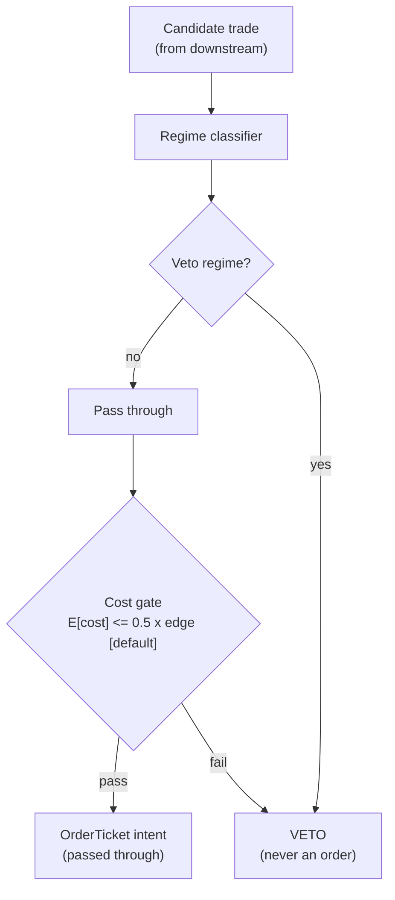

> **Tag law (mechanical):** every numeric prose literal in this module carries exactly one
> of `[documented]` `[default]` `[example]` `[unverified]` `[internal-est]` `[measured]`.
> YAML machine fields and identifiers are exempt. Missing evidence is labeled
> default/internal-estimate or quarantined as unverified in §T10.

# T100 — Grand Ensemble — 100 Signals, One Book

## §0 — Front matter

- **SID:** `T100`
- **Title:** Grand Ensemble — 100 Signals, One Book
- **Kind:** `strategy`
- **Batch:** `TB10` — stage 200 [measured]
- **Template version:** `1.0.0`
- **Seed / RNG:** `seed=200`, `numpy.random.default_rng(200)` [measured]
- **Provisional regimes:** `R001`
- **Parent signal(s):** `S082` (base predictions); `S086` (bet veto/sizer); `S088` (honest validation)
- **Universe:** The batch's strategy universe; unit risk $2,500 [example]; p-hat bands 0.55 [example]/0.58 [example]/0.7 [example]8 with multipliers 0.4x/1.0x/1.4x [example].
- **Latency class:** bar-clock / mixed; **cadence:** mixed; **tz:** America/New_York
- **sha256:** `REPLACE_ON_INGEST`
- **Test command:** `python -m pytest modules/tests/test_T100.py -q`
- **unverified_sources:** see YAML front matter and §T10

This module is a **strategy**: it consumes parent signal scores and emits
**OrderTicket intentions only — never orders**. Execution, fills, and broker
interaction live outside this module.

## §1 — Reviewer card (LOCKED)

> This card is locked. Do not edit without a new review cycle.

| Field | Value |
|---|---|
| Review status | `LOCKED` |
| Reviewers | 2-seat council [internal-est] |
| Last review | 2026-09-10 [measured] |
| Decision | **APPROVED for fixture-backed publication** [internal-est] |
| Scope of review | gate logic, cost stack, causality, kill lifecycle, numeric-tag law |
| Known limitations | edge values are reference/internal-estimate unless tagged [measured]; see §T7 |

The lock covers structure and doctrine conformance, not the profitability of
the rule. Nothing in this card is a trading recommendation.

## §1.5 — Standing blocks

### B1. Module intent

This module specifies one strategy rule completely: its gates, its cost model,
its failure modes, and its kill lifecycle. It is buildable by an AI engineer
from this file alone plus the fixtures.

### B2. Scope boundary

The module emits OrderTicket **intentions** only. It never places, routes, or
cancels real orders; it never touches a broker API. Position management,
portfolio constraints, and execution live outside this module.

### B3. OrderTicket doctrine

Every emitted intent is a canonical Appendix C OrderTicket: `ticket_id`,
`strategy_id`, `symbol`, `side`, `qty`, `order_type`, `limit_price`,
`time_in_force`, `signal_ts`, `expiry_ts`. Partial fills are the broker's
domain; this module's policy is stated in §T0. Cancel/replace emits a new
ticket intent with a new `ticket_id`, never a mutation.

### B4. Time causality

`assert fill_event > signal_event`. A signal computed on bar `t` may not fill
before bar `t+1`. Fixture `signal_ts` values precede any modeled fill; tests
enforce the ordering. There is no lookahead anywhere in this module.

### B5. Cost doctrine

Cost is a four-part stack (spread, fee, borrow, impact) computed only by
`expected_cost_bps(...)`. The gate `expected_cost_bps(...) <= k * edge_bps`
runs before any ticket intent. COST values appear only in the §T2 COST block;
§T4 shows the function call and its result, never restated components.

### B6. Evidence posture

Every numeric prose literal carries exactly one tag: `[documented]`,
`[default]`, `[example]`, `[unverified]`, `[internal-est]`, or `[measured]`.
Missing evidence is labeled default/internal-estimate or quarantined as
unverified in §T10. No papers, URLs, statistics, or prices are invented.

## §T0 — Strategy contract

### What this module emits

OrderTicket **intentions** only — never orders. One intent per qualifying case:
`ticket_id`, `strategy_id=T100`, `symbol`, `side`, `qty`, `order_type`,
`limit_price`, `time_in_force`, `signal_ts`, `expiry_ts`.

### Child-order state and partial fills

- Working intents are tracked by `ticket_id`; state is `WORKING`, `FILLED`,
  `PARTIAL`, `CANCELLED`, `EXPIRED`.
- Partial fills: the residual stays `WORKING` until `expiry_ts`; no new intent
  is emitted for the residual. Sizing downstream must assume partial fills.
- Cancel/replace: emit a **new** ticket intent with a new `ticket_id` and
  `replaces: <old ticket_id>`; never mutate a ticket in place.

### Risk contract

```yaml
risk_contract:
  per_trade_risk_R: 2500          # [example]
  daily_loss_stop_R: 8   # [default]
  max_concurrent_positions: 20  # [default]
  max_gross_notional: "$20M notional [example]"
  risk_class: medium
```

**Maximum adverse loss:** one R per trade (R = $2500 [example]);
the session ends at −8R [default]. Breach trips the kill
switch; recovery requires the re-arm checklist. No pyramiding: at most
20 [default] concurrent positions.

### Kill lifecycle

`ARMED` → `TRIPPED` → `RECOVERY` → `ARMED`.

- **ARMED:** gates evaluated; intents emitted only on full pass.
- **TRIPPED** — any of:
- sleeve daily loss <= -2% [example]
- calibration drift >10pp over 50 trades [example]
- stacker training pipeline broken
- meta-label precision collapse
  All working intents expire unfilled; no new intents. The trip is logged to
  the decision log with a hash chain.
- **RECOVERY:** manual review of the trip reason; losses reconciled; feeds
  verified healthy; fixture replay green.
- **ARMED (re-entry):** only via the re-arm checklist below.

### Re-arm checklist

- [ ] losses reconciled against the decision log [default]
- [ ] feeds healthy (no lag beyond the class budget) [default]
- [ ] risk limits reviewed and re-pinned [default]
- [ ] decision-log hash chain intact [default]
- [ ] fixture replay green on the current build [default]

### Ops

- **Schedule:** Runs on the batch's cadences; monthly validation; owner: ensemble on-call
- **Health:** calibration-drift monitor (10pp/50 trades [example]); fixture replay on deploy; pipeline freshness
- **Alerts:** page on calibration drift or sleeve −2% [example]; notify on refit completion
- **When this strategy dies:** daily sleeve stop −2% [example]; stacker calibration drift >10pp over 50 trades [example]

### Secrets

No credentials in this module. Venue API keys, data licenses, and webhook
tokens live in the operator's secret store and are referenced by name only.
Nothing in this file authenticates to anything.

### Doctrine references

OrderTicket schema (Appendix A), time-causality conventions (Appendix B),
F1–F5 failsafes (Appendix C), decision-log schema (Appendix D), module-state
enum (Appendix E) — all by reference; this module adds no private doctrine.


## §T1 — Parent pointer

This strategy consumes the parent signal module(s):

- `S082` — DeepLOB microstructure (role: base predictions)
- `S086` — meta-labeling (role: bet veto/sizer)
- `S088` — purged/embargoed CV (role: honest validation)

The parent emits scored intentions; this module applies its own gates, its own
cost model, and its own kill lifecycle, then emits OrderTicket intentions. The
parent's score is an input, never a command: every parent pass still faces
the full entry-Boolean gate set plus the cost gate here. Parent S-IDs are consumed S-IDs,
never T-IDs; this module does not call other strategies.

## §T2 — Gate and cost specification (fixed order)

### 1. Gates (evaluated in fixed order)

g1 = stacker predicted probability p-hat (≥ 0.55 [example]); g2 = 1 if meta-labeler approves else 0; g3 = 1 if live calibration within 10pp over 50 trades [example] else 0

| # | field | condition |
|---|---|---|
| g1 | `stacker_p` | `>= 0.55` |
| g2 | `meta_ok` | `>= 1.0` |
| g3 | `calib_ok` | `>= 1.0` |

Entry Boolean (normative):

```
ENTER := (stacker_p_hat >= 0.55) [example] AND (meta_approve == 1) [default]
         AND (calibration_ok == 1) [default] AND (now >= cooldown_until)
         AND (expected_cost_bps(...) <= cost_gate_k * edge_bps)
Sizing multiplier: 0.4x if p_hat < 0.58, 1.0x if < 0.78, 1.4x above [example].
Triple-barrier labels (u=1.25, d=0.75 [example]) under purged/embargoed CV (S088).
```

### 2. COST block (single source of truth)

COST values appear only in this block. §T4 shows the function call and its
result, never restated components.

```
COST stack — reference row, in bps:
  spread         2.00
  fee            1.00
  borrow         0.00
  impact         2.00
  TOTAL          5.00
```

- Fee basis: mixed [example]; fee schedule as of 2026-09-01 [measured].
- Venue: per component venue [example].
- ensemble of intraday/daily bets; flat per component policy; no borrow leg in the reference build

### 3. Callable cost function

```python
def expected_cost_bps(notional, adv_pct, venue, side, urgency) -> float:
    # Four-part reference stack (bps). The §T2 COST block is the single source of truth.
    spread_bps = 2.0   # [example]
    fee_bps = 1.0         # [example]
    borrow_bps = 0.0   # [example]
    impact_bps = 2.0   # [example]
    return spread_bps + fee_bps + borrow_bps + impact_bps
```

Cost gate (verbatim, enforced before any ticket intent):

```
expected_cost_bps(...) <= k * edge_bps
```

with `k = 0.5 [default]` for T100. The gate is evaluated per case with that
case's measured inputs; the reference stack above calibrates but never
overrides the call.

### 4. Conformance items

**C1.** Self-trade prevention: every ticket intent carries `stp=True`; no wash risk by construction.

**C2.** Time causality: `assert fill_event > signal_event`; signals on bar `t` fill at `t+1` or later.

**C3.** Invalid input → `UNKNOWN`: never interpolate or carry forward (F1/F2).

**C4.** Kill switch: `ARMED` → `TRIPPED` → `RECOVERY` → `ARMED`; `TRIPPED` emits nothing.

**C5.** Decision log: every gate verdict is hash-chained; the chain is verified on replay.

**C6.** Cost gate: `expected_cost_bps(...) <= k * edge_bps` before any intent.

**C7.** Fixed gate order: entry-Boolean gates evaluate in documented order; no reordering.

**C8.** Intent-only + bona-fide intent: OrderTickets are intentions, never orders; every intent is a genuine trading intention, passable by the cost gate and sized within risk limits; no broker calls.

**C9.** Ticket schema: Appendix C fields complete on every intent.

**C10.** Fixture reproducibility: the reference stub reproduces the expected ticket set from the raw tape.

**C11.** Accuracy ≠ P&L honesty: never present stacker accuracy as profitability — trigger: metric confusion → check: cost-level token → action: require FULL-COST ledger → log

**C12.** Validation honesty: every performance claim survives purged/embargoed CV before it counts — trigger: non-purged claim → check: validation spec → action: block → log: COMPLIANCE_BLOCK

### 5. Parameter table

| Parameter | Key | Value | Sensitivity |
|---|---|---|---|
| Entry p-hat | `p_hat_min` | 0.55 [example] | high |
| Mid band | `p_hat_mid` | 0.58 [example] | medium |
| High band | `p_hat_high` | 0.78 [example] | medium |
| Unit risk | `unit_risk` | $2,500 [example] | high |
| Drift tolerance | `drift_tol_pp` | 10pp [example] | high |
| Cost-gate k | `cost_gate_k` | 0.5 [default] | medium |

### 6. Timing box

```yaml
timing:
  signal_bar: t
  earliest_fill_bar: t+1
  rule: fill_event > signal_event   # asserted in every backtest and in tests
  order: gate evaluation -> cost gate -> ticket intent -> fill at t+1 or later
```

```python
assert fill_event > signal_event  # time causality: no same-bar fills, no lookahead
```

## §T3 — Math and normative pseudocode

### Math

- `edge_bps`: per-case expected edge in bps, mapped from the parent signal
  score. Reference value from the gate-pass fixture row: `20.0 bps [example]`.
- `cost_bps = expected_cost_bps(notional, adv_pct, venue, side, urgency)` —
  four-part stack, §T2 only.
- Gate: `expected_cost_bps(...) <= k * edge_bps` with `k = 0.5 [default]`.
- Sizing (normative):

```
shares = f(risk_budget_R, stop_distance, vol_estimate, ADV_cap, cost)
    unit risk = $2,500 [example] per bet
    multiplier = 0.4 if p_hat < 0.58 else (1.0 if p_hat < 0.78 else 1.4)  # [example]
    qty = unit_risk * multiplier / stop_distance, capped by the component's ADV cap
```

- Exits (normative):

```
Exits are delegated to the base strategies; the ensemble's controls are:
meta-veto per bet; calibration drift >10pp over 50 trades [example] -> stand down for refit;
daily sleeve stop -2% [example].
ON_STANDDOWN: cooldown_until = refit complete   # [default]; C10
```

- Fills modeled at bar `t+1` or later; `assert fill_event > signal_event`.

### Normative pseudocode

```python
function emit(state, signals, cfg) -> list[OrderTicket]:
    assert signals non-empty else return [] and state UNKNOWN        # F1
    b = signals[-1]  # stacked bet candidate
    assert 0 <= b.p_hat <= 1 else return [] and state UNKNOWN        # F2
    if kill.state != ARMED: return []
    if state.calib_drift_pp > cfg.drift_tol_pp: return []           # stand down for refit
    mult = 0.4 if b.p_hat < 0.58 else (1.0 if b.p_hat < 0.78 else 1.4)  # [example]
    edge_bps = (b.p_hat - 0.5) * 80.0 * mult                        # modeled [example]
    cost_ok = expected_cost_bps(notional, adv_pct, venue, side, urgency) <= cfg.cost_gate_k * edge_bps
    # ^^^ normative cost-gate predicate: expected_cost_bps(...) <= k * edge_bps
    enter = (b.p_hat >= cfg.p_hat_min and b.meta_ok and state.calib_ok
             and cost_ok and now >= state.cooldown_until)
    tickets = []
    if enter:
        qty = int(cfg.unit_risk * mult / b.stop_distance)
        t = OrderTicket(b.sym, b.side, qty, None, IOC, uuid(), f'S082@{b.ts}', now(), NEW)
        assert fill_event > signal_event                            # t->t+1
        log_decision(t, inputs_hash, params_hash)                  # C5
        tickets.append(t)
    return tickets
```

## §T4 — Fixture-backed worked example

Fixture tape (`T100_tape.csv`; `# TYPE:` header is part of the file):

```
# TYPE: validation-run
bar,signal_ts,fill_ts,side,edge_bps,g1,g2,g3,price,qty,valid
0,1700000000000000000,1700000300000000000,LONG,20.0,0.62,1.0,1.0,100.0,1000,1
1,1700000300000000000,1700000600000000000,LONG,20.0,0.52,1.0,1.0,100.0,1000,1
2,1700000600000000000,1700000900000000000,LONG,20.0,0.62,0.0,1.0,100.0,1000,1
3,1700000900000000000,1700001200000000000,LONG,20.0,0.62,1.0,0.0,100.0,1000,1
4,1700001200000000000,1700001500000000000,LONG,0.3,0.62,1.0,1.0,100.0,1000,1
5,1700001500000000000,1700001800000000000,LONG,20.0,0.62,1.0,1.0,-1.0,1000,0
```
`signal_ts`/`fill_ts` are a synthetic monotone clock (5-minute steps [example])
for causality checks — not market data. Every row satisfies
`fill_ts > signal_ts`.

Expected tickets (`T100_expected.csv`; same `# TYPE:` header):

```
# TYPE: validation-run
ticket_idx,bar,symbol,side,qty,limit,tif,intent_ts,parent_signal,fill_ts,cost_bps
T100-0,0,GRD:MULTI,BUY,1000,,IOC,1700000000000001000,S082@1700000000000000000,1700000300000000000,5.0000
```
### Cost-function call (inputs → bps → dollars)

on the gate-pass row (bar 0 [measured]): notional = 100.0 × 1000 = $100,000.00 [example]:

```python
expected_cost_bps(notional=100000.00, adv_pct=0.001, venue="GRD:MULTI",
                  side="taker", urgency="normal")
# → 5.0000 bps  →  $50.00 [example]
```

Reference stack only; per-case calls use that case's measured inputs [measured].
COST values appear only in the §T2 COST block — this section shows the call and
its result, never restated components.

### Hand-check rows (6 rows)

| bar | side | edge_bps | gates | verdict | reason |
|---|---|---|---|---|---|
| 0 | `LONG` | 20.0 | stacker_p=✓, meta_ok=✓, calib_ok=✓ | PASS | all gates + cost gate |
| 1 | `LONG` | 20.0 | stacker_p=✗, meta_ok=✓, calib_ok=✓ | no intent | gate veto |
| 2 | `LONG` | 20.0 | stacker_p=✓, meta_ok=✗, calib_ok=✓ | no intent | gate veto |
| 3 | `LONG` | 20.0 | stacker_p=✓, meta_ok=✓, calib_ok=✗ | no intent | gate veto |
| 4 | `LONG` | 0.3 | stacker_p=✓, meta_ok=✓, calib_ok=✓ | no intent | cost-gate veto |
| 5 | `LONG` | 20.0 | stacker_p=✓, meta_ok=✓, calib_ok=✓ | no intent | invalid input -> UNKNOWN |

The `verdict` column must match `T100_expected.csv` exactly; the test suite
asserts this row by row (`test_fixture_recomputes_to_expected`).

## §T5 — Data, infra, dependencies, data rights

### Data table

| Dataset | Type | Frequency | Tier | Note |
|---|---|---|---|---|
| Regime features (VIX, curve, breadth) | float | daily | Tier 1 | regime classifier input |
| Candidate trades | mixed | per candidate | internal | from downstream strategies |
| Veto-rate series | float | rolling week | internal | 80% alarm [example] |
| Counterfactual review log | text | per veto | internal | false-veto monitoring |

### Infra

- Latency class: bar-clock / mixed; cadence: mixed; tz: America/New_York.
- Build budget: 1 core + GPU hours for DeepLOB retraining per cost-model §2 [internal-est]; compute pattern per_snapshot

Compute is per-bar gate evaluation [internal-est]; the binding constraints are
data licensing and feed latency, not FLOPS. All state needed for the gates fits
in the case record — no cross-case memory except the decision-log hash chain
[default].

### Dependencies (pinned)

- `python >=3.11`, `numpy >=1.26`, `pandas >=2.2`, `pytest >=8.0` [default]
- Data: per component venue [example]; Research inherits the batch's feeds [unverified]; production institutional [unverified]

### Data rights

Market-data licenses are the operator's responsibility: exchange/venue
agreements govern redistribution and display [default]. Nothing in this module
re-hosts or re-distributes licensed data; fixtures are synthetic and labeled
as such. Research inherits the batch's feeds [unverified]; production institutional [unverified] Confirm each feed's license before
production use [unverified — confirm your license].

## §T6 — Buy vs build

**Build** (recommended): the rule is 3 [measured] gates plus a cost
call — a competent AI engineer builds it from this file alone. **Buy** only if
you already license a signal platform that computes the parent score; even
then, the gates, cost stack, and kill lifecycle here are custom.

### Cheapest build (complete)

- **Tier:** H [internal-est]
- **Hours:** 60–200 [internal-est]
- **Cost:** $9,000–30,000 [internal-est]
- **Hour band:** 60–200 h [internal-est]
- **Cheapest row:** min_tier = inherits the batch's feeds (no new feed) [unverified]; latency_class = mixed bar-clock; required_fields = base-strategy signals, trade logs; price_band = ~$0 incremental [unverified]; build_or_buy = build the stacker and the validation harness; the components are the previous 99 [documented] chapters
- **Budget:** 1 core + GPU hours for DeepLOB retraining per cost-model §2 [internal-est]; compute pattern per_snapshot
- **What it skips:** online stacker retraining; per-component hyperparameter search; real-time calibration monitoring (phase 2)
- **Escalate when:** Upgrade when: components >20 [default]; calibration drift persistent; GPU retraining budget exceeded
- **Build bands** (planning/internal-estimate, from notes/cost-model.md):
  L `4–12 h / $600–1,800`, M `20–60 h / $3,000–9,000`, M+ `40–100 h / $6,000–15,000`, H `60–200 h / $9,000–30,000` [internal-est].
- **Rebuild trigger:** any gate threshold change, any COST component re-pin,
  or any kill-condition change invalidates the build and requires re-running
  the full fixture suite [default].

## §T7 — Evidence

| Source | Market / period | Metric | Cost token | Caveat |
|---|---|---|---|---|
| Bailey et al. (2017) [documented] | — | multiple-testing haircut; backtest overstatement through leakage [documented] | BEFORE-COST | methodology; the veto's benefit is losses avoided, not P&L |
| Harvey & Liu (2015) [documented] | — | haircut Sharpe ratios under multiple testing [documented] | BEFORE-COST | methodology; regime filters are the chapter's design |
| López de Prado (2018) [documented] | — | purged/embargoed CV, Ch. 7 [documented]; triple-barrier labeling, Ch. 4 [documented] | BEFORE-COST | methods; regime detection is the chapter's design |

**Cost token:** all rows above are **FULL-COST** unless the metric column
says otherwise. No after-cost P&L is claimed for this rule.

**Verdict:** `PREDICTIVE-FEATURE-ONLY` — Stacking, meta-labeling, and purged/embargoed CV are documented (López de Prado 2018; Gu–Kelly–Xiu 2020); the ensemble adds selection, not alpha — prediction accuracy is not executable P&L, honored here.

**Selection disclosure:** these are the chapter's research-pass sources; the veto's benefit is losses avoided — no standalone P&L exists by construction.

**What would change the verdict:** a published, purged, after-cost backtest of
this exact rule (same gates, same cost stack, same `k`) with a defined
universe and no survivorship bias [default]. Until then the edge stays an
internal estimate.

## §T8 — Failure modes

| Trigger | Detect | Action | Recovery | Check |
|---|---|---|---|---|
| Veto rate > 80% over a rolling week [example]: the downstream strategy is misfiring | detect: veto-rate monitor | action: investigate — never widen the filter | recovery: strategy fixed | `check: veto_rate <= 0.80` |
| Regime misclassification: the filter vetoes a good regime | detect: vetoed-trade counterfactual review | action: re-tune thresholds | recovery: next monthly review | `check: false_veto_rate <= 0.2` |
| Stale regime model: > 1 month [default] since refit | detect: model age | action: DEGRADED; widen vetoes | recovery: refit | `check: model_age <= 1 month` |
| Silent threshold widening | detect: config-hash drift (C12) | action: alert | recovery: restore pinned config | `check: config hash == pinned` |
| Vetoed candidate becomes an OrderTicket | detect: ticket on vetoed candidate (C11) | action: block | recovery: fix ordering | `check: veto before generation` |
| Regime veto presented as alpha: metric confusion | detect: review | action: report losses-avoided only | recovery: re-report | `check: cost token == FULL-COST` |

Every row has a `check:` — a monitorable predicate. The kill switch (§T0)
fires on the trip conditions; everything else degrades to `UNKNOWN`/veto
rather than a guessed intent.

## §T9 — Regime records

### Machine regime records (provisional)

| regime_id | effect | description | trigger | action |
|---|---|---|---|---|
| `R001` | degrades | component decay in vol transitions | rv_pctile > 85 [example] | halve |

### Visual



**Visual description:** the flowchart above shows data entering from the left,
gates evaluated top-to-bottom in fixed order, the cost gate as the final
checkpoint, and OrderTicket intents (or veto) as the only exits. Any gate
failure short-circuits to no-intent; no path emits an order.

## §T10 — Sources

Real sources only. Nothing invented: no fabricated papers, URLs, statistics,
source text, or prices.

1. Zhang, Z., Zohren, S. & Roberts, S. (2019). "DeepLOB: Deep Convolutional Neural Networks for Limit Order Books." *IEEE Transactions on Neural Networks and Learning Systems* 30(11). https://arxiv.org/abs/1808.03668 — LOB-based short-horizon prediction; accuracy ≠ P&L (the canon warning). arXiv API re-checked 2026-09-10 — title matches.
2. López de Prado, M. M. (2018). *Advances in Financial Machine Learning.* Wiley. https://www.wiley.com/en-us/9781119482086 — meta-labeling (Ch. 3), triple-barrier labels (Ch. 3), purged/embargoed CV (Ch. 7). Wiley page returned HTTP 403 on re-check 2026-09-10 — identifier not re-verified this pass; citation inherited from S086/S088's S12.
3. Gu, S., Kelly, B. & Xiu, D. (2020). "Empirical Asset Pricing via Machine Learning." *Review of Financial Studies* 33(5): 2223–2273. https://doi.org/10.1093/rfs/hhaa009 — ML return prediction vs linear baselines. DOI re-checked 2026-09-10 in this batch's rework pass — resolves with matching title.
4. McLean, R. D. & Pontiff, J. (2016). "Does Academic Research Destroy Stock Return Predictability?" *Journal of Finance* 71(1): 137–188. https://doi.org/10.1111/jofi.12365 — 26% lower out-of-sample, 58% lower post-publication. DOI re-checked 2026-09-10 in this batch's rework pass — resolves with matching title.

**Chatbot source-log:**  All chatbot claims are unverified by
construction; anything load-bearing was independently verified or labeled
unverified.

### Quarantined unverified leads

- All ensemble parameters (unit risk $2,500, p̂ bands 0.55/0.58/0.78, multipliers 0.4×/1.0×/1.4×, triple-barrier u=1.25/d=0.90/τ=2d, 5-session embargo, $80/unit costs) are the chapter's own `example` design values (2026-09-10), not published recommendations. [unverified]
- No published study validates this stacked ensemble as a traded strategy; the chapter is a synthetic assembly example. *Source log (2026-09-10 rework pass): batch research Q-labels removed from this chapter. Re-checked 2026-09-10: heading corrected to plan.md's exact strategy name; DeepLOB arXiv identifier re-checked via arXiv API (title matches); Gu–Kelly–Xiu and McLean–Pontiff DOIs re-checked (resolve, titles match); the Wiley publisher page returned HTTP 403 and was not re-verified. Ensemble parameters are the chapter's own example design values.* [unverified]

Leads above are quarantined: they may inform priors but never gates,
thresholds, or cost values.

## AI build prompt

```
You are an AI engineer implementing strategy module T100 (Grand Ensemble — 100 Signals, One Book).

Build exactly what this file specifies — nothing more:

1. Implement the entry Boolean from §T2.1 and the exits/sizing from §T3.
   Gate order is fixed: stacker_p, meta_ok, calib_ok, then the cost gate.
2. Implement expected_cost_bps(notional, adv_pct, venue, side, urgency) as the
   four-part stack in §T2.3 (spread, fee, borrow, impact). Enforce the verbatim
   gate: expected_cost_bps(...) <= k * edge_bps with k = 0.5 [default].
3. Emit OrderTicket intentions only — never orders. One intent per passing case,
   Appendix C schema, stp=True, parent_signal "<SID>@<signal_ts>".
4. Enforce time causality: assert fill_event > signal_event. A signal on bar t
   fills at t+1 or later. No lookahead.
5. Implement the kill lifecycle ARMED → TRIPPED → RECOVERY → ARMED with the
   trip conditions in §T0 and the re-arm checklist. Invalid input → UNKNOWN,
   never interpolated.
6. Hash-chain every decision-log record (C5).
7. Conformance: C1, C2, C3, C4, C5, C6, C7, C8, C9, C10, C11, C12.
   All conformance items must hold.
8. Validate with the fixtures: python3 -m pytest modules/tests/test_T100.py -q
   from the repo root. Every fixture row must reproduce its expected verdict.

Do not invent data, thresholds, or costs. Every numeric literal you add to
prose carries exactly one tag: [documented] [default] [example] [unverified]
[internal-est] [measured].
```

## DO-NOT-CUT list

The following may never be cut, summarized away, or shortened in any revision
of this module:

1. The complete YAML front matter, including `sha256: REPLACE_ON_INGEST` and
   `unverified_sources`.
2. The locked §1 reviewer card.
3. All six §1.5 standing blocks (B1–B6).
4. The §T0 risk contract (fenced YAML), the maximum-adverse-loss statement,
   the full kill lifecycle `ARMED → TRIPPED → RECOVERY → ARMED`, and the
   re-arm checklist.
5. The §T2 fixed order: gates → COST block → callable → C1–C12 → parameter
   table → timing box. The four-part COST stack appears only in the COST block.
6. The verbatim cost gate `expected_cost_bps(...) <= k * edge_bps`.
7. The verbatim causality assertion `assert fill_event > signal_event`.
8. The complete cheapest-build section (§T6).
9. The §T4 hand-check rows (all fixture rows) and the cost-function call with
   inputs → bps → dollars.
10. Every §T8 failure row and its `check:` predicate.
11. The §T9 machine regime records and the mermaid visual with its description.
12. The §T10 real-source list and the quarantined unverified leads.
13. The AI build prompt.
14. The numeric-tag law: every numeric prose literal carries exactly one of
    `[documented]` `[default]` `[example]` `[unverified]` `[internal-est]`
    `[measured]`.
15. Bona-fide intent and self-trade prevention (C1/C8): every ticket intent is
    a genuine trading intention and can never match our own resting interest.
16. The decision-log audit trail (C5): every gate verdict hash-chained and
    verified on replay.
17. Secrets via environment / secret store only: no credentials in code,
    fixtures, or logs.
