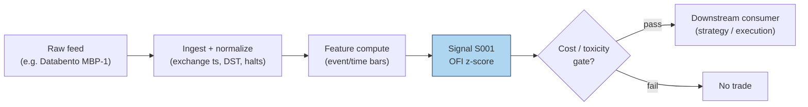
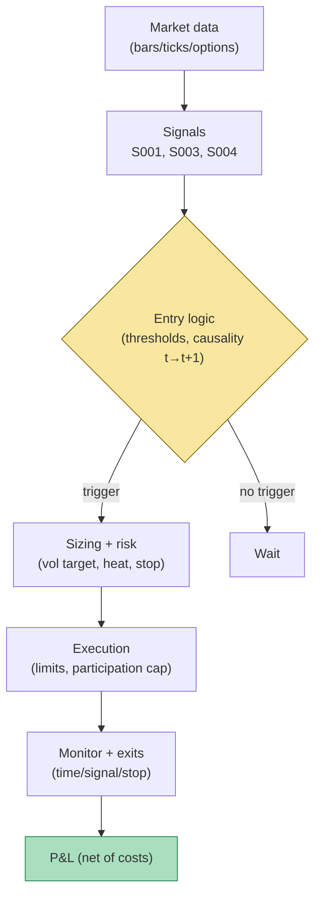

# Visualization Standard — all 200 chapters (v1, mandatory)

Every chapter ships **exactly 2 visuals**. No chapter merges without both.

| # | Visual | File / form | Purpose |
|---|--------|-------------|---------|
| V1 | Worked-example chart | `images/S###_example.png` or `images/T###_example.png` (matplotlib) | Plot the SAME synthetic numbers used in the chapter's worked example; watermarked `SYNTHETIC EXAMPLE` |
| V2 | Diagram | fenced ` ```mermaid ` block inside the chapter markdown | Signal → data-flow diagram; strategy → strategy-flow diagram |

---

## V1 — Matplotlib worked-example chart

### Mandatory style block
Every chart-generating script MUST start with this exact block (copy verbatim). It fixes the
house style so all 200 charts look like one document.

```python
import matplotlib
matplotlib.use("Agg")  # headless render on the Mac/VM
import matplotlib.pyplot as plt
import numpy as np

# ---- HOUSE STYLE (do not restyle) ----
plt.rcParams.update({
    "figure.figsize": (10, 5.2),
    "figure.dpi": 150,
    "savefig.dpi": 150,
    "font.family": "DejaVu Sans",
    "font.size": 10,
    "axes.titlesize": 13,
    "axes.titleweight": "bold",
    "axes.labelsize": 10,
    "axes.grid": True,
    "grid.alpha": 0.25,
    "grid.linestyle": "--",
    "xtick.labelsize": 9,
    "ytick.labelsize": 9,
    "legend.fontsize": 9,
    "legend.framealpha": 0.9,
})
PALETTE = {
    "price":   "#1f3a5f",  # dark navy — primary price/equity line
    "signal":  "#c0392b",  # red — signal / entries
    "signal2": "#8e44ad",  # purple — secondary signal
    "volume":  "#7f8c8d",  # grey — volume bars
    "band":    "#aed6f1",  # light blue — bands / fill
    "profit":  "#1e8449",  # green — profits / long
    "loss":    "#922b21",  # dark red — losses / short
    "zero":    "#2c3e50",  # baseline
}
```

### Mandatory watermark + caption pattern
Append to every chart script, after plotting:

```python
# ---- SYNTHETIC WATERMARK (mandatory) ----
fig = plt.gcf()
fig.text(0.5, 0.5, "SYNTHETIC EXAMPLE", fontsize=42, color="red", alpha=0.14,
         ha="center", va="center", rotation=28, weight="bold", zorder=10)
fig.text(0.99, 0.01, "synthetic data — not market data", fontsize=8, color="#7f8c8d",
         ha="right", va="bottom")
plt.tight_layout()
plt.savefig("images/S001_example.png", bbox_inches="tight")  # <-- use the chapter's ID
plt.close()
```

Rules:
- The plotted series MUST be the numbers from the chapter's worked-example table (same seed,
  same values). A reviewer spot-checks 2–3 points.
- Title format: `S001 — Order-flow imbalance: 10-event synthetic tape` (ID + name + what is plotted).
- Axes labeled with units. Legend required if >1 series. No 3-D, no pie charts, no dual axes
  unless the chapter justifies them.
- For strategy chapters (T###): plot equity/P&L or a trade timeline (entry/exit markers with
  prices); annotate each trade's net P&L.
- File naming is exact: `images/S001_example.png` … `images/S100_example.png`,
  `images/T001_example.png` … `images/T100_example.png`. Lowercase `images/`, relative path
  from `quant-signals-deep/`.
- Embed in markdown as: ``
  (descriptive alt text, never just "chart").

### Reproducibility
- Every script sets `rng = np.random.default_rng(<seed>)` and the chapter text states the seed.
- Scripts live at `batches/<BATCH>/plot_S###.py` / `plot_T###.py` next to the chapter file so a
  reviewer can re-run: `python3 batches/SB1/plot_S001.py` must regenerate the identical PNG.

---

## V2 — Mermaid diagrams

Fenced with ` ```mermaid ` (no extra indentation). Keep node labels short; put parameter detail
in the chapter text, not the diagram.

### Template V2-S — signal data-flow (use for S001–S100)



Worker adaptation rules: replace bracket text with the chapter's actual feed, granularity,
signal name, and gate. Keep the 6-node skeleton (feed → ingest → feature → signal → gate → out/drop).

### Template V2-T — strategy flow (use for T001–T100)



Worker adaptation rules: fill in the real S-numbers, the actual entry condition, sizing rule,
and exit set. Keep the skeleton; do not add more than 2 extra nodes.

### Mermaid QC
- Must render: balanced brackets, no unescaped `|` inside labels (use `<br/>` for line breaks
  if needed — the templates already do).
- Every edge label that carries data must name the granularity (e.g. `1-min bars`, `L1 events`).

---

## Cross-chapter consistency checklist (reviewer)
- [ ] PNG exists at the exact required path and is referenced with a relative `images/…` link.
- [ ] Watermark `SYNTHETIC EXAMPLE` visible; corner caption present.
- [ ] House style block used (spot-check fonts/colors); title carries chapter ID.
- [ ] Chart numbers match the worked-example table (spot-check ≥2 points).
- [ ] Mermaid fenced, renders, follows the V2-S or V2-T skeleton, edges labeled with granularity.
- [ ] Alt text describes the visual (no bare "chart"/"diagram").
